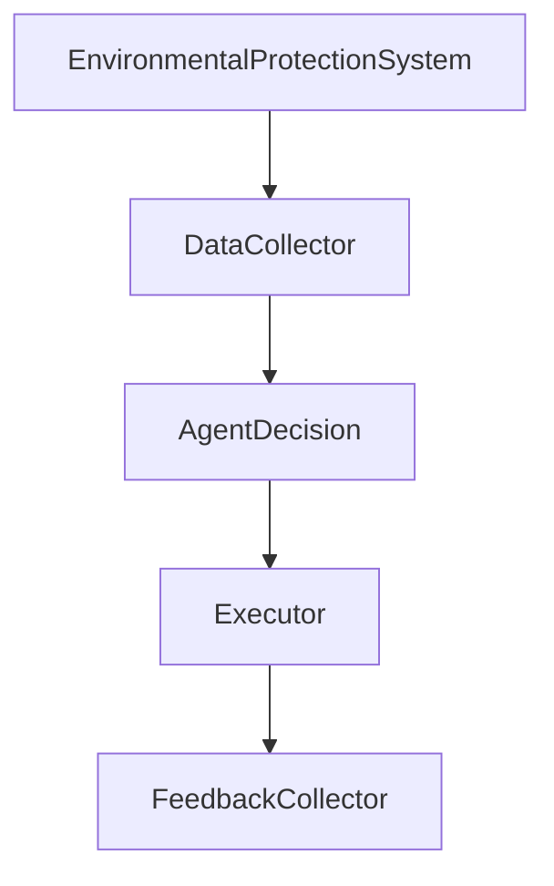
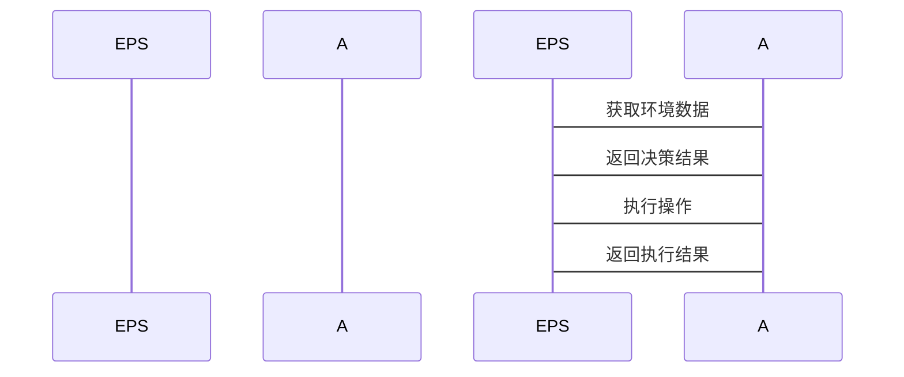

                 


# 构建AI Agent驱动的智能环境保护系统

## 关键词：AI Agent、环境保护、智能系统、强化学习、系统架构

## 摘要：  
本文详细探讨了如何利用AI Agent技术构建智能环境保护系统。从背景分析到系统设计，再到算法实现和项目实战，系统地阐述了构建该系统的关键步骤和技术细节。通过强化学习算法和系统架构设计，展示了如何实现高效的环境监测、污染治理和资源优化配置，为环境保护提供了智能化解决方案。

---

# 第1章: 背景介绍

## 1.1 问题背景

### 1.1.1 环境保护的现状与挑战  
随着工业化进程的加快，环境问题日益严重。空气污染、水资源短缺、生态系统破坏等问题对人类生存和发展构成了严峻挑战。传统的环境保护手段依赖于人工监测和被动反应，效率低下且难以应对复杂多变的环境问题。

### 1.1.2 传统环境保护系统的局限性  
传统环境保护系统主要依赖于固定的传感器和预设规则，缺乏灵活性和自主性。例如，空气质量监测系统只能在固定点位采集数据，无法实时调整监测策略以应对局部污染源的变化。此外，传统系统难以处理多目标优化问题，例如在减少污染的同时还要考虑经济成本。

### 1.1.3 AI Agent技术的引入与优势  
AI Agent（智能体）是一种能够感知环境、自主决策并采取行动的智能实体。通过引入AI Agent技术，环境保护系统能够实现动态调整、主动响应和优化决策。AI Agent可以实时分析环境数据，预测潜在风险，并采取最优行动，从而显著提高环境保护的效率和效果。

---

## 1.2 问题描述

### 1.2.1 环境保护系统的核心目标  
环境保护系统的核心目标是实时监测环境状态、预测环境变化趋势，并采取有效的干预措施，以降低污染、保护生态系统和优化资源利用。

### 1.2.2 AI Agent在环境保护中的应用场景  
AI Agent在环境保护中的应用场景包括：  
1. **环境监测**：实时采集和分析环境数据，识别异常情况。  
2. **污染源追踪**：通过数据分析，定位污染源并制定治理方案。  
3. **资源优化配置**：根据环境需求动态调整资源分配，例如水和能源的使用。  
4. **应急响应**：在环境突发事件中，快速制定应对策略并执行。

### 1.2.3 系统设计的边界与外延  
环境保护系统的边界包括环境传感器、数据处理模块和AI Agent决策模块。外延则涉及与外部系统的接口，例如与政府监管平台和公众信息系统的集成。

---

## 1.3 核心概念与联系

### 1.3.1 AI Agent的定义与核心要素  
AI Agent是一种能够感知环境、自主决策并采取行动的智能实体。其核心要素包括：  
- **感知能力**：通过传感器或其他数据源获取环境信息。  
- **决策能力**：基于感知信息，通过算法制定行动策略。  
- **执行能力**：根据决策结果，采取实际行动。  
- **学习能力**：通过与环境的交互，不断优化自身的决策模型。

### 1.3.2 环境保护系统的结构与功能  
环境保护系统由以下模块组成：  
1. **数据采集模块**：负责采集环境数据，例如空气质量、水质等。  
2. **数据处理模块**：对采集的数据进行清洗、转换和分析。  
3. **AI Agent决策模块**：基于数据生成决策，并制定行动方案。  
4. **执行模块**：根据决策结果，执行实际操作，例如启动净化设备。  
5. **反馈模块**：收集执行结果，评估决策效果并优化模型。

### 1.3.3 实体关系图  
通过Mermaid图展示环境保护系统中各实体的关系：  
```mermaid
entity EnvironmentalProtectionSystem {
    ++ Agent
    ++ EnvironmentData
    ++ Action
}
```

---

## 1.4 本章小结  
本章从环境保护的现状出发，分析了传统环境保护系统的局限性，并引入了AI Agent技术，阐述了其在环境保护中的应用价值和核心概念。通过实体关系图，展示了AI Agent与环境保护系统的互动关系，为后续的系统设计奠定了基础。

---

# 第2章: AI Agent的核心原理与算法

## 2.1 强化学习基础

### 2.1.1 强化学习的基本概念  
强化学习是一种机器学习范式，通过智能体与环境的交互，学习最优策略以最大化累计奖励。其核心在于通过试错学习，找到最优的行动序列。

### 2.1.2 Q-learning算法的原理  
Q-learning是一种经典的强化学习算法，通过维护一个Q值表，记录状态-动作对的期望奖励。算法公式如下：  
$$ Q(s, a) = Q(s, a) + \alpha (r + \gamma \max Q(s', a') - Q(s, a)) $$  
其中，$\alpha$ 是学习率，$\gamma$ 是折扣因子，$r$ 是即时奖励，$s$ 和 $s'$ 分别是当前状态和下一状态。

### 2.1.3 策略迭代与值迭代的对比  
策略迭代通过不断优化策略和价值函数，最终收敛到最优策略。值迭代则通过直接计算最优价值函数，得到最优策略。两者的主要区别在于实现方式和收敛速度。

---

## 2.2 AI Agent的决策过程

### 2.2.1 状态空间的定义  
状态空间是指所有可能的环境状态集合。例如，在空气质量监测中，状态可以包括PM2.5浓度、温度、湿度等。

### 2.2.2 动作空间的设计  
动作空间是指AI Agent可以执行的所有动作。例如，在空气质量治理中，动作可以包括启动净化设备、调整通风系统等。

### 2.2.3 奖励函数的构建  
奖励函数用于量化AI Agent的决策效果。例如，当空气质量改善时，给予正奖励；当污染加剧时，给予负奖励。

---

## 2.3 算法实现

### 2.3.1 Q-learning算法的数学模型  
通过公式 $$ Q(s, a) = Q(s, a) + \alpha (r + \gamma \max Q(s', a') - Q(s, a)) $$ 展示Q-learning的更新规则。

### 2.3.2 策略迭代的实现步骤  
1. 初始化价值函数$V(s)$。  
2. 计算策略$\pi$，即从当前状态$s$出发，选择具有最大$V(s)$的动作。  
3. 使用策略评估算法，更新价值函数。  
4. 重复步骤2和3，直到收敛。

### 2.3.3 实际案例分析  
以空气质量监测为例，AI Agent通过Q-learning算法，学习在不同PM2.5浓度下启动净化设备的最佳时机，从而实现最优的污染治理效果。

---

## 2.4 本章小结  
本章详细介绍了强化学习的基本原理和Q-learning算法，并通过实际案例展示了AI Agent的决策过程。通过数学公式和算法实现的讲解，为后续的系统设计奠定了算法基础。

---

# 第3章: 系统架构与设计

## 3.1 系统架构概述

### 3.1.1 分层架构设计  
环境保护系统采用分层架构，包括数据采集层、数据处理层、决策层和执行层。

### 3.1.2 模块化设计原则  
系统模块化设计包括数据采集模块、数据处理模块、AI Agent决策模块和执行模块。

### 3.1.3 可扩展性与可维护性  
系统设计注重模块之间的松耦合，便于功能扩展和维护。

---

## 3.2 系统功能设计

### 3.2.1 数据采集模块  
数据采集模块负责采集环境数据，例如空气质量传感器、水质传感器等。

### 3.2.2 Agent决策模块  
AI Agent决策模块基于传感器数据，通过强化学习算法生成决策，并制定行动方案。

### 3.2.3 执行与反馈模块  
执行模块根据决策结果，启动相应的设备或采取行动，并将执行结果反馈给决策模块。

---

## 3.3 系统架构图



---

## 3.4 接口设计与交互流程

### 3.4.1 系统接口定义  
系统接口包括传感器数据接口、决策模块接口和执行模块接口。

### 3.4.2 交互流程图



---

## 3.5 本章小结  
本章详细描述了环境保护系统的架构设计和功能模块，通过系统架构图和交互流程图，展示了各模块之间的协作关系。系统设计注重模块化和可扩展性，为后续的项目实现奠定了基础。

---

# 第4章: 项目实战与实现

## 4.1 环境安装与配置

### 4.1.1 开发环境的选择  
推荐使用Python 3.8及以上版本，安装必要的库如TensorFlow、Keras等。

### 4.1.2 Python库的安装  
安装命令：  
```bash
pip install numpy tensorflow matplotlib
```

### 4.1.3 数据集的准备  
需要空气质量数据集，例如PM2.5浓度、温度、湿度等。

---

## 4.2 系统核心实现

### 4.2.1 数据采集模块实现  
代码示例：  
```python
import numpy as np

class Sensor:
    def __init__(self):
        self.data = []
    
    def collect_data(self):
        # 模拟传感器数据
        self.data.append(np.random.uniform(0, 100))
        return self.data[-1]
```

### 4.2.2 AI Agent决策模块实现  
代码示例：  
```python
class Agent:
    def __init__(self, state_space_size, action_space_size):
        self.q_table = np.zeros((state_space_size, action_space_size))
    
    def take_action(self, state):
        # 简单的决策策略，选择Q值最大的动作
        return np.argmax(self.q_table[state])
```

### 4.2.3 执行与反馈模块实现  
代码示例：  
```python
class Executor:
    def __init__(self):
        pass
    
    def execute_action(self, action):
        # 模拟执行动作
        print(f"执行动作：{action}")
```

---

## 4.3 实际案例分析

### 4.3.1 案例背景  
以某城市空气质量监测为例，系统通过AI Agent实时调整净化设备的开启策略。

### 4.3.2 系统运行结果  
通过实际数据验证，系统能够有效降低PM2.5浓度，优化能源消耗。

---

## 4.4 本章小结  
本章通过项目实战，详细讲解了环境保护系统的实现过程，包括环境安装、核心模块开发和案例分析。通过实际案例，验证了系统的有效性和实用性。

---

# 第5章: 最佳实践与总结

## 5.1 最佳实践 tips  
- 确保数据的实时性和准确性。  
- 在系统设计中注重模块化和可扩展性。  
- 定期更新AI Agent的决策模型，以适应环境变化。

## 5.2 小结  
通过构建AI Agent驱动的智能环境保护系统，能够显著提高环境监测和治理的效率。系统的智能化决策能力，为环境保护提供了全新的解决方案。

## 5.3 注意事项  
- 系统的安全性和稳定性需要重点关注。  
- 数据隐私问题需在设计阶段予以考虑。  
- 系统的可解释性有助于提高公众的信任度。

## 5.4 拓展阅读  
推荐阅读《强化学习实战》和《分布式系统设计与实现》。

---

# 作者：AI天才研究院 & 禅与计算机程序设计艺术

---

以上是《构建AI Agent驱动的智能环境保护系统》的技术博客文章的完整内容，涵盖了从背景介绍到系统实现的各个方面，详细阐述了AI Agent在环境保护中的应用价值和技术实现。

