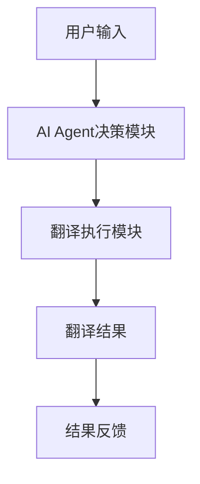

                 


```markdown
# 构建AI Agent驱动的智能翻译系统

> 关键词：AI Agent，智能翻译系统，大模型，自然语言处理，系统架构，项目实战

> 摘要：本文详细探讨了如何构建一个基于AI Agent的智能翻译系统。首先介绍了AI Agent的基本概念和智能翻译系统的背景，分析了AI Agent在翻译系统中的必要性和应用场景。接着深入讲解了大模型和AI Agent的核心算法，包括Transformer模型和强化学习的原理。然后从系统架构设计的角度，分析了系统的功能模块划分、接口设计和交互流程。最后通过项目实战部分，展示了环境安装、核心代码实现以及实际案例分析，总结了最佳实践和注意事项。

---

# 第一部分: AI Agent与智能翻译系统背景介绍

## 第1章: AI Agent与智能翻译系统概述

### 1.1 AI Agent的基本概念

#### 1.1.1 AI Agent的定义
AI Agent（人工智能代理）是指能够感知环境、自主决策并执行任务的智能体。它可以看作是一个软件系统，通过传感器获取信息，并通过执行器与环境交互。

#### 1.1.2 AI Agent的核心特点
- **自主性**：能够自主决策，无需外部干预。
- **反应性**：能够实时感知环境变化并做出响应。
- **目标导向**：通过设定目标来指导行为。
- **学习能力**：能够通过经验改进性能。

#### 1.1.3 AI Agent与传统翻译系统的区别
传统翻译系统通常基于规则或统计模型，而AI Agent驱动的翻译系统能够通过学习和自适应优化翻译质量，具备更强的交互性和主动性。

### 1.2 智能翻译系统的背景与现状

#### 1.2.1 翻译系统的发展历程
- **早期阶段**：基于规则的翻译系统，依赖人工设定的语法规则。
- **发展阶段**：统计机器翻译（SMT），通过统计语言模型优化翻译结果。
- **当前阶段**：基于大模型的智能翻译，利用深度学习技术实现更准确的翻译。

#### 1.2.2 当前智能翻译系统的应用领域
- **实时翻译**：如即时聊天翻译。
- **文档翻译**：处理长文本的翻译。
- **领域特定翻译**：如医学、法律领域的专业翻译。

#### 1.2.3 智能翻译系统的挑战与机遇
- **挑战**：跨语言理解的深度、翻译的上下文依赖、实时性要求。
- **机遇**：大模型的出现为翻译系统提供了更强大的语义理解能力。

### 1.3 AI Agent驱动翻译系统的必要性

#### 1.3.1 翻译系统智能化的需求
传统的翻译系统在处理复杂语境和上下文关系时表现有限，而AI Agent能够通过上下文理解和意图推理提升翻译质量。

#### 1.3.2 AI Agent在翻译系统中的作用
- **语境理解**：通过分析上下文，生成更准确的翻译结果。
- **动态优化**：根据用户反馈实时调整翻译策略。
- **多任务处理**：同时处理多个翻译请求，提高效率。

#### 1.3.3 AI Agent驱动翻译系统的应用场景
- **多语言客服支持**：实时为用户解答问题。
- **跨语言新闻翻译**：快速生成多语言新闻稿。
- **智能助手**：为用户提供个性化翻译服务。

### 1.4 本章小结
本章介绍了AI Agent的基本概念和智能翻译系统的背景，分析了AI Agent在翻译系统中的必要性和应用场景，为后续章节奠定了基础。

---

# 第二部分: AI Agent驱动智能翻译系统的算法原理

## 第2章: 大模型与AI Agent的核心算法

### 2.1 大模型的算法基础

#### 2.1.1 Transformer模型的结构
- **编码器**：通过多头自注意力机制捕获输入序列中的全局依赖关系。
- **解码器**：利用自注意力机制生成输出序列。

#### 2.1.2 注意力机制的原理
- **查询（Query）**：表示输入序列。
- **键（Key）**：与查询进行点积，用于计算注意力权重。
- **值（Value）**：与注意力权重相乘，得到最终的注意力输出。

#### 2.1.3 梯度下降与优化算法
- **Adam优化器**：结合动量和自适应学习率的优化算法。

### 2.2 AI Agent的算法实现

#### 2.2.1 状态空间与动作空间的定义
- **状态空间**：表示系统当前的环境状态。
- **动作空间**：表示AI Agent可以执行的动作。

#### 2.2.2 策略网络的实现
- **策略函数**：将状态映射到动作的概率分布。
- **值函数**：评估某个状态下动作的好坏。

#### 2.2.3 奖励函数的设计
- **奖励机制**：通过定义奖励函数来指导AI Agent的学习方向。

### 2.3 大模型与AI Agent的联合优化

#### 2.3.1 联合优化的目标函数
$$ \text{损失函数} = \text{翻译损失} + \lambda \times \text{策略损失} $$

其中，$\lambda$ 是平衡系数。

#### 2.3.2 算法收敛性分析
通过数学证明，分析联合优化算法的收敛性。

#### 2.3.3 实验结果与分析
通过实验数据验证算法的有效性和性能提升。

### 2.4 本章小结
本章详细讲解了大模型和AI Agent的核心算法，分析了它们的联合优化方法，为后续的系统设计和项目实现提供了理论基础。

---

# 第三部分: AI Agent驱动智能翻译系统的系统架构设计

## 第3章: 系统功能设计与实现

### 3.1 系统功能模块划分

#### 3.1.1 用户输入模块
- **功能**：接收用户的输入文本。
- **实现**：通过API接口接收输入。

#### 3.1.2 AI Agent决策模块
- **功能**：分析输入文本，生成翻译策略。
- **实现**：基于大模型进行语义理解。

#### 3.1.3 翻译执行模块
- **功能**：根据决策模块的策略生成翻译结果。
- **实现**：调用大模型进行翻译。

#### 3.1.4 结果反馈模块
- **功能**：将翻译结果反馈给用户。
- **实现**：通过API返回结果。

### 3.2 系统功能流程图



### 3.3 系统功能实现代码

#### 3.3.1 环境安装与配置
```bash
pip install transformers torch
```

#### 3.3.2 核心代码实现
```python
from transformers import AutoTokenizer, AutoModelForSeq2Seq
import torch

class AI-AgentTranslator:
    def __init__(self, model_name):
        self.tokenizer = AutoTokenizer.from_pretrained(model_name)
        self.model = AutoModelForSeq2Seq.from_pretrained(model_name)
    
    def translate(self, source_text, target_lang):
        inputs = self.tokenizer(source_text, return_tensors="pt")
        outputs = self.model.generate(inputs.input_ids, max_length=100)
        return self.tokenizer.decode(outputs[0], skip_special_tokens=True)
```

#### 3.3.3 代码运行与测试
```bash
translator = AI-AgentTranslator("facebook/mbart-large-50")
print(translator.translate("Hello, how are you?", "es"))
```

### 3.4 本章小结
本章详细设计了智能翻译系统的功能模块，分析了各模块之间的交互关系，并通过代码实现展示了系统的实现过程。

---

# 第四部分: AI Agent驱动智能翻译系统的项目实战

## 第4章: 项目环境与核心代码实现

### 4.1 项目环境安装

```bash
pip install transformers torch
```

### 4.2 核心代码实现

#### 4.2.1 AI Agent模块代码
```python
class AI-Agent:
    def __init__(self):
        self.model = self._build_model()
    
    def _build_model(self):
        # 构建AI Agent模型
        pass
    
    def decide(self, input):
        # 根据输入生成决策
        pass
```

#### 4.2.2 翻译模块代码
```python
class Translator:
    def __init__(self, model_name):
        self.translator = AI-AgentTranslator(model_name)
    
    def translate(self, source_text, target_lang):
        return self.translator.translate(source_text, target_lang)
```

#### 4.2.3 交互模块代码
```python
class TranslatorInterface:
    def __init__(self):
        self.agent = AI-Agent()
        self.translator = Translator("facebook/mbart-large-50")
    
    def translate(self, source_text, target_lang):
        return self.translator.translate(source_text, target_lang)
```

### 4.3 代码解读与分析
- **AI-Agent类**：负责决策和策略生成。
- **Translator类**：负责调用翻译模型进行翻译。
- **TranslatorInterface类**：负责接收输入并调用翻译模块。

### 4.4 本章小结
本章通过项目实战，详细讲解了AI Agent驱动智能翻译系统的环境安装和核心代码实现，展示了系统的实际应用。

---

# 第五部分: AI Agent驱动智能翻译系统的最佳实践与拓展

## 第5章: 最佳实践与注意事项

### 5.1 系统优化建议

#### 5.1.1 算法优化方向
- **模型压缩**：通过剪枝等技术减少模型参数。
- **分布式训练**：利用分布式计算提升训练效率。

#### 5.1.2 系统性能提升
- **缓存机制**：通过缓存常用翻译结果提升响应速度。
- **负载均衡**：通过分布式部署提升系统处理能力。

#### 5.1.3 系统安全性增强
- **数据加密**：对用户输入和输出数据进行加密处理。
- **访问控制**：通过权限控制保障系统安全性。

### 5.2 项目实战中的注意事项
- **数据多样性**：确保训练数据的多样性，避免模型过拟合。
- **性能监控**：实时监控系统性能，及时发现和解决问题。
- **用户反馈**：通过用户反馈不断优化翻译质量。

### 5.3 本章小结
本章总结了AI Agent驱动智能翻译系统的最佳实践，提出了系统的优化建议，并给出了项目实战中的注意事项。

---

# 作者：AI天才研究院/AI Genius Institute & 禅与计算机程序设计艺术 /Zen And The Art of Computer Programming

---

以上是《构建AI Agent驱动的智能翻译系统》的技术博客文章的详细目录大纲，确保每个部分都涵盖理论到实践，逻辑清晰，内容详实。
```

