                 


# 《构建AI Agent驱动的智能营销系统》

> 关键词：AI Agent, 智能营销, 机器学习, 自然语言处理, 精准营销

> 摘要：  
本文详细探讨了如何构建一个基于AI Agent的智能营销系统。首先介绍了AI Agent的基本概念和智能营销的背景，然后分析了AI Agent在营销中的核心原理和应用场景。接着，深入讲解了AI Agent驱动的营销系统的整体架构设计、系统功能模块划分、系统架构图以及接口设计。最后，通过一个具体的电商案例，详细展示了如何实现一个基于AI Agent的智能营销系统，包括数据预处理、模型训练、算法实现以及系统优化等步骤。本文还提供了算法流程图、系统架构图以及代码实现，帮助读者更好地理解和应用相关技术。

---

## 正文

### 第1章: AI Agent与智能营销系统基础

#### 1.1 AI Agent的基本概念

**1.1.1 AI Agent的定义与分类**

AI Agent（人工智能代理）是指能够感知环境并采取行动以实现目标的智能体。根据功能和应用场景的不同，AI Agent可以分为以下几类：

- **反应式AI Agent**：基于当前感知做出反应，不依赖历史数据。
- **认知式AI Agent**：具备复杂推理和规划能力，能够处理复杂任务。
- **协作式AI Agent**：能够与其他AI Agent或人类协同工作。
- **学习式AI Agent**：能够通过经验改进自身性能。

**1.1.2 AI Agent的核心特征**

- **自主性**：能够在没有外部干预的情况下自主运行。
- **反应性**：能够实时感知环境并做出反应。
- **学习能力**：能够通过数据和经验不断优化自身性能。
- **适应性**：能够根据环境变化调整策略和行为。

**1.1.3 AI Agent与传统营销的区别**

传统的营销方式主要依赖人工分析和经验判断，而AI Agent能够通过数据驱动的方式实现精准营销，提高效率和效果。AI Agent还可以实时处理大量数据，快速响应客户需求，实现个性化服务。

---

#### 1.2 智能营销的背景与趋势

**1.2.1 数字营销的发展历程**

从传统广告到数字化营销，再到如今的智能化营销，技术的进步推动了营销方式的不断演变。AI Agent的出现进一步提升了营销的精准性和效率。

**1.2.2 AI技术在营销中的应用现状**

目前，AI Agent已经在客户画像、需求预测、个性化推荐等领域得到了广泛应用。通过机器学习和自然语言处理技术，AI Agent能够帮助营销人员更好地理解客户需求，制定精准的营销策略。

**1.2.3 智能营销的未来趋势**

未来的智能营销将更加注重客户体验和数据驱动决策。AI Agent将与其他先进技术（如区块链、物联网）结合，实现更加智能化、个性化的营销服务。

---

#### 1.3 AI Agent驱动营销的优势

**1.3.1 提高营销效率**

AI Agent能够快速处理大量数据，帮助营销人员快速制定营销策略，提高工作效率。

**1.3.2 实现精准营销**

通过AI Agent的分析和预测能力，企业可以实现精准的客户定位和个性化推荐，提高营销效果。

**1.3.3 优化客户体验**

AI Agent能够实时响应客户需求，提供个性化的服务，提升客户满意度和忠诚度。

---

### 第2章: AI Agent的核心原理与技术

#### 2.1 AI Agent的构成与工作流程

**2.1.1 输入处理模块**

输入处理模块负责接收和解析输入数据，包括客户信息、市场数据等。以下是输入处理模块的流程图：

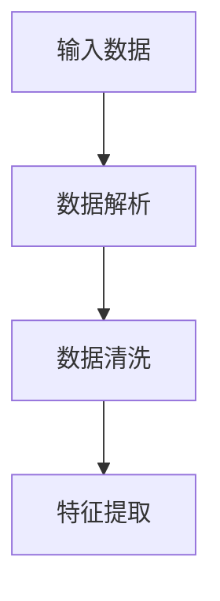

**2.1.2 决策模块**

决策模块基于输入数据和预设的规则，生成决策指令。以下是决策模块的流程图：

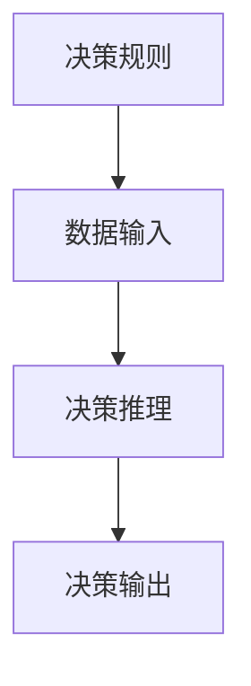

**2.1.3 执行模块**

执行模块负责根据决策模块的输出，执行具体的营销操作，如发送邮件、推送消息等。

---

#### 2.2 AI Agent的算法基础

**2.2.1 机器学习算法**

机器学习算法是AI Agent的核心，常用算法包括支持向量机（SVM）、随机森林（Random Forest）和神经网络（Neural Networks）等。以下是机器学习算法的流程图：

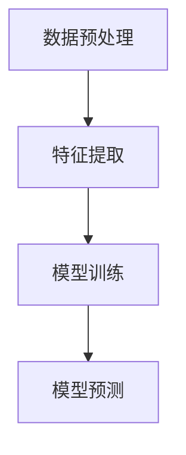

**2.2.2 自然语言处理技术**

自然语言处理（NLP）技术用于理解和生成人类语言，常用技术包括分词、实体识别和情感分析等。以下是NLP技术的流程图：

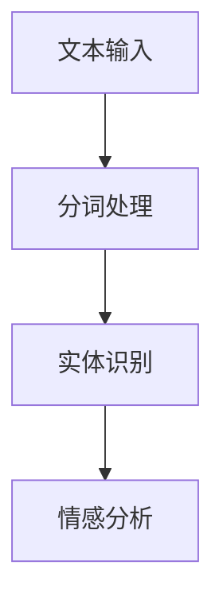

**2.2.3 强化学习与决策树**

强化学习用于优化AI Agent的行为策略，而决策树则用于分类和回归问题。以下是强化学习和决策树的流程图：

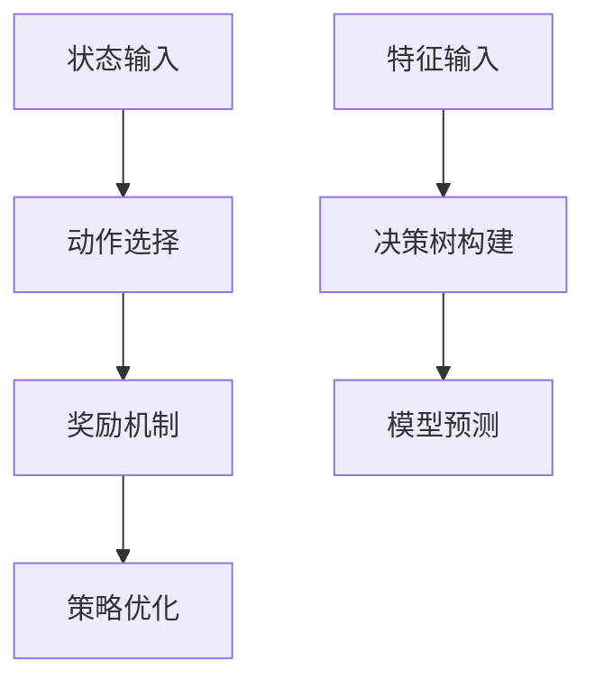

---

#### 2.3 AI Agent的训练与优化

**2.3.1 数据预处理**

数据预处理是AI Agent训练的重要步骤，包括数据清洗、特征提取和数据增强等。以下是数据预处理的流程图：

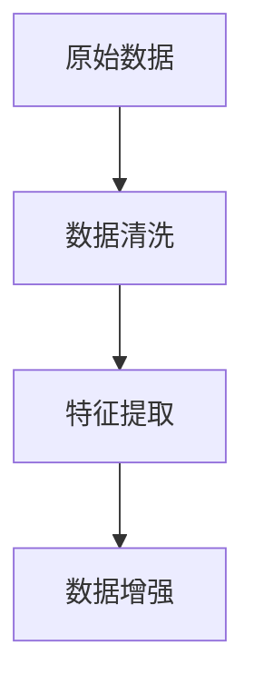

**2.3.2 模型训练**

模型训练包括选择合适的算法、调整超参数和训练模型等步骤。以下是模型训练的流程图：

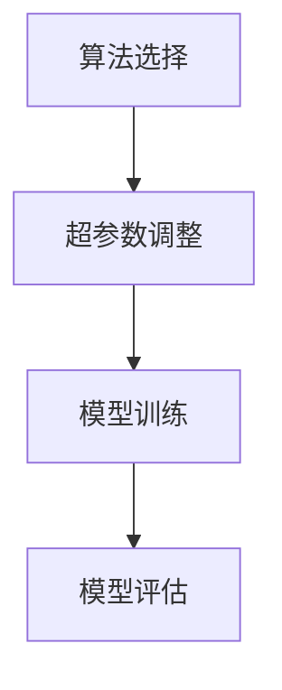

**2.3.3 模型评估与优化**

模型评估包括准确率、召回率和F1分数等指标。以下是模型评估的流程图：

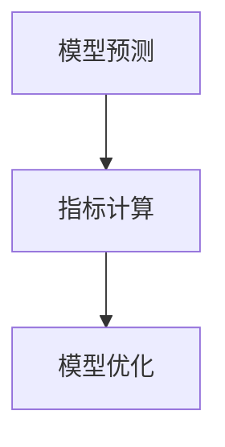

---

### 第3章: AI Agent在营销中的应用场景

#### 3.1 客户画像与需求分析

**3.1.1 客户数据收集与处理**

通过多种渠道收集客户数据，包括社交媒体、网站访问和购买记录等。以下是客户数据收集与处理的流程图：

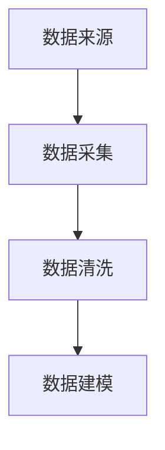

**3.1.2 客户画像的构建**

客户画像通过分析客户的特征和行为，构建客户的三维画像。以下是客户画像的构建流程图：

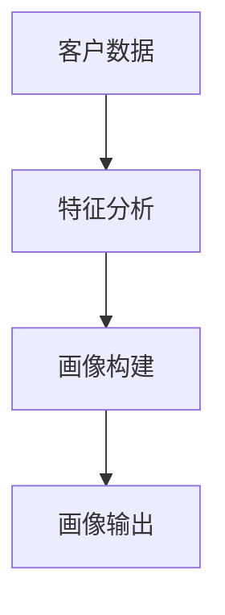

**3.1.3 需求预测与分析**

通过分析客户的行为和偏好，预测客户的需求。以下是需求预测与分析的流程图：

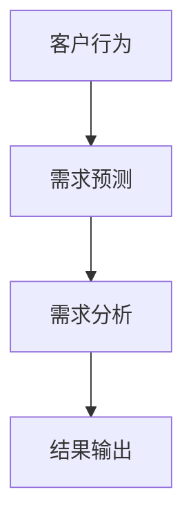

---

#### 3.2 精准营销与个性化推荐

**3.2.1 精准营销策略**

精准营销通过分析客户画像和需求，制定个性化的营销策略。以下是精准营销策略的流程图：

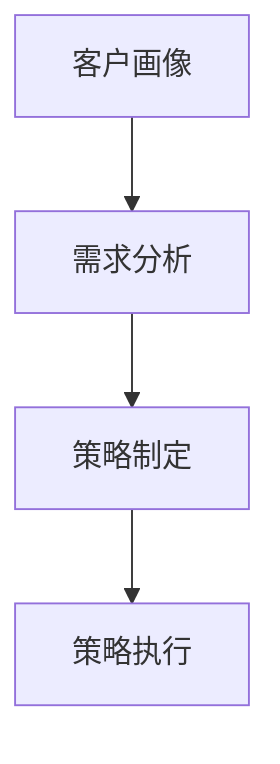

**3.2.2 个性化推荐算法**

个性化推荐算法包括基于协同过滤、基于内容的推荐和混合推荐等方法。以下是个性化推荐算法的流程图：

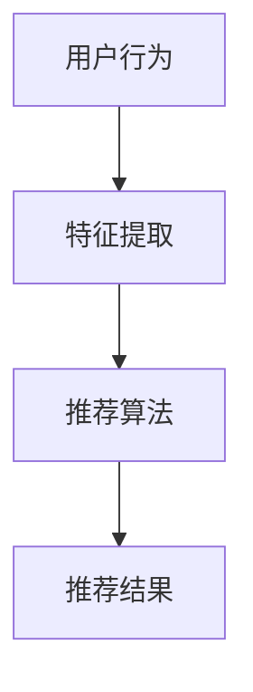

**3.2.3 推荐系统的实现**

推荐系统的实现包括数据预处理、模型训练和结果输出等步骤。以下是推荐系统的实现流程图：

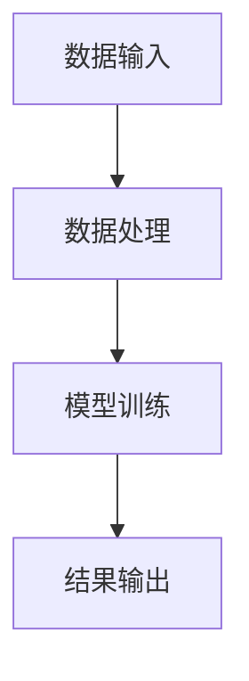

---

#### 3.3 营销效果评估与优化

**3.3.1 营销效果的评估指标**

常用的营销效果评估指标包括转化率、点击率和客户满意度等。以下是营销效果评估指标的表格：

| 指标名称 | 指标定义 | 指标作用 |
|----------|----------|----------|
| 转化率    | 转化目标达成的次数 / 总访问次数 | 评估营销活动的效果 |
| 点击率    | 点击目标链接的次数 / 总展示次数 | 评估广告或内容的吸引力 |
| 客户满意度 | 客户对服务的满意程度 | 评估客户体验 |

**3.3.2 数据分析与优化**

通过分析数据，找出优化点并进行调整。以下是数据分析与优化的流程图：

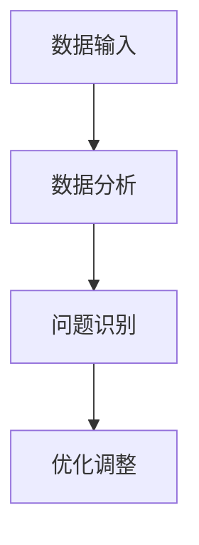

**3.3.3 持续改进策略**

持续改进策略包括定期评估和优化模型、监控市场变化和客户反馈等。以下是持续改进策略的流程图：

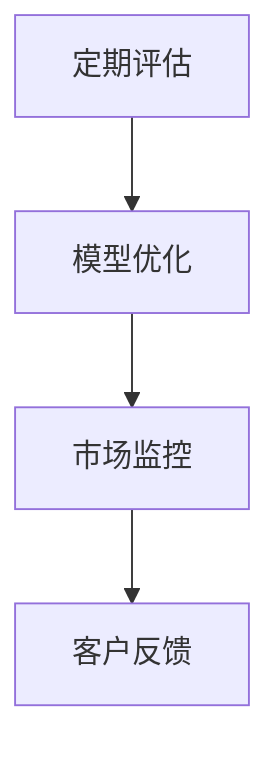

---

### 第4章: AI Agent驱动的营销系统架构

#### 4.1 系统整体架构设计

**4.1.1 系统功能模块划分**

AI Agent驱动的营销系统主要包括数据采集、数据处理、模型训练和结果输出四个功能模块。以下是系统功能模块的类图：

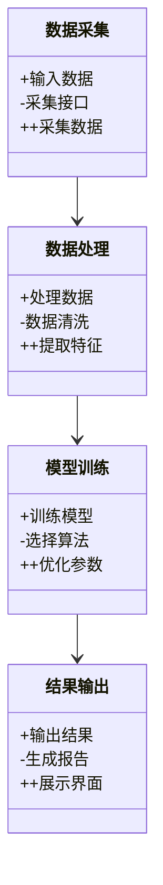

**4.1.2 系统架构图**

以下是AI Agent驱动的营销系统的架构图：

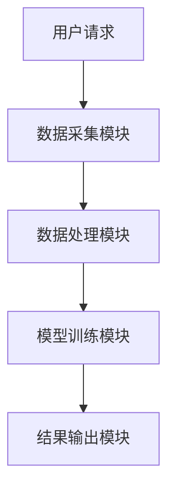

**4.1.3 系统接口设计**

系统接口设计包括数据采集接口、模型调用接口和结果展示接口。以下是系统接口设计的表格：

| 接口名称 | 接口功能 | 接口类型 |
|----------|----------|----------|
| 数据采集接口 | 采集客户数据 | RESTful API |
| 模型调用接口 | 调用AI Agent模型 | RPC |
| 结果展示接口 | 展示营销结果 | Web API |

**4.1.4 系统交互流程**

以下是系统交互流程的序列图：

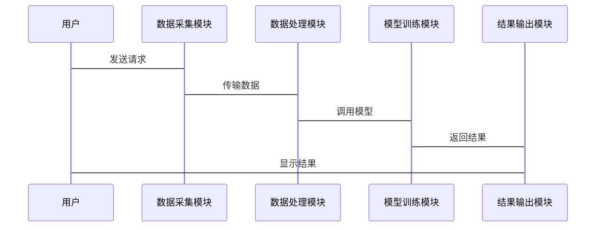

---

### 第5章: 项目实战——构建基于AI Agent的智能营销系统

#### 5.1 项目背景与目标

本项目旨在构建一个基于AI Agent的智能营销系统，实现客户画像、精准营销和个性化推荐功能。

#### 5.2 项目环境与工具

- **编程语言**：Python
- **框架与库**：TensorFlow、PyTorch、Scikit-learn
- **开发工具**：Jupyter Notebook、VS Code
- **数据存储**：MySQL、MongoDB

#### 5.3 核心实现源代码

以下是核心代码实现：

```python
import numpy as np
from sklearn.model_selection import train_test_split
from sklearn.ensemble import RandomForestClassifier

# 数据预处理
def preprocess_data(data):
    # 数据清洗
    data.dropna(inplace=True)
    # 特征提取
    features = data[['age', 'income', 'gender']]
    target = data['label']
    return features, target

# 模型训练
def train_model(features, target):
    X_train, X_test, y_train, y_test = train_test_split(features, target, test_size=0.2)
    model = RandomForestClassifier()
    model.fit(X_train, y_train)
    return model, X_test, y_test

# 模型预测
def predict_model(model, X_test):
    y_pred = model.predict(X_test)
    return y_pred

# 模型评估
def evaluate_model(y_test, y_pred):
    accuracy = np.mean(y_pred == y_test)
    print(f"Accuracy: {accuracy}")
    return accuracy

# 主函数
def main():
    # 数据加载
    data = pd.read_csv('customer_data.csv')
    # 数据预处理
    features, target = preprocess_data(data)
    # 模型训练
    model, X_test, y_test = train_model(features, target)
    # 模型预测
    y_pred = predict_model(model, X_test)
    # 模型评估
    accuracy = evaluate_model(y_test, y_pred)
    print(f"Accuracy: {accuracy}")

if __name__ == "__main__":
    main()
```

---

### 第6章: 最佳实践与小结

#### 6.1 最佳实践 Tips

- **数据质量**：确保数据的准确性和完整性，数据预处理是关键。
- **模型选择**：根据具体问题选择合适的算法，避免盲目使用复杂模型。
- **实时优化**：定期监控模型性能，及时调整和优化。

#### 6.2 小结

本文详细介绍了如何构建一个基于AI Agent的智能营销系统，涵盖了从基础概念到系统实现的全过程。通过理论与实践相结合，帮助读者掌握AI Agent在营销中的应用。

#### 6.3 注意事项

- **数据隐私**：确保客户数据的安全和隐私保护。
- **模型解释性**：提高模型的可解释性，便于分析和优化。
- **技术更新**：及时跟进AI技术的最新发展，保持系统的先进性。

#### 6.4 拓展阅读

- **推荐书籍**：《机器学习实战》、《深度学习》
- **在线资源**：Kaggle、Coursera相关课程
- **技术博客**：Towards Data Science、Medium AI专栏

---

### 作者信息

作者：AI天才研究院/AI Genius Institute & 禅与计算机程序设计艺术 /Zen And The Art of Computer Programming

---

以上是《构建AI Agent驱动的智能营销系统》的完整目录和内容概要，希望对您有所帮助！

