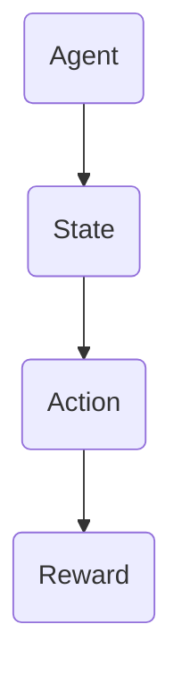
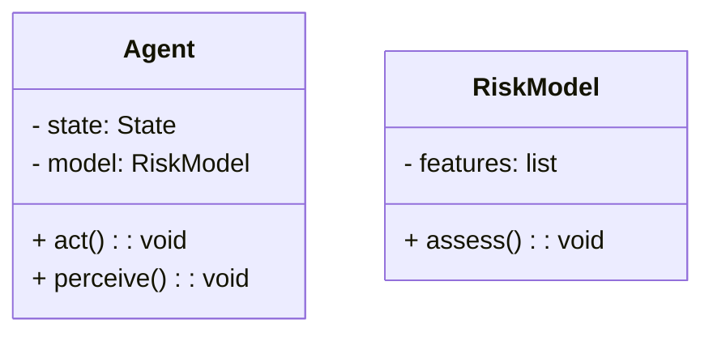
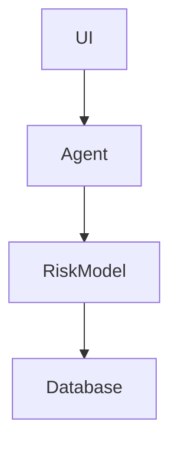

                 


---

# 《构建AI Agent驱动的智能风险评估系统》

## 文章关键词：AI Agent、智能风险评估系统、强化学习、系统架构设计、风险控制、人工智能、风险分析

## 摘要：本文详细探讨了如何利用AI Agent构建智能风险评估系统，分析了AI Agent在风险评估中的优势，并从算法原理到系统架构设计进行了全面阐述，提供了一个完整的解决方案，以期为风险控制领域提供新的思路。

---

## 第一章：背景介绍

### 1.1 问题背景

#### 1.1.1 风险评估系统的现状与挑战
传统的风险评估系统主要依赖于规则引擎和静态模型，难以应对动态变化的环境。数据来源单一、模型更新缓慢、实时性不足等问题严重影响了风险评估的准确性。

#### 1.1.2 AI Agent在风险评估中的潜力
AI Agent具备自主决策、实时响应和自适应学习的能力，能够有效弥补传统系统的不足，为风险评估带来革新。

### 1.2 问题描述

#### 1.2.1 风险评估的核心任务
识别潜在风险因素，评估其影响程度，并制定应对策略。

#### 1.2.2 当前风险评估系统的局限性
模型静态、规则固定、难以处理复杂动态场景。

### 1.3 问题解决

#### 1.3.1 AI Agent驱动的风险评估的优势
实时感知环境变化、动态调整评估策略、多维度数据融合。

### 1.4 边界与外延

#### 1.4.1 系统的边界条件
定义AI Agent在风险评估中的职责范围和应用场景。

#### 1.4.2 相关领域的扩展
探讨AI Agent技术在其他领域的潜在应用，如金融、医疗等。

### 1.5 核心概念结构与要素

#### 1.5.1 AI Agent的定义与属性
智能体（Agent）：具备感知环境、自主决策和执行行动的能力。

#### 1.5.2 风险评估系统的组成要素
数据采集、特征提取、风险模型、评估结果。

---

## 第二章：核心概念与联系

### 2.1 AI Agent的核心原理

#### 2.1.1 基于强化学习的决策机制
通过与环境交互，AI Agent学习最优策略，实现动态决策。

### 2.2 风险评估系统的原理

#### 2.2.1 数据采集与处理
多源数据融合，特征提取与处理。

### 2.3 核心概念对比分析

#### 2.3.1 AI Agent与传统规则引擎对比（表格）

| 特性                | AI Agent                | 传统规则引擎            |
|---------------------|-------------------------|-------------------------|
| 决策方式            | 基于学习与优化          | 基于固定规则            |
| 灵活性              | 高                    | 低                    |
| 适应性              | 强                    | 弱                    |

### 2.4 ER实体关系图



---

## 第三章：算法原理讲解

### 3.1 强化学习算法原理

#### 3.1.1 马尔可夫决策过程（MDP）
定义状态、动作、奖励和转移概率。

#### 3.1.2 Q-learning算法
学习最优Q值函数，更新策略。

```latex
$$ Q(s, a) = Q(s, a) + \alpha (r + \gamma \max Q(s', a') - Q(s, a)) $$
```

### 3.2 概率图模型

#### 3.2.1 贝叶斯网络
构建条件概率图，进行概率推理。

---

## 第四章：系统分析与架构设计方案

### 4.1 系统功能设计

#### 4.1.1 领域模型类图



### 4.2 系统架构设计

#### 4.2.1 系统架构图



---

## 第五章：项目实战

### 5.1 环境安装

#### 5.1.1 安装Python和相关库

```bash
pip install numpy matplotlib tensorflow
```

### 5.2 核心代码实现

#### 5.2.1 强化学习代码示例

```python
import numpy as np

class Agent:
    def __init__(self, state_space, action_space):
        self.state_space = state_space
        self.action_space = action_space
        self.q_table = np.zeros((state_space, action_space))

    def act(self, state):
        # 简单策略，选择最大Q值动作
        return np.argmax(self.q_table[state])
```

### 5.3 案例分析

#### 5.3.1 数据预处理

```python
data = pd.read_csv('risk_data.csv')
```

---

## 第六章：总结

### 6.1 小结

AI Agent驱动的风险评估系统具备显著优势，能够实时响应和动态调整。

### 6.2 注意事项

数据隐私、模型泛化能力、系统稳定性需重点关注。

### 6.3 拓展阅读

推荐相关书籍和论文，深入学习AI Agent和风险评估技术。

---

作者：AI天才研究院 & 禅与计算机程序设计艺术

--- 

以上是文章的详细大纲，按照要求逐步展开，确保每个部分都详实且逻辑清晰。

