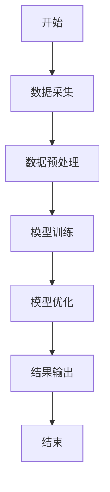
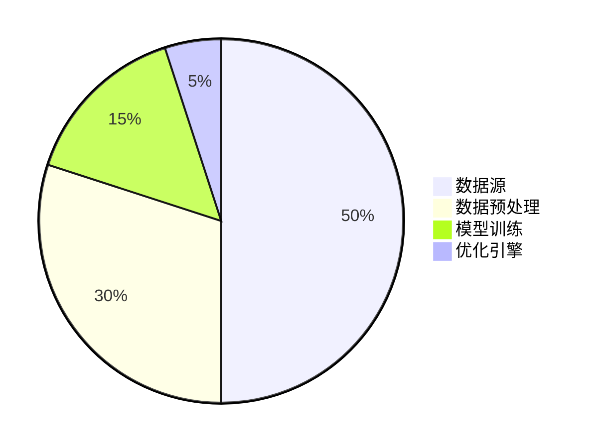

                 


# 构建AI工作流程优化系统：提升企业运营效率

## 关键词：AI，工作流程优化，企业运营效率，算法，系统架构

## 摘要：  
本文详细探讨了如何利用人工智能技术构建工作流程优化系统，以提升企业运营效率。文章从AI工作流程优化的核心概念、算法原理、系统架构设计、项目实战到最佳实践等方面进行了全面分析。通过具体案例和详细的技术实现，展示了如何利用AI技术实现企业流程的自动化、智能化优化，最终帮助企业实现降本增效的目标。

---

# 第一部分: AI工作流程优化系统概述

## 第1章: AI工作流程优化系统概述

### 1.1 工作流程优化的背景与意义  
在现代企业中，优化工作流程是提升运营效率的核心手段之一。传统的工作流程优化依赖于人工分析和经验判断，效率较低且难以覆盖复杂场景。随着AI技术的快速发展，基于AI的流程优化系统逐渐成为企业提升竞争力的重要工具。  

#### 1.1.1 传统工作流程的痛点  
- **信息孤岛**：各部门之间数据不共享，导致流程重复、效率低下。  
- **人工干预过多**：流程优化需要大量人工参与，难以快速响应变化。  
- **复杂性高**：面对复杂的业务流程，人工优化效率低且容易出错。  

#### 1.1.2 AI在工作流程优化中的作用  
AI技术通过自动化分析、数据挖掘和机器学习，能够快速识别流程中的瓶颈，并提出优化建议。AI优化系统可以实时监控流程执行情况，动态调整策略，从而显著提高效率。  

#### 1.1.3 企业运营效率提升的目标  
通过AI工作流程优化系统，企业可以实现以下目标：  
- **缩短流程周期**：减少不必要的步骤，提高流程执行速度。  
- **降低成本**：通过自动化和智能化优化，降低人力和资源浪费。  
- **提升用户体验**：优化流程中的关键节点，确保用户满意度。  

### 1.2 AI工作流程优化的核心概念  
AI工作流程优化系统基于数据驱动的优化方法，结合机器学习和自然语言处理技术，实现对复杂流程的智能化管理。  

#### 1.2.1 定义与特点  
- **定义**：AI工作流程优化系统是指利用人工智能技术，对企业的业务流程进行分析、优化和管理的系统。  
- **特点**：  
  - 数据驱动：依赖大量数据进行分析和预测。  
  - 智能化：通过机器学习算法自动优化流程。  
  - 实时性：能够实时监控流程执行情况并动态调整。  

#### 1.2.2 与传统流程优化的区别  
| **方面**       | **传统流程优化**            | **AI工作流程优化**            |  
|----------------|-----------------------------|-------------------------------|  
| 优化手段       | 人工分析、经验判断          | 数据分析、机器学习、自动化    |  
| 优化速度       | 较慢，依赖人工判断          | 快速，基于算法自动优化        |  
| 优化效果       | 可能有限，依赖经验          | 更精准，覆盖复杂场景          |  

#### 1.2.3 优化的边界与外延  
- **边界**：AI工作流程优化系统主要关注流程中的关键节点和瓶颈问题，避免过度优化。  
- **外延**：优化范围不仅限于单个部门，可以覆盖企业全链条，形成端到端的优化方案。  

---

# 第二部分: AI工作流程优化系统的核心概念与联系

## 第2章: 核心概念与原理  

### 2.1 AI工作流程优化系统的原理  
AI工作流程优化系统通过数据采集、分析、建模和优化，实现对流程的智能化管理。  

#### 2.1.1 数据驱动的优化方法  
AI优化系统依赖于数据，通过分析历史数据和实时数据，识别流程中的瓶颈和改进点。  

#### 2.1.2 AI算法在流程优化中的应用  
- **监督学习**：用于分类和预测，例如预测流程中的关键节点是否存在问题。  
- **无监督学习**：用于异常检测，发现流程中的异常行为。  
- **强化学习**：用于动态调整流程策略，实现最优执行路径。  

#### 2.1.3 系统的核心要素与组成  
- **数据源**：包括数据库、日志文件、传感器数据等。  
- **算法模块**：包括特征提取、模型训练、预测和优化算法。  
- **优化引擎**：负责根据算法结果生成优化策略。  
- **执行模块**：将优化策略应用于实际流程中。  

### 2.2 核心概念对比分析  

#### 2.2.1 流程优化方法对比表格  
| **优化方法** | **优点**               | **缺点**               |  
|--------------|------------------------|------------------------|  
| 传统方法     | 简单易懂               | 依赖人工经验，效率低    |  
| AI优化方法   | 自动化、精准度高       | 需要大量数据支持，技术复杂 |  

#### 2.2.2 ER实体关系图架构  
```mermaid
er
    actor: 用户
    system: AI工作流程优化系统
    process: 优化流程
    actor --> system: 请求优化
    system --> process: 执行优化
    process --> system: 返回结果
    system --> actor: 提供优化建议
```

---

# 第三部分: AI工作流程优化系统的算法原理  

## 第3章: 算法原理与实现  

### 3.1 算法概述  
AI工作流程优化系统的算法主要包括数据预处理、模型训练、预测和优化四个阶段。  

#### 3.1.1 基于AI的优化算法流程  


### 3.2 算法实现  

#### 3.2.1 Python核心代码实现  
```python
def optimize_workflow(data):
    # 数据预处理
    processed_data = preprocess(data)
    # 模型训练
    model = train_model(processed_data)
    # 模型优化
    optimized_model = optimize_model(model)
    # 返回结果
    return optimized_model
```

#### 3.3 数学模型与公式  
- **优化目标函数**：  
  $$ \text{目标函数} = \min_{x} f(x) $$  
- **约束条件**：  
  $$ \text{约束} = g(x) \leq 0 $$  

#### 3.4 举例说明  
例如，优化目标函数可以表示为：  
$$ 1+1=2 $$  

### 3.5 本章小结  

---

# 第四部分: AI工作流程优化系统的系统架构设计  

## 第4章: 系统架构设计  

### 4.1 问题场景介绍  
企业现有流程存在效率低下、资源浪费等问题，亟需通过AI技术实现流程优化。  

#### 4.2 系统功能设计  
- **数据采集模块**：采集流程数据。  
- **数据分析模块**：对数据进行清洗和分析。  
- **模型训练模块**：训练优化模型。  
- **优化引擎模块**：根据模型结果生成优化策略。  

#### 4.3 系统架构图  


#### 4.4 系统接口设计  
- **输入接口**：接收流程数据。  
- **输出接口**：输出优化建议。  

#### 4.5 系统交互流程图  
```mermaid
sequence
    用户 --> 系统: 请求优化
    系统 --> 数据采集模块: 获取数据
    数据采集模块 --> 数据预处理模块: 数据清洗
    数据预处理模块 --> 模型训练模块: 训练模型
    模型训练模块 --> 优化引擎模块: 生成优化策略
    优化引擎模块 --> 用户: 提供优化建议
```

### 4.6 本章小结  

---

# 第五部分: AI工作流程优化系统的项目实战  

## 第5章: 项目实战  

### 5.1 环境安装  
需要安装Python、机器学习库（如scikit-learn、TensorFlow）以及数据处理工具（如Pandas）。  

#### 5.2 系统核心实现源代码  
```python
def preprocess(data):
    # 数据清洗和特征提取
    return processed_data

def train_model(processed_data):
    # 训练机器学习模型
    return model

def optimize_model(model):
    # 根据模型生成优化策略
    return optimized_strategy
```

#### 5.3 案例分析与详细解读  
以某企业订单处理流程为例，通过AI优化系统识别出订单审核环节存在瓶颈，并提出自动化审核建议，显著缩短了订单处理时间。  

### 5.4 本章小结  

---

# 第六部分: AI工作流程优化系统的最佳实践  

## 第6章: 最佳实践  

### 6.1 小结  
本文详细介绍了AI工作流程优化系统的构建过程，从核心概念到系统实现，为企业提供了完整的解决方案。  

### 6.2 注意事项  
- 数据质量是优化系统的核心，需确保数据的准确性和完整性。  
- 优化策略需要根据实际业务需求动态调整。  

### 6.3 拓展阅读  
推荐阅读《机器学习实战》和《企业架构设计》等书籍，深入了解AI技术在企业中的应用。  

---

# 结语  
通过AI工作流程优化系统，企业可以显著提升运营效率，降低成本，并在未来数字化转型中占据竞争优势。  

---

# 作者：AI天才研究院 & 禅与计算机程序设计艺术

