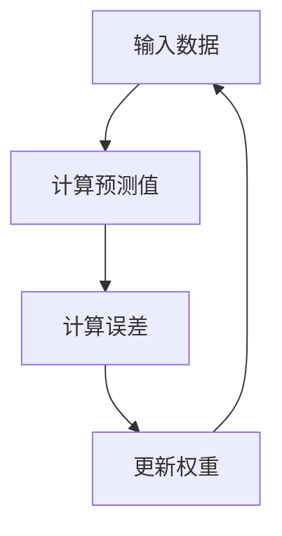
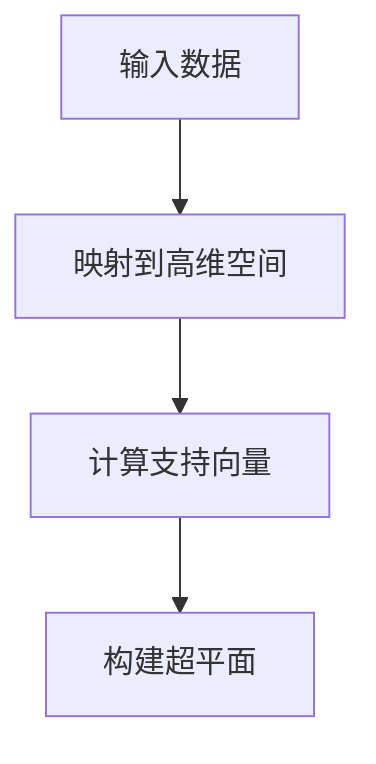
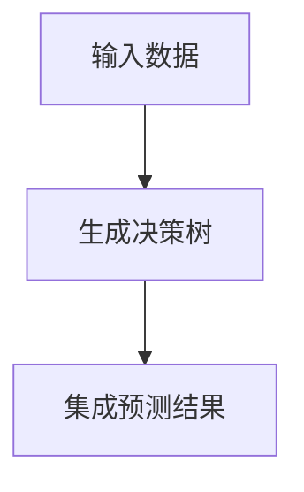
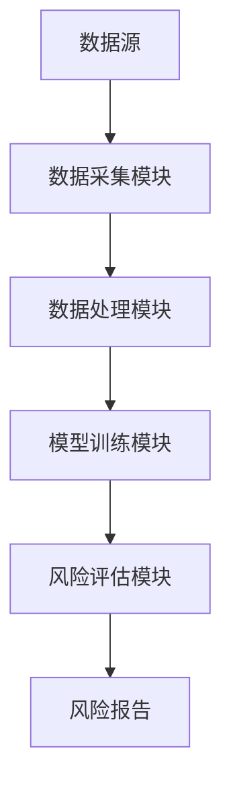
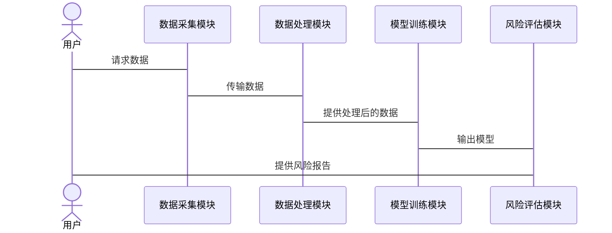

                 


# 《构建AI辅助的金融风险度量系统》

## 关键词：AI、金融风险、风险管理、机器学习、系统架构

## 摘要：  
本文系统地探讨了如何利用人工智能技术构建金融风险度量系统。首先，从金融风险的基本概念和传统度量方法的局限性入手，引出了人工智能在金融领域的应用潜力。接着，详细分析了AI辅助金融风险度量的核心概念与系统架构，包括数据来源、模型构建和风险评估等关键要素。随后，深入讲解了常用的机器学习算法（如线性回归、支持向量机和随机森林）的原理与实现，并通过Mermaid流程图和Python代码示例帮助读者理解。此外，本文还从系统设计的角度出发，介绍了项目的背景、功能设计、架构图、接口设计和交互流程。最后，通过一个完整的项目实战案例，展示了如何将理论应用于实践，并提出了系统优化与扩展的方向。本文旨在为读者提供从理论到实践的全面指导，帮助他们构建高效可靠的AI辅助金融风险度量系统。

---

## 第1章：金融风险度量的背景与挑战

### 1.1 金融风险的定义与分类  
金融风险是指由于市场波动、经济变化或其他不确定性因素，导致金融机构或投资者遭受损失的可能性。常见的金融风险类型包括市场风险、信用风险、流动性风险和操作风险。

### 1.2 传统金融风险度量方法的局限性  
传统方法如VaR（Value at Risk）和CVaR（Conditional Value at Risk）虽然在一定程度上能够量化风险，但它们通常假设数据分布是线性的，难以捕捉非线性关系和复杂市场行为。

### 1.3 AI在金融领域的应用前景  
人工智能技术，特别是机器学习算法，能够通过非线性模型捕捉复杂的数据关系，提高风险预测的准确性和实时性。AI在金融领域的应用包括智能投顾、欺诈检测和信用评分等。

---

## 第2章：核心概念与系统架构

### 2.1 AI辅助金融风险度量的核心要素  
- **数据来源**：包括市场数据、用户行为数据和新闻情绪数据等。
- **模型构建**：选择适合的机器学习算法，并进行数据预处理、特征提取和模型训练。
- **风险评估**：通过模型输出风险评分，并结合业务规则进行最终评估。

### 2.2 实体关系图（ER图）  
```mermaid
er
actor: 用户
model: 风险度量模型
data: 数据源
interface: 系统接口
```

### 2.3 核心概念对比表  
| 概念 | 属性 | 描述 |
|------|------|------|
| 数据来源 | 多样性 | 包括市场数据、用户行为数据等 |
| 模型类型 | 可解释性 | 如线性回归、随机森林等 |
| 风险评估 | 时效性 | 需要实时或近实时计算 |

---

## 第3章：常见算法原理与实现

### 3.1 线性回归算法  
#### 3.1.1 算法原理  
线性回归是一种简单而强大的回归算法，通过最小化预测值与实际值之间的平方差之和来优化模型参数。  



#### 3.1.2 数学模型  
$$ y = \beta_0 + \beta_1x + \epsilon $$  

### 3.2 支持向量机（SVM）  
#### 3.2.1 算法原理  
SVM通过将数据映射到高维空间，并在高维空间中找到一个超平面，将数据分成两类。



### 3.3 随机森林  
#### 3.3.1 算法原理  
随机森林是一种基于决策树的集成学习算法，通过构建多棵决策树并取其预测结果的平均值来提高模型的准确性和鲁棒性。



---

## 第4章：系统分析与架构设计

### 4.1 项目背景与目标  
本项目旨在构建一个实时金融风险监测系统，通过AI技术提高风险预测的准确性和效率。

### 4.2 系统功能设计  
- 数据采集模块：从多个数据源获取金融数据。
- 数据处理模块：对数据进行清洗、特征提取和标准化处理。
- 模型训练模块：选择合适的算法并进行模型训练。
- 风险评估模块：基于模型输出风险评分，并生成风险报告。

### 4.3 系统架构图  


### 4.4 接口设计与交互流程  


---

## 第5章：项目实战

### 5.1 环境安装  
- 安装Python、Jupyter Notebook、NumPy、Pandas和Scikit-learn。

### 5.2 核心代码实现  
```python
import pandas as pd
from sklearn.model_selection import train_test_split
from sklearn.ensemble import RandomForestRegressor
from sklearn.metrics import mean_absolute_error

# 数据加载
data = pd.read_csv('financial_data.csv')
X = data[['feature1', 'feature2', ...]]
y = data['target']

# 数据分割
X_train, X_test, y_train, y_test = train_test_split(X, y, test_size=0.2)

# 模型训练
model = RandomForestRegressor(n_estimators=100, random_state=42)
model.fit(X_train, y_train)

# 模型预测
y_pred = model.predict(X_test)

# 评估指标
mae = mean_absolute_error(y_test, y_pred)
print('Mean Absolute Error:', mae)
```

### 5.3 案例分析  
通过分析实际案例，如股票市场的风险预测，展示模型的预测能力。

---

## 第6章：优化与扩展

### 6.1 系统优化  
- 超参数调优：使用网格搜索或随机搜索优化模型性能。
- 集成学习：通过集成多个模型进一步提高预测准确率。

### 6.2 鲁棒性设计  
- 数据预处理：增强模型对异常数据的鲁棒性。
- 模型容错：设计容错机制，确保系统在模型失效时仍能正常运行。

### 6.3 未来研究方向  
- 深度学习模型：探索深度学习在金融风险度量中的应用。
- 实时数据流处理：研究如何处理实时数据流，提高风险预测的实时性。

---

## 附录A：工具与库安装指南  
- Python: `python --version`
- Jupyter Notebook: `jupyter notebook --ip=0.0.0.0`
- NumPy: `pip install numpy`
- Pandas: `pip install pandas`
- Scikit-learn: `pip install scikit-learn`

---

## 附录B：数据源与数据格式  
- 数据来源：金融数据API、CSV文件等。
- 数据格式示例：`date,feature1,feature2,target`

---

## 附录C：参考文献  
- 刘军. 《机器学习实战》
- 王伟. 《Python机器学习》
- 李明. 《金融风险管理》

---

## 作者：AI天才研究院/AI Genius Institute & 禅与计算机程序设计艺术 /Zen And The Art of Computer Programming  

---

通过以上目录结构和内容安排，本书将为读者提供从理论到实践的全面指导，帮助他们理解并构建高效的AI辅助金融风险度量系统。每一部分都注重细节，结合图表和代码示例，确保内容易于理解和应用。

