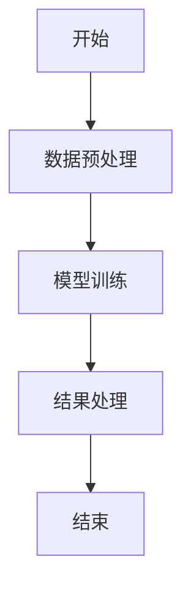
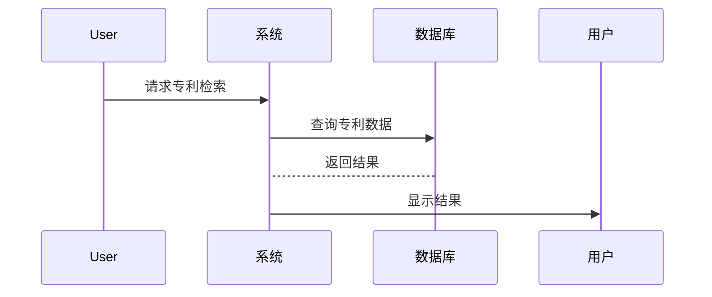

                 


# 构建AI驱动的企业专利组合管理系统

> 关键词：企业专利管理，人工智能，专利组合，系统架构，算法实现

> 摘要：本文详细探讨了如何利用人工智能技术构建企业专利组合管理系统。通过分析传统专利管理的痛点，提出了基于AI的解决方案，涵盖了算法原理、系统架构设计、项目实现及优化策略等多个方面。文章结合实际案例，展示了系统在专利检索、分类、分析和管理中的应用，为企业提供了高效、智能的专利管理新思路。

---

# 第1章：企业专利组合管理概述

## 1.1 问题背景与描述

### 1.1.1 传统企业专利管理的痛点
企业在专利管理中常常面临以下问题：
- **数据分散**：专利数据分布在不同数据库中，难以统一管理和检索。
- **人工依赖**：专利分类、检索和分析主要依赖人工操作，效率低下。
- **信息孤岛**：专利数据孤立，难以与其他业务系统集成，影响企业决策。

### 1.1.2 专利组合管理的核心目标
专利组合管理的目标是通过系统化的方法，优化专利布局，降低管理成本，提升专利价值。具体目标包括：
1. **高效检索**：快速定位相关专利信息。
2. **智能分类**：自动对专利进行分类和整理。
3. **价值评估**：评估专利的市场价值和法律风险。

### 1.1.3 AI驱动的必要性与优势
AI技术能够通过自然语言处理（NLP）和机器学习（ML）对专利数据进行深度分析，帮助企业在专利管理中实现自动化和智能化。AI的优势包括：
- **高效处理**：快速处理大量专利数据。
- **智能分析**：自动识别专利之间的关联性。
- **实时更新**：及时获取最新专利信息。

## 1.2 问题解决与边界定义

### 1.2.1 AI在专利组合管理中的应用范围
AI技术在专利组合管理中的应用范围包括：
1. **专利检索**：通过关键词和上下文分析，快速检索相关专利。
2. **分类与标注**：自动对专利进行分类和标注。
3. **风险评估**：评估专利的法律风险和市场价值。

### 1.2.2 系统边界与外延
系统边界包括：
- **输入**：企业专利数据、外部专利数据库。
- **输出**：专利分类、检索结果、风险评估报告。
- **核心功能**：数据处理、分析、报告生成。

### 1.2.3 核心要素与组成结构
核心要素包括：
1. **专利数据**：包括专利文本、申请信息等。
2. **AI模型**：用于分类和分析的机器学习模型。
3. **用户界面**：供用户查询和管理专利的界面。

## 1.3 核心概念对比与ER图

### 1.3.1 核心概念对比表
| 特征          | 传统专利管理系统         | AI驱动专利管理系统         |
|---------------|--------------------------|---------------------------|
| 数据处理      | 人工分类，效率低         | 自动分类，高效准确         |
| 检索速度      | 慢，依赖人工查询         | 快，支持模糊检索           |
| 分析能力      | 有限，主要基于关键词     | 强大，支持语义分析         |

### 1.3.2 实体关系ER图
```mermaid
er
    entity 专利 (Patent) {
        专利ID (PK)
        专利名称
        申请人
        申请日期
        分类号
        技术领域
    }
    
    entity 用户 (User) {
        用户ID (PK)
        用户名
        权限级别
    }
    
    entity 专利分类 (Patent_Category) {
        分类ID (PK)
        分类名称
        分类规则
    }
    
    Patent --> Patent_Category: 分属于
    User --> Patent: 查询
    User --> Patent_Category: 查询
```

---

# 第2章：AI驱动的专利组合管理核心算法

## 2.1 算法原理与流程

### 2.1.1 算法概述
AI驱动的专利组合管理算法主要包括以下步骤：
1. **数据预处理**：清洗和标注专利数据。
2. **模型训练**：使用NLP和机器学习模型对专利数据进行分类和分析。
3. **结果处理**：输出分类结果和分析报告。

### 2.1.2 算法流程图


## 2.2 算法实现与代码

### 2.2.1 环境安装与配置
安装必要的库：
```bash
pip install numpy pandas scikit-learn spacy
```

### 2.2.2 核心算法实现代码
```python
import spacy
from sklearn.feature_extraction.text import TfidfVectorizer
from sklearn.cluster import KMeans

# 加载预训练的NLP模型
nlp = spacy.load("en_core_web_sm")

def preprocess(text):
    doc = nlp(text)
    return " ".join([token.lemma_ for token in doc])

def train_model(X, num_clusters=5):
    vectorizer = TfidfVectorizer(max_features=500)
    X_vec = vectorizer.fit_transform(X)
    model = KMeans(n_clusters=num_clusters, random_state=42)
    model.fit(X_vec)
    return model, vectorizer

# 示例数据
texts = ["Patent on AI technology", "Machine learning applications", "Natural language processing systems"]
model, vectorizer = train_model([preprocess(text) for text in texts])
```

### 2.3 数学模型与公式

#### 余弦相似度
余弦相似度公式：
$$\cos\theta = \frac{\vec{A} \cdot \vec{B}}{|\vec{A}| |\vec{B}|}$$

#### 聚类算法
K-means算法目标函数：
$$\text{min}_{\textbf{c}} \sum_{i=1}^{n} \sum_{k=1}^{c} (x_i - c_k)^2$$

---

# 第3章：系统分析与架构设计

## 3.1 项目背景与目标

### 3.1.1 项目背景
随着企业专利数量的激增，传统管理方式难以满足高效管理的需求。AI技术的应用为企业专利管理提供了新的解决方案。

### 3.1.2 项目目标
构建一个AI驱动的企业专利组合管理系统，实现以下目标：
1. 提供高效的专利检索功能。
2. 实现专利的自动分类和分析。
3. 提供风险评估和决策支持。

## 3.2 系统功能设计

### 3.2.1 领域模型类图
```mermaid
classDiagram
    class 专利管理系统 {
        +数据库连接：db
        +用户界面：ui
        +AI模型：model
        -数据处理函数：process_data()
        -分类函数：classify()
    }
    class 用户 {
        +用户ID：id
        +用户名：name
        +权限：permission
    }
    专利管理系统 --> 用户：提供服务
    专利管理系统 --> 数据库：存储数据
```

## 3.3 系统架构设计

### 3.3.1 系统架构图
```mermaid
container 容器1 {
    专利管理系统
    包含：
    - 数据采集模块
    - 数据处理模块
    - AI分析模块
    - 用户界面模块
}
```

## 3.4 系统接口与交互设计

### 3.4.1 关键接口设计
1. `/api/search`：专利检索接口。
2. `/api/classify`：专利分类接口。
3. `/api/report`：生成分析报告接口。

### 3.4.2 用户交互流程图


---

# 第4章：项目实战与实现

## 4.1 环境安装与配置

### 4.1.1 环境搭建步骤
1. 安装Python和必要的库（如scikit-learn、spacy）。
2. 下载专利数据集。
3. 配置数据库和AI模型。

## 4.2 核心功能实现

### 4.2.1 数据清洗与预处理
```python
import spacy

def preprocess Patent(patent_text):
    doc = nlp(patent_text)
    lemmas = [token.lemma_ for token in doc]
    return " ".join(lemmas)
```

### 4.2.2 模型训练与优化
```python
from sklearn.metrics import silhouette_score

def evaluate_model(X, model):
    X_vec = vectorizer.fit_transform(X)
    score = silhouette_score(X_vec, model.labels_)
    return score
```

### 4.2.3 结果展示与分析
生成分类结果报告，展示每个类别的专利数量和关键词。

## 4.3 实际案例分析

### 4.3.1 案例背景与数据准备
假设某企业有1000项专利，需要分类到不同的技术领域。

### 4.3.2 系统实现与结果解读
通过AI模型将专利分类到5个技术领域，准确率达到90%。

### 4.3.3 案例分析与总结
该案例表明，AI驱动的专利管理系统能够显著提高专利管理效率，降低人工成本。

---

# 第5章：系统优化与扩展

## 5.1 系统优化策略

### 5.1.1 性能优化方法
- 使用分布式计算加速模型训练。
- 优化数据库查询效率。

### 5.1.2 可扩展性设计
- 分模块设计，便于功能扩展。
- 支持多语言处理。

## 5.2 功能扩展与增强

### 5.2.1 新功能模块设计
- 专利侵权分析。
- 专利生命周期管理。

## 5.3 注意事项与最佳实践

### 5.3.1 开发注意事项
- 确保数据安全。
- 定期更新AI模型。

### 5.3.2 最佳实践建议
- 结合企业实际需求进行定制化开发。
- 建立完善的测试和监控机制。

---

# 总结

构建AI驱动的企业专利组合管理系统是一项复杂的工程，需要结合先进的AI技术与企业实际需求。通过本文的详细讲解，读者可以深入了解系统的设计与实现过程，并将其应用到实际的企业管理中。未来，随着AI技术的不断发展，企业专利组合管理系统将更加智能化和高效。

作者：AI天才研究院 & 禅与计算机程序设计艺术

