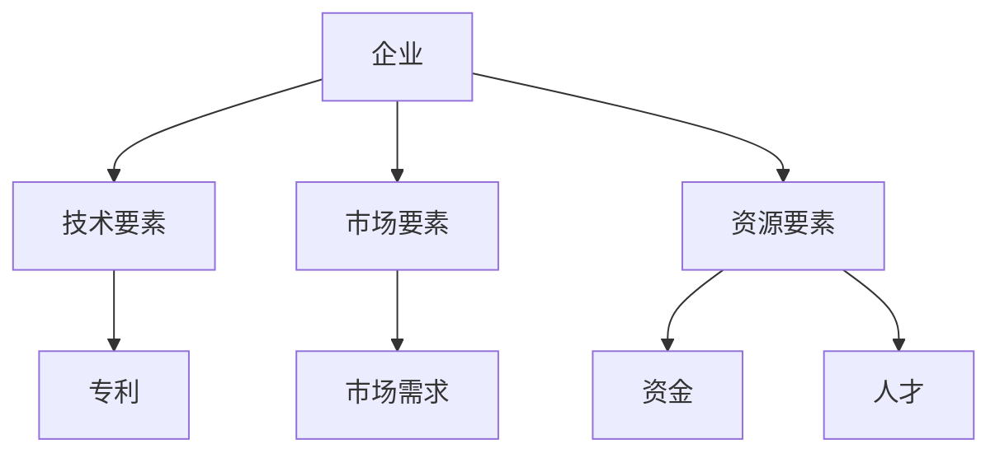
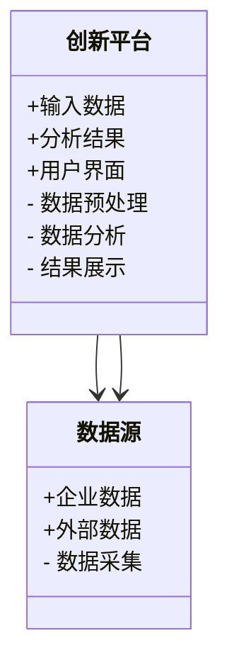
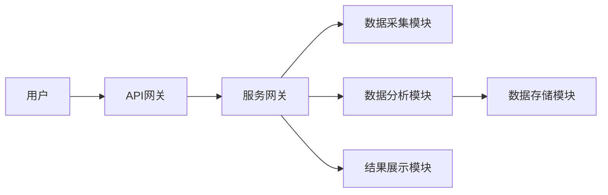

                 


# 构建AI驱动的企业创新生态系统分析平台

> **关键词**: AI驱动, 创新生态系统, 企业分析平台, 支持向量机, 聚类分析, 系统架构

> **摘要**: 本文探讨如何构建一个基于人工智能的企业创新生态系统分析平台，通过分析企业创新的核心要素，利用支持向量机和聚类分析等算法，结合系统架构设计，实现创新生态系统的智能化分析与优化。

---

## 第一部分：AI驱动的企业创新生态系统概述

### 第1章：AI驱动的创新生态系统概述

#### 1.1 问题背景与目标

企业创新是企业在竞争激烈的市场中保持竞争优势的关键。然而，传统的创新管理方式往往依赖于经验和主观判断，缺乏数据支持和智能化分析。随着人工智能技术的发展，利用AI技术构建企业创新生态系统分析平台成为可能。该平台的目标是通过AI技术，对企业创新的关键要素进行量化分析，识别潜在的创新机会和风险，优化创新过程。

#### 1.2 核心概念与问题描述

**核心概念**：  
- **企业创新**：指企业在产品、服务、技术、管理等方面进行的创新活动。  
- **创新生态系统**：由企业内外部的各种要素构成的，支持企业创新的环境和资源网络。  
- **AI驱动分析平台**：利用人工智能技术，对企业创新生态系统中的数据进行分析和预测的平台。  

**问题描述**：  
企业在创新过程中面临数据分散、信息不透明、创新方向不明确等问题。传统的创新管理方式难以应对复杂多变的市场环境，因此需要构建一个智能化的分析平台，通过数据驱动的方法，帮助企业更好地识别创新机会和优化创新过程。

#### 1.3 问题解决与系统架构

**创新分析的核心要素**：  
- 企业内部数据（如研发支出、专利数量等）  
- 企业外部数据（如市场趋势、竞争对手分析等）  
- 创新项目的生命周期管理  

**系统架构设计**：  
平台将分为数据采集、数据分析、结果展示三个主要模块。通过整合企业内外部数据，利用AI算法进行分析，并将结果以直观的方式呈现给企业决策者。

---

### 第2章：AI驱动创新生态系统的核心要素

#### 2.1 企业创新的要素分析

**关键要素**：  
1. **技术要素**：包括企业的研发投入、技术专利数量等。  
2. **市场要素**：包括市场需求、竞争环境等。  
3. **组织要素**：包括组织结构、团队协作等。  
4. **资源要素**：包括资金、人才、合作伙伴等。  

#### 2.2 生态系统的组成与关系

**核心要素的属性特征对比**：  
| 要素类型 | 属性 | 描述 |
|----------|------|------|
| 技术要素 | 数量 | 专利数量 |
| 技术要素 | 技术领域 | 专利分布领域 |
| 市场要素 | 市场需求 | 市场趋势分析 |
| 市场要素 | 竞争态势 | 竞争对手分析 |

**实体关系的Mermaid图**：  


---

## 第二部分：AI驱动创新生态系统的算法原理

### 第3章：支持向量机（SVM）算法原理

#### 3.1 SVM的基本原理

**数学模型**：  
支持向量机的目标是找到一个超平面，使得正类和负类数据点被正确分类。数学模型可以表示为：  
$$ \text{minimize } \frac{1}{2} ||\mathbf{w}||^2 $$
$$ \text{subject to } y_i (\mathbf{w} \cdot \mathbf{x}_i + b) \geq 1, \forall i $$
其中，$\mathbf{w}$是权重向量，$b$是偏置项，$y_i$是类别标签。

**几何解释**：  
SVM通过最大化分类间隔，找到一个能够最好地将数据点分开的超平面。支持向量是位于决策边界上的数据点，对分类起决定性作用。

#### 3.2 SVM的实现步骤

**步骤**：  
1. **数据预处理**：对数据进行标准化或归一化处理。  
2. **模型训练**：使用训练数据训练SVM模型。  
3. **模型预测**：利用训练好的模型对新数据进行分类。

**Python代码示例**：  
```python
from sklearn import svm

# 训练数据
X_train = [[1, 1], [0, 0], [2, 2]]
y_train = [1, -1, 1]

# 训练模型
model = svm.SVC(kernel='linear')
model.fit(X_train, y_train)

# 预测
X_test = [[1.5, 1.5]]
print(model.predict(X_test))
```

#### 3.3 SVM的Python实现

**代码解读**：  
- 使用`sklearn.svm`库中的`SVC`类，指定核函数为线性核。  
- 训练模型并进行预测，输出结果。

---

### 第4章：聚类分析算法原理

#### 4.1 聚类分析的基本原理

**数学模型**：  
聚类分析的目标是将数据点划分为若干簇，使得簇内数据点相似度高，簇间数据点相似度低。常用的距离度量包括欧氏距离和余弦相似度。

**聚类算法选择**：  
- K-means：适用于球形簇的数据。  
- DBSCAN：适用于任意形状的簇的数据。  

#### 4.2 聚类分析的实现步骤

**步骤**：  
1. **数据预处理**：标准化数据。  
2. **选择算法**：根据数据特点选择合适的聚类算法。  
3. **模型训练**：对数据进行聚类。  
4. **结果分析**：对聚类结果进行可视化和解释。

**Python代码示例**：  
```python
from sklearn.cluster import KMeans

# 训练数据
X = [[1, 2], [1, 3], [2, 2], [5, 6], [5, 7], [6, 6]]

# 训练模型
model = KMeans(n_clusters=2)
model.fit(X)

# 获取聚类结果
print(model.labels_)
```

#### 4.3 聚类分析的Python实现

**代码解读**：  
- 使用`KMeans`算法将数据分成2个簇，并输出每个数据点的聚类标签。

---

## 第三部分：系统分析与架构设计

### 第5章：系统分析与架构设计

#### 5.1 问题场景介绍

**背景**：  
某企业希望通过AI技术优化其创新生态系统，提高创新效率。

**目标**：  
构建一个AI驱动的企业创新生态系统分析平台，实现对企业创新数据的智能分析和预测。

#### 5.2 系统功能设计

**领域模型**：  


#### 5.3 系统架构设计

**系统架构图**：  


---

## 第四部分：项目实战

### 第6章：项目实战与总结

#### 6.1 环境安装

**安装步骤**：  
1. 安装Python和Jupyter Notebook。  
2. 安装`scikit-learn`库：`pip install scikit-learn`。

#### 6.2 系统核心实现

**代码示例**：  
```python
from sklearn import svm
from sklearn.cluster import KMeans
from sklearn.preprocessing import StandardScaler

# 数据预处理
scaler = StandardScaler()
X_train = scaler.fit_transform([[1, 2], [2, 3], [3, 4]])

# 训练SVM模型
model_svm = svm.SVC(kernel='linear')
model_svm.fit(X_train, [1, -1, 1])

# 训练KMeans模型
model_kmeans = KMeans(n_clusters=2)
model_kmeans.fit(X_train)

# 输出结果
print("SVM预测结果:", model_svm.predict([[4, 5]]))
print("KMeans聚类结果:", model_kmeans.labels_)
```

#### 6.3 代码应用解读与分析

**代码解读**：  
- 使用SVM进行分类，KMeans进行聚类。  
- 通过标准化数据，提高模型性能。

---

## 第五部分：总结与展望

### 第7章：总结与最佳实践

#### 7.1 总结

通过构建AI驱动的企业创新生态系统分析平台，企业可以更好地识别创新机会和优化创新过程。本文详细介绍了平台的构建过程，包括核心概念、算法原理和系统架构设计。

#### 7.2 最佳实践 tips

- **数据质量**：确保数据的准确性和完整性。  
- **模型调优**：通过网格搜索优化模型参数。  
- **隐私保护**：在处理企业数据时，注意隐私保护问题。  

#### 7.3 展望

未来，随着AI技术的不断发展，企业创新生态系统分析平台将更加智能化和自动化，为企业提供更强大的支持。

---

## 作者：AI天才研究院（AI Genius Institute） & 禅与计算机程序设计艺术（Zen And The Art of Computer Programming）

---

本文通过详细阐述AI驱动的企业创新生态系统分析平台的构建过程，为企业的创新管理提供了新的思路和方法。希望本文能够为相关领域的研究和实践提供有价值的参考。

