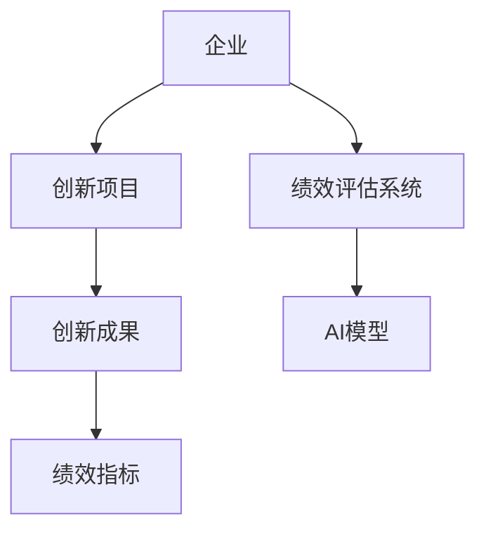
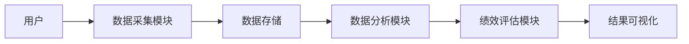

                 


# 《构建AI驱动的企业创新绩效评估系统》

## 关键词：AI驱动，企业创新，绩效评估，机器学习，系统架构

## 摘要：  
随着人工智能技术的快速发展，企业创新绩效评估的智能化需求日益增长。本文章详细探讨了如何利用AI技术构建高效的企业创新绩效评估系统，涵盖核心概念、算法原理、系统设计及实战案例，旨在为企业提供创新的解决方案。

---

## 第一部分：背景介绍

### 第1章：企业创新绩效评估的背景与挑战

#### 1.1 企业创新绩效评估的核心概念

- **什么是企业创新绩效**：  
  企业创新绩效是指企业在创新过程中所取得的成果与效率的综合评价，包括产品创新、技术创新、管理创新等方面。

- **创新绩效的评估维度**：  
  - **输入维度**：资源投入、团队能力、技术储备  
  - **过程维度**：创新流程效率、协作能力、研发投入  
  - **输出维度**：创新成果数量、质量、市场表现  

- **传统评估方法的局限性**：  
  传统评估方法多依赖主观评分，难以量化和动态跟踪，且忽视了数据的深度分析。

#### 1.2 AI驱动评估的背景与优势

- **AI技术在企业绩效评估中的应用现状**：  
  从数据分析到预测建模，AI正在改变企业绩效评估的方式。

- **AI驱动评估的核心优势**：  
  - **数据驱动**：通过深度学习和大数据分析，实现精准评估。  
  - **动态调整**：实时跟踪企业创新行为，提供动态反馈。  
  - **个性化推荐**：根据企业特点，提供定制化评估方案。

- **企业创新绩效评估的边界与外延**：  
  评估不仅关注成果，还需考虑创新过程中的资源配置效率和团队协作能力。

#### 1.3 本书的目标与结构

- **本书的核心目标**：  
  提供一套基于AI的企业创新绩效评估系统的设计与实现方法。

- **本书的主要内容与结构**：  
  从核心概念到算法原理，从系统架构到项目实战，全面覆盖AI驱动的创新绩效评估。

---

## 第二部分：AI驱动的企业创新绩效评估系统的核心概念

### 第2章：企业创新绩效评估的核心要素与关系

#### 2.1 企业创新绩效评估的核心要素

- **企业创新的输入要素**：  
  包括资金、技术、人才等资源的投入。

- **企业创新的输出成果**：  
  包括新产品、新技术、新专利等。

- **创新绩效的评价指标**：  
  包括效率、效果、可持续性等。

#### 2.2 AI驱动评估的关键技术与方法

- **机器学习在绩效评估中的应用**：  
  利用监督学习、无监督学习等技术对数据进行分析。

- **自然语言处理（NLP）在创新成果分析中的作用**：  
  通过文本挖掘技术分析专利、论文等文本数据。

- **数据挖掘在企业行为数据中的应用**：  
  发现隐藏的模式和趋势，辅助评估决策。

#### 2.3 核心概念的ER实体关系图



---

## 第三部分：AI驱动的创新绩效评估算法原理

### 第3章：基于机器学习的绩效评估模型

#### 3.1 算法原理与流程

- **数据预处理与特征提取**：  
  清洗数据，提取关键特征。

- **基于线性回归的简单模型**：  
  适用于线性关系的简单预测。

- **基于深度学习的复杂模型**：  
  如LSTM、BERT，适用于复杂非线性关系。

#### 3.2 算法实现与代码示例

```python
import numpy as np
from sklearn.linear_model import LinearRegression

# 示例：线性回归模型
X = np.array([[1], [2], [3], [4]])
y = np.array([2, 4, 6, 8])

model = LinearRegression()
model.fit(X, y)

print(model.predict([[5]]))  # 输出：[[10]]
```

#### 3.3 算法优缺点分析

- **优点**：高效、易于解释。  
- **缺点**：对非线性关系的处理能力有限。

---

## 第四部分：系统架构与设计

### 第4章：AI驱动的企业创新绩效评估系统架构

#### 4.1 系统功能设计

- **数据采集模块**：收集企业创新数据。  
- **数据分析模块**：对数据进行处理和分析。  
- **绩效评估模块**：生成评估结果。  
- **可视化展示模块**：以图表形式展示评估结果。

#### 4.2 系统架构设计



---

## 第五部分：项目实战

### 第5章：构建AI驱动的企业创新绩效评估系统

#### 5.1 环境安装与配置

- **安装Python和相关库**：如numpy、pandas、scikit-learn。

#### 5.2 核心代码实现

```python
import pandas as pd
from sklearn.model_selection import train_test_split
from sklearn.metrics import accuracy_score

# 示例数据加载
data = pd.read_csv('innovation.csv')
X = data.drop('performance', axis=1)
y = data['performance']

# 数据分割
X_train, X_test, y_train, y_test = train_test_split(X, y, test_size=0.2)

# 模型训练
from sklearn.ensemble import RandomForestClassifier
model = RandomForestClassifier()
model.fit(X_train, y_train)

# 预测与评估
y_pred = model.predict(X_test)
print(accuracy_score(y_test, y_pred))
```

#### 5.3 案例分析与解读

- **案例背景**：某科技公司希望评估其创新绩效。  
- **数据来源**：公司内部数据、公开专利信息。  
- **分析结果**：通过AI模型预测其创新绩效，提供改进建议。

#### 5.4 项目小结

- **系统实现的关键点**：数据预处理、模型选择、结果可视化。  
- **系统优势**：高效、动态、精准。

---

## 第六部分：总结与展望

### 第6章：总结与展望

#### 6.1 最佳实践 tips

- 数据质量至关重要，需进行充分预处理。  
- 根据实际需求选择合适的算法。  
- 定期更新模型，确保评估结果的准确性。

#### 6.2 小结

通过AI技术构建的企业创新绩效评估系统，能够高效、精准地评估企业创新能力，为企业决策提供有力支持。

#### 6.3 未来趋势

- 更加智能化的评估系统。  
- 结合区块链技术，确保数据安全与透明。  
- 结合AR/VR技术，提供沉浸式评估体验。

---

## 作者：AI天才研究院/AI Genius Institute & 禅与计算机程序设计艺术 /Zen And The Art of Computer Programming

