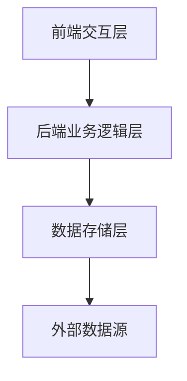
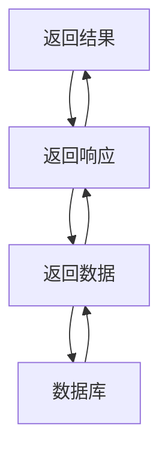
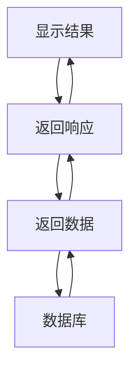

                 


# 构建AI驱动的企业智能助手：从概念到落地

## 关键词
AI, 企业智能助手, 机器学习, 自然语言处理, 系统架构, 技术实现

## 摘要
AI驱动的企业智能助手是通过人工智能技术构建的企业内部辅助工具，旨在通过智能化的交互和自动化流程提升企业效率。本文将从概念出发，逐步分析AI驱动的企业智能助手的核心技术、算法实现、系统架构设计、项目实战以及最佳实践，为企业智能化转型提供详细的技术指导。

---

# 第一部分: AI驱动的企业智能助手概述

## 第1章: AI驱动的企业智能助手的概念与背景

### 1.1 什么是AI驱动的企业智能助手
#### 1.1.1 定义与核心特征
AI驱动的企业智能助手是一种结合人工智能技术的企业辅助工具，通过自然语言处理、机器学习等技术实现智能化交互与自动化流程。

#### 1.1.2 与传统企业助手的主要区别
传统企业助手通常依赖于固定规则和手动操作，而AI驱动的企业智能助手能够通过学习和适应，提供更智能、个性化的服务。

### 1.2 AI技术在企业中的应用背景
#### 1.2.1 企业数字化转型的现状
企业正面临数字化转型的压力，AI技术成为提升效率和竞争力的关键。

#### 1.2.2 AI技术对企业效率提升的作用
通过自动化流程、数据驱动决策和智能化服务，AI技术显著提升了企业的运营效率。

#### 1.2.3 企业智能助手在数字化转型中的角色
作为数字化转型的重要工具，AI驱动的企业智能助手能够整合企业资源，优化流程，提升用户体验。

### 1.3 企业智能助手的典型应用场景
#### 1.3.1 客户服务与支持
通过智能客服系统提供24/7的客户支持，快速解决问题。

#### 1.3.2 企业内部流程自动化
自动处理审批、任务分配等内部流程，减少人工干预。

#### 1.3.3 数据分析与决策支持
通过分析海量数据，为企业提供数据驱动的决策支持。

#### 1.3.4 创新业务模式的探索
结合AI技术，探索新的业务模式，如智能推荐、个性化服务等。

### 1.4 本章小结
本章介绍了AI驱动的企业智能助手的概念、技术背景和应用场景，为后续的技术实现奠定了基础。

---

# 第二部分: AI驱动的企业智能助手的核心技术

## 第2章: AI驱动的企业智能助手的技术架构

### 2.1 技术架构概述
AI驱动的企业智能助手的技术架构通常包括前端交互层、后端业务逻辑层和数据存储层。

#### 2.1.1 系统整体架构图（Mermaid图）


### 2.2 核心技术模块
#### 2.2.1 自然语言处理（NLP）模块
NLP模块负责理解和生成自然语言，是智能助手的核心技术之一。

#### 2.2.2 机器学习模型
机器学习模型用于预测和分类，帮助智能助手做出智能决策。

#### 2.2.3 数据处理与存储
数据处理与存储模块负责数据的采集、清洗和存储，确保数据的准确性和可用性。

### 2.3 技术选型与实现
#### 2.3.1 选择合适的AI框架
TensorFlow和PyTorch是目前最受欢迎的深度学习框架，可以根据具体需求选择合适的框架。

#### 2.3.2 NLP模型的训练与优化
使用预训练的NLP模型（如BERT）进行微调，以适应企业的具体需求。

#### 2.3.3 数据安全与隐私保护
采用数据脱敏和加密技术，确保数据的安全性和隐私性。

### 2.4 本章小结
本章详细介绍了AI驱动的企业智能助手的技术架构和核心技术模块，为后续的算法实现奠定了基础。

---

# 第三部分: AI驱动的企业智能助手的算法实现

## 第3章: 机器学习算法基础

### 3.1 机器学习算法概述
机器学习算法分为监督学习、无监督学习和强化学习三类。

#### 3.1.1 监督学习
监督学习通过标记数据进行训练，适用于分类和回归任务。

#### 3.1.2 无监督学习
无监督学习通过数据内部结构进行学习，适用于聚类和降维任务。

#### 3.1.3 强化学习
强化学习通过与环境交互进行学习，适用于游戏和机器人控制等任务。

### 3.2 自然语言处理算法
#### 3.2.1 Transformer模型
Transformer模型通过自注意力机制，显著提升了NLP任务的性能。

#### 3.2.2 BERT模型
BERT模型通过预训练技术，实现了上下文的理解和生成。

#### 3.2.3 GPT模型
GPT模型通过生成式学习，能够生成自然流畅的文本。

### 3.3 模型训练与优化
#### 3.3.1 数据预处理
数据预处理包括清洗、归一化和特征提取等步骤，确保数据的高质量。

#### 3.3.2 模型训练流程
模型训练流程包括数据加载、模型定义、损失函数计算和优化器选择等步骤。

#### 3.3.3 模型调优与评估
模型调优包括超参数优化和模型融合，模型评估包括准确率、召回率和F1分数等指标。

### 3.4 本章小结
本章详细介绍了机器学习和自然语言处理算法的基础知识，为后续的系统架构设计和项目实现提供了理论支持。

---

# 第四部分: 系统架构与设计

## 第4章: 系统架构设计

### 4.1 系统整体架构
系统整体架构采用分层设计，包括前端、后端和数据存储三部分。

#### 4.1.1 分层架构设计（Mermaid图）


### 4.2 功能模块设计
#### 4.2.1 用户交互模块
用户交互模块负责接收用户的输入，并通过NLP技术进行解析。

#### 4.2.2 业务逻辑处理模块
业务逻辑处理模块根据用户的请求，调用相应的服务进行处理。

#### 4.2.3 数据存储与管理模块
数据存储与管理模块负责数据的存储和管理，确保数据的完整性和一致性。

### 4.3 系统接口设计
#### 4.3.1 API接口设计
系统通过RESTful API接口与外部系统进行交互，确保系统的可扩展性和灵活性。

#### 4.3.2 接口调用流程（Mermaid图）


### 4.4 系统交互流程设计
#### 4.4.1 交互流程（Mermaid图）


### 4.5 本章小结
本章详细介绍了AI驱动的企业智能助手的系统架构设计，包括功能模块设计、接口设计和交互流程设计。

---

# 第五部分: 项目实战

## 第5章: 项目实战

### 5.1 项目介绍
本项目旨在构建一个AI驱动的企业智能助手，帮助企业实现智能化转型。

### 5.2 系统核心实现
#### 5.2.1 环境安装
安装必要的开发工具和依赖库，例如Python、TensorFlow、PyTorch等。

#### 5.2.2 核心代码实现
```python
# 模型训练代码示例
import tensorflow as tf
from tensorflow.keras import layers

model = tf.keras.Sequential([
    layers.Dense(64, activation='relu'),
    layers.Dense(1, activation='sigmoid')
])

model.compile(optimizer='adam', loss='binary_crossentropy', metrics=['accuracy'])

model.fit(x_train, y_train, epochs=10, batch_size=32)
```

#### 5.2.3 代码应用解读与分析
详细解读核心代码的功能和实现逻辑，分析代码的优缺点及优化空间。

### 5.3 实际案例分析
#### 5.3.1 案例背景
以某企业为例，介绍其智能化转型的需求和目标。

#### 5.3.2 案例实施
详细描述实施过程，包括需求分析、系统设计、开发实现和测试优化。

#### 5.3.3 案例分析与总结
总结案例的成功经验，分析实施过程中遇到的问题及解决方案。

### 5.4 本章小结
本章通过实际案例展示了AI驱动的企业智能助手的项目实施过程，为读者提供了宝贵的实践经验。

---

# 第六部分: 最佳实践与总结

## 第6章: 最佳实践与总结

### 6.1 最佳实践
#### 6.1.1 数据质量管理
确保数据的高质量是AI系统成功的关键。

#### 6.1.2 模型优化与调优
通过持续优化模型，提升系统的性能和准确性。

#### 6.1.3 系统安全与隐私保护
确保系统的安全性和数据的隐私性，避免潜在风险。

### 6.2 小结
AI驱动的企业智能助手是一个复杂的系统工程，需要结合技术、业务和管理多方面进行考虑。

### 6.3 注意事项
在实际应用中，需要注意系统的可扩展性、可维护性和用户体验。

### 6.4 拓展阅读
推荐相关的技术书籍和论文，供读者深入学习和研究。

---

# 作者：AI天才研究院/AI Genius Institute & 禅与计算机程序设计艺术 /Zen And The Art of Computer Programming

