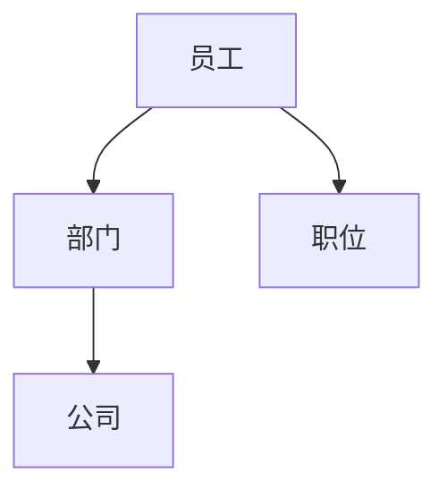
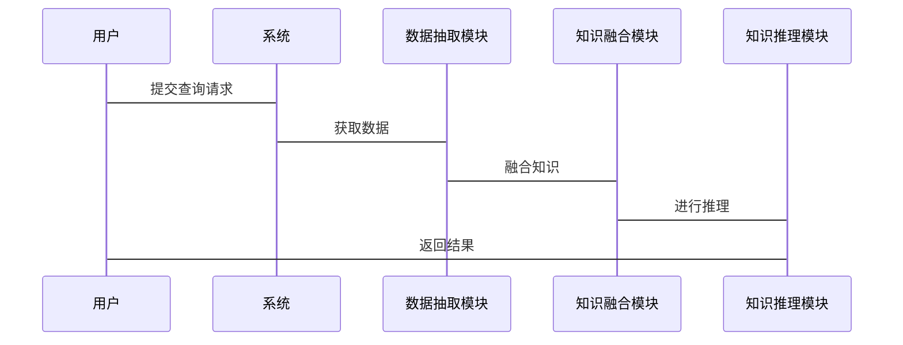

                 


# 构建AI驱动的企业知识图谱：深化领域理解

## 关键词：知识图谱, AI驱动, 企业应用, 领域理解, 数据分析, 机器学习, 智能系统

## 摘要：知识图谱是一种强大的工具，用于整合和分析企业数据，通过AI技术实现智能推理和决策支持。本文详细探讨了构建AI驱动的知识图谱的过程，包括核心概念、算法原理、系统架构设计以及实战案例，旨在帮助企业深化领域理解，提升数据驱动的决策能力。

---

## 第一部分：构建AI驱动的企业知识图谱背景介绍

### 第1章：知识图谱的基本概念与背景

#### 1.1 知识图谱的定义与特点
知识图谱是一种以图结构形式表示知识的数据库，其中节点表示实体或概念，边表示实体之间的关系。知识图谱具有语义丰富、结构化、可扩展性强等特点，能够将分散的数据整合成一个统一的知识网络。

#### 1.2 AI驱动的知识图谱构建方法
- **知识抽取与表示**：通过自然语言处理技术从文本中提取实体、属性和关系，并将其表示为结构化的数据。
- **知识融合与推理**：将多个数据源中的知识进行整合，并通过推理算法发现隐含的知识。
- **知识图谱的动态更新**：根据实时数据和反馈不断更新知识图谱，保持其准确性和及时性。

#### 1.3 知识图谱在企业中的应用背景
- **企业知识管理的现状与挑战**：传统的企业知识管理存在数据孤岛、信息不一致等问题，难以支持复杂的决策需求。
- **AI驱动知识图谱的优势**：AI技术能够提高知识抽取和推理的效率和准确性，为企业提供更强大的知识管理能力。
- **企业知识图谱的潜在价值**：通过知识图谱，企业可以更好地理解其业务流程、客户行为和市场趋势，从而优化决策和运营。

#### 1.4 本章小结
本章介绍了知识图谱的基本概念和AI驱动的构建方法，并分析了其在企业中的应用背景和潜在价值。

---

## 第二部分：知识图谱的核心概念与联系

### 第2章：知识图谱的结构与核心要素

#### 2.1 知识图谱的实体与属性
- **实体的定义与分类**：实体是知识图谱中的基本单位，可以是人、组织、产品等。
- **属性的定义与分类**：属性描述实体的特征，如年龄、性别等。
- **实体与属性的关系**：实体通过属性描述其特征，形成完整的知识描述。

#### 2.2 知识图谱的关系与规则
- **关系的定义与分类**：关系表示实体之间的关联，如“属于”、“包含”等。
- **规则的定义与分类**：规则是知识图谱中的约束条件，用于指导知识的抽取和推理。
- **关系与规则的应用场景**：通过关系和规则，可以构建复杂的语义网络，支持智能推理和决策。

#### 2.3 知识图谱的语义网络构建
语义网络是知识图谱的核心，通过实体、属性和关系的组合，构建一个语义丰富的知识网络。语义网络的构建需要考虑实体的上下文和语义关联，确保知识的准确性和完整性。

#### 2.4 知识图谱的领域实体关系图（ER图）
以下是一个简单的领域实体关系图示例：



#### 2.5 本章小结
本章详细讲解了知识图谱的结构和核心要素，包括实体、属性、关系和规则，并通过ER图展示了领域实体之间的关系。

---

## 第三部分：知识图谱的算法原理

### 第3章：知识图谱构建的算法原理

#### 3.1 知识抽取的算法原理
- **基于规则的知识抽取**：通过预定义的规则从文本中抽取特定的信息。
- **基于统计的知识抽取**：利用统计学方法从大规模数据中发现模式和关系。
- **基于深度学习的知识抽取**：使用神经网络模型（如BERT）从文本中提取实体和关系。

#### 3.2 知识融合的算法原理
- **实体对齐算法**：通过计算实体之间的相似度，将不同数据源中的实体进行对齐。
- **关系抽取算法**：从文本中识别实体之间的关系，并构建关系边。
- **知识图谱的动态更新算法**：根据新数据更新知识图谱，保持其准确性和完整性。

#### 3.3 知识推理的算法原理
- **基于规则的推理**：根据预定义的规则进行推理，如“如果A是B的子类，那么A具有B的所有属性”。
- **基于统计的推理**：利用统计学方法进行概率推理，如马尔可夫链。
- **基于深度学习的推理**：使用图神经网络进行知识推理，如GAT（Graph Attention Network）。

#### 3.4 知识图谱表示学习的数学模型
知识图谱的表示学习是通过将实体和关系映射到向量空间，从而学习其语义表示。常用的模型包括：
- **向量空间模型**：将实体表示为向量，计算实体之间的相似度。
- **三元组关系模型**：将关系表示为边，构建三元组（头实体，关系，尾实体）。

以下是一个简单的向量空间模型示例：
$$v_i = \text{表示实体} i \text{的向量}$$
$$v_j = \text{表示实体} j \text{的向量}$$
$$\text{相似度} = \frac{v_i \cdot v_j}{\|v_i\| \|v_j\|}$$

---

## 第四部分：系统分析与架构设计

### 第4章：知识图谱构建的系统架构

#### 4.1 问题场景介绍
构建AI驱动的知识图谱需要解决数据抽取、融合、存储和推理等问题，同时需要考虑系统的可扩展性和实时性。

#### 4.2 系统功能设计
- **数据抽取模块**：从多种数据源中抽取实体、属性和关系。
- **知识融合模块**：对抽取的知识进行清洗、对齐和融合。
- **知识推理模块**：基于知识图谱进行推理和查询。
- **知识存储与管理模块**：存储和管理知识图谱数据，支持动态更新。

#### 4.3 系统架构设计
以下是一个简单的系统架构图：


#### 4.4 系统接口设计
- **数据接口**：与数据源（如数据库、API）对接，获取原始数据。
- **推理接口**：提供API供其他系统调用知识推理功能。
- **用户界面**：提供可视化界面，供用户查询和分析知识图谱。

#### 4.5 系统交互流程
以下是一个简单的系统交互流程图：



#### 4.6 本章小结
本章详细讲解了构建AI驱动的知识图谱的系统架构，包括功能设计、架构设计和交互流程。

---

## 第五部分：项目实战

### 第5章：构建AI驱动的知识图谱实战

#### 5.1 环境安装
需要安装以下工具和库：
- Python 3.8+
- TensorFlow
- Keras
- Scikit-learn
- Networkx

#### 5.2 核心代码实现
以下是构建知识图谱的核心代码示例：

```python
import networkx as nx

# 创建知识图谱
G = nx.Graph()

# 添加实体
G.add_nodes_from(["员工1", "部门1", "职位1"])

# 添加关系
G.add_edges_from([("员工1", "部门1"), ("员工1", "职位1")])

# 可视化知识图谱
nx.draw(G, node_size=1500, font_size=10, with_labels=True)
plt.show()
```

#### 5.3 代码应用解读与分析
- **实体添加**：使用`add_nodes_from`方法添加实体节点。
- **关系添加**：使用`add_edges_from`方法添加实体之间的关系边。
- **可视化**：使用Networkx库进行可视化，展示知识图谱的结构。

#### 5.4 实际案例分析
以下是一个实际案例分析：
- **案例背景**：某公司希望构建员工和部门的知识图谱，以便更好地进行组织管理和人员调配。
- **案例实现**：通过上述代码实现员工、部门和职位之间的关系图谱。
- **案例分析**：通过知识图谱可以清晰地展示员工与部门、职位之间的关系，支持智能组织管理。

#### 5.5 本章小结
本章通过实际案例展示了如何构建AI驱动的知识图谱，并提供了核心代码和实现步骤。

---

## 第六部分：总结与扩展

### 第6章：总结与扩展阅读

#### 6.1 本章总结
本文详细讲解了构建AI驱动的知识图谱的过程，包括核心概念、算法原理、系统架构设计以及实战案例。通过本文的学习，读者可以掌握构建知识图谱的关键技术，并将其应用到实际的企业场景中。

#### 6.2 最佳实践 tips
- 在构建知识图谱时，需要选择合适的数据源和算法，确保数据的准确性和完整性。
- 知识图谱的动态更新需要实时监控数据变化，并及时进行更新和优化。
- 在实际应用中，可以结合其他技术（如自然语言处理、机器学习）进一步提升知识图谱的智能性。

#### 6.3 注意事项
- 知识图谱的构建需要考虑数据的多样性和复杂性，避免信息丢失和冗余。
- 在系统设计中，需要考虑可扩展性和可维护性，确保系统的稳定性和高效性。
- 知识图谱的安全性和隐私保护也需要引起足够的重视。

#### 6.4 拓展阅读
- 关键词扩展：知识图谱、AI技术、数据管理、智能系统
- 推荐书籍：《知识图谱：概念、方法与应用》
- 推荐文章：《基于深度学习的知识抽取与推理》

#### 6.5 本章小结
本章总结了全文内容，并给出了实践中的注意事项和拓展阅读的方向。

---

## 作者：AI天才研究院/AI Genius Institute & 禅与计算机程序设计艺术 /Zen And The Art of Computer Programming

---

以上是构建AI驱动的企业知识图谱的完整内容，涵盖了从概念到实战的各个方面，希望对您有所帮助！

