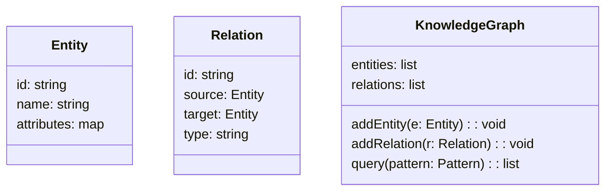
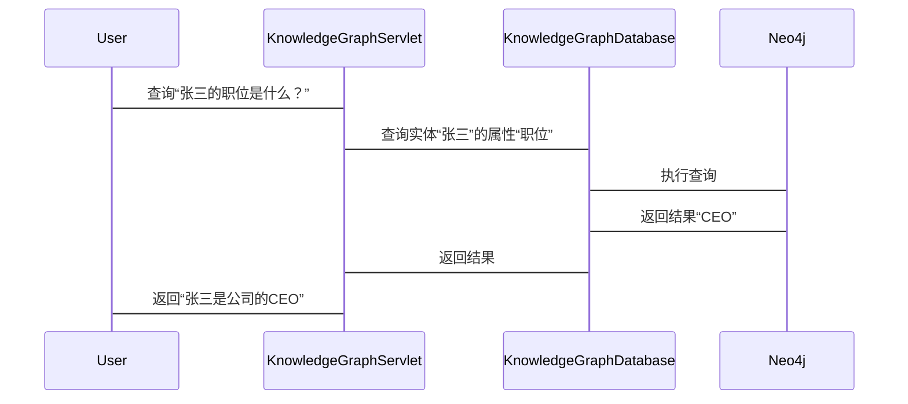

                 


# 构建AI驱动的企业知识管理系统：智能知识图谱

## 关键词：
- AI驱动
- 企业知识管理
- 智能知识图谱
- 数据挖掘
- 知识可视化
- 信息抽取

## 摘要：
随着企业数据的爆炸式增长，如何高效地管理和利用这些知识成为了企业面临的重要挑战。本文将深入探讨如何利用人工智能技术构建智能知识图谱，从而实现企业知识管理的智能化。文章首先介绍了知识图谱的基本概念及其与企业知识管理的结合，随后详细讲解了知识图谱的构建流程、核心算法及其在企业中的应用场景。通过实际案例分析和系统设计，本文为企业提供了构建AI驱动的知识管理系统的实用指导。

---

## 第1章: 知识图谱与企业知识管理概述

### 1.1 知识图谱的基本概念

#### 1.1.1 知识图谱的定义与特点
知识图谱是一种以图结构形式表示知识的语义网络，通过实体（node）和关系（edge）的组合，描述现实世界中的概念及其相互关系。知识图谱具有以下特点：
- **结构化**：通过实体和关系的形式化表示，实现知识的结构化存储。
- **语义化**：支持语义理解和关联推理。
- **动态性**：能够实时更新和扩展。

#### 1.1.2 知识图谱的核心要素：实体、关系与属性
- **实体**：知识图谱的基本单元，代表独立存在的对象，如“人”、“组织”、“概念”等。
- **关系**：描述实体之间的关联，如“属于”、“属于”、“拥有”等。
- **属性**：描述实体的特征或状态，如“姓名”、“年龄”、“职位”等。

#### 1.1.3 企业知识管理的现状与挑战
- **数据孤岛**：企业内部数据分散在不同的系统中，难以实现统一管理和利用。
- **知识碎片化**：缺乏系统化的知识组织和表示方式。
- **语义理解**：传统知识管理缺乏语义理解能力，难以支持智能查询和推理。

### 1.2 AI驱动的知识管理新范式

#### 1.2.1 知识图谱与AI的结合
AI技术（如自然语言处理、机器学习）为知识图谱的构建和应用提供了强大的支持，使其能够实现知识的自动化抽取、关联推理和智能问答。

#### 1.2.2 智能知识管理的典型应用场景
- **智能问答**：基于知识图谱实现语义理解，提供智能问答服务。
- **知识推荐**：根据用户行为和知识图谱中的关联关系，推荐相关内容。
- **决策支持**：通过知识图谱的关联推理，支持企业决策。

#### 1.2.3 企业知识管理的未来趋势
- **智能化**：结合AI技术，实现知识的自动化处理和智能应用。
- **实时化**：支持实时数据更新和动态知识图谱构建。
- **个性化**：根据用户需求和行为，提供个性化的知识服务。

---

## 第2章: 知识图谱构建的核心概念与联系

### 2.1 知识图谱的核心要素与属性

#### 2.1.1 实体与属性的关系
- 实体是知识图谱的基本单元，属性描述了实体的特征或状态。
- 例如，实体“张三”可以具有属性“姓名”、“年龄”、“职位”等。

#### 2.1.2 关系与角色的定义
- 关系描述实体之间的关联，如“张三属于公司A”。
- 角色用于明确关系中的角色，如“张三是公司的CEO”。

#### 2.1.3 知识图谱的结构化表示
知识图谱可以通过结构化数据的形式表示，例如RDF（资源描述框架）或JSON-LD。

### 2.2 知识图谱的构建流程与方法

#### 2.2.1 数据采集与预处理
- 数据来源：企业内部文档、外部数据库、网络爬取等。
- 数据清洗：去除噪声数据，确保数据质量。

#### 2.2.2 实体识别与抽取
- 实体识别：通过NLP技术从文本中识别出实体。
- 实体消歧：解决同一实体在不同上下文中的不同表示问题。

#### 2.2.3 关系抽取与属性提取
- 关系抽取：识别文本中的关系，并将其形式化表示。
- 属性提取：提取实体的属性信息，如“张三的职位是CEO”。

#### 2.2.4 知识图谱的存储与管理
- 数据存储：使用图数据库（如Neo4j）或关系型数据库存储知识图谱。
- 数据管理：包括数据的增删改查、版本控制等。

### 2.3 知识图谱的可视化与交互

#### 2.3.1 知识图谱的可视化方法
- 使用图数据库工具（如Neo4j的Cypher）进行可视化。
- 通过图表形式展示实体之间的关系。

#### 2.3.2 用户交互与知识图谱的动态更新
- 用户可以通过查询或交互式界面动态更新知识图谱。
- 知识图谱的动态更新包括新增实体、修改关系等。

#### 2.3.3 可视化工具的选择与应用
- 常见的可视化工具包括Neo4j的Cypher、Graphviz、Gephi等。

---

## 第3章: 知识图谱构建的算法原理

### 3.1 实体识别与抽取算法

#### 3.1.1 基于规则的实体识别
- 通过预定义的规则进行实体识别，例如基于关键词匹配。
- 适用于特定领域的实体识别。

#### 3.1.2 基于统计的实体识别
- 使用统计模型（如HMM）进行实体识别，考虑上下文信息。
- 适用于多种语言和领域。

#### 3.1.3 基于深度学习的实体识别
- 使用神经网络模型（如LSTM、BERT）进行实体识别。
- 优势：能够处理复杂的上下文信息，效果更准确。

### 3.2 关系抽取与属性提取算法

#### 3.2.1 基于规则的关系抽取
- 通过预定义的关系模板进行关系抽取，例如“X属于Y”。
- 适用于简单关系的抽取。

#### 3.2.2 基于统计的关系抽取
- 使用统计模型（如CRF）进行关系抽取，考虑上下文信息。
- 适用于多种语言和领域。

#### 3.2.3 基于深度学习的关系抽取
- 使用神经网络模型（如BERT）进行关系抽取。
- 优势：能够处理复杂的语义信息，效果更准确。

### 3.3 知识图谱构建的优化算法

#### 3.3.1 知识融合与冲突处理
- 知识融合：将多个来源的知识进行合并，解决冲突。
- 冲突处理：通过协商或投票机制解决知识冲突。

#### 3.3.2 知识图谱的可扩展性设计
- 设计灵活的知识表示方式，支持动态扩展。
- 例如，使用RDF或JSON-LD格式，支持新增实体和关系。

#### 3.3.3 知识图谱的压缩与优化
- 知识图谱的压缩：通过合并实体和关系，减少数据量。
- 知识图谱的优化：通过规则或算法，消除冗余数据。

---

## 第4章: 系统分析与架构设计方案

### 4.1 问题场景介绍

#### 4.1.1 项目背景
- 企业内部数据分散，难以实现统一管理。
- 需要构建一个智能的知识管理系统，支持智能问答和知识推荐。

#### 4.1.2 项目目标
- 构建企业知识图谱，实现知识的结构化存储和管理。
- 提供智能问答、知识推荐等服务。

### 4.2 系统功能设计

#### 4.2.1 领域模型类图


#### 4.2.2 系统架构设计
```mermaid
server {
    serverPort = 8080
    /KnowledgeGraphServlet
        KnowledgeGraphServlet --> KnowledgeGraphDatabase
        KnowledgeGraphDatabase --> Neo4j
}
```

#### 4.2.3 系统接口设计
- 接口1：添加实体和关系。
- 接口2：查询知识图谱，返回匹配的结果。

#### 4.2.4 系统交互流程


---

## 第5章: 项目实战

### 5.1 环境安装

#### 5.1.1 安装Neo4j
```bash
# 下载并安装Neo4j社区版
https://neo4j.com/download/
```

#### 5.1.2 安装Python和相关库
```bash
pip install neo4j-driver
pip install spacy
pip install scikit-learn
```

### 5.2 系统核心实现源代码

#### 5.2.1 实体识别代码
```python
import spacy

nlp = spacy.load("en_core_web_sm")

def extract_entities(text):
    doc = nlp(text)
    entities = []
    for ent in doc.ents:
        entities.append((ent.text, ent.label_))
    return entities
```

#### 5.2.2 关系抽取代码
```python
from sklearn.feature_extraction.text import TfidfVectorizer
from sklearn.metrics.pairwise import cosine_similarity

vectorizer = TfidfVectorizer()
tfidf_matrix = vectorizer.fit_transform(corpus)

similarity_matrix = cosine_similarity(tfidf_matrix)
```

#### 5.2.3 知识图谱构建代码
```python
from neo4j-driver import GraphDatabase

def add_entity(tx, entity_name, entity_type):
    tx.run("CREATE (:Entity {name: $name, type: $type})", name=entity_name, type=entity_type)

def add_relation(tx, source, relation, target):
    tx.run("MATCH (a {name: $source}), (b {name: $target}) CREATE (a)-[r:$relation]->(b)", source=source, relation=relation, target=target)
```

### 5.3 代码应用解读与分析
- 实体识别代码使用spaCy库，能够从文本中提取实体及其类型。
- 关系抽取代码使用TF-IDF和余弦相似度，实现文本语义的相似性计算。
- 知识图谱构建代码使用Neo4j数据库，实现实体和关系的存储。

### 5.4 实际案例分析和详细讲解剖析
- 案例：构建一个简单的知识图谱，包含“公司”、“员工”、“职位”等实体和关系。
- 分析：通过代码实现实体识别、关系抽取和知识图谱构建，验证系统的功能和性能。

### 5.5 项目小结
- 项目实现了企业知识图谱的构建，支持智能问答和知识推荐。
- 未来可以进一步优化算法，提高系统的性能和准确性。

---

## 第6章: 最佳实践 tips、小结、注意事项、拓展阅读

### 6.1 小结
- 本文详细介绍了AI驱动的企业知识管理系统的构建过程，包括知识图谱的构建、算法原理、系统设计和项目实战。

### 6.2 注意事项
- 数据隐私和安全：在构建知识图谱时，需要注意数据的隐私和安全问题。
- 系统性能优化：需要关注知识图谱的存储和查询性能。

### 6.3 拓展阅读
- 推荐阅读《知识图谱：概念、方法与应用》。
- 关注知识图谱领域的最新研究和应用。

---

## 作者：AI天才研究院/AI Genius Institute & 禅与计算机程序设计艺术 /Zen And The Art of Computer Programming

---

以上是《构建AI驱动的企业知识管理系统：智能知识图谱》的技术博客文章的详细内容，涵盖了知识图谱的基本概念、构建流程、系统设计和项目实战等多个方面，希望对您有所帮助！

