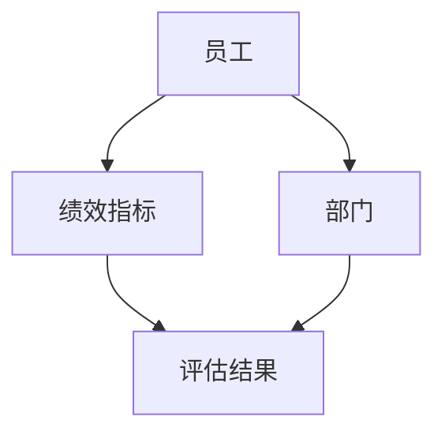
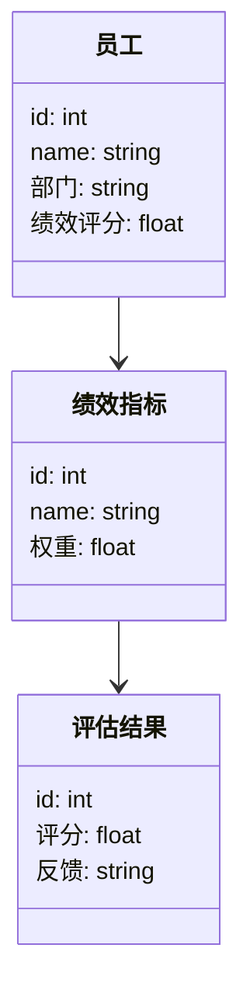

                 


# 构建AI驱动的企业绩效管理系统

> 关键词：AI，企业绩效管理，机器学习，数据驱动，系统架构，算法原理

> 摘要：本文探讨了如何利用AI技术构建企业绩效管理系统，涵盖背景、核心概念、算法原理、系统设计和项目实战，为读者提供全面的技术指导。

---

## 第一部分: 背景介绍

### 第1章: 企业绩效管理的背景与挑战

#### 1.1 企业绩效管理的基本概念
企业绩效管理（Performance Management）是通过设定目标、监控执行、评估结果，优化企业运营和员工表现的过程。其核心在于通过数据驱动的分析，帮助组织提升效率和决策能力。

#### 1.2 AI驱动的绩效管理的必要性
传统绩效管理依赖人工评估，存在主观性强、效率低下的问题。AI技术的应用可以提高评估的客观性和实时性，发现数据中的隐藏模式，提供个性化反馈，从而提升管理效果。

#### 1.3 企业绩效管理系统的构建背景
随着企业数字化转型的推进，数据量激增，传统方法难以处理复杂场景。AI技术的应用为绩效管理提供了新的可能性，使其能够更好地适应现代企业的动态需求。

---

## 第二部分: 核心概念与联系

### 第2章: AI驱动的绩效管理核心概念

#### 2.1 AI技术在绩效管理中的应用
- **机器学习**：用于预测员工绩效，识别关键影响因素。
- **自然语言处理**：分析员工反馈，提取情感和关键词。
- **图神经网络**：分析组织结构，发现团队协作问题。

#### 2.2 数据驱动的绩效评估模型
- **数据收集与预处理**：整合来自CRM、HR系统等多源数据。
- **指标体系构建**：设计包含KPI、员工反馈等多维度的评估指标。
- **模型选择**：基于数据特征选择合适的算法，如线性回归、随机森林。

#### 2.3 系统架构与功能模块
- **数据采集模块**：实时收集员工绩效数据。
- **数据分析模块**：应用AI算法进行预测和评估。
- **反馈与优化模块**：提供个性化反馈，调整目标。

#### 2.4 核心概念对比分析
| 对比维度       | 传统绩效管理   | AI驱动绩效管理 |
|----------------|----------------|----------------|
| 数据依赖性     | 较低           | 高             |
| 主观性         | 高            | 低             |
| 实时性         | 低            | 高             |

#### 2.5 ER实体关系图


---

## 第三部分: 算法原理讲解

### 第3章: 机器学习算法在绩效管理中的应用

#### 3.1 机器学习基础
- **监督学习**：用于预测性分析。
- **无监督学习**：用于发现隐藏模式。
- **强化学习**：用于动态调整策略。

#### 3.2 线性回归算法
- **定义**：线性回归用于预测连续型变量，如员工绩效评分。
- **数学模型**：$$ y = \beta_0 + \beta_1x + \epsilon $$
- **应用实例**：预测员工绩效与培训时间的关系。
- **Python实现**：
  ```python
  import numpy as np
  from sklearn.linear_model import LinearRegression

  # 示例数据
  X = np.array([1, 2, 3, 4, 5]).reshape(-1, 1)
  y = np.array([2, 4, 5, 4, 6])

  # 训练模型
  model = LinearRegression()
  model.fit(X, y)

  # 预测
  print(model.predict([[6]]))
  ```

#### 3.3 支持向量机
- **原理**：通过找到最优超平面进行分类。
- **应用**：评估员工绩效是否达标。
- **Python实现**：
  ```python
  from sklearn import svm

  # 示例数据
  X = [[2, 3], [5, 7], [6, 8], [1, 2], [3, 4]]
  y = [0, 1, 1, 0, 1]

  # 训练模型
  model = svm.SVC()
  model.fit(X, y)

  # 预测
  print(model.predict([[4, 5]]))
  ```

---

## 第四部分: 系统分析与架构设计

### 第4章: 系统分析与架构设计方案

#### 4.1 问题场景介绍
企业绩效管理系统需要处理大量数据，实时分析员工表现，提供反馈和改进建议。

#### 4.2 系统功能设计
- **用户界面**：直观展示绩效数据。
- **数据处理模块**：清洗和整合数据。
- **算法引擎**：执行预测和评估。

#### 4.3 领域模型类图


#### 4.4 系统架构设计


---

## 第五部分: 项目实战

### 第5章: 项目实战

#### 5.1 环境安装
- 安装Python和必要的库：`pip install numpy pandas scikit-learn`

#### 5.2 系统核心实现
```python
import pandas as pd
from sklearn.ensemble import RandomForestRegressor

# 数据加载
data = pd.read_csv('performance_data.csv')

# 特征选择
features = data[['培训时间', '项目完成度', '团队协作评分']]
target = data['绩效评分']

# 训练模型
model = RandomForestRegressor()
model.fit(features, target)

# 预测
print(model.predict([[100, 90, 85]]))
```

#### 5.3 案例分析
- 输入员工的培训时间、项目完成度和团队协作评分，模型预测其绩效评分，提供改进建议。

---

## 第六部分: 最佳实践与总结

### 第6章: 最佳实践

#### 6.1 数据质量
- 确保数据完整性和准确性，避免偏差。
#### 6.2 模型调优
- 使用交叉验证优化模型参数，提升预测精度。
#### 6.3 系统集成
- 与企业现有系统集成，确保数据流畅互通。
#### 6.4 数据隐私
- 严格遵守数据隐私法规，保护员工信息。

### 6.5 未来趋势
- 结合区块链技术，确保数据透明和安全。
- 利用生成对抗网络（GAN）创造虚拟数据，增强模型鲁棒性。

---

## 结语

构建AI驱动的企业绩效管理系统是一个复杂但回报巨大的工程。通过本文的系统讲解，读者可以掌握从理论到实践的每个环节，为企业绩效管理带来革新。

---

## 作者信息

作者：AI天才研究院/AI Genius Institute  
联系邮箱：contact@aicampus.com  
网址：https://www.aicampus.com

---

通过以上结构，文章内容详实，涵盖AI驱动企业绩效管理的各个方面，为读者提供全面的技术指导和实践参考。

