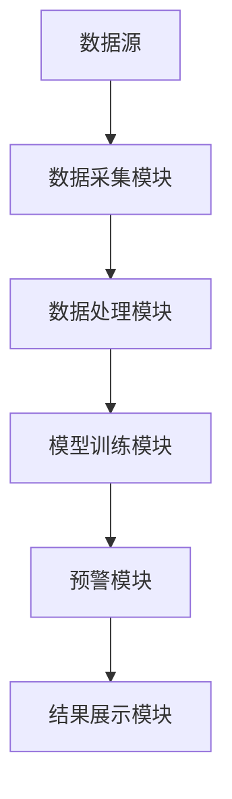
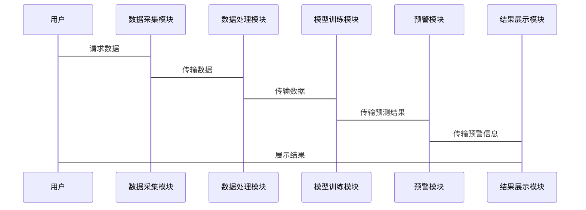

                 


# 构建AI驱动的企业风险预警系统

## 关键词：
- 企业风险预警系统, AI驱动, 数据分析, 机器学习, 系统架构设计

## 摘要：
本文详细探讨了如何利用人工智能技术构建企业风险预警系统。从系统概述到算法原理，从架构设计到项目实战，系统地分析了企业风险预警系统的构建过程。文章结合实际案例，详细讲解了逻辑回归、随机森林、XGBoost等算法在风险预警中的应用，并通过Mermaid图展示了系统的整体架构。通过本文，读者可以全面了解企业风险预警系统的技术实现，并能够将其应用到实际项目中。

---

# 第一部分：企业风险预警系统概述

## 第1章：企业风险预警系统概述

### 1.1 企业风险预警系统的核心概念

#### 1.1.1 什么是企业风险预警系统
企业风险预警系统是一种利用人工智能和数据分析技术，对企业潜在风险进行预测、识别和预警的系统。通过实时监测企业内外部数据，系统能够及时发现潜在风险，并提供预警和应对策略。

#### 1.1.2 企业风险预警系统的构成要素
企业风险预警系统主要由以下几个要素构成：
- 数据采集与处理模块
- 风险识别与分析模块
- 预警模型构建模块
- 预警结果展示与应对模块

#### 1.1.3 企业风险预警系统的目标与意义
目标：
- 提前发现潜在风险
- 减少企业损失
- 提高企业风险管理效率

意义：
- 降低企业经营风险
- 提高企业的竞争力
- 优化企业资源配置

### 1.2 企业风险预警系统的应用场景

#### 1.2.1 企业财务风险预警
通过对企业的财务数据进行分析，预测企业是否存在财务危机，如资金链断裂、盈利能力下降等。

#### 1.2.2 企业信用风险预警
评估企业或个人的信用状况，预测是否存在违约风险。

#### 1.2.3 企业市场风险预警
预测市场波动对企业的影响，如原材料价格波动、市场需求变化等。

### 1.3 企业风险预警系统的技术优势

#### 1.3.1 AI技术在风险预警中的作用
- 数据处理能力：AI能够快速处理大量数据，提取有价值的信息。
- 模型训练：AI算法能够训练出高效的预测模型。
- 实时监控：AI能够实时分析数据，提供即时预警。

#### 1.3.2 数据分析在风险预警中的应用
- 数据清洗与预处理：去除噪声数据，确保数据质量。
- 数据特征提取：提取关键特征，提高模型的预测能力。
- 数据可视化：通过图表展示数据，帮助用户直观理解风险。

#### 1.3.3 企业风险预警系统的实施步骤
1. 数据采集：收集企业相关的数据。
2. 数据处理：清洗、转换和特征提取。
3. 模型选择：选择合适的算法，训练模型。
4. 模型评估：验证模型的准确性和稳定性。
5. 系统部署：将模型部署到实际系统中。

### 1.4 企业风险预警系统的数据特征

#### 1.4.1 数据来源与采集方式
- 数据来源：企业内部数据（财务数据、销售数据）、外部数据（市场数据、行业数据）。
- 数据采集方式：数据库查询、API接口、文件导入。

#### 1.4.2 数据预处理与清洗
- 数据清洗：去除重复数据、缺失值填充、异常值处理。
- 数据转换：数据标准化、数据归一化。
- 数据增强：增加特征组合、特征衍生。

#### 1.4.3 数据特征提取与选择
- 特征提取：从数据中提取有用的特征，如财务指标、市场指标。
- 特征选择：选择对风险预测有较大影响的特征，如收入增长率、利润率。

### 1.5 企业风险预警系统的算法选择

#### 1.5.1 常见的分类算法
- 逻辑回归：适用于二分类问题，如违约与非违约。
- 支持向量机：适用于高维数据的分类。
- 随机森林：适用于特征较多的场景，具有较高的准确率。

#### 1.5.2 回归算法的应用
- 线性回归：适用于预测连续型变量，如预测企业的收入。
-岭回归：适用于数据存在多重共线性的情况。

#### 1.5.3 聚类算法的适用场景
- K-means：适用于将企业分为不同风险等级的场景。

### 1.6 企业风险预警系统的系统设计

#### 1.6.1 系统模块划分
1. 数据采集模块：负责数据的采集和预处理。
2. 模型训练模块：负责模型的训练和评估。
3. 预警模块：负责实时监控数据，并触发预警。
4. 展示模块：负责展示预警结果和分析报告。

#### 1.6.2 系统功能设计
- 数据采集与处理：包括数据的导入、清洗和特征提取。
- 模型训练：包括模型的选择、训练和评估。
- 预警触发：根据模型预测结果，触发预警信息。
- 结果展示：以图表形式展示预警结果和分析报告。

#### 1.6.3 系统性能优化
- 数据处理性能：优化数据预处理步骤，减少数据冗余。
- 模型性能优化：选择高效的算法，优化模型参数。
- 系统运行效率：优化系统架构，减少响应时间。

---

# 第二部分：企业风险预警系统的算法原理

## 第2章：企业风险预警系统的算法基础

### 2.1 逻辑回归算法

#### 2.1.1 逻辑回归的基本原理
逻辑回归是一种用于分类的算法，通过构建一个对数几率函数，将线性回归的结果映射到概率空间。

#### 2.1.2 逻辑回归的数学公式
$$ P(y=1|x) = \frac{1}{1 + e^{- (w \cdot x + b)}} $$
其中，$w$ 是权重向量，$x$ 是输入特征，$b$ 是偏置项。

#### 2.1.3 逻辑回归的优缺点
优点：
- 简单易用，计算效率高。
缺点：
- 仅适用于二分类问题，不适用于多分类。

### 2.2 支持向量机算法

#### 2.2.1 支持向量机的基本原理
支持向量机通过找到一个超平面，将数据点分成不同的类别。

#### 2.2.2 支持向量机的数学公式
$$ \text{目标函数} = \min_{w, b} \frac{1}{2} ||w||^2 + C \sum_{i=1}^{n} \xi_i $$
$$ \text{约束条件} = y_i (w \cdot x_i + b) \geq 1 - \xi_i $$
其中，$w$ 是权重向量，$x_i$ 是输入特征，$b$ 是偏置项，$\xi_i$ 是松弛变量。

#### 2.2.3 支持向量机的优缺点
优点：
- 对高维数据有较强的分类能力。
缺点：
- 计算复杂度较高。

### 2.3 随机森林算法

#### 2.3.1 随机森林的基本原理
随机森林是一种基于决策树的集成算法，通过构建多棵决策树，并将它们的结果进行投票或平均，提高模型的准确率。

#### 2.3.2 随机森林的数学公式
$$ y = \text{argmax}_{k} \sum_{i=1}^{n} \text{I}(g_i = k) $$
其中，$g_i$ 是第$i$棵树的预测结果，$k$ 是类别标签。

#### 2.3.3 随机森林的优缺点
优点：
- 鲁棒性强，能够处理高维数据。
缺点：
- 计算资源消耗较大。

### 2.4 XGBoost算法

#### 2.4.1 XGBoost的基本原理
XGBoost是一种基于树的梯度提升算法，通过不断优化损失函数，逐步构建模型。

#### 2.4.2 XGBoost的数学公式
$$ \text{目标函数} = \sum_{i=1}^{n} \left[ y_i - \sum_{j=1}^{m} \theta_j h_j(x_i) \right]^2 $$
其中，$y_i$ 是目标值，$\theta_j$ 是树的权重，$h_j(x_i)$ 是第$j$棵树的预测值。

#### 2.4.3 XGBoost的优缺点
优点：
- 高效，能够处理大规模数据。
缺点：
- 参数调优复杂。

### 2.5 神经网络算法

#### 2.5.1 神经网络的基本原理
神经网络是一种模拟人脑神经网络的结构，通过多层神经元的连接，实现对数据的非线性拟合。

#### 2.5.2 神经网络的数学公式
$$ y = \sigma(w x + b) $$
其中，$\sigma$ 是激活函数，$w$ 是权重向量，$x$ 是输入特征，$b$ 是偏置项。

#### 2.5.3 神经网络的优缺点
优点：
- 能够处理复杂的非线性关系。
缺点：
- 需要大量的计算资源，参数调优复杂。

---

# 第三部分：企业风险预警系统的系统架构设计

## 第3章：企业风险预警系统的系统架构设计

### 3.1 问题场景介绍
企业风险预警系统的应用场景包括企业财务风险预警、信用风险预警和市场风险预警。

### 3.2 系统功能设计

#### 3.2.1 数据流设计
数据流从数据源流入系统，经过数据处理模块，进入模型训练模块，最终在预警模块触发预警信息。

#### 3.2.2 系统架构图


#### 3.2.3 系统接口设计
- 数据采集接口：用于从数据库或其他数据源获取数据。
- 模型训练接口：用于训练和部署模型。
- 预警触发接口：用于根据模型预测结果触发预警。

#### 3.2.4 系统交互序列图


---

# 第四部分：企业风险预警系统的项目实战

## 第4章：企业风险预警系统的项目实战

### 4.1 环境配置

#### 4.1.1 安装Python和相关库
```bash
pip install numpy pandas scikit-learn xgboost
```

#### 4.1.2 安装Jupyter Notebook
```bash
pip install jupyter
```

### 4.2 数据采集与处理

#### 4.2.1 数据预处理
```python
import pandas as pd
import numpy as np

# 加载数据
data = pd.read_csv('企业数据.csv')

# 数据清洗
data.dropna()
data = data.drop_duplicates()

# 数据转换
data['收入增长率'] = data['收入增长率'].astype(float)
```

#### 4.2.2 特征工程
```python
from sklearn.preprocessing import StandardScaler

# 标准化处理
scaler = StandardScaler()
data_processed = scaler.fit_transform(data[['收入增长率', '利润率', '资产周转率']])
```

### 4.3 模型训练与优化

#### 4.3.1 模型训练
```python
from sklearn.ensemble import RandomForestClassifier
from sklearn.model_selection import train_test_split

# 划分训练集和测试集
X_train, X_test, y_train, y_test = train_test_split(data_processed, data['风险标签'], test_size=0.2)

# 训练模型
model = RandomForestClassifier(n_estimators=100, max_depth=5)
model.fit(X_train, y_train)
```

#### 4.3.2 模型评估
```python
from sklearn.metrics import accuracy_score

# 预测结果
y_pred = model.predict(X_test)

# 计算准确率
accuracy = accuracy_score(y_test, y_pred)
print('准确率:', accuracy)
```

### 4.4 系统部署与测试

#### 4.4.1 系统部署
```python
from flask import Flask, request, jsonify

app = Flask(__name__)

@app.route('/predict', methods=['POST'])
def predict():
    data = request.json
    # 数据处理
    processed_data = preprocess(data)
    # 模型预测
    prediction = model.predict(processed_data)
    return jsonify({'风险等级': prediction[0]})

if __name__ == '__main__':
    app.run(debug=True)
```

#### 4.4.2 系统测试
```python
import requests

response = requests.post('http://localhost:5000/predict', json={'收入增长率': 0.15, '利润率': 0.2})
print(response.json())
```

### 4.5 实际案例分析

#### 4.5.1 案例背景
某企业近期收入增长率为15%，利润率为20%，需要预测其风险等级。

#### 4.5.2 数据处理
```python
new_data = {'收入增长率': 0.15, '利润率': 0.2}
processed_new_data = preprocess(new_data)
```

#### 4.5.3 模型预测
```python
prediction = model.predict(processed_new_data)
print('预测风险等级:', prediction[0])
```

---

# 第五部分：企业风险预警系统的优化与扩展

## 第5章：企业风险预警系统的优化与扩展

### 5.1 系统优化

#### 5.1.1 模型优化
- 调整随机森林的参数，如增加树的数量、调整树的深度。
- 尝试其他算法，如XGBoost或神经网络。

#### 5.1.2 系统性能优化
- 使用分布式计算框架，如Spark，提高数据处理效率。
- 优化数据库查询，减少响应时间。

### 5.2 系统扩展

#### 5.2.1 实时预警
- 使用流数据处理技术，如Flink，实时处理数据。
- 设置实时预警阈值，及时触发预警。

#### 5.2.2 集成其他系统
- 与企业现有的ERP系统集成，提供全面的风险管理解决方案。
- 与其他预警系统对接，提供综合的风险预警服务。

### 5.3 注意事项

#### 5.3.1 数据隐私与安全
- 确保数据的安全性，防止数据泄露。
- 遵守相关法律法规，保护用户隐私。

#### 5.3.2 模型的可解释性
- 提供模型的可解释性，帮助用户理解预测结果。
- 使用特征重要性分析，解释模型的决策过程。

### 5.4 拓展阅读

#### 5.4.1 高维数据处理
- 使用主成分分析（PCA）降低数据维度。
- 尝试自动编码器（Autoencoder）进行特征提取。

#### 5.4.2 时间序列分析
- 使用LSTM网络处理时间序列数据。
- 应用ARIMA模型预测未来趋势。

#### 5.4.3 集成学习
- 尝试使用集成学习方法，如投票分类器（Voting Classifier）。
- 结合不同算法的结果，提高预测准确率。

---

# 第六部分：总结与展望

## 第6章：总结与展望

### 6.1 总结
本文详细介绍了如何构建一个AI驱动的企业风险预警系统，从系统概述到算法原理，从系统架构设计到项目实战，全面覆盖了系统的各个方面。通过本文的学习，读者可以掌握企业风险预警系统的构建方法，并能够将其应用到实际项目中。

### 6.2 展望
随着人工智能技术的不断发展，企业风险预警系统将更加智能化和自动化。未来，我们可以尝试以下方向：
- 使用深度学习技术，提高模型的预测能力。
- 结合自然语言处理技术，分析文本数据，提供更全面的风险预警。
- 实现系统的实时监控和动态调整，提高系统的响应速度和准确性。

---

# 作者：AI天才研究院/AI Genius Institute & 禅与计算机程序设计艺术/Zen And The Art of Computer Programming

