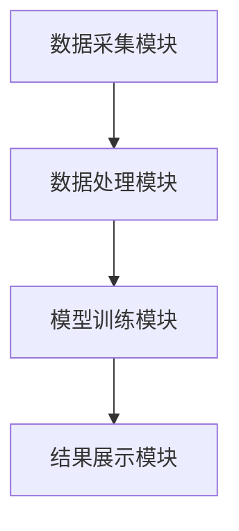
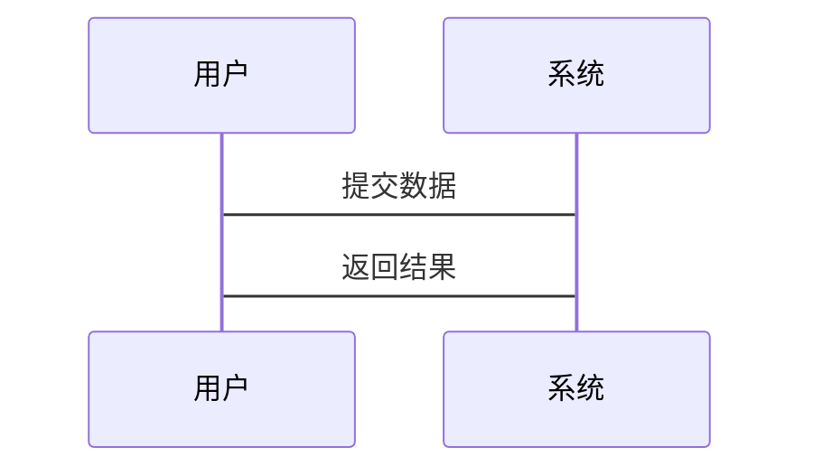

                 


# 构建AI驱动的客户生命周期管理系统

> 关键词：客户生命周期管理, AI驱动, 机器学习, 深度学习, 自然语言处理, 系统架构

> 摘要：本文详细探讨了如何利用人工智能技术构建客户生命周期管理系统，从背景介绍到核心技术，再到系统架构和项目实战，全面分析了AI在客户生命周期管理中的应用及其带来的价值提升。文章结合实际案例，通过丰富的图表和代码示例，帮助读者理解并掌握AI驱动客户生命周期管理的核心方法。

---

# 第1章: 客户生命周期管理概述

## 1.1 客户生命周期管理的定义与背景

### 1.1.1 什么是客户生命周期管理
客户生命周期管理（Customer Lifecycle Management, CLM）是指通过分析客户与企业之间的交互，从客户获取、激活、留存到流失的全生命周期进行管理的过程。通过CLM，企业可以更好地理解客户需求，优化客户体验，提升客户满意度和忠诚度。

### 1.1.2 客户生命周期管理的重要性
在现代商业环境中，客户是企业最重要的资产之一。通过CLM，企业可以：
1. 提高客户满意度和忠诚度。
2. 优化营销策略，提升转化率。
3. 降低客户流失率，延长客户生命周期。
4. 提高客户贡献度，实现精准营销。

### 1.1.3 AI在客户生命周期管理中的作用
人工智能（AI）技术的引入，使得客户生命周期管理更加智能化。AI可以通过以下方式提升CLM的效果：
1. **客户画像**：利用机器学习算法分析客户的特征和行为，构建精准的客户画像。
2. **行为预测**：通过深度学习模型预测客户的下一步行为，如购买、流失等。
3. **个性化推荐**：基于客户的兴趣和行为，推荐个性化的产品或服务。
4. **情感分析**：通过自然语言处理技术分析客户反馈，了解客户情绪，优化客户体验。

## 1.2 客户生命周期管理的核心概念

### 1.2.1 客户生命周期的阶段划分
客户生命周期通常分为以下几个阶段：
1. **获取阶段**：吸引潜在客户，如广告、推广活动等。
2. **激活阶段**：将潜在客户转化为实际客户，如注册、首次购买等。
3. **留存阶段**：通过优质服务和产品，保持客户的活跃度和忠诚度。
4. **增长阶段**：通过交叉销售和向上销售，增加客户的贡献度。
5. **流失阶段**：客户停止与企业的交互，企业需要采取措施挽回客户。

### 1.2.2 各阶段的核心特征
以下是各阶段的核心特征对比：

| 阶段       | 核心特征                               |
|------------|--------------------------------------|
| 获取阶段   | 吸引潜在客户，提高转化率               |
| 激活阶段   | 提高客户活跃度，降低流失率             |
| 留存阶段   | 保持客户忠诚度，提升客户生命周期价值   |
| 增长阶段   | 提高客户贡献度，增加收入               |
| 流失阶段   | 减少客户流失，挽回流失客户             |

### 1.2.3 客户生命周期管理的目标
客户生命周期管理的目标是通过分析客户行为和需求，优化企业与客户之间的交互，实现客户价值的最大化。具体目标包括：
1. 提高客户满意度和忠诚度。
2. 降低客户获取和维护成本。
3. 提高客户的生命周期价值（Lifetime Value, LTV）。

## 1.3 本章小结
本章从客户生命周期管理的定义、重要性和AI的作用三个方面进行了详细阐述，为后续章节的分析奠定了基础。

---

# 第2章: AI驱动客户生命周期管理的核心技术

## 2.1 机器学习在客户生命周期管理中的应用

### 2.1.1 监督学习在客户分类中的应用
监督学习是一种通过标记数据训练模型的技术。在客户生命周期管理中，监督学习可以用于客户分类，例如将客户分为高价值客户、中价值客户和低价值客户。

#### 示例：逻辑回归模型
以下是一个简单的逻辑回归模型，用于分类客户是否为高价值客户：

$$ P(y=1|x) = \frac{e^{\beta_0 + \beta_1 x}}{1 + e^{\beta_0 + \beta_1 x}} $$

其中，$x$ 是客户的特征向量，$\beta_0$ 和 $\beta_1$ 是模型参数。

### 2.1.2 非监督学习在客户聚类中的应用
非监督学习是一种无需标记数据的技术，常用于客户聚类。例如，可以将客户分为不同的群体，以便制定更有针对性的营销策略。

#### 示例：K-means聚类算法
K-means算法是一种常用的聚类算法，其步骤如下：

1. 随机选择K个初始质心。
2. 计算每个数据点到质心的距离，将其分配到最近的质心所在的簇。
3. 重新计算每个簇的质心。
4. 重复步骤2和3，直到质心不再变化。

### 2.1.3 强化学习在客户行为预测中的应用
强化学习是一种通过与环境交互来学习策略的技术。在客户生命周期管理中，强化学习可以用于预测客户的下一步行为，例如购买或流失。

#### 示例：Q-learning算法
Q-learning算法是一种常用的强化学习算法，其更新公式为：

$$ Q(s, a) = Q(s, a) + \alpha \left[ r + \max_{a'} Q(s', a') - Q(s, a) \right] $$

其中，$s$ 是当前状态，$a$ 是当前动作，$r$ 是奖励，$\alpha$ 是学习率。

## 2.2 自然语言处理在客户反馈分析中的应用

### 2.2.1 情感分析在客户反馈中的应用
情感分析是一种通过分析文本的情感倾向（如积极、消极、中性）来理解客户情绪的技术。在客户生命周期管理中，情感分析可以用于分析客户的反馈，优化客户体验。

#### 示例：基于词袋模型的情感分析
以下是一个简单的词袋模型实现：

```python
from sklearn.feature_extraction.text import CountVectorizer

# 创建词袋模型
vectorizer = CountVectorizer()

# 将文本数据转换为词袋向量
X = vectorizer.fit_transform(text_data)
```

### 2.2.2 基于NLP的客户意图识别
客户意图识别是一种通过分析客户的文本或语音来理解其需求的技术。在客户生命周期管理中，意图识别可以用于优化客户服务流程。

#### 示例：基于TF-IDF的意图识别
TF-IDF（Term Frequency-Inverse Document Frequency）是一种常用的文本特征提取方法，其计算公式为：

$$ \text{TF-IDF}(t, d) = \text{TF}(t, d) \times \text{IDF}(t, d) $$

其中，$\text{TF}(t, d)$ 是词$ t$在文档$d$中的词频，$\text{IDF}(t, d)$ 是词$t$的逆文档频率。

## 2.3 深度学习在客户行为预测中的应用

### 2.3.1 卷积神经网络（CNN）在客户画像中的应用
CNN是一种常用的深度学习模型，常用于处理图像和文本数据。在客户画像中，CNN可以用于分析客户的文本数据，提取其特征。

#### 示例：基于CNN的客户画像
以下是一个简单的CNN实现：

```python
import keras
from keras.layers import Conv2D, MaxPooling2D, Flatten, Dense

# 定义CNN模型
model = keras.Sequential([
    Conv2D(32, (3, 3), activation='relu', input_shape=(64, 64, 3)),
    MaxPooling2D((2, 2)),
    Conv2D(64, (3, 3), activation='relu'),
    MaxPooling2D((2, 2)),
    Flatten(),
    Dense(128, activation='relu'),
    Dense(1, activation='sigmoid')
])

# 编译模型
model.compile(optimizer='adam', loss='binary_crossentropy', metrics=['accuracy'])
```

### 2.3.2 循环神经网络（RNN）在客户行为预测中的应用
RNN是一种常用的深度学习模型，常用于处理序列数据。在客户行为预测中，RNN可以用于分析客户的交互历史，预测其下一步行为。

#### 示例：基于LSTM的客户行为预测
LSTM（长短期记忆网络）是一种常用的RNN变体，其更新公式为：

$$ f_t = \sigma(W_f \cdot [h_{t-1}, x_t] + b_f) $$
$$ i_t = \sigma(W_i \cdot [h_{t-1}, x_t] + b_i) $$
$$ o_t = \sigma(W_o \cdot [h_{t-1}, x_t] + b_o) $$
$$ c_t = f_t \cdot c_{t-1} + i_t \cdot x_t $$
$$ h_t = o_t \cdot \text{tanh}(c_t) $$

以下是一个简单的LSTM实现：

```python
from keras.layers import LSTM, Dense
from keras.models import Sequential

# 定义LSTM模型
model = Sequential([
    LSTM(64, return_sequences=True),
    LSTM(32),
    Dense(1, activation='sigmoid')
])

# 编译模型
model.compile(optimizer='adam', loss='binary_crossentropy', metrics=['accuracy'])
```

## 2.4 本章小结
本章详细介绍了机器学习、自然语言处理和深度学习在客户生命周期管理中的应用，为后续章节的系统架构设计和项目实战奠定了技术基础。

---

# 第3章: 系统架构设计

## 3.1 系统功能模块划分

### 3.1.1 数据采集模块
数据采集模块负责收集客户的行为数据，例如点击、浏览、购买等。

### 3.1.2 数据处理模块
数据处理模块负责对采集到的数据进行清洗、预处理和特征提取。

### 3.1.3 模型训练模块
模型训练模块负责训练机器学习模型，例如逻辑回归、随机森林等。

### 3.1.4 结果展示模块
结果展示模块负责将模型的输出结果以可视化的方式展示给用户。

## 3.2 系统架构设计图

### 3.2.1 系统架构图（Mermaid）


## 3.3 系统接口设计

### 3.3.1 数据接口
数据接口负责与数据源进行交互，例如数据库、API等。

### 3.3.2 模型接口
模型接口负责与机器学习模型进行交互，例如调用模型进行预测。

### 3.3.3 用户接口
用户接口负责与最终用户进行交互，例如Web界面、移动应用等。

## 3.4 系统交互流程图

### 3.4.1 交互流程图（Mermaid）


## 3.5 本章小结
本章从系统功能模块划分、架构设计和接口设计三个方面进行了详细阐述，为后续章节的项目实战奠定了基础。

---

# 第4章: 项目实战

## 4.1 项目环境搭建

### 4.1.1 安装Python
```bash
python --version
```

### 4.1.2 安装必要的库
```bash
pip install scikit-learn tensorflow keras
```

### 4.1.3 数据集准备
数据集可以从公开数据集获取，例如Kaggle上的客户数据集。

## 4.2 项目核心代码实现

### 4.2.1 数据预处理代码
```python
from sklearn.preprocessing import StandardScaler

# 创建标准化对象
scaler = StandardScaler()

# 对数据进行标准化处理
X_scaled = scaler.fit_transform(X)
```

### 4.2.2 模型训练代码
```python
from sklearn.model_selection import train_test_split
from sklearn.linear_model import LogisticRegression

# 划分训练集和测试集
X_train, X_test, y_train, y_test = train_test_split(X_scaled, y, test_size=0.2)

# 创建逻辑回归模型
model = LogisticRegression()

# 训练模型
model.fit(X_train, y_train)
```

### 4.2.3 结果展示代码
```python
from sklearn.metrics import accuracy_score

# 预测测试集结果
y_pred = model.predict(X_test)

# 计算准确率
accuracy = accuracy_score(y_test, y_pred)
print(f'准确率: {accuracy}')
```

## 4.3 项目实战小结
本章通过实际案例展示了如何利用AI技术构建客户生命周期管理系统，从环境搭建到代码实现，再到结果展示，帮助读者掌握了AI驱动客户生命周期管理的核心方法。

---

# 作者：AI天才研究院/AI Genius Institute & 禅与计算机程序设计艺术 /Zen And The Art of Computer Programming

