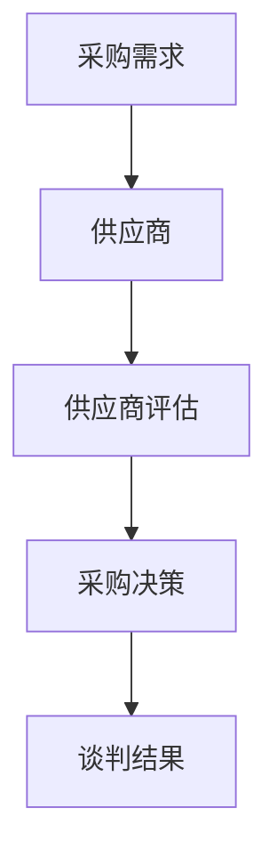
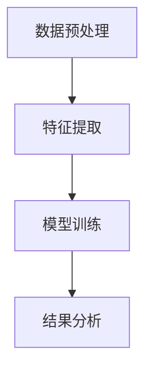
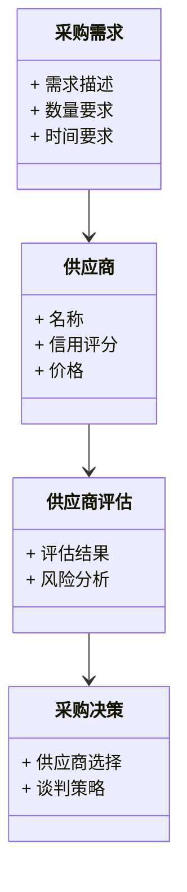
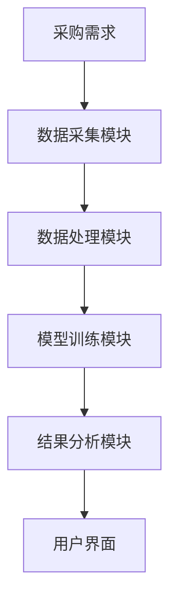
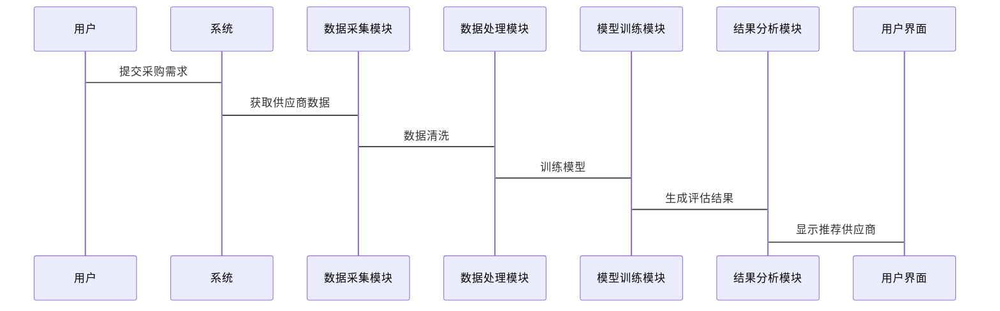

                 


# 《构建AI驱动的采购助手：优化供应商选择与谈判》

## 关键词：AI、采购助手、供应商选择、谈判优化、机器学习、自然语言处理、强化学习

## 摘要：本文探讨了如何利用AI技术优化供应商选择与谈判过程，通过机器学习和自然语言处理等技术，构建智能化的采购助手，解决传统采购中的痛点，提升效率与决策质量。

---

## 第一章：背景介绍

### 1.1 问题背景

#### 1.1.1 传统采购流程的痛点
传统采购流程复杂且耗时，涉及多个环节，包括需求分析、供应商选择、合同谈判、订单跟踪等。在供应商选择阶段，采购团队需要收集大量数据，评估供应商的资质、价格、交货能力等，这一过程通常依赖人工经验，效率低下且容易出错。此外，谈判过程中信息不对称的问题也导致采购成本难以降到最低。

#### 1.1.2 供应商选择的复杂性
供应商选择不仅需要考虑价格，还要综合评估质量、交货时间、售后服务等因素。这些因素相互关联，且每个供应商的情况可能千差万别，增加了选择的难度。此外，市场环境的变化（如原材料价格波动）也会对供应商选择产生影响。

#### 1.1.3 谈判中的信息不对称问题
在谈判过程中，采购方和供应商之间的信息可能存在不对称，导致谈判结果未必是最优的。采购方可能不了解供应商的真实成本结构，而供应商也可能利用信息不对称来提高报价。

---

### 1.2 问题描述

#### 1.2.1 供应商选择的标准与挑战
供应商选择的标准包括质量、价格、交货时间、地理位置、财务状况等。然而，如何在众多供应商中找到最优解是一个复杂的优化问题，尤其是在数据量大、变量多的情况下。

#### 1.2.2 谈判中的策略与技巧
谈判不仅是价格的博弈，还包括条款的优化，如付款条件、交货时间、售后服务等。如何制定谈判策略，最大化采购方的利益，是一个需要深思熟虑的过程。

#### 1.2.3 数据驱动决策的必要性
传统的采购决策依赖于经验和直觉，而数据驱动的决策可以通过分析历史数据和市场趋势，提供更科学的依据。然而，如何有效利用数据是采购优化的关键。

---

### 1.3 问题解决

#### 1.3.1 AI技术如何优化采购流程
AI技术可以通过数据分析、机器学习和自然语言处理，帮助采购团队快速筛选供应商，评估供应商资质，预测谈判结果，并提供最优策略建议。

#### 1.3.2 数据分析在供应商选择中的应用
通过机器学习模型，可以对供应商的历史数据进行分析，预测其表现，识别潜在风险。自然语言处理技术可以用于分析供应商的合同文本，识别隐藏的条款风险。

#### 1.3.3 自动化谈判工具的优势
自动化谈判工具可以通过强化学习模拟谈判过程，优化谈判策略，减少人为错误，提高谈判效率和成功率。

---

### 1.4 边界与外延

#### 1.4.1 采购助手的适用范围
采购助手主要适用于企业采购，尤其是大宗采购和供应链管理。它可以帮助采购团队提高效率，但无法完全替代人类的决策。

#### 1.4.2 与传统采购工具的区别
传统采购工具主要依赖人工操作，而采购助手通过AI技术提供智能化支持，能够处理复杂的数据分析和预测任务。

#### 1.4.3 未来发展的潜力
随着AI技术的不断进步，采购助手将变得更加智能化，能够处理更多复杂的任务，如实时市场监控、动态价格预测等。

---

### 1.5 核心要素组成

#### 1.5.1 数据采集与处理
采购助手需要收集供应商的历史数据、市场数据、合同文本等信息，并进行清洗和预处理。

#### 1.5.2 AI算法模型
采用机器学习、自然语言处理和强化学习等算法，构建供应商评估模型和谈判策略优化模型。

#### 1.5.3 用户交互界面
友好的用户界面能够让用户轻松使用采购助手，获取分析结果和策略建议。

---

## 第二章：核心概念与联系

### 2.1 核心概念原理

#### 2.1.1 数据驱动的供应商评估
通过机器学习模型对供应商的历史数据进行分析，评估其信用风险、质量表现等。

#### 2.1.2 自然语言处理在合同分析中的应用
利用自然语言处理技术，自动提取合同中的关键条款，识别潜在风险。

#### 2.1.3 强化学习在谈判策略中的应用
通过强化学习模拟谈判过程，优化谈判策略，提高谈判结果的满意度。

---

### 2.2 概念属性特征对比表格

| 概念          | 属性          | 特征描述                                                                 |
|---------------|---------------|--------------------------------------------------------------------------|
| 数据驱动评估  | 数据来源      | 供应商历史数据、市场数据、行业标准数据                                         |
| 自然语言处理  | 应用场景      | 合同条款分析、供应商文档解读                                                 |
| 强化学习       | 算法特点      | 通过试错优化策略，适用于动态谈判环境                                         |

---

### 2.3 ER实体关系图



---

## 第三章：算法原理讲解

### 3.1 供应商选择模型的算法原理

#### 3.1.1 算法选择与流程
- 选择随机森林和K-means算法，分别用于供应商分类和聚类。
- 数据预处理、特征提取、模型训练、结果分析。



#### 3.1.2 代码实现

```python
import pandas as pd
from sklearn.ensemble import RandomForestClassifier
from sklearn.metrics import accuracy_score

# 数据加载与预处理
data = pd.read_csv('suppliers.csv')
X = data.drop('label', axis=1)
y = data['label']

# 特征选择与模型训练
model = RandomForestClassifier()
model.fit(X, y)

# 模型评估
predictions = model.predict(X)
print("准确率:", accuracy_score(y, predictions))
```

#### 3.1.3 数学公式
随机森林的分类问题：
$$ y = \text{argmax}( \sum_{i=1}^{n} w_i y_i ) $$

K-means的聚类问题：
$$ \text{目标函数} = \sum_{i=1}^{k} \sum_{j \in C_i} (x_j - \mu_i)^2 $$

---

### 3.2 谈判策略优化的算法原理

#### 3.2.1 强化学习的应用
- 使用Q-learning算法模拟谈判过程，优化谈判策略。

#### 3.2.2 代码实现

```python
import numpy as np
from collections import defaultdict

class QLearning:
    def __init__(self, actions):
        self.actions = actions
        self.q_table = defaultdict(dict)
    
    def choose_action(self, state):
        if not self.q_table[state]:
            return np.random.choice(self.actions)
        return max(self.q_table[state], key=lambda k: self.q_table[state][k])
    
    def update_q_table(self, state, action, reward):
        if state not in self.q_table:
            self.q_table[state] = {action: 0}
        self.q_table[state][action] = self.q_table[state][action] * 0.9 + reward * 0.1
```

#### 3.2.3 数学模型
Q-learning的目标函数：
$$ Q(s, a) = (1-\alpha) Q(s, a) + \alpha (r + \gamma Q(s', a')) $$

---

## 第四章：系统分析与架构设计

### 4.1 项目背景与目标

#### 4.1.1 项目背景
本项目旨在通过AI技术优化供应商选择和谈判过程，提高采购效率和决策质量。

#### 4.1.2 项目目标
- 构建供应商评估模型
- 实现自动化谈判工具
- 提供数据驱动的决策支持

---

### 4.2 系统功能设计

#### 4.2.1 领域模型


---

### 4.3 系统架构设计

#### 4.3.1 系统架构


---

### 4.4 系统接口设计

#### 4.4.1 接口描述
- 输入接口：供应商数据、采购需求
- 输出接口：供应商评估结果、谈判策略建议

#### 4.4.2 接口调用方式
```python
# 示例接口
def get_supplier_recommendation(demand):
    return model.predict(demand)
```

---

### 4.5 系统交互流程



---

## 第五章：项目实战

### 5.1 环境安装

#### 5.1.1 安装Python与相关库
- Python 3.8+
- TensorFlow、Scikit-learn、Flask

#### 5.1.2 安装开发工具
- Jupyter Notebook
- VS Code

---

### 5.2 系统核心实现

#### 5.2.1 数据预处理代码
```python
import pandas as pd
from sklearn.preprocessing import StandardScaler

data = pd.read_csv('suppliers.csv')
scaler = StandardScaler()
X_scaled = scaler.fit_transform(data.drop('label', axis=1))
```

#### 5.2.2 模型训练代码
```python
from sklearn.ensemble import RandomForestClassifier

model = RandomForestClassifier()
model.fit(X_scaled, data['label'])
```

---

### 5.3 案例分析

#### 5.3.1 案例背景
某制造企业需要采购原材料，希望通过AI助手选择最优供应商。

#### 5.3.2 分析过程
- 数据清洗与特征提取
- 训练供应商评估模型
- 生成谈判策略

#### 5.3.3 结果解读
- 推荐的供应商：A公司
- 谈判策略：降低价格10%，延长交货时间一周

---

### 5.4 项目小结

#### 5.4.1 实现过程
- 系统设计与开发
- 数据采集与处理
- 模型训练与优化

#### 5.4.2 项目总结
- 成功实现了供应商评估和谈判策略优化
- 提高了采购效率和决策质量

---

## 第六章：总结与展望

### 6.1 内容总结

#### 6.1.1 核心内容回顾
- AI技术在采购中的应用
- 供应商选择与谈判优化的策略
- 系统架构与实现方法

---

### 6.2 未来展望

#### 6.2.1 技术发展
- 更多AI技术的应用，如多模态数据处理
- 自动化采购流程的进一步优化

#### 6.2.2 拓展方向
- 结合区块链技术，确保数据安全
- 实时监控市场变化，动态调整采购策略

---

## 附录

### 附录A：参考文献

1. Bishop, C. M. (2006). Pattern Recognition and Machine Learning.
2. Goodfellow, I., Bengio, Y., & Courville, A. (2016). Deep Learning.

### 附录B：工具资源

1. Python官方文档：https://docs.python.org/
2. TensorFlow官方文档：https://tensorflow.org/
3. Flask官方文档：https://flask.pocoo.org/

---

## 作者：AI天才研究院/AI Genius Institute & 禅与计算机程序设计艺术 /Zen And The Art of Computer Programming

---

通过构建AI驱动的采购助手，企业可以显著提高采购效率和决策质量。未来，随着技术的不断进步，AI在采购中的应用将更加广泛和深入，为企业创造更大的价值。

