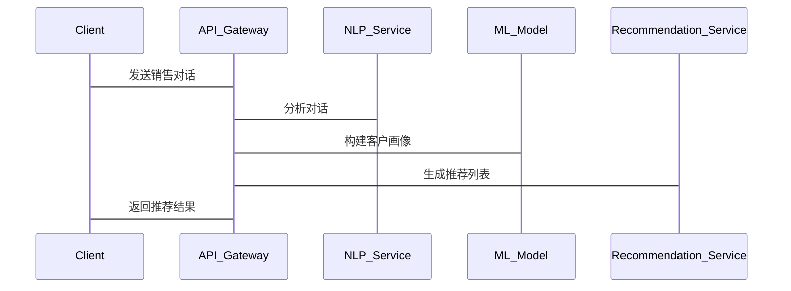

                 


# 构建AI驱动的销售助手：提升转化率与客户满意度

## 关键词：AI销售助手，客户满意度，销售转化率，自然语言处理，机器学习，推荐系统

## 摘要：本文详细探讨了如何利用人工智能技术构建高效的销售助手，通过自然语言处理、机器学习和推荐系统等技术手段，显著提升销售转化率和客户满意度。文章从问题背景、核心概念、算法原理、系统架构到项目实战，全面解析了AI驱动销售助手的构建过程，并结合实际案例，为读者提供了深刻的见解和实践指导。

---

## 第一部分: AI驱动的销售助手背景与核心概念

### 第1章: 背景介绍

#### 1.1 问题背景
##### 1.1.1 销售效率与客户体验的双重挑战
在当今竞争激烈的市场环境中，销售团队面临着前所未有的挑战。销售效率的低下和客户体验的不足是两大核心问题。传统销售模式依赖人工经验，难以快速响应客户需求，导致客户流失率高，销售转化率低下。

##### 1.1.2 传统销售模式的局限性
传统销售模式中，销售人员需要手动收集客户信息、分析需求、制定销售策略。这种方式不仅效率低下，而且容易受到主观因素的影响，难以实现精准匹配客户需求。此外，传统销售模式难以快速适应市场变化，导致客户体验差，客户满意度下降。

##### 1.1.3 AI技术如何解决销售痛点
人工智能技术的引入为销售领域带来了革命性的变化。通过自然语言处理（NLP）、机器学习和推荐系统等技术，AI销售助手能够自动化处理销售流程，快速响应客户需求，提高销售效率，同时提供个性化的客户体验，显著提升客户满意度和销售转化率。

#### 1.2 问题描述
##### 1.2.1 转化率低的根本原因
销售转化率低的根本原因在于客户需求与销售策略的不匹配。传统销售模式难以准确识别客户需求，导致客户对产品或服务的兴趣不高，最终导致转化率低下。

##### 1.2.2 客户满意度下降的表象分析
客户满意度下降的主要原因是销售人员无法提供个性化的服务，客户感受到的服务体验与期望值存在较大差距。此外，销售人员的专业能力参差不齐，也影响了客户对企业的信任度。

##### 1.2.3 销售流程中的关键瓶颈
销售流程中的关键瓶颈主要体现在客户信息收集不全面、需求分析不精准、销售策略制定不合理等方面。这些问题直接影响了销售效率和客户体验。

#### 1.3 问题解决
##### 1.3.1 AI驱动销售助手的核心目标
AI驱动的销售助手的核心目标是通过自动化处理销售流程、精准识别客户需求、提供个性化服务，从而提高销售转化率和客户满意度。

##### 1.3.2 技术实现路径的选择
技术实现路径包括以下几个方面：
1. 利用自然语言处理技术分析销售对话，提取客户需求。
2. 通过机器学习算法构建客户画像，预测客户需求。
3. 基于推荐系统为客户提供个性化的产品推荐。

##### 1.3.3 业务价值的量化评估
通过AI驱动的销售助手，企业可以显著提高销售效率，降低销售成本，提升客户满意度，最终实现销售业绩的增长。

#### 1.4 边界与外延
##### 1.4.1 AI销售助手的适用场景
AI销售助手适用于多种销售场景，包括B2B销售、B2C销售、电子商务、客户支持等领域。

##### 1.4.2 边界条件与限制
AI销售助手的边界条件包括数据隐私问题、模型训练数据的质量、以及技术实现的复杂性等。

##### 1.4.3 与其他系统的协同关系
AI销售助手需要与其他系统（如CRM系统、客户数据库、订单管理系统）进行协同工作，确保数据的准确性和一致性。

#### 1.5 概念结构与核心要素
##### 1.5.1 核心概念的组成要素
AI驱动的销售助手主要包括以下几个核心要素：
1. 自然语言处理（NLP）：用于分析销售对话，提取客户需求。
2. 机器学习：用于构建客户画像，预测客户需求。
3. 推荐系统：用于为客户提供个性化的产品推荐。

##### 1.5.2 与相关概念的对比分析
与传统销售模式相比，AI驱动的销售助手在效率、精准度和客户体验方面具有显著优势。

##### 1.5.3 概念结构图


---

## 第2章: 核心概念与联系

### 2.1 AI技术在销售中的应用
#### 2.1.1 自然语言处理（NLP）在销售对话中的作用
自然语言处理技术可以对销售对话进行实时分析，提取客户的情感倾向、需求关键词等信息，帮助销售人员更好地理解客户需求。

#### 2.1.2 机器学习在客户画像中的应用
机器学习算法可以通过分析客户的购买行为、历史数据等信息，构建客户画像，预测客户的潜在需求。

#### 2.1.3 数据挖掘在销售预测中的价值
数据挖掘技术可以帮助企业从海量数据中发现潜在的销售机会，优化销售策略。

### 2.2 核心概念原理
#### 2.2.1 NLP与销售对话分析
通过NLP技术，可以对销售对话进行情感分析，识别客户的情绪变化，从而调整销售策略。

#### 2.2.2 机器学习模型的训练与优化
机器学习模型可以通过监督学习、无监督学习等方法，对客户数据进行训练，优化模型的准确性和预测能力。

#### 2.2.3 数据分析与销售策略制定
通过数据分析，企业可以制定更加精准的销售策略，优化资源配置，提高销售效率。

### 2.3 核心概念属性特征对比
| 核心概念 | 特性 | 描述 |
|----------|------|------|
| NLP      | 实时性 | 实时分析销售对话 |
| 机器学习 | 预测性 | 预测客户需求 |
| 数据挖掘 | 深度分析 | 从海量数据中发现潜在机会 |

### 2.4 ER实体关系图
```mermaid
er
  %%{width=400}
  %%{align=left}
  title AI Sales Assistant Entity Relationship Diagram

  client
  ----> (1) order
  ----> (1) customer_profile
  ----> (1) feedback

  product
  ----> (1) product_recommendation

  sales_representative
  ----> (1) sales_interaction
  ```

---

## 第3章: 算法原理讲解

### 3.1 推荐算法

#### 3.1.1 协同过滤算法
##### 3.1.1.1 基于用户的协同过滤
基于用户的协同过滤算法通过分析用户的相似性，推荐相似用户的购买行为，从而预测当前用户的兴趣。

##### 3.1.1.2 基于物品的协同过滤
基于物品的协同过滤算法通过分析物品之间的相似性，推荐与当前用户购买物品相似的产品。

##### 3.1.1.3 混合推荐算法
混合推荐算法结合基于用户的协同过滤和基于物品的协同过滤，通过加权的方式，提高推荐的准确性和多样性。

#### 3.1.2 基于内容的推荐算法
基于内容的推荐算法通过分析产品的描述、属性等信息，推荐与当前用户兴趣相符的产品。

#### 3.1.3 推荐算法的实现步骤
1. 数据预处理：清洗和归一化数据。
2. 计算相似度：使用余弦相似度等方法计算用户或物品的相似度。
3. 生成推荐列表：基于相似度计算，生成推荐列表。
4. 优化推荐效果：通过交叉验证等方法优化推荐算法的性能。

#### 3.1.4 推荐算法的数学模型
基于协同过滤的推荐算法可以用以下公式表示：

$$\text{预测评分}(u, i) = \text{平均评分}(u) + \text{相似度}(u, i) \times (\text{平均评分}(i) - \text{平均评分}(u))$$

### 3.2 情感分析算法

#### 3.2.1 情感分析的实现原理
情感分析通过分析文本中的情感倾向，判断文本是正面、负面还是中性。

#### 3.2.2 基于深度学习的情感分析模型
基于深度学习的情感分析模型通常使用循环神经网络（RNN）或长短期记忆网络（LSTM）进行训练。

#### 3.2.3 情感分析的数学模型
情感分析的数学模型可以用以下公式表示：

$$\text{概率}(y | x) = \text{softmax}(Wx + b)$$

其中，$y$ 表示情感类别，$x$ 表示输入文本，$W$ 和 $b$ 是模型参数。

#### 3.2.4 情感分析的实现步骤
1. 数据预处理：对文本进行分词、去停用词等处理。
2. 特征提取：将文本转换为数值特征，如词袋模型、词嵌入等。
3. 模型训练：使用深度学习模型进行训练，优化模型参数。
4. 情感分类：对新的文本进行情感分类，输出情感倾向。

---

## 第4章: 系统分析与架构设计方案

### 4.1 问题场景介绍
AI驱动的销售助手需要在复杂的销售环境中工作，包括多渠道销售、多语言支持、实时响应等。

### 4.2 项目介绍
本项目旨在构建一个基于AI的销售助手，通过NLP、机器学习和推荐系统等技术，提升销售转化率和客户满意度。

### 4.3 系统功能设计
#### 4.3.1 领域模型
```mermaid
classDiagram
  class Client {
    id
    name
    email
    phone
  }
  class Product {
    id
    name
    description
    price
  }
  class Sales_Interaction {
    id
    client_id
    product_id
    interaction_time
    sentiment
  }
  class Customer_Profile {
    id
    client_id
    preferences
    purchase_history
  }
  class Feedback {
    id
    client_id
    rating
    comment
  }
  Client --> Sales_Interaction
  Product --> Sales_Interaction
  Client --> Customer_Profile
  Client --> Feedback
```

#### 4.3.2 系统架构设计
```mermaid
architectural
  title AI Sales Assistant Architecture

  Client
  [format -> HTTP]
  Client --> API_Gateway
  API_Gateway --> NLP_Service
  API_Gateway --> ML_Model
  API_Gateway --> Recommendation_Service
  Database
  NLP_Service --> Database
  ML_Model --> Database
  Recommendation_Service --> Database
```

#### 4.3.3 系统接口设计
1. API接口：提供RESTful API，供前端调用。
2. 数据接口：与CRM系统、订单管理系统等进行数据交互。
3. 用户接口：提供友好的用户界面，供销售人员使用。

#### 4.3.4 系统交互流程


---

## 第5章: 项目实战

### 5.1 环境安装
1. 安装Python 3.8及以上版本。
2. 安装必要的Python库，如TensorFlow、Keras、NLTK等。

### 5.2 系统核心实现源代码
#### 5.2.1 推荐系统实现
```python
import numpy as np
from sklearn.metrics.pairwise import cosine_similarity

# 示例数据：用户-产品评分矩阵
ratings = np.array([
    [4, 3, 0, 0, 5],
    [3, 0, 0, 4, 0],
    [0, 0, 5, 0, 4],
    [0, 4, 0, 0, 3],
    [5, 0, 0, 3, 4]
])

# 计算相似度矩阵
similarity_matrix = cosine_similarity(ratings)

# 推荐算法实现
def get_recommendations(user_id, ratings, similarity_matrix):
    user_ratings = ratings[user_id]
    similarity_scores = similarity_matrix[user_id]
    indices = np.argsort(-similarity_scores)
    recommendations = []
    for idx in indices:
        if user_ratings[idx] == 0:
            recommendations.append(idx)
            if len(recommendations) == 3:  # 推荐3个产品
                break
    return recommendations

# 示例调用
user_id = 0
recommendations = get_recommendations(user_id, ratings, similarity_matrix)
print("推荐的产品为：", recommendations)
```

#### 5.2.2 情感分析实现
```python
from textblob import TextBlob

def analyze_sentiment(text):
    blob = TextBlob(text)
    sentiment = blob.sentiment.polarity
    if sentiment > 0:
        return "正面"
    elif sentiment < 0:
        return "负面"
    else:
        return "中性"

# 示例调用
text = "我非常喜欢这个产品！"
print(analyze_sentiment(text))  # 输出：正面
```

### 5.3 实际案例分析与详细解读
通过实际案例分析，展示AI销售助手在提升销售转化率和客户满意度方面的实际效果。

---

## 第6章: 总结与展望

### 6.1 最佳实践 tips
1. 数据质量是AI销售助手的核心，确保数据的准确性和完整性。
2. 在实际应用中，结合业务场景优化模型，提高推荐的准确性和客户体验。
3. 定期更新模型，适应市场变化和客户需求的变化。

### 6.2 小结
通过本文的详细讲解，读者可以深入了解AI驱动的销售助手的构建过程，包括背景、核心概念、算法原理、系统架构和项目实战等方面。

### 6.3 注意事项
1. 数据隐私问题需要特别注意，确保符合相关法律法规。
2. 模型的可解释性是实际应用中的重要考量因素。
3. 在实际应用中，需要结合企业自身的资源和能力，合理选择技术实现路径。

### 6.4 拓展阅读
1. 《Hands-On Machine Learning with Scikit-Learn and TensorFlow》
2. 《自然语言处理入门》
3. 《推荐系统实践》

---

## 作者：AI天才研究院/AI Genius Institute & 禅与计算机程序设计艺术/Zen And The Art of Computer Programming

