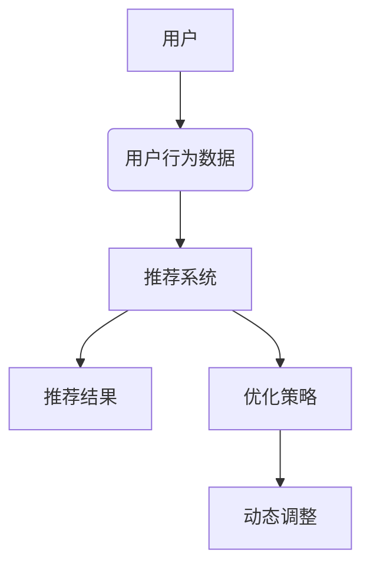
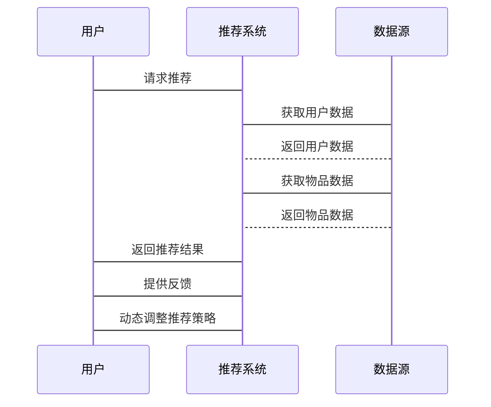

                 


# 《构建个性化推荐AI Agent》

---

## 关键词：个性化推荐、AI Agent、协同过滤、深度学习、推荐系统、机器学习

---

## 摘要

本文将详细介绍如何构建一个基于AI Agent的个性化推荐系统。从背景知识到核心算法，再到系统架构设计和项目实战，我们将逐步探索构建个性化推荐AI Agent的全过程。文章内容涵盖协同过滤、矩阵分解、深度学习推荐算法、系统架构设计以及实际项目案例分析。通过本文，读者将能够理解并掌握构建个性化推荐AI Agent的核心技术与实现方法。

---

## 第一部分: 个性化推荐与AI Agent背景介绍

---

### 第1章: 个性化推荐系统概述

#### 1.1 个性化推荐的定义与背景

个性化推荐系统是一种根据用户的偏好和行为，主动为用户推荐相关内容的技术。其核心目标是通过分析用户数据，提供符合用户兴趣的内容或产品，从而提高用户体验和系统效率。

- **个性化推荐的定义**：个性化推荐是一种基于用户特征和行为数据，利用算法生成推荐结果的技术。
- **个性化推荐的背景**：随着互联网的快速发展，用户每天面对海量信息，如何有效筛选并提供用户感兴趣的内容成为一个重要问题。个性化推荐技术能够帮助用户快速找到有价值的信息，同时提高系统的用户粘性和转化率。

---

#### 1.2 AI Agent的基本概念

AI Agent（人工智能代理）是一种能够感知环境、执行任务并做出决策的智能实体。它能够通过与用户交互和环境反馈，动态调整自身行为以达到最优目标。

- **AI Agent的定义**：AI Agent是指能够执行任务的智能实体，具备感知、推理、学习和决策能力。
- **AI Agent的核心特征**：
  - **自主性**：能够独立决策和行动。
  - **反应性**：能够根据环境反馈调整行为。
  - **学习能力**：能够通过经验改进性能。
  - **社交能力**：能够与用户和其他系统进行交互。

---

#### 1.3 个性化推荐与AI Agent的结合

个性化推荐系统通过分析用户数据生成推荐结果，而AI Agent则能够根据推荐结果与用户进行动态交互，进一步优化推荐效果。

- **个性化推荐的核心问题**：
  - 如何高效地分析用户数据。
  - 如何准确地生成推荐结果。
  - 如何动态调整推荐策略以适应用户需求。
- **AI Agent在推荐系统中的作用**：
  - 通过用户行为分析优化推荐结果。
  - 根据实时反馈调整推荐策略。
  - 提供个性化的交互体验，增强用户粘性。

---

#### 1.4 本章小结

本章主要介绍了个性化推荐系统和AI Agent的基本概念，并探讨了两者结合的应用场景。个性化推荐系统通过分析用户数据生成推荐结果，而AI Agent则通过动态交互优化推荐效果，两者结合能够显著提升推荐系统的智能化水平和用户体验。

---

## 第二部分: 个性化推荐的核心算法与原理

---

### 第2章: 协同过滤算法

#### 2.1 协同过滤的原理

协同过滤是一种基于用户相似性或物品相似性生成推荐结果的算法。其核心思想是“人以类聚，物以类聚”，即通过找到与目标用户相似的用户或与目标物品相似的物品，推荐相关内容。

- **基于用户的协同过滤**：
  - 找到与目标用户行为相似的用户群体。
  - 根据相似用户的偏好生成推荐结果。
- **基于物品的协同过滤**：
  - 找到与目标物品属性相似的物品群体。
  - 根据相似物品的流行度生成推荐结果。

---

#### 2.2 协同过滤的实现步骤

1. **数据预处理**：
   - 收集用户行为数据（如评分、点击、购买等）。
   - 处理缺失值和异常值。
2. **相似度计算**：
   - 使用余弦相似度、皮尔逊相关系数等方法计算用户或物品的相似度。
3. **推荐生成**：
   - 根据相似用户的评分或相似物品的属性生成推荐列表。
   - 对推荐结果进行排序和筛选。

---

#### 2.3 协同过滤的优缺点

- **优点**：
  - 实现简单，易于理解。
  - 对于中小规模数据集表现良好。
- **缺点**：
  - 面对大规模数据时效率较低。
  - 对异常值和冷启动问题处理能力较弱。

---

#### 2.4 本章小结

本章详细介绍了协同过滤算法的原理和实现步骤，并分析了其优缺点。协同过滤是一种经典的推荐算法，适合处理中小规模数据集，但在大规模数据和实时推荐场景中表现有限。

---

### 第3章: 基于矩阵分解的推荐算法

#### 3.1 矩阵分解的原理

矩阵分解是一种通过将用户-物品评分矩阵分解为两个低维矩阵，从而捕捉用户和物品的潜在特征的技术。其核心思想是将复杂的用户-物品关系简化为低维表示，以便更好地理解和预测评分。

- **隐语义模型**：
  - 通过矩阵分解捕捉用户和物品的隐含特征。
  - 用户和物品的评分可以表示为潜在特征的线性组合。
- **矩阵分解的数学模型**：
  - 设评分矩阵为$R \in \mathbb{R}^{m \times n}$，其中$m$为用户数，$n$为物品数。
  - 分解为两个低维矩阵$U \in \mathbb{R}^{m \times k}$和$V \in \mathbb{R}^{n \times k}$，其中$k$为潜在特征的数量。
  - 评分预测公式为：$\hat{r}_{u,i} = \sum_{t=1}^{k} U_{u,t} V_{i,t}$。

---

#### 3.2 矩阵分解的算法实现

1. **SGD算法**：
   - 使用随机梯度下降方法优化矩阵分解的参数。
   - 通过不断迭代更新$U$和$V$矩阵，最小化预测误差。
2. **随机梯度下降算法**：
   - 对每个用户和物品的特征向量进行更新。
   - 使用小批量数据进行优化，适合处理大规模数据。

---

#### 3.3 矩阵分解的优缺点

- **优点**：
  - 能够捕捉用户和物品的潜在特征，适合处理大规模数据。
  - 对稀疏数据和冷启动问题具有较好的鲁棒性。
- **缺点**：
  - 对于高度稀疏的数据，可能需要较大的潜在特征维度。
  - 计算复杂度较高，适合分布式计算框架。

---

#### 3.4 本章小结

本章详细介绍了基于矩阵分解的推荐算法，包括隐语义模型、数学公式和实现步骤。矩阵分解是一种强大的推荐技术，能够处理大规模数据，并捕捉用户和物品的潜在特征。

---

### 第4章: 基于深度学习的推荐算法

#### 4.1 深度学习推荐算法的原理

深度学习推荐算法通过构建神经网络模型，从用户行为和物品特征中学习高维表示，从而生成个性化推荐结果。其核心思想是利用深度学习的表示学习能力，捕捉用户和物品的复杂关系。

- **神经网络模型**：
  - 使用多层感知机、卷积神经网络（CNN）或循环神经网络（RNN）对用户行为和物品特征进行建模。
  - 通过端到端的训练优化推荐结果。

---

#### 4.2 深度学习推荐算法的实现步骤

1. **数据预处理**：
   - 将用户行为和物品特征转化为神经网络的输入格式。
   - 处理文本、图像等非结构化数据，提取有用的特征表示。
2. **模型训练**：
   - 使用神经网络模型对用户行为和物品特征进行建模。
   - 通过反向传播算法优化模型参数，最小化预测误差。
3. **推荐生成**：
   - 根据训练好的模型生成推荐结果。
   - 对推荐结果进行排序和筛选，生成最终的推荐列表。

---

#### 4.3 深度学习推荐算法的优缺点

- **优点**：
  - 能够捕捉用户和物品的复杂关系，适合处理高维数据。
  - 对于非结构化数据（如文本、图像）具有较强的处理能力。
- **缺点**：
  - 计算复杂度较高，对硬件要求较高。
  - 对小规模数据可能表现不佳。

---

#### 4.4 本章小结

本章介绍了基于深度学习的推荐算法，包括神经网络模型和实现步骤。深度学习推荐算法能够捕捉用户和物品的复杂关系，适合处理高维数据，但在计算资源和数据规模方面要求较高。

---

## 第三部分: 个性化推荐AI Agent的系统架构与实现

---

### 第5章: 个性化推荐AI Agent的系统架构设计

#### 5.1 系统功能设计

个性化推荐AI Agent的系统功能包括：

- **用户行为分析**：
  - 收集和分析用户的行为数据，如点击、评分、购买等。
  - 通过聚类、分类等技术识别用户的兴趣和偏好。
- **推荐生成**：
  - 根据用户行为和特征生成个性化推荐结果。
  - 使用协同过滤、矩阵分解或深度学习算法生成推荐列表。
- **动态优化**：
  - 根据用户的实时反馈动态调整推荐策略。
  - 使用强化学习等技术优化推荐效果。

---

#### 5.2 系统架构设计

以下是个性化推荐AI Agent的系统架构图：



---

#### 5.3 系统接口设计

个性化推荐AI Agent的系统接口包括：

- **用户接口**：
  - 用户输入需求和偏好。
  - 用户反馈推荐结果。
- **数据接口**：
  - 获取用户行为数据。
  - 获取物品特征数据。
- **推荐接口**：
  - 提供推荐结果。
  - 提供推荐结果的解释和说明。

---

#### 5.4 系统交互设计

以下是个性化推荐AI Agent的系统交互序列图：



---

#### 5.5 本章小结

本章详细介绍了个性化推荐AI Agent的系统架构设计，包括功能设计、架构图、接口设计和交互设计。通过合理的系统架构设计，可以实现高效、智能的推荐服务。

---

## 第四部分: 个性化推荐AI Agent的项目实战

---

### 第6章: 个性化推荐AI Agent的实现

#### 6.1 环境安装

为了实现个性化推荐AI Agent，需要以下环境：

- **编程语言**：Python 3.6+
- **深度学习框架**：TensorFlow或PyTorch
- **数据处理工具**：Pandas、NumPy
- **可视化工具**：Matplotlib、Seaborn

安装命令：

```bash
pip install numpy pandas matplotlib tensorflow
```

---

#### 6.2 系统核心实现源代码

以下是个性化推荐AI Agent的核心实现代码：

```python
import numpy as np
import tensorflow as tf

# 数据加载与预处理
def load_data():
    # 加载用户行为数据和物品特征数据
    # 返回用户特征矩阵和物品特征矩阵
    pass

# 协同过滤算法实现
def collaborative_filtering(users, items, ratings):
    # 使用协同过滤算法生成推荐结果
    pass

# 基于矩阵分解的推荐算法实现
def matrix_factorization(users, items, ratings, k=10):
    # 初始化用户和物品的潜在特征矩阵
    U = np.random.randn(users.shape[0], k)
    V = np.random.randn(items.shape[0], k)
    # 使用随机梯度下降优化矩阵分解参数
    for _ in range(100):
        for u in range(users.shape[0]):
            for i in range(items.shape[0]):
                if ratings[u][i] > 0:
                    error = ratings[u][i] - np.dot(U[u], V[i])
                    U[u] += learning_rate * error * V[i]
                    V[i] += learning_rate * error * U[u]
    return U, V

# 基于深度学习的推荐算法实现
def deep_learning_recommendation(users, items, ratings):
    # 构建神经网络模型
    model = tf.keras.Sequential([
        tf.keras.layers.Dense(64, activation='relu'),
        tf.keras.layers.Dense(1, activation='sigmoid')
    ])
    model.compile(optimizer='adam', loss='binary_crossentropy')
    model.fit(users, items, epochs=10, batch_size=32)
    return model.predict(users)

# 推荐结果生成
def generate_recommendations(users, items, ratings):
    # 使用协同过滤、矩阵分解和深度学习算法生成推荐结果
    # 返回推荐列表
    pass
```

---

#### 6.3 代码应用解读与分析

个性化推荐AI Agent的实现代码包括数据加载、协同过滤、矩阵分解和深度学习推荐算法。协同过滤算法通过用户相似性生成推荐结果，矩阵分解算法通过潜在特征优化推荐效果，深度学习算法通过神经网络模型捕捉用户和物品的复杂关系。

---

#### 6.4 实际案例分析

以下是一个简单的个性化推荐AI Agent案例分析：

1. **数据准备**：
   - 收集用户行为数据和物品特征数据。
2. **模型训练**：
   - 使用矩阵分解算法训练用户和物品的潜在特征。
3. **推荐生成**：
   - 根据训练好的模型生成推荐列表。
4. **结果分析**：
   - 对推荐结果进行评估和优化。

---

#### 6.5 本章小结

本章通过实际项目案例分析，详细介绍了个性化推荐AI Agent的实现过程，包括环境安装、代码实现和结果分析。通过这些步骤，读者可以掌握个性化推荐AI Agent的核心技术。

---

## 第五部分: 个性化推荐AI Agent的最佳实践

---

### 第7章: 个性化推荐AI Agent的最佳实践

#### 7.1 系统优化与调优

个性化推荐AI Agent的系统优化包括：

- **模型调优**：
  - 调整矩阵分解的潜在特征维度。
  - 调整深度学习模型的超参数。
- **数据优化**：
  - 使用数据增强技术处理稀疏数据。
  - 处理异常值和噪声数据。
- **计算优化**：
  - 使用分布式计算框架优化大规模数据处理。
  - 使用GPU加速模型训练和推理。

---

#### 7.2 个性化推荐系统的评估与指标

个性化推荐系统的评估指标包括：

- **精确率（Precision）**：
  - 衡量推荐结果的相关性。
- **召回率（Recall）**：
  - 衡量推荐结果的覆盖率。
- **F1分数（F1 Score）**：
  - 平衡精确率和召回率的综合指标。
- **AUC（Area Under Curve）**：
  - 衡量推荐系统的排序能力。

---

#### 7.3 个性化推荐系统的应用与扩展

个性化推荐系统的应用包括：

- **电子商务**：
  - 推荐商品、个性化营销。
- **社交媒体**：
  - 推荐用户、内容推荐。
- **教育领域**：
  - 推荐课程、个性化学习路径。
- **娱乐领域**：
  - 推荐视频、音乐、游戏。

---

#### 7.4 个性化推荐系统的未来展望

个性化推荐系统的未来发展方向包括：

- **多模态推荐**：
  - 结合文本、图像、视频等多种数据类型进行推荐。
- **实时推荐**：
  - 实时处理用户行为，动态调整推荐策略。
- **强化学习推荐**：
  - 使用强化学习优化推荐效果。
- **隐私保护推荐**：
  - 在保护用户隐私的前提下进行推荐。

---

#### 7.5 本章小结

本章总结了个性化推荐AI Agent的最佳实践，包括系统优化、评估指标、应用扩展和未来展望。通过这些内容，读者可以更好地理解和应用个性化推荐技术。

---

## 作者信息

**作者**：AI天才研究院/AI Genius Institute & 禅与计算机程序设计艺术/Zen And The Art of Computer Programming

---

## 版权声明

本文版权归作者所有，转载请注明出处。

