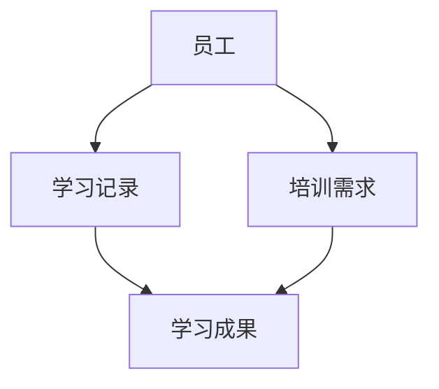
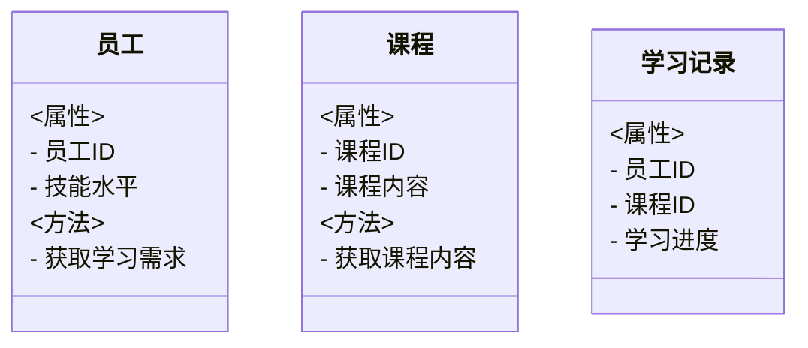
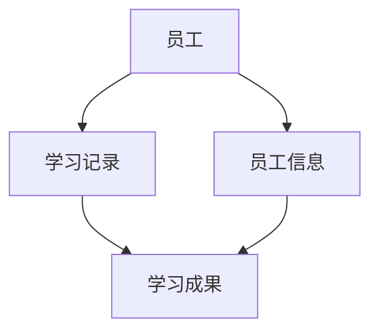
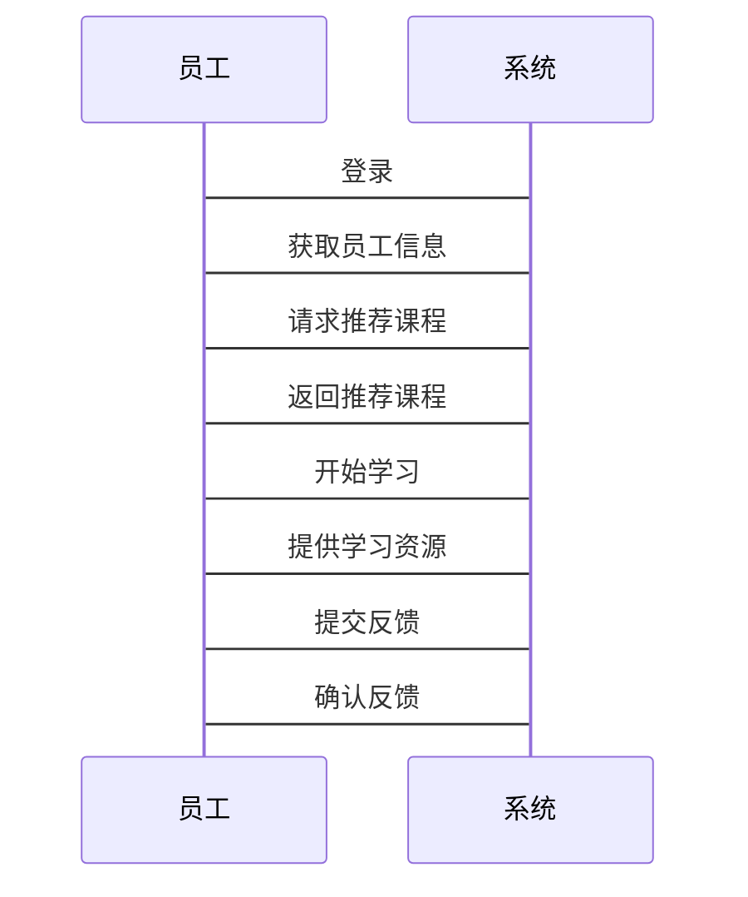

                 


# 构建企业专属AI培训师：员工技能提升助手

> 关键词：企业培训、AI培训师、机器学习、自然语言处理、技能提升

> 摘要：本文详细探讨了构建企业专属AI培训师的背景、核心概念、算法原理、系统架构及其实战应用，旨在为企业提供高效、个性化的员工技能提升解决方案。

---

# 第1章：企业专属AI培训师的背景介绍

## 1.1 问题背景

### 1.1.1 传统企业培训的痛点

在企业培训中，传统方法常面临以下问题：
- **低效性**：培训内容可能与员工需求不匹配，导致学习积极性不高。
- **一致性**：难以实现大规模员工的个性化培训。
- **成本高**：需要大量的人力和时间资源。

### 1.1.2 企业培训效率低下的原因

- **缺乏个性化**：员工的技能水平和学习需求差异大，统一培训效果不佳。
- **内容陈旧**：培训内容更新不及时，难以适应快速变化的市场需求。
- **反馈延迟**：传统培训难以实时跟踪学习效果并提供反馈。

### 1.1.3 AI技术如何解决企业培训问题

AI技术通过以下方式提升企业培训效率：
- **个性化推荐**：根据员工的学习历史和技能水平，推荐适合的学习内容。
- **实时反馈**：利用自然语言处理和机器学习算法，实时评估学习效果并提供反馈。
- **动态调整**：根据学习进度和效果，动态调整学习计划。

## 1.2 问题描述

### 1.2.1 员工技能提升的需求分析

员工技能提升需求多样，包括技术技能、软技能和管理技能。不同员工在不同阶段的需求不同，需要灵活的培训方案。

### 1.2.2 现有培训体系的不足

现有培训体系常存在以下不足：
- **缺乏个性化**：忽视员工的个体差异，导致学习效果不佳。
- **内容单一**：难以覆盖员工的多样化需求。
- **反馈机制缺失**：无法实时跟踪学习进度并提供反馈。

### 1.2.3 AI培训师的核心目标与定位

AI培训师的核心目标是通过AI技术实现个性化、动态调整的培训方案，帮助员工高效提升技能。其定位是企业的智能培训助手，辅助HR部门优化培训流程。

## 1.3 解决方案

### 1.3.1 AI培训师的功能与作用

AI培训师的主要功能包括：
- **个性化学习路径规划**：基于员工的学习历史和技能水平，推荐适合的学习内容。
- **实时学习反馈**：通过机器学习算法，实时评估学习效果并提供反馈。
- **动态调整学习计划**：根据学习进度和效果，动态调整学习计划。

### 1.3.2 个性化学习路径的设计

个性化学习路径的设计基于以下步骤：
1. **评估员工技能水平**：通过测试或数据分析，评估员工当前的技能水平。
2. **分析学习需求**：根据员工的职业目标和岗位要求，分析其需要提升的技能。
3. **推荐学习内容**：基于需求分析，推荐适合的学习资源和课程。
4. **动态调整计划**：根据学习反馈，实时调整学习路径。

### 1.3.3 AI驱动的知识传递与技能提升

AI通过以下方式驱动知识传递：
- **自然语言处理**：用于生成个性化的学习内容和反馈。
- **机器学习**：用于预测学习效果并优化学习路径。
- **强化学习**：用于动态调整学习策略，提升学习效率。

## 1.4 边界与外延

### 1.4.1 AI培训师的应用范围

AI培训师适用于企业内部员工的技能提升，包括技术培训、管理培训和软技能培训。

### 1.4.2 与其他企业系统的边界划分

AI培训师与其他企业系统的边界划分：
- **人力资源管理系统（HRM）**：与HRM系统集成，获取员工信息和培训记录。
- **学习管理系统（LMS）**：与LMS系统集成，推荐学习资源和课程。
- **绩效管理系统**：与绩效管理系统集成，评估学习效果并提供反馈。

### 1.4.3 AI培训师的未来发展与可能性

AI培训师的未来发展可能包括：
- **更智能化的推荐算法**：基于更复杂的学习者特征和行为数据，提供更精准的学习内容。
- **增强的交互体验**：通过自然语言处理和语音识别技术，提供更自然的交互方式。
- **跨平台支持**：支持多种学习平台和设备，提升学习的便捷性。

## 1.5 核心要素组成

### 1.5.1 数据驱动的个性化学习

个性化学习基于以下数据：
- **员工信息**：包括员工的技能水平、学习历史和职业目标。
- **课程数据**：包括课程内容、难度和学习时间。
- **学习反馈**：包括员工的学习效果和反馈。

### 1.5.2 AI算法支持的知识推荐

AI算法通过以下方式推荐知识：
- **协同过滤**：基于员工的学习历史和行为数据，推荐类似的学习内容。
- **内容推荐**：基于课程内容和员工的学习需求，推荐相关课程。
- **实时反馈**：基于学习反馈，实时调整推荐策略。

### 1.5.3 人机交互的培训体验

人机交互通过以下方式优化培训体验：
- **自然语言处理**：通过对话式交互，员工可以直接用自然语言表达学习需求。
- **语音识别**：通过语音交互，员工可以方便地获取学习内容和反馈。
- **虚拟现实**：通过虚拟现实技术，提供沉浸式的学习体验。

---

# 第2章：核心概念与联系

## 2.1 AI培训师的核心原理

### 2.1.1 机器学习模型的训练过程

机器学习模型的训练过程包括以下步骤：
1. **数据预处理**：清洗数据，提取特征。
2. **模型训练**：使用训练数据训练模型。
3. **模型评估**：通过测试数据评估模型性能。
4. **模型优化**：调整模型参数，提升性能。

### 2.1.2 自然语言处理在培训内容生成中的应用

自然语言处理用于生成个性化学习内容，包括：
- **文本生成**：生成个性化的学习计划和反馈。
- **文本分类**：分类学习内容，推荐相关课程。

### 2.1.3 强化学习在学习路径优化中的作用

强化学习用于优化学习路径，通过以下方式：
- **状态定义**：定义学习路径的状态，如当前学习阶段和技能水平。
- **动作选择**：根据当前状态，选择最优的学习行动。
- **奖励机制**：根据学习效果，给予奖励或惩罚。

## 2.2 核心概念对比分析

### 2.2.1 不同AI模型的特点对比

| 模型类型 | 优点 | 缺点 |
|----------|------|------|
| 协同过滤 | 简单易实现 | 需要大量用户数据 |
| 基于内容的推荐 | 高准确性 | 对冷启动问题敏感 |
| 深度学习模型 | 高准确性 | 训练时间长，需要大量数据 |

### 2.2.2 各模型的优缺点分析

- **协同过滤**：优点是简单易实现，缺点是需要大量用户数据，且难以处理冷启动问题。
- **基于内容的推荐**：优点是准确性高，缺点是对冷启动问题敏感，且难以处理数据稀疏性。
- **深度学习模型**：优点是准确性高，缺点是训练时间长，需要大量数据。

### 2.2.3 模型选择的依据与策略

模型选择的依据包括：
- **数据量**：数据量大时，深度学习模型表现更好。
- **数据稀疏性**：数据稀疏时，协同过滤模型更适用。
- **实时性要求**：实时性要求高时，简单模型更适用。

## 2.3 ER实体关系图



---

# 第3章：算法原理讲解

## 3.1 算法原理概述

### 3.1.1 机器学习模型的训练过程

训练过程包括数据预处理、特征提取、模型训练和评估。

### 3.1.2 自然语言处理模型的文本生成机制

文本生成机制包括编码器-解码器结构和注意力机制。

### 3.1.3 强化学习在学习路径优化中的作用

强化学习通过状态、动作和奖励机制优化学习路径。

## 3.2 算法原理的详细讲解

### 3.2.1 机器学习模型的训练过程

1. **数据预处理**：清洗数据，处理缺失值和异常值。
2. **特征提取**：提取有用的特征，如TF-IDF。
3. **模型训练**：使用训练数据训练模型，如随机森林或神经网络。
4. **模型评估**：使用测试数据评估模型性能，如准确率和召回率。

### 3.2.2 自然语言处理模型的文本生成机制

文本生成机制包括：
- **编码器**：将输入文本编码为向量。
- **解码器**：根据编码向量生成输出文本。
- **注意力机制**：在解码过程中关注输入文本的重要部分。

### 3.2.3 强化学习在学习路径优化中的作用

强化学习通过以下步骤优化学习路径：
1. **状态定义**：定义学习路径的状态，如当前学习阶段和技能水平。
2. **动作选择**：根据当前状态，选择最优的学习行动。
3. **奖励机制**：根据学习效果，给予奖励或惩罚。

## 3.3 算法实现的代码示例

### 3.3.1 简单的协同过滤算法

```python
import numpy as np

# 示例数据：员工ID和课程ID的评分矩阵
# 假设评分矩阵为 employees x courses 的二维数组
# 使用协同过滤算法推荐课程

def collaborative_filtering(train_data, test_data, k=3):
    # 训练阶段：计算每个员工的平均评分和相似员工
    # 预测阶段：根据相似员工的评分预测当前员工的评分
    pass

# 示例使用
train_data = np.array([[4, 3, 0], [0, 2, 1], [0, 0, 5]])
test_data = np.array([[0, 1, 0]])
```

### 3.3.2 基于内容的推荐算法

```python
from sklearn.feature_extraction.text import TfidfVectorizer

# 示例数据：课程描述
courses = [
    "Python编程基础",
    "数据结构与算法",
    "机器学习入门"
]

# 提取TF-IDF特征
vectorizer = TfidfVectorizer()
tfidf_matrix = vectorizer.fit_transform(courses)

# 计算课程之间的相似性
similarity_matrix = tfidf_matrix.T * tfidf_matrix
```

## 3.4 算法的数学模型和公式

### 3.4.1 协同过滤的相似性计算

$$
similarity(i, j) = \frac{\sum_{k=1}^{n} r_{ik} \cdot r_{jk}}{\sqrt{\sum_{k=1}^{n} r_{ik}^2} \cdot \sqrt{\sum_{k=1}^{n} r_{jk}^2}}}
$$

### 3.4.2 基于内容的推荐模型

$$
score(i, j) = \sum_{k=1}^{m} w_k \cdot f_k(i, j)
$$

其中，$w_k$是特征$k$的权重，$f_k(i, j)$是特征$k$在项目$i$和$j$中的值。

---

# 第4章：系统分析与架构设计

## 4.1 问题场景介绍

构建企业专属AI培训师需要解决以下问题：
- **个性化推荐**：如何根据员工的学习需求推荐合适的课程？
- **实时反馈**：如何实时跟踪学习进度并提供反馈？
- **动态调整**：如何根据学习反馈动态调整学习计划？

## 4.2 项目介绍

### 4.2.1 项目目标

- 开发一个AI培训师系统，实现个性化学习推荐和实时反馈。

### 4.2.2 项目范围

- 系统功能：个性化推荐、实时反馈、动态调整。
- 用户群体：企业员工。
- 系统边界：与企业的人力资源管理系统和学习管理系统集成。

## 4.3 系统功能设计

### 4.3.1 领域模型



### 4.3.2 系统架构设计



## 4.4 系统接口设计

### 4.4.1 API接口设计

- **获取员工信息**：`GET /employees/{id}`
- **推荐课程**：`POST /recommend_courses`
- **提交学习反馈**：`POST /submit_feedback`

### 4.4.2 接口实现

```python
from flask import Flask, request, jsonify

app = Flask(__name__)

@app.route('/employees/<int:id>', methods=['GET'])
def get_employee(id):
    # 获取员工信息
    pass

@app.route('/recommend_courses', methods=['POST'])
def recommend_courses():
    # 根据员工信息推荐课程
    pass

@app.route('/submit_feedback', methods=['POST'])
def submit_feedback():
    # 提交学习反馈
    pass

if __name__ == '__main__':
    app.run(debug=True)
```

## 4.5 系统交互设计

### 4.5.1 交互流程

1. **员工登录**：员工登录系统，获取员工信息。
2. **推荐课程**：系统根据员工信息推荐课程。
3. **开始学习**：员工选择课程，开始学习。
4. **提交反馈**：员工完成学习后提交反馈。
5. **动态调整**：系统根据反馈动态调整学习计划。

### 4.5.2 交互流程图



---

# 第5章：项目实战

## 5.1 环境安装

### 5.1.1 安装Python和必要的库

```bash
pip install numpy
pip install pandas
pip install scikit-learn
pip install flask
```

### 5.1.2 安装开发工具

- 安装Jupyter Notebook用于数据分析和算法开发。
- 安装VS Code或PyCharm作为开发环境。

## 5.2 系统核心实现

### 5.2.1 核心代码实现

```python
from sklearn.feature_extraction.text import TfidfVectorizer
from sklearn.metrics.pairwise import cosine_similarity

# 示例数据：员工学习需求
employee = "提升Python编程能力"

# 提取特征
vectorizer = TfidfVectorizer()
tfidf_matrix = vectorizer.fit_transform([employee])

# 计算相似性
similarity_matrix = cosine_similarity(tfidf_matrix)
```

### 5.2.2 代码解读与分析

- **TfidfVectorizer**：用于提取文本特征，计算TF-IDF值。
- **cosine_similarity**：计算文本之间的余弦相似度，用于推荐相关课程。

## 5.3 代码实现细节

### 5.3.1 基于内容的推荐实现

```python
def get_recommendations(employee_need):
    # 提取特征
    vectorizer = TfidfVectorizer()
    tfidf_matrix = vectorizer.fit_transform([employee_need])
    # 计算相似性
    similarity = cosine_similarity(tfidf_matrix)
    # 返回相似性最高的课程
    return similarity.argsort()[0][::-1]
```

### 5.3.2 交互式界面实现

```python
from flask import Flask, render_template, request

app = Flask(__name__)

@app.route('/', methods=['GET', 'POST'])
def index():
    if request.method == 'POST':
        employee_need = request.form['employee_need']
        # 调用推荐函数
        recommendations = get_recommendations(employee_need)
        return render_template('result.html', recommendations=recommendations)
    return render_template('index.html')

if __name__ == '__main__':
    app.run(debug=True)
```

## 5.4 实际案例分析

### 5.4.1 案例背景

假设某公司需要提升员工的Python编程能力。

### 5.4.2 数据分析与处理

- **数据预处理**：清洗员工信息和课程数据。
- **特征提取**：提取员工的学习需求和课程内容的特征。

### 5.4.3 算法实现与优化

- **模型训练**：训练机器学习模型，如随机森林。
- **模型优化**：调整模型参数，提升推荐准确率。

## 5.5 项目小结

通过项目实战，我们成功实现了AI培训师的核心功能，包括个性化推荐和实时反馈。系统能够根据员工的学习需求推荐合适的课程，并根据反馈动态调整学习计划。

---

# 第6章：最佳实践与总结

## 6.1 最佳实践

### 6.1.1 小结

- AI培训师能够显著提升企业培训效率，实现个性化学习和动态调整。

### 6.1.2 注意事项

- 数据隐私保护：确保员工数据的安全和隐私。
- 系统集成：与企业现有系统（如HRM和LMS）集成，提升系统可用性。
- 模型优化：持续优化推荐算法，提升推荐准确率。

### 6.1.3 拓展阅读

- 《机器学习实战》：深入学习机器学习算法的实现。
- 《自然语言处理入门》：了解自然语言处理的基本原理和应用。

## 6.2 总结

AI培训师通过机器学习和自然语言处理技术，帮助企业实现个性化、高效的员工培训。随着技术的不断发展，AI培训师将在企业培训中发挥越来越重要的作用。

---

作者：AI天才研究院/AI Genius Institute & 禅与计算机程序设计艺术/Zen And The Art of Computer Programming

