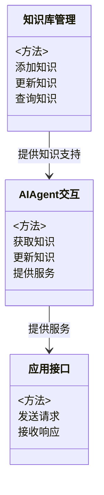
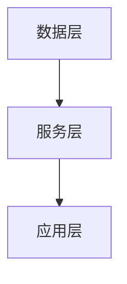
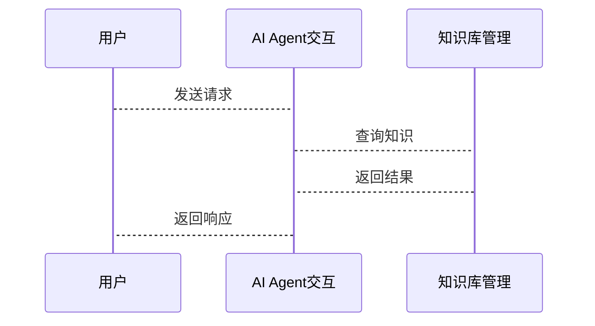

                 


```markdown
# 构建企业知识库：为AI Agent提供专业领域支持

> 关键词：企业知识库，AI Agent，知识抽取，知识融合，对话生成

> 摘要：本文详细探讨了如何构建企业知识库以支持AI Agent的专业领域应用。首先介绍了企业知识库和AI Agent的基本概念，然后分析了知识库在AI Agent中的核心作用，接着详细讲解了知识库的构建方法、算法原理及系统架构设计，并通过实际案例展示了如何将这些理论应用于实践。最后总结了最佳实践和未来发展趋势。

---

## 第一部分: 企业知识库与AI Agent概述

### 第1章: 企业知识库与AI Agent基础

#### 1.1 企业知识库的定义与特点

企业知识库是一个结构化的数据库，用于存储和管理企业的核心知识和信息。它不仅包含数据，还包含数据之间的关系和语义，能够支持复杂的推理和决策过程。

- **定义**：企业知识库是一种以知识表示为基础的数据库，通常以知识图谱的形式存在，包含实体、属性和关系。
- **特点**：
  - **结构化**：数据以实体和关系的形式组织。
  - **语义化**：数据具有明确的语义和上下文。
  - **可扩展性**：能够方便地添加新知识和更新现有知识。
  - **可推理性**：支持基于知识图谱的推理和逻辑推理。

#### 1.2 AI Agent的基本概念

AI Agent是一种智能代理，能够感知环境、执行任务并做出决策。它广泛应用于推荐系统、智能客服、自动化操作等领域。

- **定义**：AI Agent是一种能够感知环境、执行任务并做出决策的智能系统。
- **特点**：
  - **自主性**：能够在没有人工干预的情况下运行。
  - **反应性**：能够根据环境的变化调整行为。
  - **社交能力**：能够与其他系统或用户进行交互。

#### 1.3 企业知识库与AI Agent的关系

企业知识库为AI Agent提供知识支持，帮助其理解和处理复杂的业务问题。

- **知识库在AI Agent中的作用**：
  - 提供领域知识，支持AI Agent的推理和决策。
  - 支持自然语言处理，提高对话生成的准确性。
  - 优化推荐算法，提高推荐的精准度。

- **AI Agent如何利用知识库**：
  - 通过查询知识库获取相关信息。
  - 利用知识库中的关系进行推理和逻辑判断。
  - 结合知识库中的知识生成自然语言回答。

#### 1.4 本章小结

本章介绍了企业知识库和AI Agent的基本概念，分析了它们之间的关系，并讨论了知识库在支持AI Agent中的作用。

---

## 第二部分: 企业知识库的核心概念与构建方法

### 第2章: 企业知识库的核心概念

#### 2.1 知识库的结构与组成

知识库的结构由实体、属性和关系三部分组成。

- **实体**：知识库中的基本单位，表示具体的概念或对象。
- **属性**：描述实体的特征或性质。
- **关系**：描述实体之间的联系。

**ER图表示**：
```mermaid
erDiagram
    customer[客户] {
        <属性>
        id : string
        name : string
        age : integer
    }
    product[产品] {
        <属性>
        id : string
        name : string
        price : float
    }
    purchase[购买]
    customer -> purchase : 购买
    product -> purchase : 被购买
```

#### 2.2 知识库的构建方法

知识库的构建分为数据采集、知识抽取和知识融合三个阶段。

- **数据采集**：从企业系统中获取结构化和非结构化数据。
- **知识抽取**：从非结构化数据中提取实体、关系和属性。
- **知识融合**：将多个数据源中的信息整合到一个统一的知识库中。

#### 2.3 知识库的更新与维护

知识库需要定期更新，以保持其准确性和完整性。

- **更新机制**：根据数据变化自动触发更新。
- **版本控制**：记录每次更新的历史版本。
- **纠错与优化**：定期检查并修正错误信息。

#### 2.4 本章小结

本章详细讲解了知识库的结构和构建方法，并讨论了其更新与维护策略。

---

## 第三部分: AI Agent的知识库支持与算法原理

### 第3章: AI Agent的知识库支持

#### 3.1 知识库在AI Agent中的应用场景

知识库在AI Agent中有多种应用场景，包括问题解答、信息检索和任务执行。

- **问题解答**：通过查询知识库提供准确的答案。
- **信息检索**：根据用户需求快速找到相关信息。
- **任务执行**：利用知识库中的知识完成复杂任务。

#### 3.2 知识库对AI Agent性能的影响

知识库的规模、结构和更新频率直接影响AI Agent的性能。

- **规模**：知识库越大，AI Agent能够处理的问题越复杂。
- **结构**：良好的知识库结构可以提高查询效率。
- **更新频率**：及时更新的知识库能够保持信息的准确性。

#### 3.3 知识库与AI Agent的交互机制

知识库与AI Agent之间的交互主要通过查询协议和模型结合实现。

- **查询协议**：定义知识库与AI Agent之间的通信方式。
- **模型结合**：将知识库中的知识嵌入到AI Agent的模型中，提高推理能力。

#### 3.4 本章小结

本章分析了知识库在AI Agent中的应用场景，并讨论了其对性能的影响和交互机制。

---

## 第四部分: 企业知识库构建的算法原理

### 第4章: 知识库构建的算法原理

#### 4.1 知识抽取算法

知识抽取是将非结构化数据转化为结构化知识的关键步骤。

- **分词**：将文本分割成词语或短语。
- **实体识别**：识别文本中的实体。
- **关系抽取**：识别实体之间的关系。

**分词算法示例**：
```python
import jieba
text = "构建企业知识库支持AI Agent"
words = jieba.lcut(text)
print(words)  # 输出：['构建', '企业', '知识库', '支持', 'AI', 'Agent']
```

#### 4.2 知识融合算法

知识融合是将多个数据源中的信息整合到一个知识库中的过程。

- **冲突检测**：检测不同数据源中的冲突信息。
- **冲突解决**：通过协商或优先级规则解决冲突。

#### 4.3 知识表示与推理

知识表示通常使用向量或符号逻辑，推理算法包括基于规则的推理和基于概率的推理。

- **向量表示**：将知识表示为向量空间中的点。
- **符号逻辑**：使用逻辑规则进行推理。

**向量空间模型示例**：
```python
from sentence_transformers import SentenceTransformer
model = SentenceTransformer('bert-base-nli-max')
embedding = model.encode("构建企业知识库")
print(embedding)  # 输出：向量表示
```

#### 4.4 本章小结

本章详细讲解了知识抽取、融合和表示的算法原理，并提供了具体的实现示例。

---

## 第五部分: 企业知识库与AI Agent的系统架构设计

### 第5章: 系统架构设计

#### 5.1 系统功能设计

系统主要包括知识库管理、AI Agent交互和应用接口三个模块。

**功能模块类图**：


#### 5.2 系统架构设计

系统采用分层架构，包括数据层、服务层和应用层。

**系统架构图**：


#### 5.3 系统交互流程

系统交互流程包括请求处理、知识查询和结果返回三个步骤。

**系统交互序列图**：


#### 5.4 本章小结

本章详细描述了系统的功能设计和架构设计，并展示了系统的交互流程。

---

## 第六部分: 项目实战与总结

### 第6章: 项目实战

#### 6.1 环境搭建

需要安装以下工具和库：

- Python
- Jieba（中文分词）
- Sentence Transformers（向量表示）

#### 6.2 核心代码实现

实现知识抽取和知识库查询的代码示例。

**知识抽取代码示例**：
```python
import jieba
from sentence_transformers import SentenceTransformer

def extract_keywords(text):
    words = jieba.lcut(text)
    return words

def get_embeddings(text):
    model = SentenceTransformer('bert-base-nli-max')
    embedding = model.encode(text)
    return embedding

text = "构建企业知识库支持AI Agent"
keywords = extract_keywords(text)
embeddings = get_embeddings(text)
```

#### 6.3 案例分析

以一个简单的客服对话系统为例，展示如何利用知识库支持AI Agent。

**案例分析**：
- **需求**：用户询问产品信息。
- **过程**：
  1. 用户输入问题。
  2. AI Agent查询知识库。
  3. 知识库返回相关信息。
  4. AI Agent生成回答。

#### 6.4 本章小结

本章通过实际项目展示了如何构建企业知识库并支持AI Agent的应用。

---

## 第七部分: 总结与展望

### 7.1 总结

本文详细探讨了如何构建企业知识库以支持AI Agent的专业领域应用。通过理论分析和实践案例，展示了知识库在AI Agent中的重要性和构建方法。

### 7.2 注意事项

- 知识库的构建需要结合企业的具体需求。
- 知识库的更新需要及时，以保持信息的准确性。
- 知识库的安全性和隐私保护需要高度重视。

### 7.3 未来趋势

- 知识库的智能化：利用AI技术进一步优化知识抽取和融合。
- 知识库的分布式存储：提高知识库的扩展性和可用性。
- 知识库的应用场景拓展：探索更多领域的应用。

### 7.4 本章小结

本章总结了全文的主要内容，并展望了未来的发展趋势。

---

## 作者

作者：AI天才研究院/AI Genius Institute & 禅与计算机程序设计艺术 /Zen And The Art of Computer Programming
```

