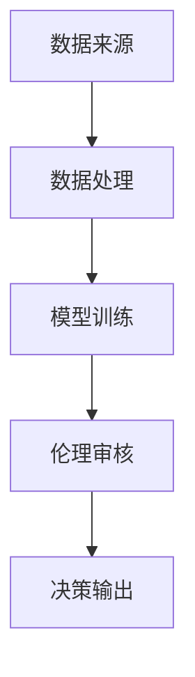
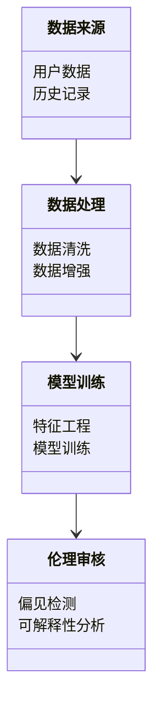
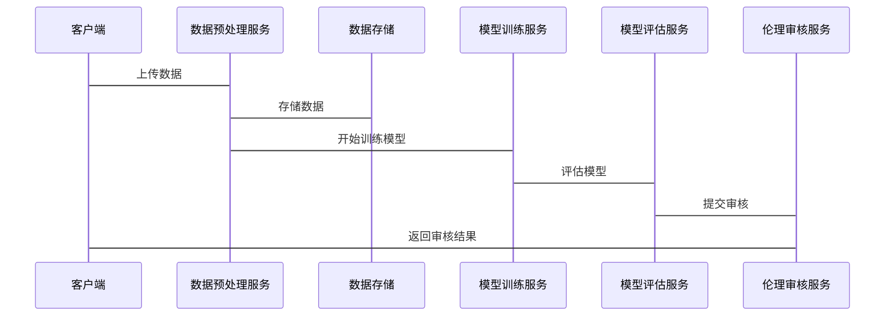

                 


# 构建企业级AI伦理审核框架：确保AI应用的公平性与透明度

## 关键词：AI伦理审核，公平性，透明度，企业级框架，AI治理，数据隐私，算法可解释性

## 摘要：  
在AI技术迅速普及的今天，企业级AI应用面临着日益复杂的伦理挑战。如何构建一个能够确保AI应用公平性和透明度的伦理审核框架，是当前企业亟需解决的关键问题。本文从AI伦理审核的核心概念出发，详细探讨了伦理审核框架的设计原则、技术实现、系统架构以及项目实战，为企业级AI应用的伦理合规提供了全面的解决方案。通过具体案例分析和系统设计，本文为构建高效、可靠的AI伦理审核框架提供了理论支持和实践指导。

---

# 第一部分: AI伦理审核框架的背景与核心概念

## 第1章: AI伦理与审核框架概述

### 1.1 AI技术的现状与挑战

#### 1.1.1 AI技术的快速发展  
人工智能（AI）技术近年来取得了突飞猛进的发展，从自然语言处理（NLP）到计算机视觉（CV），AI已经渗透到各个行业。然而，这种快速发展也带来了新的挑战，尤其是在伦理方面。

#### 1.1.2 AI应用中的伦理问题  
AI技术的广泛应用引发了诸多伦理问题，例如：  
1. **数据隐私**：用户数据的收集和使用是否符合隐私保护要求？  
2. **算法偏见**：AI系统是否存在不公平的算法偏见？  
3. **决策透明度**：AI系统做出的决策是否可解释且透明？  
4. **责任归属**：当AI系统出现问题时，责任如何界定？  

#### 1.1.3 企业级AI应用的独特挑战  
企业级AI应用通常涉及海量数据和复杂的业务逻辑，这使得伦理问题更加突出。例如，在金融领域的信用评分系统中，如果算法存在偏见，可能会对某些群体的信用评估产生不公平影响。

---

### 1.2 AI伦理审核的必要性

#### 1.2.1 公平性与透明度的重要性  
AI系统的公平性和透明度是用户信任的基础。如果用户无法理解AI系统的决策逻辑，或者认为系统存在偏见，他们可能会对AI技术失去信任。  

#### 1.2.2 企业级AI应用的伦理风险  
企业级AI应用通常涉及关键业务流程，伦理问题的出现可能会导致严重的法律和 reputational 风险。例如，在医疗领域，AI系统的错误决策可能导致患者的生命安全受到威胁。

#### 1.2.3 伦理审核框架的核心要素  
为了确保AI系统的公平性和透明度，伦理审核框架需要包含以下核心要素：  
1. **数据来源与处理**：确保数据的合法性和合规性。  
2. **模型训练与部署**：避免算法偏见，确保模型的可解释性。  
3. **伦理审核流程与机制**：建立完善的审核流程和机制，确保AI系统的决策符合伦理要求。

---

### 1.3 伦理审核框架的核心概念与联系

#### 1.3.1 核心概念原理  
AI伦理审核框架的核心概念包括：  
1. **数据隐私与保护**：确保数据的收集、存储和使用符合隐私保护要求。  
2. **模型可解释性**：使AI系统的决策逻辑清晰且可解释。  
3. **伦理决策机制**：在AI系统做出决策时，确保决策符合伦理标准。

#### 1.3.2 核心概念属性对比表  

| **概念**         | **属性**                     | **描述**                                                                 |
|------------------|------------------------------|--------------------------------------------------------------------------|
| 数据隐私与保护   | 合法性                      | 数据的收集和使用必须符合相关法律法规。                                 |
|                  | � 匿名化/脱敏                 | 数据在处理过程中需要进行匿名化或脱敏处理。                             |
| 模型可解释性      | 明确性                      | 模型的决策逻辑必须清晰且易于理解。                                     |
|                  | 可追溯性                   | 模型的决策必须能够追溯到具体的数据或特征。                             |
| 伦理决策机制     | 公平性                      | 决策机制必须避免算法偏见，确保公平性。                                 |
|                  | 可控性                      | 在必要时，能够对AI系统的决策进行干预和调整。                           |

#### 1.3.3 ER实体关系图架构  
以下是一个简单的ER实体关系图，展示了AI伦理审核框架中的核心实体及其关系：  


---

## 第2章: AI伦理审核框架的核心概念与联系

### 2.1 核心概念原理

#### 2.1.1 数据隐私与保护  
数据隐私是AI伦理审核框架的核心概念之一。在企业级AI应用中，数据的收集、存储和使用必须符合相关法律法规，例如《通用数据保护条例》（GDPR）。  

#### 2.1.2 模型可解释性  
模型的可解释性是确保AI系统透明度的关键。如果AI系统的决策逻辑不清晰，用户将无法信任系统。因此，我们需要使用可解释性模型（如LIME和SHAP）来分析模型的决策过程。

#### 2.1.3 伦理决策机制  
伦理决策机制是AI系统做出决策时的道德指南。它需要确保AI系统的决策符合伦理标准，例如避免算法偏见和确保公平性。

---

### 2.2 核心概念属性对比表

| **概念**         | **属性**                     | **描述**                                                                 |
|------------------|------------------------------|--------------------------------------------------------------------------|
| 数据隐私与保护   | 合法性                      | 数据的收集和使用必须符合相关法律法规。                                 |
|                  | 匿名化/脱敏                 | 数据在处理过程中需要进行匿名化或脱敏处理。                             |
| 模型可解释性      | 明确性                      | 模型的决策逻辑必须清晰且易于理解。                                     |
|                  | 可追溯性                   | 模型的决策必须能够追溯到具体的数据或特征。                             |
| 伦理决策机制     | 公平性                      | 决策机制必须避免算法偏见，确保公平性。                                 |
|                  | 可控性                      | 在必要时，能够对AI系统的决策进行干预和调整。                           |

---

### 2.3 ER实体关系图架构  


---

## 第三部分: AI伦理审核框架的技术实现

---

## 第4章: AI伦理审核算法原理

### 4.1 对抗训练原理

#### 4.1.1 对抗网络的构建  
对抗训练是一种常用的算法公平性提升方法。通过构建对抗网络，我们可以消除模型中的偏见。  

#### 4.1.2 对抗训练的流程  
1. 初始化对抗网络，包括生成器和判别器。  
2. 通过交替训练，生成器生成对抗样本，判别器学习区分真实样本和对抗样本。  
3. 通过不断迭代，生成器生成的样本逐渐趋近于真实样本，从而减少偏见。

#### 4.1.3 对抗训练的优缺点  
- **优点**：能够有效减少模型偏见。  
- **缺点**：计算成本较高，且需要大量的训练数据。

---

### 4.2 模型可解释性算法

#### 4.2.1 LIME算法  
LIME（Local Interpretable Model-agnostic Explanations）是一种常用的可解释性算法。它通过局部拟合线性模型来解释模型的决策逻辑。

#### 4.2.2 SHAP值  
SHAP（SHapley Additive exPlanations）是一种基于博弈论的可解释性方法。它通过计算每个特征对模型决策的贡献度来解释模型。

#### 4.2.3 显式可解释模型  
显式可解释模型（如线性回归模型）本身具有较高的可解释性，适合用于需要透明度的场景。

---

### 4.3 伦理决策算法

#### 4.3.1 基于规则的决策  
基于规则的决策机制通过预定义的规则来确保AI系统的决策符合伦理标准。例如，可以定义规则：“如果模型预测的结果存在偏见，则需要调整模型参数。”

#### 4.3.2 基于概率的决策  
基于概率的决策机制通过概率模型来计算决策的不确定性，并根据概率值来决定最终的决策结果。

---

## 第5章: AI伦理审核框架的系统架构设计

### 5.1 问题场景介绍  
本章将通过一个具体的案例（例如金融领域的信用评分系统）来介绍AI伦理审核框架的系统架构设计。

---

### 5.2 系统功能设计

#### 5.2.1 领域模型设计  
以下是信用评分系统的领域模型：  


---

### 5.3 系统架构设计

#### 5.3.1 系统架构图  
以下是AI伦理审核框架的系统架构图：  


---

### 5.4 系统接口设计

#### 5.4.1 API接口  
以下是AI伦理审核框架的主要API接口：  
1. `/api/data/upload`：上传数据接口。  
2. `/api/model/train`：训练模型接口。  
3. `/api/model/evaluate`：评估模型接口。  
4. `/api/ethics/review`：伦理审核接口。  

---

### 5.5 系统交互流程

#### 5.5.1 交互流程图  
以下是系统交互流程图：  


---

## 第6章: AI伦理审核框架的项目实战

### 6.1 环境安装与配置

#### 6.1.1 安装Python环境  
```bash
pip install python3
pip install numpy
pip install scikit-learn
pip install lime
pip install shap
```

---

#### 6.1.2 安装框架依赖  
```bash
pip install flask
pip install requests
pip install json
```

---

### 6.2 系统核心实现源代码

#### 6.2.1 数据预处理代码  
```python
import pandas as pd
import numpy as np

def data_preprocessing(df):
    # 数据清洗
    df.dropna(inplace=True)
    # 数据增强
    df['age_range'] = pd.cut(df['age'], 5)
    return df
```

---

#### 6.2.2 模型训练代码  
```python
from sklearn.tree import DecisionTreeClassifier
from sklearn.model_selection import train_test_split

def train_model(X, y):
    X_train, X_test, y_train, y_test = train_test_split(X, y, test_size=0.2)
    model = DecisionTreeClassifier()
    model.fit(X_train, y_train)
    return model
```

---

#### 6.2.3 伦理审核代码  
```python
from lime.lime_tabular import LimeTabular
from shap import SHAP

def ethical_review(model, X):
    explainer = LimeTabular()
    explanation = explainer.explain_instance(X.iloc[0], model.predict_proba)
    return explanation
```

---

### 6.3 代码应用解读与分析

#### 6.3.1 数据预处理  
数据预处理是AI伦理审核框架的第一步。通过数据清洗和数据增强，我们可以确保数据的完整性和多样性。

#### 6.3.2 模型训练  
在模型训练阶段，我们使用决策树模型来进行分类任务。通过交叉验证，我们可以评估模型的性能。

#### 6.3.3 伦理审核  
在伦理审核阶段，我们使用LIME和SHAP这两种可解释性工具来分析模型的决策逻辑。通过这些工具，我们可以发现模型中的偏见，并对其进行调整。

---

### 6.4 案例分析与详细讲解剖析

#### 6.4.1 信用评分系统案例分析  
在信用评分系统中，AI伦理审核框架可以帮助我们发现模型中的偏见，并确保模型的决策公平且透明。

---

### 6.5 项目小结

#### 6.5.1 核心代码与实现  
通过上述代码，我们可以实现一个简单的AI伦理审核框架。虽然这个框架的功能相对简单，但它为我们提供了构建更复杂的框架的基础。

---

## 第七部分: 结论与展望

---

## 第7章: 总结与展望

### 7.1 伦理审核框架的价值

#### 7.1.1 公平性与透明度的提升  
通过构建AI伦理审核框架，我们可以确保AI系统的决策公平且透明。  

#### 7.1.2 数据隐私与保护的强化  
AI伦理审核框架可以帮助我们更好地保护用户数据的隐私和安全。

---

### 7.2 伦理审核框架的未来发展方向

#### 7.2.1 更复杂的算法与模型  
随着AI技术的不断发展，我们需要开发更复杂的算法和模型来应对新的伦理挑战。

#### 7.2.2 更强大的系统架构设计  
未来，我们需要设计更强大的系统架构，以支持更大规模的AI应用。

---

## 第八部分: 扩展内容

---

## 第8章: 伦理决策算法的深入探讨

### 8.1 基于规则的决策算法

#### 8.1.1 规则定义  
通过定义预定义的规则，我们可以确保AI系统的决策符合伦理标准。

#### 8.1.2 规则实现  
以下是一个简单的规则实现示例：  
```python
def ethical_decision(rules, model_output):
    for rule in rules:
        if rule.check(model_output):
            return rule.action
    return default_action
```

---

### 8.2 基于概率的决策算法

#### 8.2.1 概率计算  
通过计算模型决策的概率，我们可以更好地理解模型的决策逻辑。

#### 8.2.2 概率应用  
以下是一个简单的概率应用示例：  
```python
import numpy as np

def probabilistic_decision(probability, threshold):
    if probability >= threshold:
        return "允许"
    else:
        return "拒绝"
```

---

## 第9章: 未来研究方向

### 9.1 新兴技术与伦理审核框架的结合

#### 9.1.1 大模型的伦理挑战  
随着大模型的出现，我们需要重新审视伦理审核框架的设计。

#### 9.1.2 新兴技术的应用  
新兴技术（如量子计算和区块链）的应用将为伦理审核框架带来新的可能性。

---

## 第10章: 最佳实践 Tips

### 10.1 小结

#### 10.1.1 伦理审核框架的核心价值  
AI伦理审核框架的核心价值在于确保AI系统的公平性和透明度。

#### 10.1.2 实际应用中的注意事项  
在实际应用中，我们需要结合具体业务需求，灵活调整伦理审核框架的设计。

---

### 10.2 注意事项

#### 10.2.1 数据隐私与保护  
在实际应用中，我们需要特别注意数据隐私和保护问题。

#### 10.2.2 模型可解释性  
模型的可解释性是确保AI系统透明度的关键。

---

### 10.3 拓展阅读

#### 10.3.1 相关书籍  
1. 《算法伦理学》  
2. 《人工智能的伦理挑战》  

#### 10.3.2 相关论文  
1. "Ethics of AI in Healthcare"  
2. "Explainable AI: A Survey"  

---

## 作者：AI天才研究院/AI Genius Institute & 禅与计算机程序设计艺术 /Zen And The Art of Computer Programming  

---

通过以上内容，我们可以看到，构建企业级AI伦理审核框架是一项复杂但至关重要的任务。通过本文的详细分析和具体案例，我们为读者提供了一个全面的解决方案，帮助企业在AI时代确保其应用的公平性和透明度。

