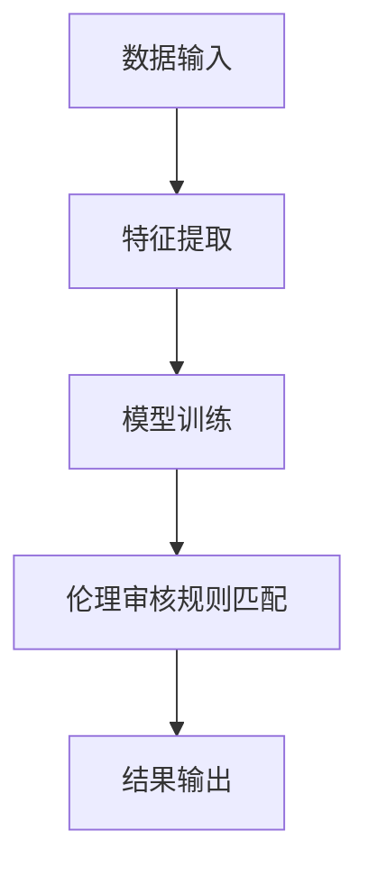
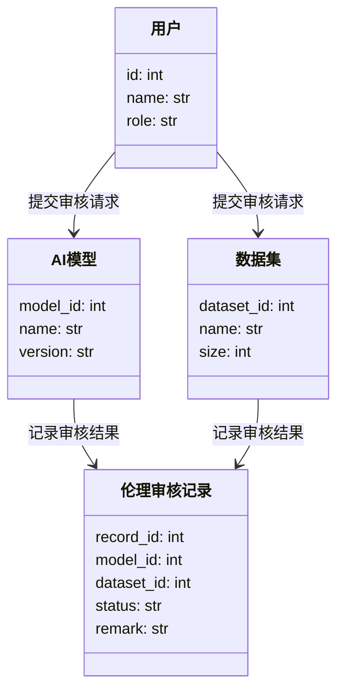
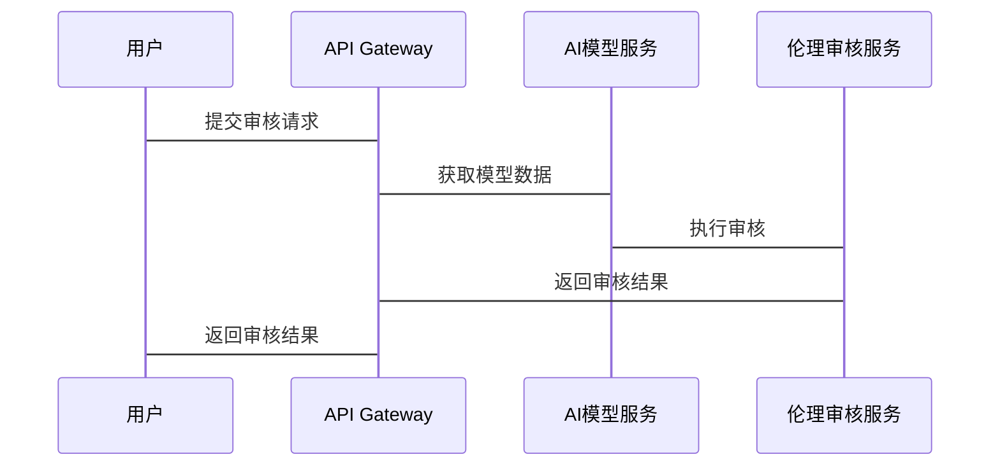

                 


# 构建企业级AI伦理审核框架：确保AI应用的公平性、透明度与可问责性

> 关键词：AI伦理审核，企业级AI应用，公平性，透明度，可问责性，AI系统设计，伦理框架

> 摘要：  
本文详细探讨了构建企业级AI伦理审核框架的核心要素，包括公平性、透明度和可问责性。通过系统化的分析和设计，结合实际案例，提出了一个完整的伦理审核框架，并从算法原理、系统架构到项目实现进行了详细阐述。本文旨在为企业级AI应用的开发者和管理者提供实用的指导，确保AI系统的伦理合规性。

---

## 第一部分: 背景与核心概念

### 第1章: 问题背景与问题描述

#### 1.1 问题背景
- **AI技术的快速发展**：AI技术在企业中的应用日益广泛，涵盖数据分析、决策支持、客户服务等多个领域。
- **企业级AI应用的伦理挑战**：AI系统的决策可能带来偏见、不透明和责任不清等问题，影响企业的声誉和合规性。
- **伦理审核框架的必要性**：为了确保AI系统的公平性、透明度和可问责性，需要建立一个系统化的伦理审核框架。

#### 1.2 问题描述
- **AI应用中的公平性问题**：AI算法可能对某些群体产生歧视性结果。
- **透明度与可解释性问题**：复杂的AI模型往往难以解释其决策过程。
- **可问责性与责任分配问题**：在AI系统出现错误时，责任归属不明确。

### 第2章: AI伦理审核框架的核心概念

#### 2.1 核心概念与属性对比
| 核心概念   | 定义与特征                          | 示例场景                                  |
|------------|------------------------------------|------------------------------------------|
| 公平性     | 确保AI系统对所有群体的公平对待     | 招聘系统中避免性别偏见                   |
| 透明度     | AI系统的决策过程可被理解和解释      | 显示贷款决策的评分依据                   |
| 可问责性   | 明确AI系统在决策中的责任归属       | 当AI系统产生错误决策时，能够追溯原因     |

#### 2.2 ER实体关系图
```mermaid
er
  actor: 用户
  role: 伦理审核角色
  entity: AI模型
  entity: 数据集
  entity: 伦理审核记录
  actor --> role: 提交审核请求
  role --> entity: 审核AI模型
  role --> entity: 审核数据集
  role --> entity: 记录审核结果
```

---

## 第二部分: 算法原理与数学模型

### 第3章: AI伦理审核算法原理

#### 3.1 算法原理


#### 3.2 数学模型与公式
- **公平性评估公式**：
  $$ P = \frac{\sum_{i=1}^{n} f(x_i)}{n} $$
  其中，$f(x_i)$ 表示第i个样本的公平性评分，$n$为样本总数。

- **透明度度量公式**：
  $$ T = \sum_{i=1}^{m} \frac{1}{d_i} $$
  其中，$d_i$ 表示第i个决策的可解释性程度，$m$为决策总数。

- **可问责性评估公式**：
  $$ A = \frac{\sum_{j=1}^{k} a_j}{k} $$
  其中，$a_j$ 表示第j个模型的可问责性评分，$k$为模型总数。

### 第4章: 算法实现与代码示例

#### 4.1 环境安装
- **Python环境配置**：安装Python 3.8或更高版本。
- **依赖库安装**：使用pip安装`mermaid`、`matplotlib`等工具。

#### 4.2 核心代码实现
- **公平性评估函数**：
  ```python
  def calculate_fairness(samples):
      total = len(samples)
      fair_sum = 0
      for sample in samples:
          fair_sum += fairness_score(sample)
      return fair_sum / total
  ```

- **透明度度量函数**：
  ```python
  def calculate_transparency(decisions):
      total = len(decisions)
      transparency_sum = 0
      for decision in decisions:
          transparency_sum += 1 / decision.explainability
      return transparency_sum / total
  ```

---

## 第三部分: 系统分析与架构设计

### 第5章: 系统分析与架构设计方案

#### 5.1 领域模型设计


#### 5.2 系统架构设计


#### 5.3 系统交互设计


---

## 第四部分: 项目实战

### 第6章: 项目实战

#### 6.1 项目介绍
- **项目名称**：企业级AI伦理审核框架
- **项目目标**：确保AI系统的公平性、透明度和可问责性。

#### 6.2 核心代码实现
- **环境安装**：
  ```bash
  pip install mermaid matplotlib
  ```

- **AI伦理审核实现**：
  ```python
  def伦理审核流程：
      1. 收集AI模型和数据集
      2. 执行公平性评估
      3. 执行透明度评估
      4. 执行可问责性评估
      5. 记录审核结果
  ```

#### 6.3 案例分析
- **案例名称**：企业招聘AI系统
- **问题描述**：招聘系统可能存在性别偏见。
- **解决方案**：通过伦理审核框架评估并消除偏见。

---

## 第五部分: 总结与展望

### 第7章: 总结与展望

#### 7.1 总结
- 本文提出了构建企业级AI伦理审核框架的完整方案，包括背景分析、核心概念、算法原理、系统架构和项目实战。

#### 7.2 展望
- 未来研究可以进一步优化伦理审核算法，探索更多AI伦理问题的解决方案。

---

## 作者：AI天才研究院（AI Genius Institute） & 禅与计算机程序设计艺术（Zen And The Art of Computer Programming）

--- 

> 版权声明：本文版权归作者所有，任何形式的转载请联系作者获得授权。

