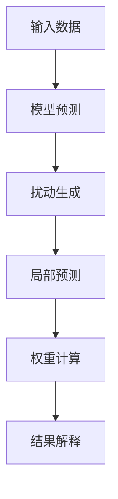
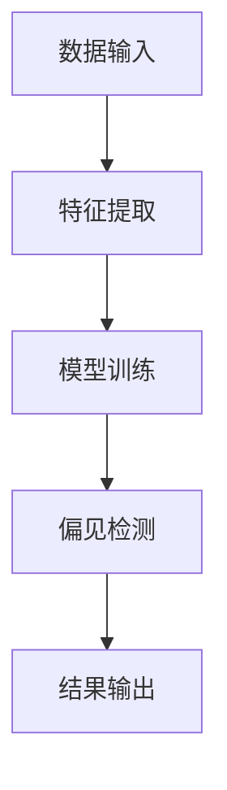
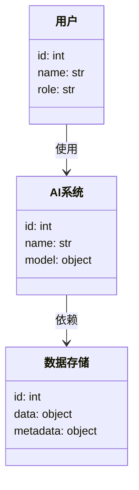
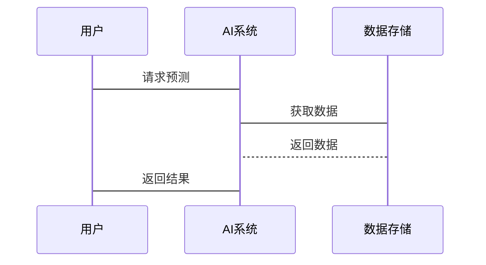

                 


# 《构建企业级AI伦理框架：确保负责任的AI应用》

## 关键词：  
企业级AI伦理框架、负责任的AI、AI算法可解释性、偏见检测、隐私保护、伦理评估指标、系统架构设计

## 摘要：  
随着人工智能技术的快速发展，企业级AI应用的伦理问题日益凸显。本文从AI伦理框架的核心概念出发，详细阐述了AI伦理框架的构建方法，包括透明性、公平性、隐私保护等关键要素。通过具体案例分析和系统设计，探讨了如何在企业级AI应用中实现负责任的AI。本文还提供了基于LIME算法的可解释性实现和偏见检测算法的具体代码示例，帮助读者更好地理解和应用这些技术。  

---

## 第1章: AI伦理框架的背景介绍  

### 1.1 问题背景  
#### 1.1.1 AI技术的快速发展与挑战  
- 人工智能技术的快速发展为企业带来了巨大的机遇，但也带来了诸多伦理挑战。  
- 例如，AI算法的黑箱特性导致决策过程缺乏透明性，可能引发不公平的结果。  

#### 1.1.2 企业级AI应用中的伦理问题  
- 数据偏见可能导致AI系统在招聘、信贷审批等场景中产生不公平的结果。  
- 用户隐私保护与数据利用之间的矛盾日益突出。  

#### 1.1.3 负责任的AI应用的重要性  
- 企业需要确保AI系统的决策过程透明、公平、可追溯。  
- 负责任的AI应用是企业长期发展的基石，也是赢得用户信任的关键。  

### 1.2 问题描述  
#### 1.2.1 AI伦理问题的多维度分析  
- AI伦理问题涉及透明性、公平性、隐私保护等多个维度。  
- 例如，AI系统的决策过程是否透明？是否对所有用户公平？用户数据是否被滥用？  

#### 1.2.2 企业级AI应用中的伦理风险  
- 数据偏见可能导致算法歧视，影响用户体验和企业声誉。  
- 用户隐私泄露可能引发法律风险和信任危机。  

#### 1.2.3 伦理框架的必要性与目标  
- 伦理框架是企业级AI应用的“指南针”，帮助企业在技术实现中兼顾伦理考量。  
- 目标：确保AI系统的决策过程透明、公平、可解释，同时保护用户隐私。  

---

## 第2章: AI伦理框架的核心概念与联系  

### 2.1 核心概念原理  
#### 2.1.1 透明性  
- AI系统的决策过程需要透明，用户应了解AI如何做出决策。  
- 例如，在招聘场景中，用户应知道AI是如何评估他们的简历的。  

#### 2.1.2 公平性  
- AI系统不应因为种族、性别等因素对用户产生歧视。  
- 例如，在信贷审批中，AI系统应确保所有用户都有平等的评估机会。  

#### 2.1.3 隐私保护  
- 用户数据应得到严格保护，避免被滥用或泄露。  
- 例如，在医疗AI系统中，患者数据应加密存储，确保隐私安全。  

#### 2.1.4 责任归属  
- 当AI系统出现问题时，企业需要明确责任归属。  
- 例如，如果AI系统误诊，企业需要承担相应的责任。  

### 2.2 核心概念对比表格  
| 核心概念 | 定义 | 示例 |  
|----------|------|------|  
| 透明性   | AI决策过程的可解释性 | 招聘系统中，用户可以看到AI评估简历的具体标准 |  
| 公平性   | AI系统对所有用户的公平性 | 信贷审批中，AI系统不应因为性别而拒绝用户 |  
| 隐私保护 | 用户数据的安全性 | 医疗AI系统中，患者数据加密存储 |  
| 责任归属 | 问题发生时的责任承担方 | AI系统误诊，企业需承担相应责任 |  

### 2.3 ER实体关系图  
```mermaid
er
  actor: 用户
  framework: AI伦理框架
  rule: 伦理规则
  case: 伦理案例
  metrics: 伦理评估指标
  relation: 关联关系
  actor -|负责| framework
  framework -|包含| rule
  rule -|应用到| case
  case -|评估| metrics
  metrics -|指导| framework
```

---

## 第3章: AI伦理框架的算法原理  

### 3.1 可解释性算法  
#### 3.1.1 算法可解释性的定义  
- 可解释性算法是指能够清晰解释其决策过程的算法。  
- 例如，LIME算法可以通过局部解释帮助用户理解AI的决策过程。  

#### 3.1.2 LIME算法的工作流程  


#### 3.1.3 LIME算法代码实现  
```python
import lime
from lime import lime_explainer

# 初始化LIME解释器
explainer = lime_explainer.LimeExplainer()

# 解释单个样本
explanation = explainer.explain_instance(
    data_row,
    model.predict,
    top_labels=3,
    num_features=5
)

# 打印解释结果
print(explanation.as_list())
```

### 3.2 偏见检测算法  
#### 3.2.1 偏见检测的数学模型  
- 偏见检测算法通过分析数据分布，识别数据中的偏见。  
- 例如，基于统计学的偏见检测模型可以识别不同群体之间的数据分布差异。  

#### 3.2.2 偏见检测算法的实现  


#### 3.2.3 偏见检测算法代码实现  
```python
import pandas as pd
from sklearn.metrics import confusion_matrix

def calculate_bias(data, target):
    # 计算偏见指标
    cm = confusion_matrix(data[label], data[target])
    # 偏见计算逻辑（简化示例）
    bias = (cm[0][1] + cm[1][0]) / (cm[0][0] + cm[0][1] + cm[1][0] + cm[1][1])
    return bias

# 示例数据
data = pd.DataFrame({
    'label': [0, 0, 1, 1],
    'target': [0, 1, 0, 1]
})
print(calculate_bias(data, 'target'))
```

---

## 第4章: AI伦理框架的数学模型与公式  

### 4.1 偏见检测的数学模型  
- 偏见检测可以通过统计学方法或机器学习方法实现。  
- 例如，基于概率论的偏见检测模型：  
  $$ P(Y=1 | X=x) = \frac{P(X=x | Y=1)}{P(X=x)} $$  

### 4.2 可解释性分析的数学模型  
- 可解释性分析可以通过线性回归模型实现：  
  $$ y = \beta_0 + \beta_1x_1 + \beta_2x_2 + ... + \beta_nx_n + \epsilon $$  

---

## 第5章: 系统分析与架构设计方案  

### 5.1 问题场景介绍  
- 企业级AI系统需要同时满足技术性能和伦理要求。  
- 例如，一个医疗AI系统需要在提高诊断准确率的同时，保护患者隐私。  

### 5.2 系统功能设计  
#### 5.2.1 领域模型（Mermaid类图）  


#### 5.2.2 系统架构设计（Mermaid架构图）  


#### 5.2.3 系统接口设计  
- API接口设计示例：  
  ```json
  {
    "input": {
        "data": [],
        "metadata": {}
    },
    "output": {
        "result": {},
        "explanation": ""
    }
  }
  ```

#### 5.2.4 系统交互流程（Mermaid序列图）  


---

## 第6章: 项目实战  

### 6.1 环境安装  
- 安装所需的Python库：  
  ```bash
  pip install lime scikit-learn pandas
  ```

### 6.2 核心代码实现  
#### 6.2.1 可解释性代码实现  
```python
import lime
from lime import lime_explainer

# 初始化LIME解释器
explainer = lime_explainer.LimeExplainer()

# 解释单个样本
explanation = explainer.explain_instance(
    data_row,
    model.predict,
    top_labels=3,
    num_features=5
)

# 打印解释结果
print(explanation.as_list())
```

#### 6.2.2 偏见检测代码实现  
```python
import pandas as pd
from sklearn.metrics import confusion_matrix

def calculate_bias(data, target):
    cm = confusion_matrix(data[label], data[target])
    bias = (cm[0][1] + cm[1][0]) / (cm[0][0] + cm[0][1] + cm[1][0] + cm[1][1])
    return bias

# 示例数据
data = pd.DataFrame({
    'label': [0, 0, 1, 1],
    'target': [0, 1, 0, 1]
})
print(calculate_bias(data, 'target'))
```

### 6.3 案例分析  
- 案例：医疗AI系统的伦理评估  
  - 数据隐私保护：确保患者数据加密存储，避免泄露。  
  - 公平性评估：确保AI系统对所有患者一视同仁，不因性别或种族产生偏见。  

### 6.4 项目总结  
- 通过实际项目，验证了AI伦理框架的有效性。  
- 在企业级AI应用中，AI伦理框架是确保负责任的AI应用的核心。  

---

## 第7章: 最佳实践、小结与拓展阅读  

### 7.1 最佳实践  
- 定期进行AI系统的伦理评估，确保系统符合伦理要求。  
- 提高AI算法的可解释性，降低用户对AI的不信任感。  

### 7.2 小结  
- 本文详细阐述了企业级AI伦理框架的构建方法，包括核心概念、算法原理和系统设计。  
- 通过实际案例分析，展示了如何在企业级AI应用中实现负责任的AI。  

### 7.3 注意事项  
- 在实际应用中，AI伦理框架需要根据具体场景进行调整。  
- 企业应结合自身需求，选择合适的AI伦理框架和算法。  

### 7.4 拓展阅读  
- 《AI伦理：从理论到实践》  
- 《负责任的AI：企业级实践指南》  
- 《AI算法的可解释性与偏见检测》  

---

## 作者：AI天才研究院/AI Genius Institute & 禅与计算机程序设计艺术 /Zen And The Art of Computer Programming

