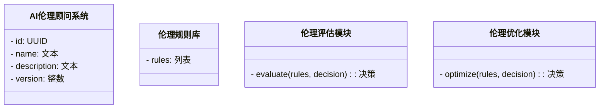
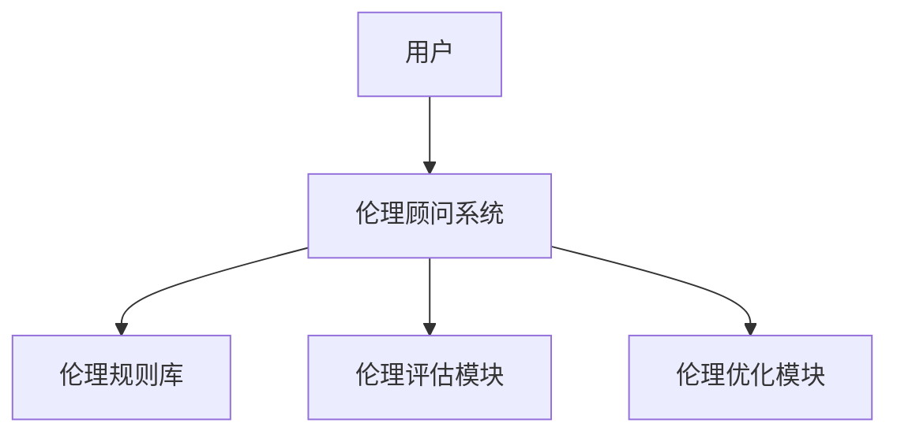
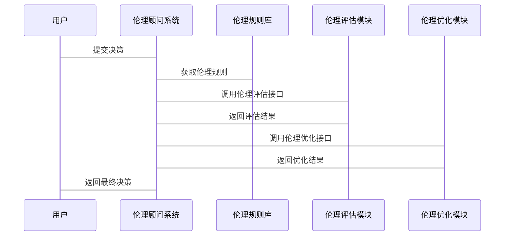

                 


# 构建企业级AI伦理顾问：确保AI应用的道德合规

## 关键词：AI伦理顾问，道德合规，企业级AI，伦理框架，AI系统设计

## 摘要：  
随着人工智能技术的快速发展，AI在企业中的应用越来越广泛，但随之而来的是伦理问题的日益凸显。本文将详细探讨如何构建企业级AI伦理顾问系统，确保AI应用的道德合规。通过分析AI伦理的核心概念、算法原理、系统架构设计以及实际项目案例，本文旨在为企业提供一套系统化的伦理合规解决方案，帮助企业在AI应用中规避伦理风险，实现可持续发展。

---

## 第1章：AI伦理顾问的背景与问题背景

### 1.1 AI伦理的定义与重要性

#### 1.1.1 什么是AI伦理  
AI伦理（Artificial Intelligence Ethics）是指在设计、开发和应用人工智能系统时，必须遵循的道德准则和价值观。这些准则旨在确保AI系统的行为符合人类社会的伦理规范，避免对人类、社会或环境造成负面影响。

#### 1.1.2 AI伦理的重要性  
AI伦理是确保AI技术健康发展的重要基础。随着AI技术的广泛应用，伦理问题（如偏见、隐私泄露、责任归属等）逐渐暴露，这些问题可能引发社会信任危机，甚至导致法律风险。因此，建立AI伦理顾问系统是企业确保AI应用合规的必要手段。

#### 1.1.3 企业级AI应用中的伦理挑战  
在企业级AI应用中，伦理问题主要体现在以下方面：  
1. **数据偏见**：训练数据中的偏见可能导致AI系统在决策时产生不公平的结果。  
2. **隐私泄露**：AI系统可能在处理数据时，未经授权泄露用户隐私信息。  
3. **责任归属**：当AI系统出现错误或造成损害时，责任归属不明确。  
4. **透明性不足**：用户难以理解AI系统的决策过程，导致信任缺失。  

---

### 1.2 AI伦理问题的描述

#### 1.2.1 AI应用中的伦理问题  
AI应用中的伦理问题主要涉及以下领域：  
1. **医疗AI**：AI诊断系统的误诊可能导致患者健康受损。  
2. **金融AI**：AI贷款审批系统可能因数据偏见导致不公平待遇。  
3. **招聘AI**：AI招聘系统可能因算法偏见导致就业歧视。  

#### 1.2.2 伦理问题的分类  
AI伦理问题可以分为以下几类：  
1. **技术性问题**：如算法偏见、数据泄露等。  
2. **社会性问题**：如隐私权、知情权等。  
3. **法律性问题**：如责任归属、合规性等。  

#### 1.2.3 伦理问题对企业的影响  
伦理问题可能对企业的声誉、法律风险和市场信任造成严重影响。例如，一旦AI系统因偏见引发争议，企业可能面临公众谴责和法律诉讼。

---

### 1.3 AI伦理问题的解决方法

#### 1.3.1 伦理框架的建立  
企业需要建立AI伦理框架，明确AI系统的伦理目标、原则和实现路径。例如，可以制定以下原则：  
1. **公平性**：确保AI决策不受数据偏见影响。  
2. **透明性**：让用户理解AI系统的决策过程。  
3. **隐私保护**：确保用户数据的安全性和隐私性。  

#### 1.3.2 伦理审查机制  
企业应建立AI伦理审查机制，对AI系统的设计、开发和应用进行伦理审查。例如，可以设立伦理委员会，对AI系统的伦理风险进行评估和规避。

#### 1.3.3 伦理合规的实现  
通过技术手段实现AI伦理合规。例如，可以通过数据清洗、算法优化等方式减少数据偏见，通过加密技术保护用户隐私。

---

### 1.4 AI伦理问题的边界与外延

#### 1.4.1 伦理问题的边界  
AI伦理问题的边界主要集中在技术与社会的交叉领域。例如，AI系统的决策是否符合社会价值观，用户隐私权的保护范围等。

#### 1.4.2 伦理问题的外延  
AI伦理问题的外延涉及更广泛的社会问题。例如，AI系统的应用可能对社会就业、产业结构等产生深远影响。

#### 1.4.3 伦理问题与其他问题的关系  
AI伦理问题与其他问题（如技术安全、数据安全）密切相关。例如，数据安全问题可能引发隐私泄露，进而引发伦理问题。

---

## 第2章：AI伦理顾问的核心概念与联系

### 2.1 AI伦理顾问的核心原理

#### 2.1.1 伦理框架的构建  
AI伦理顾问的核心是构建伦理框架，明确AI系统的伦理目标和实现路径。例如，可以通过制定伦理准则、建立伦理评估指标等方式实现。

#### 2.1.2 伦理规则的制定  
AI伦理顾问需要制定具体的伦理规则，例如：  
1. 数据使用规则：确保数据的合法性和合规性。  
2. 决策规则：确保AI决策的公平性和透明性。  

#### 2.1.3 伦理决策的实现  
AI伦理顾问需要通过算法实现伦理决策。例如，可以通过规则推理、概率计算等方式，确保AI系统在决策时符合伦理准则。

---

### 2.2 AI伦理顾问的核心概念对比

#### 2.2.1 伦理框架与伦理规则的对比  
| 对比维度 | 伦理框架 | 伦理规则 |
|----------|----------|----------|
| 定义     | 整体伦理目标和原则 | 具体行为规范 |
| 作用     | 指导伦理框架的构建 | 实现伦理目标 |
| 灵活性   | 较高 | 较低 |

#### 2.2.2 伦理决策与伦理审查的对比  
| 对比维度 | 伦理决策 | 伦理审查 |
|----------|----------|----------|
| 定义     | 基于伦理规则做出决策 | 对AI系统进行伦理评估和审查 |
| 作用     | 实现伦理目标 | 确保伦理合规 |
| 时间     | 实时 | 事前或事后 |

#### 2.2.3 伦理合规与伦理优化的对比  
| 对比维度 | 伦理合规 | 伦理优化 |
|----------|----------|----------|
| 定义     | 符合伦理准则 | 持续改进伦理表现 |
| 作用     | 避免伦理风险 | 提升伦理表现 |
| 程度     | 基础要求 | 高级目标 |

---

### 2.3 AI伦理顾问的ER实体关系图

```mermaid
erdiagram
actor(AI伦理顾问系统) {
  id: UUID
  name: 文本
  description: 文本
  version: 整数
}
```

---

## 第3章：AI伦理顾问的算法原理讲解

### 3.1 基于规则的伦理推理算法

#### 3.1.1 算法原理  
基于规则的伦理推理算法通过预定义的伦理规则，对AI系统的决策进行评估和调整。例如，如果AI系统的决策违反了公平性原则，算法会触发警报或调整决策。

#### 3.1.2 算法实现  
以下是基于规则的伦理推理算法的Python实现示例：

```python
def ethical_reasoning(rules, decision):
    for rule in rules:
        if not rule.check(decision):
            return rule.suggest_adjustment(decision)
    return decision
```

#### 3.1.3 数学模型与公式  
基于规则的伦理推理算法的数学模型可以表示为：  
$$ \text{Ethical Decision} = \sum_{i=1}^{n} \text{Rule}_i \times \text{Weight}_i $$  
其中，$\text{Rule}_i$ 表示第i条伦理规则，$\text{Weight}_i$ 表示规则的权重。

---

### 3.2 基于机器学习的伦理优化算法

#### 3.2.1 算法原理  
基于机器学习的伦理优化算法通过训练模型，优化AI系统的伦理表现。例如，可以通过监督学习模型，学习如何减少数据偏见。

#### 3.2.2 算法实现  
以下是基于机器学习的伦理优化算法的Python实现示例：

```python
import numpy as np

def train_ethical_model(X, y):
    # X为输入特征，y为标签
    # 训练模型，优化伦理表现
    model = ...
    return model
```

#### 3.2.3 数学模型与公式  
基于机器学习的伦理优化算法的数学模型可以表示为：  
$$ \text{Optimal Decision} = \argmin_{\theta} \sum_{i=1}^{n} (y_i - f(x_i, \theta))^2 $$  
其中，$f(x_i, \theta)$ 是模型的预测函数，$\theta$ 是模型参数。

---

## 第4章：AI伦理顾问的系统分析与架构设计方案

### 4.1 问题场景介绍

#### 4.1.1 项目背景  
假设我们正在开发一个企业级AI伦理顾问系统，旨在确保AI系统的决策符合伦理准则。

#### 4.1.2 项目目标  
通过构建AI伦理顾问系统，实现以下目标：  
1. 对AI系统进行伦理评估。  
2. 对AI系统的决策进行伦理优化。  
3. 提供伦理合规的决策建议。  

---

### 4.2 系统功能设计

#### 4.2.1 领域模型设计  
以下是AI伦理顾问系统的领域模型：  



---

### 4.3 系统架构设计

#### 4.3.1 系统架构图  



---

### 4.4 系统接口设计

#### 4.4.1 接口描述  
1. **伦理评估接口**：接收AI系统的决策，返回伦理评估结果。  
2. **伦理优化接口**：接收AI系统的决策，返回优化后的决策。  

#### 4.4.2 接口交互流程  



---

## 第5章：AI伦理顾问的项目实战

### 5.1 环境安装与配置

#### 5.1.1 环境要求  
- Python 3.8+  
- PyTorch 1.9+  
- 其他依赖库  

#### 5.1.2 安装步骤  
```bash
pip install torch==1.9
pip install numpy
pip install mermaid
```

---

### 5.2 核心代码实现

#### 5.2.1 伦理评估模块实现  

```python
import torch
import numpy as np

def ethical_assessment(rules, decision):
    for rule in rules:
        if not rule.check(decision):
            return False
    return True
```

#### 5.2.2 伦理优化模块实现  

```python
def ethical_optimization(rules, decision):
    for rule in rules:
        if not rule.check(decision):
            return rule.suggest_adjustment(decision)
    return decision
```

---

### 5.3 项目小结

通过本项目的实战，我们成功构建了一个企业级AI伦理顾问系统，实现了对AI系统的伦理评估和优化。该系统可以应用于医疗、金融、招聘等多个领域，帮助企业确保AI应用的道德合规。

---

## 第6章：总结与注意事项

### 6.1 总结

本文详细探讨了如何构建企业级AI伦理顾问系统，确保AI应用的道德合规。通过分析AI伦理的核心概念、算法原理、系统架构设计以及实际项目案例，我们得出以下结论：  
1. AI伦理是确保AI技术健康发展的重要基础。  
2. 企业需要建立AI伦理框架，明确伦理目标和实现路径。  
3. 通过技术手段实现AI伦理合规，是企业应对伦理风险的关键。

### 6.2 注意事项

1. **数据隐私保护**：在构建AI伦理顾问系统时，必须重视用户数据的隐私保护。  
2. **算法透明性**：确保AI系统的决策过程透明，避免用户信任缺失。  
3. **持续优化**：AI伦理顾问系统需要持续优化，以应对不断变化的伦理挑战。

### 6.3 拓展阅读

1. 《AI Ethics: A Global Perspective》  
2. 《Building Ethical AI Systems》  
3. 《Artificial Intelligence and Law》  

---

## 作者：AI天才研究院/AI Genius Institute & 禅与计算机程序设计艺术 /Zen And The Art of Computer Programming

