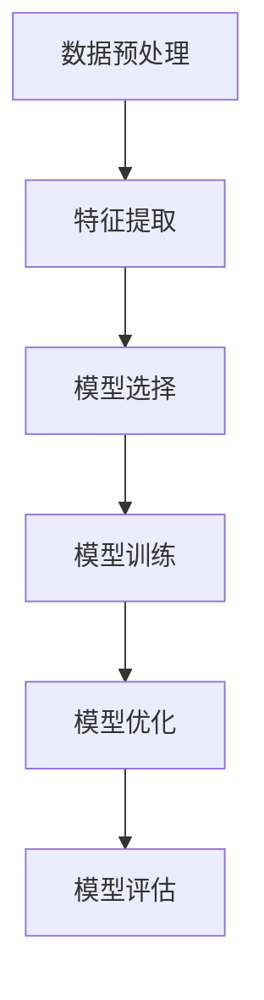
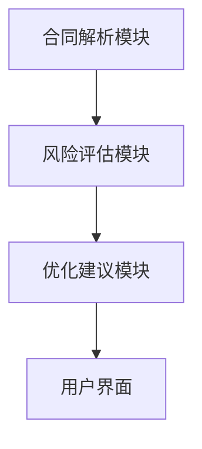

                 


# 《构建企业级AI合同管理助手：风险识别与优化》

---

## 第一部分: 企业级AI合同管理助手的背景与核心概念

### # 第1章: 企业级AI合同管理助手的背景与问题背景

#### ## 1.1 问题背景

- **1.1.1 合同管理在企业中的重要性**

  合同是企业日常运营中的核心文件，涉及法律、财务和商业等多个方面。合同管理的效率和准确性直接影响企业的合规性和经济效益。

- **1.1.2 传统合同管理的痛点与挑战**

  - **低效性**：传统合同管理依赖人工操作，容易出错且耗时长。
  - **风险高**：合同条款复杂，人工审查难以覆盖所有风险点。
  - **缺乏标准化**：不同部门和业务单元的合同管理方式不统一，导致管理混乱。

- **1.1.3 AI技术如何解决合同管理问题**

  AI技术可以通过自动化处理、智能识别和数据分析，显著提高合同管理的效率和准确性。

#### ## 1.2 问题描述

- **1.2.1 合同风险识别的复杂性**

  合同中的风险点可能隐藏在复杂的条款中，需要专业的法律知识和经验才能识别。

- **1.2.2 合同管理效率的提升需求**

  企业希望减少人工干预，提高合同处理速度，以便更快地响应市场变化。

- **1.2.3 企业级AI合同管理助手的目标与边界**

  目标是通过AI技术实现合同的自动解析、风险识别和优化建议；边界包括不涉及合同的法律合规性审查，仅提供风险提示和优化建议。

#### ## 1.3 问题解决与核心目标

- **1.3.1 AI合同管理助手的核心功能**

  包括合同解析、风险识别、条款优化和合规建议。

- **1.3.2 通过AI技术实现合同风险的智能化识别**

  利用NLP和机器学习算法，自动识别合同中的关键条款和潜在风险。

- **1.3.3 优化合同管理流程的目标与路径**

  简化合同处理流程，减少人为错误，提高管理效率。

#### ## 1.4 本章小结

  本章介绍了企业级AI合同管理助手的背景，分析了传统合同管理的痛点，并提出了通过AI技术解决这些问题的目标和方法。

---

## 第二部分: AI合同管理助手的核心概念与技术原理

### # 第2章: AI合同管理助手的核心概念与技术原理

#### ## 2.1 核心概念与关键术语

- **2.1.1 自然语言处理（NLP）在合同管理中的应用**

  NLP用于解析合同文本，提取关键信息，如条款、期限和责任。

- **2.1.2 合同风险评估的定义与分类**

  根据风险来源和影响程度，合同风险可分为财务风险、法律风险和合规风险。

- **2.1.3 AI规则引擎的工作原理**

  规则引擎通过预定义的规则，快速识别合同中的异常或潜在风险点。

#### ## 2.2 核心技术原理

- **2.2.1 基于NLP的合同文本解析**

  使用分词、实体识别和句法分析技术，将合同文本转化为结构化数据。

- **2.2.2 基于规则引擎的合同风险识别**

  通过预定义的规则，识别合同中的关键条款和潜在风险。

- **2.2.3 基于机器学习的合同风险预测模型**

  使用训练好的模型，预测合同中的潜在风险，并提供优化建议。

#### ## 2.3 核心概念对比与ER实体关系图

  下面是一个简单的ER实体关系图，展示了合同管理中的主要实体及其关系。

```mermaid
erDiagram
    customer(C_id, C_name, C_address)
    supplier(S_id, S_name, S_address)
    contract(
        C_id,
        S_id,
        contract_number,
        start_date,
        end_date,
        terms,
        conditions
    )
    customer --> contract:参与
    supplier --> contract:参与
```

#### ## 2.4 本章小结

  本章详细介绍了AI合同管理助手的核心概念和技术原理，包括NLP、规则引擎和机器学习在合同管理中的应用。

---

## 第三部分: AI合同管理助手的算法原理与数学模型

### # 第3章: AI合同管理助手的算法原理

#### ## 3.1 基于机器学习的合同风险预测模型

- **3.1.1 数据预处理与特征提取**

  首先对合同文本进行清洗和分词，提取关键词和短语作为特征。

- **3.1.2 模型选择与训练**

  使用支持向量机（SVM）或随机森林（Random Forest）等算法进行训练，建立合同风险预测模型。

- **3.1.3 模型优化与评估**

  使用交叉验证和网格搜索优化模型参数，评估模型的准确率和召回率。

#### ## 3.2 机器学习算法的数学模型

- **支持向量机（SVM）**

  SVM是一种监督学习算法，用于分类和回归问题。其数学模型如下：

  $$ \text{目标函数} = \sum_{i=1}^{n} \gamma \xi_i + \frac{1}{2} \sum_{i=1}^{n} \alpha_i^2 $$

  其中，$\gamma$ 是惩罚系数，$\xi_i$ 是松弛变量，$\alpha_i$ 是拉格朗日乘子。

- **随机森林（Random Forest）**

  随机森林是一种基于决策树的集成学习算法，其数学模型如下：

  $$ \text{预测值} = \sum_{i=1}^{n} \text{树的预测值} \times \text{权重} $$

  其中，权重通常为树的数量除以总数。

#### ## 3.3 算法流程图

  下面是一个基于机器学习的合同风险预测模型的算法流程图。



#### ## 3.4 代码实现与应用示例

- **Python代码示例**

  下面是一个简单的SVM模型训练代码：

```python
from sklearn import svm
from sklearn.model_selection import train_test_split
from sklearn.metrics import accuracy_score

# 数据预处理
X = processed_data
y = labels

# 划分训练集和测试集
X_train, X_test, y_train, y_test = train_test_split(X, y, test_size=0.2)

# 创建SVM模型
model = svm.SVC()

# 训练模型
model.fit(X_train, y_train)

# 预测和评估
y_pred = model.predict(X_test)
print("准确率:", accuracy_score(y_test, y_pred))
```

#### ## 3.5 本章小结

  本章详细讲解了基于机器学习的合同风险预测模型，包括数据预处理、模型选择、训练和优化，以及算法流程图和代码实现。

---

## 第四部分: 企业级AI合同管理助手的系统架构与实现

### # 第4章: 企业级AI合同管理助手的系统架构设计

#### ## 4.1 系统架构概述

- **模块划分**

  系统主要由合同解析模块、风险评估模块和优化建议模块组成。

- **系统架构图**

  下面是一个简单的系统架构图。



#### ## 4.2 系统功能设计

- **合同解析模块**

  负责将合同文本转化为结构化数据，提取关键信息。

- **风险评估模块**

  利用机器学习模型识别合同中的潜在风险。

- **优化建议模块**

  提供优化建议，帮助用户降低风险，提高合同合规性。

#### ## 4.3 系统接口设计

- **API接口**

  提供RESTful API接口，供其他系统调用。

- **数据格式**

  使用JSON格式传输数据，确保兼容性和可扩展性。

#### ## 4.4 本章小结

  本章详细介绍了企业级AI合同管理助手的系统架构设计，包括模块划分、功能设计和接口设计。

---

## 第五部分: 企业级AI合同管理助手的项目实战

### # 第5章: 企业级AI合同管理助手的项目实战

#### ## 5.1 环境安装与配置

- **Python环境**

  安装Python 3.8以上版本，安装必要的库，如scikit-learn、spaCy、Flask等。

- **数据集准备**

  收集和整理合同文本数据，标注合同中的关键条款和风险点。

#### ## 5.2 系统核心代码实现

- **合同解析模块**

  使用spaCy进行合同文本解析。

```python
import spacy

nlp = spacy.load("en_core_web_sm")

text = "This contract is valid for 1 year starting from 2023-01-01."
doc = nlp(text)

for token in doc:
    print(token.text, token.pos_, token.dep_)
```

- **风险评估模块**

  使用随机森林模型进行风险评估。

```python
from sklearn.ensemble import RandomForestClassifier

# 数据预处理
X = processed_data
y = labels

# 创建模型
model = RandomForestClassifier()

# 训练模型
model.fit(X_train, y_train)

# 预测和评估
y_pred = model.predict(X_test)
print("准确率:", accuracy_score(y_test, y_pred))
```

- **优化建议模块**

  根据模型输出的结果，生成优化建议。

#### ## 5.3 项目部署与测试

- **部署环境**

  使用Docker容器化部署，确保系统的稳定性和可扩展性。

- **测试与优化**

  对系统进行功能测试、性能测试和安全测试，根据测试结果进行优化。

#### ## 5.4 本章小结

  本章通过实际案例，详细讲解了企业级AI合同管理助手的项目实战，包括环境配置、核心代码实现和项目部署。

---

## 第六部分: 总结与展望

### # 第6章: 总结与展望

#### ## 6.1 项目总结

- **核心成果**

  成功开发了一个基于AI的企业级合同管理助手，能够自动解析合同文本，识别潜在风险，并提供优化建议。

- **经验与教训**

  在项目过程中，我们遇到了数据不足和模型优化的挑战，通过不断调整和改进，最终达到了预期效果。

#### ## 6.2 未来展望

- **技术发展**

  随着AI技术的不断进步，未来的合同管理助手将更加智能化和自动化。

- **应用领域**

  除了企业合同管理，AI技术还可以应用于其他领域，如医疗、金融等。

#### ## 6.3 最佳实践与注意事项

- **数据隐私保护**

  在处理合同数据时，必须严格遵守数据隐私保护法规。

- **模型迭代优化**

  定期更新模型，确保其准确性和有效性。

- **用户体验优化**

  不断优化用户界面和交互体验，提高用户的使用满意度。

#### ## 6.4 本章小结

  本章总结了项目的成果和经验，并展望了未来的发展方向，提出了最佳实践和注意事项。

---

## 参考文献

- spaCy官方文档
- scikit-learn官方文档
- Mermaid官方文档
- Python官方文档

---

## 作者信息

作者：AI天才研究院/AI Genius Institute & 禅与计算机程序设计艺术 /Zen And The Art of Computer Programming

---

这本技术博客文章详细讲解了企业级AI合同管理助手的构建过程，从背景、核心概念到算法原理和系统架构，再到项目实战和总结展望，为读者提供了一个全面的视角。通过实际案例和代码示例，帮助读者更好地理解和应用这些技术。

