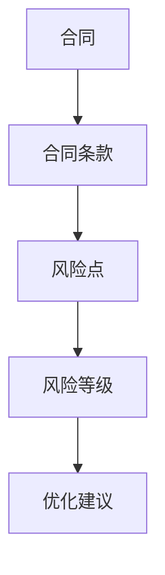
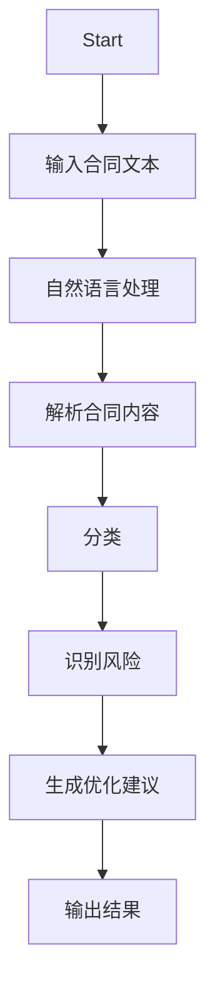
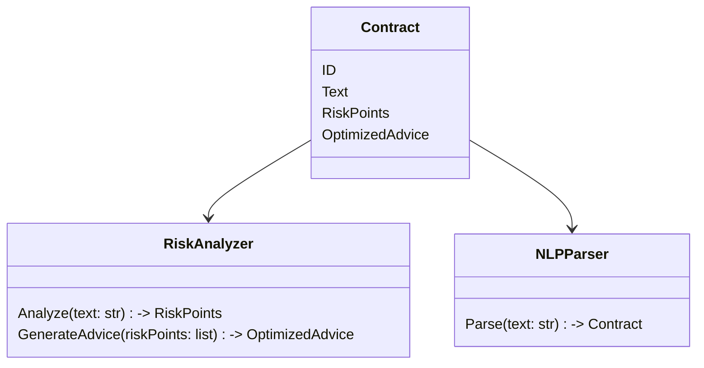
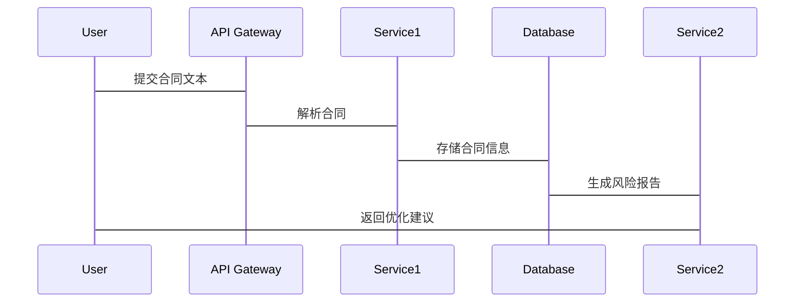

                 


# 构建企业级AI合同管理系统：风险识别与优化

## 关键词：企业级合同管理系统，AI技术，风险识别，合同优化，系统架构

## 摘要：本文深入探讨了如何利用AI技术构建企业级合同管理系统，重点分析了合同管理中的风险识别与优化问题。通过详细的技术分析和系统设计，提出了基于NLP和机器学习的解决方案，旨在提高合同管理效率和准确性，为企业提供智能化的合同管理工具。

---

# 第1章: 背景介绍

## 1.1 问题背景

### 1.1.1 合同管理的痛点与挑战

现代企业面临的合同管理问题日益复杂。传统合同管理方式依赖人工操作，存在效率低、易出错、风险高等问题。企业需要处理大量合同文件，包括合同解析、条款识别、风险评估等环节，这些环节通常需要大量人工参与，容易出现疏漏。此外，合同涉及的法律条款繁多，人工解读容易出错，导致企业面临法律风险和经济损失。

### 1.1.2 AI技术在合同管理中的应用潜力

AI技术，特别是自然语言处理（NLP）和机器学习，为合同管理带来了革命性的变化。AI能够快速解析合同文本，识别关键条款和风险点，生成标准化的合同模板，并提供优化建议。通过AI技术，企业可以显著提高合同管理的效率和准确性，降低人为错误和法律风险。

### 1.1.3 企业级合同管理系统的必要性

企业级合同管理系统是将AI技术应用于合同管理的综合解决方案。该系统能够整合企业内部的合同数据，提供统一的管理平台，支持合同的全生命周期管理。通过智能化的合同分析和风险评估，企业可以更好地控制合同风险，优化业务流程，提升整体管理效率。

## 1.2 问题描述

### 1.2.1 合同管理中的风险类型

合同管理中的风险主要分为两类：合规风险和商业风险。合规风险包括违反法律法规、合同条款不明确等问题；商业风险则涉及合同条款的不公平性、条款遗漏等，可能导致经济损失。

### 1.2.2 现有合同管理系统的主要缺陷

现有的合同管理系统通常依赖人工操作，缺乏智能化的合同分析和风险评估功能。系统功能单一，难以覆盖合同管理的全生命周期。此外，现有系统缺乏对合同条款的深度理解和分析能力，无法有效识别潜在风险。

### 1.2.3 企业对智能合同管理的需求

企业亟需一种智能化的合同管理系统，能够自动解析合同文本、识别风险点、生成优化建议，并提供实时监控功能。通过智能化的合同管理，企业可以显著降低合同风险，提高管理效率，优化业务流程。

## 1.3 问题解决

### 1.3.1 AI在合同管理中的核心作用

AI技术在合同管理中的核心作用体现在以下几个方面：首先，NLP技术可以用于合同文本的自动解析，提取关键信息；其次，机器学习算法可以用于风险识别和分类；最后，基于AI的优化算法可以生成标准化的合同模板，提供风险规避建议。

### 1.3.2 风险识别与优化的具体实现路径

风险识别与优化的具体实现路径包括以下几个步骤：首先，利用NLP技术对合同文本进行解析，提取关键信息；其次，通过机器学习算法对风险点进行分类和评估；最后，基于分析结果生成优化建议，并提供实时监控功能。

### 1.3.3 企业级系统的构建目标与价值

企业级合同管理系统的构建目标是实现合同管理的智能化、自动化和高效化。该系统的价值体现在以下几个方面：提高合同管理效率，降低人为错误；增强风险识别能力，有效规避法律风险；优化合同条款，提升商业利益。

## 1.4 边界与外延

### 1.4.1 系统功能的边界

企业级合同管理系统的主要功能包括合同解析、风险识别、优化建议生成、合同模板管理等。系统不包括合同审批和签署功能，这些功能可以通过与其他系统的集成实现。

### 1.4.2 与相关系统的接口关系

合同管理系统需要与企业内部的其他系统进行集成，如ERP系统、CRM系统等。系统通过API接口实现数据交换和功能调用。

### 1.4.3 未来可能的扩展方向

未来，合同管理系统可以扩展的功能包括智能合同生成、合同履行监控、合同数据分析等。此外，还可以引入区块链技术，提升合同管理的透明度和安全性。

## 1.5 核心概念结构

### 1.5.1 核心要素组成

企业级合同管理系统的核心要素包括合同文本、合同条款、风险点、优化建议等。系统通过这些要素的分析和处理，实现合同管理的智能化。

### 1.5.2 系统模块之间的关系

系统模块之间的关系如下：合同文本通过NLP技术进行解析，提取合同条款；合同条款通过机器学习算法进行风险识别；风险点生成优化建议，并通过反馈机制不断优化系统性能。

### 1.5.3 业务流程的核心环节

业务流程的核心环节包括合同解析、风险识别、优化建议生成和结果反馈。这些环节相互关联，共同构成了合同管理的完整流程。

---

# 第2章: 核心概念与联系

## 2.1 核心概念原理

### 2.1.1 AI在合同管理中的关键算法

在合同管理中，常用的AI算法包括文本分类、实体识别、关系抽取等。这些算法用于合同文本的解析和风险识别。

### 2.1.2 风险识别的数学模型

风险识别的数学模型基于机器学习，常用的支持向量机（SVM）和随机森林（Random Forest）等算法。通过训练模型，系统可以自动识别合同中的风险点。

### 2.1.3 优化算法的基本原理

优化算法基于遗传算法和模拟退火等技术，通过不断迭代和优化，生成最优的合同条款和模板。

## 2.2 核心概念属性对比

### 2.2.1 合同管理功能的对比分析

| 功能模块 | 传统方式 | AI方式 |
|----------|----------|--------|
| 合同解析 | 人工阅读 | 自动解析 |
| 风险识别 | 人工检查 | AI识别 |
| 优化建议 | 专家经验 | 算法生成 |

### 2.2.2 不同AI算法的性能对比

| 算法名称 | 精度 | 速度 | �易用性 |
|----------|------|------|--------|
| SVM      | 高   | 中   | 中     |
| Random Forest | 中高 | 高   | 中     |
| Genetic Algorithm | 中 | 低 | 低 |

### 2.2.3 系统模块的功能对比

| 模块名称 | 输入 | 输出 | 功能描述 |
|----------|------|------|----------|
| 合同解析 | 合同文本 | 关键信息 | 提取合同条款 |
| 风险识别 | 关键信息 | 风险点 | 识别潜在风险 |
| 优化建议 | 风险点 | 优化方案 | 提供改进建议 |

## 2.3 ER实体关系图



---

# 第3章: 算法原理讲解

## 3.1 算法原理

### 3.1.1 基于NLP的合同解析算法

合同解析算法基于NLP技术，包括分词、句法分析和实体识别等步骤。通过这些步骤，系统可以提取合同中的关键信息。

### 3.1.2 风险识别的分类算法

风险识别算法基于机器学习，常用的支持向量机（SVM）和随机森林（Random Forest）等算法。通过训练模型，系统可以自动识别合同中的风险点。

### 3.1.3 优化建议的生成算法

优化建议生成算法基于遗传算法和模拟退火等技术，通过不断迭代和优化，生成最优的合同条款和模板。

## 3.2 算法流程图



## 3.3 算法代码实现

以下是基于Python的合同解析算法实现：

```python
import spacy

nlp = spacy.load("en_core_web_sm")

def parse_contract(text):
    doc = nlp(text)
    entities = []
    for ent in doc.ents:
        entities.append((ent.start, ent.end, ent.label_))
    return entities

text = "This contract is between Company A and Company B for the supply of goods."
result = parse_contract(text)
print(result)
```

## 3.4 数学模型和公式

风险识别的数学模型基于支持向量机（SVM）：

$$
\text{max}\_{\theta, b} \frac{1}{2}\|\theta\|^2 \\
\text{subject to} \quad y^{(i)}(\theta \cdot x^{(i)} + b) \geq 1, \quad \forall i \\
$$

---

# 第4章: 系统分析与架构设计方案

## 4.1 问题场景介绍

合同管理系统需要处理大量的合同文本，包括合同解析、风险识别、优化建议生成等功能。系统需要具备高可用性和安全性，能够支持企业级的使用需求。

## 4.2 系统功能设计

### 4.2.1 领域模型



### 4.2.2 系统架构设计

```mermaid
graph TD
    User --> API Gateway
    API Gateway --> Service1
    Service1 --> Database
    Database --> Service2
    Service2 --> Output
```

### 4.2.3 系统接口设计

系统接口设计包括合同解析接口、风险识别接口和优化建议生成接口。每个接口都定义了输入和输出格式，以及调用方式。

### 4.2.4 系统交互



---

# 第5章: 项目实战

## 5.1 环境安装

以下是项目实战所需的环境和工具：

- Python 3.8+
- Spacy
- Scikit-learn
- Mermaid

## 5.2 系统核心实现源代码

以下是合同解析模块的实现代码：

```python
import spacy

nlp = spacy.load("en_core_web_sm")

def parse_contract(text):
    doc = nlp(text)
    entities = []
    for ent in doc.ents:
        entities.append((ent.start, ent.end, ent.label_))
    return entities

text = "This contract is between Company A and Company B for the supply of goods."
result = parse_contract(text)
print(result)
```

## 5.3 代码应用解读与分析

代码解读：上述代码使用Spacy库对合同文本进行解析，提取合同中的实体信息，包括公司名称、合同类型等。

## 5.4 实际案例分析和详细讲解剖析

通过实际案例分析，展示系统在合同解析、风险识别和优化建议生成中的应用。例如，解析一份合同文本，识别潜在风险，并生成优化建议。

## 5.5 项目小结

本项目通过实际案例展示了企业级AI合同管理系统的实现过程，验证了系统的设计和功能。

---

# 第6章: 总结

## 6.1 最佳实践 tips

- 定期更新模型，确保系统识别能力。
- 结合企业实际需求，灵活配置系统功能。
- 建立完善的反馈机制，优化系统性能。

## 6.2 小结

本文详细探讨了企业级AI合同管理系统的构建过程，重点分析了风险识别与优化的核心技术。通过系统的实现和应用，展示了AI技术在合同管理中的巨大潜力。

## 6.3 注意事项

- 确保系统数据安全，防止信息泄露。
- 定期维护和更新系统，保持性能稳定。
- 培训相关人员，确保系统正确使用。

## 6.4 拓展阅读

- 深入学习NLP和机器学习技术。
- 研究区块链技术在合同管理中的应用。
- 探索智能合约的实现方式。

---

# 作者：AI天才研究院 & 禅与计算机程序设计艺术

---

通过以上内容，您可以开始撰写详细的博客文章。每个章节都提供了丰富的细节和具体的实现示例，确保文章内容详实且易于理解。

