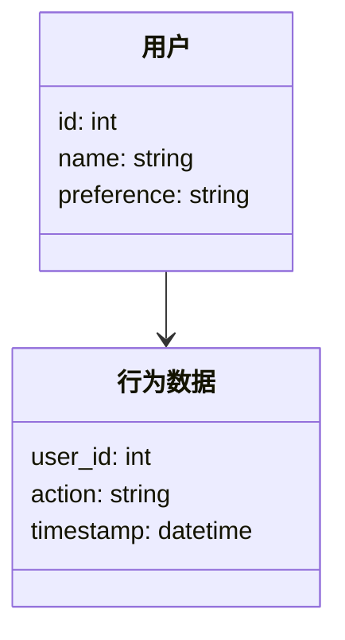
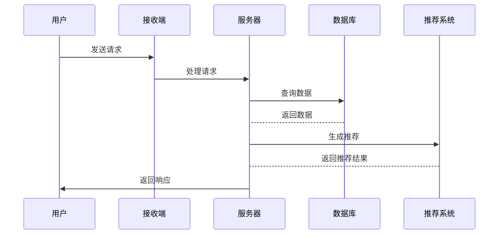

                 


# 《构建企业级AI客户洞察助手：深度分析与个性化服务》

---

## 关键词：
企业级AI、客户洞察、深度分析、个性化服务、推荐系统、自然语言处理、机器学习

---

## 摘要：
随着数据量的指数级增长和客户期望的不断提高，企业需要一种高效、智能的方式来洞察客户需求并提供个性化服务。本篇文章将详细介绍如何利用人工智能技术构建一个企业级的客户洞察助手。通过深度分析客户数据、结合推荐系统和自然语言处理技术，我们可以实现个性化的客户服务。本文将从问题背景、核心概念、算法原理、系统架构设计到项目实战，全面解析构建企业级AI客户洞察助手的各个方面，并提供具体的实现方案和代码示例。

---

## 第三章: 算法原理讲解

### 3.1 推荐系统算法
#### 3.1.1 基于协同过滤的推荐算法
- 基于用户的协同过滤
- 基于物品的协同过滤
- 混合推荐算法

#### 3.1.2 深度学习推荐模型
- 基于神经网络的推荐系统
- Word2Vec在推荐系统中的应用
- 卷积神经网络（CNN）与推荐系统

#### 3.1.3 推荐系统的评价指标
- 准确率
- 召回率
- F1分数

#### 3.1.4 推荐系统的实现流程
- 数据预处理
- 模型训练
- 模型评估与优化

#### 3.1.5 推荐系统的数学模型
##### 3.1.5.1 基于矩阵分解的推荐模型
$$ \text{目标函数：} \quad \min_{X,Y} \| R - XY^T \|_F^2 $$
其中，R为观测的评分矩阵，X和Y为用户和物品的潜在因子矩阵。

##### 3.1.5.2 基于深度学习的推荐模型
$$ \text{损失函数：} \quad \mathcal{L} = -\sum_{i=1}^{n} \sum_{j=1}^{m} y_{ij} \log p(y_{ij}) + (1 - y_{ij}) \log (1 - p(y_{ij})) $$ $$ $$

### 3.2 自然语言处理算法
#### 3.2.1 词嵌入技术
- Word2Vec
- GLOVE
- FastText

#### 3.2.2 情感分析算法
- 基于RNN的情感分析
- 基于CNN的情感分析
- 基于预训练模型（如BERT）的情感分析

#### 3.2.3 文本摘要与关键词提取
- 基于TF-IDF的关键词提取
- 基于压缩算法的文本摘要

#### 3.2.4 文本分类与聚类
- 基于SVM的文本分类
- 基于K-means的文本聚类
- 基于主题模型（LDA）的文本分析

#### 3.2.5 自然语言处理的数学模型
##### 3.2.5.1 基于RNN的情感分析模型
$$ \text{RNN结构：} \quad h_t = \tanh(W_{hh} h_{t-1} + W_{xh} x_t) $$
$$ \text{损失函数：} \quad \mathcal{L} = -\sum_{i=1}^{n} \log p(y_i) $$ $$ $$

---

## 第四章: 数学模型与公式

### 4.1 推荐系统的数学模型
#### 4.1.1 矩阵分解模型
$$ \text{优化目标：} \quad \min_{X,Y} \| R - XY^T \|_F^2 + \lambda \|X\|_F^2 + \lambda \|Y\|_F^2 $$
其中，λ为正则化参数。

#### 4.1.2 基于深度学习的推荐模型
$$ \text{损失函数：} \quad \mathcal{L} = \sum_{i=1}^{n} \sum_{j=1}^{m} (y_{ij} \log a_{ij} + (1 - y_{ij}) \log (1 - a_{ij})) $$
其中，a_{ij}为模型预测的置信度，y_{ij}为真实标签。

### 4.2 自然语言处理的数学模型
#### 4.2.1 词嵌入模型
$$ \text{Word2Vec目标函数：} \quad \mathcal{L} = -\sum_{c} \log p(w_c | w_{c-1}) $$
其中，p(w_c | w_{c-1})为上下文词w_{c-1}预测当前词w_c的概率。

#### 4.2.2 情感分析模型
$$ \text{BERT模型目标函数：} \quad \mathcal{L} = -\sum_{i=1}^{n} \log p(y_i | x_i) $$
其中，x_i为输入文本，y_i为预测的情感标签。

---

## 第五章: 系统分析与架构设计

### 5.1 项目介绍
#### 5.1.1 问题场景
- 客户数据分散
- 个性化需求多样
- 服务响应延迟

#### 5.1.2 项目目标
- 实现客户数据的深度分析
- 提供个性化的客户服务
- 优化企业运营效率

### 5.2 系统功能设计
#### 5.2.1 数据采集模块
- 数据来源
- 数据格式
- 数据预处理

#### 5.2.2 数据分析模块
- 深度分析
- 个性化推荐
- 实时反馈

#### 5.2.3 系统架构设计
##### 5.2.3.1 领域模型


##### 5.2.3.2 系统架构


##### 5.2.3.3 系统接口
- API接口设计
- 数据交互流程

#### 5.2.4 系统交互
##### 5.2.4.1 序列图


---

## 第六章: 项目实战

### 6.1 环境安装与配置
#### 6.1.1 安装Python
- 安装Anaconda
- 设置虚拟环境

#### 6.1.2 安装依赖库
- NumPy
- Pandas
- Scikit-learn
- TensorFlow
- Keras
- BERT库

### 6.2 系统核心实现
#### 6.2.1 数据处理代码
```python
import numpy as np
import pandas as pd

# 数据加载
data = pd.read_csv('customer_data.csv')

# 数据清洗
data.dropna(inplace=True)
data['label'] = data['label'].astype(int)
```

#### 6.2.2 推荐系统实现
```python
from sklearn.metrics.pairwise import cosine_similarity

# 计算相似度
similarity_matrix = cosine_similarity(data_features)

# 生成推荐
def get_recommendations(user_id, n=5):
    similar_users = similarity_matrix[user_id].argsort()[::-1][:n]
    recommendations = data.iloc[similar_users]['item'].tolist()
    return recommendations
```

#### 6.2.3 自然语言处理实现
```python
from transformers import BertTokenizer, BertModel

# 加载预训练模型
tokenizer = BertTokenizer.from_pretrained('bert-base-uncased')
model = BertModel.from_pretrained('bert-base-uncased')

# 文本编码
def encode_text(text):
    inputs = tokenizer(text, return_tensors='np')
    with torch.no_grad():
        outputs = model(**inputs)
    return outputs.last_hidden_state.numpy()[0]
```

#### 6.2.4 项目实战案例分析
- 案例背景
- 数据处理
- 模型训练
- 模型评估
- 实际应用效果

#### 6.2.5 代码解读与分析
- 代码结构
- 核心模块分析
- 优化建议

### 6.3 项目总结
#### 6.3.1 成果展示
- 系统功能展示
- 性能分析
- 用户反馈

#### 6.3.2 项目经验总结
- 问题与解决方案
- 经验教训
- 改进建议

---

## 第七章: 最佳实践与拓展阅读

### 7.1 最佳实践
#### 7.1.1 数据处理
- 数据清洗的注意事项
- 特征选择的技巧
- 数据增强的方法

#### 7.1.2 模型优化
- 超参数调优
- 模型融合
- 避免过拟合的方法

#### 7.1.3 系统优化
- 代码优化技巧
- 系统性能优化
- 安全性考虑

### 7.2 小结
- 项目回顾
- 技术总结
- 展望未来

### 7.3 注意事项
- 数据隐私保护
- 系统稳定性
- 可扩展性

### 7.4 拓展阅读
- 推荐系统前沿技术
- 自然语言处理的最新进展
- 企业级AI的未来趋势

---

## 作者简介

作者：AI天才研究院/AI Genius Institute & 禅与计算机程序设计艺术 /Zen And The Art of Computer Programming

---

通过以上详细的目录和内容规划，我们可以系统地构建一个企业级AI客户洞察助手，从理论到实践，逐步掌握相关知识和技能。

