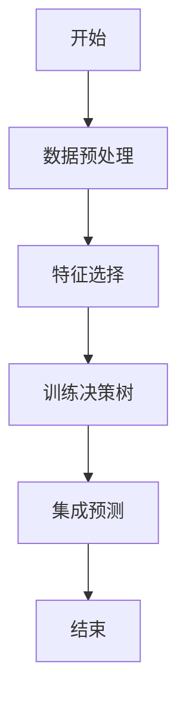
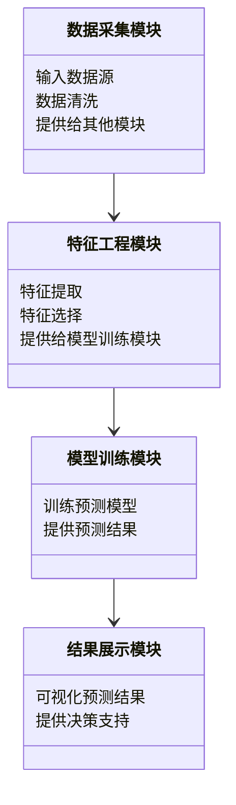

                 


# 构建企业级AI客户生命周期管理助手

> 关键词：AI，客户生命周期，管理助手，机器学习，深度学习

> 摘要：本文详细探讨了构建企业级AI客户生命周期管理助手的关键技术与实现方法。从背景介绍、核心概念到算法原理、系统架构，再到项目实战，全面解析了如何利用AI技术提升客户生命周期管理的效率与精准度。文章结合实际案例，详细阐述了系统设计与实现过程，并总结了最佳实践与注意事项，为读者提供了一套完整的解决方案。

---

## 第一部分: 企业级AI客户生命周期管理助手概述

### 第1章: 客户生命周期管理概述

#### 1.1 客户生命周期管理的定义与重要性
客户生命周期管理（Customer Lifecycle Management, CLM）是指从客户与企业建立关系开始，一直到客户关系终止的整个过程中的管理活动。其核心目标是通过优化客户体验，提升客户满意度和忠诚度，从而实现客户价值的最大化。

在企业级管理中，客户生命周期管理涵盖了客户获取、客户维护、客户保留和客户流失管理等多个阶段。传统的方法依赖于人工操作和简单的规则引擎，效率低下且难以应对复杂多变的市场环境。而AI技术的引入，为企业的客户管理带来了革命性的变化。

#### 1.2 企业级AI客户管理助手的背景
随着市场竞争的加剧，企业对客户管理的要求越来越高。传统的客户管理方式难以满足个性化需求和实时响应的挑战。AI技术的快速发展为企业提供了新的解决方案。

- **传统客户管理的局限性**：依赖人工操作，效率低，难以应对大规模客户；规则引擎缺乏灵活性，难以适应复杂场景。
- **AI技术的革新作用**：通过机器学习和深度学习，AI能够实时分析客户行为数据，预测客户需求，提供个性化服务。
- **核心目标**：通过AI技术实现客户全生命周期的智能化管理，提升客户满意度和企业收益。

---

### 第2章: AI在客户生命周期管理中的核心概念与联系

#### 2.1 数据采集与处理
数据是AI客户管理的基础。企业需要从多种渠道采集客户数据，并进行清洗和预处理。

- **数据源的多样性**：包括 CRM 系统、社交媒体、网站日志等。
- **数据清洗与预处理**：去除噪声数据，处理缺失值，标准化数据格式。
- **数据特征的提取与选择**：通过特征工程提取关键特征，如客户行为特征、时间特征等。

#### 2.2 客户行为分析与预测
基于AI的客户行为分析能够帮助企业预测客户的下一步行为，从而提前采取干预措施。

- **客户行为数据的特征提取**：提取客户的购买频率、访问时长、点击行为等特征。
- **基于AI的行为预测模型**：使用随机森林、神经网络等算法构建预测模型。
- **行为预测与客户生命周期的关系**：预测客户可能在哪个阶段流失，并采取针对性措施。

#### 2.3 客户分群与画像
通过AI技术，企业可以将客户分成不同的群体，并为每个群体构建画像，以便更好地进行个性化管理。

- **客户分群的定义与方法**：基于聚类算法将客户分成不同的群体。
- **基于AI的客户画像构建**：通过深度学习提取客户的深层特征，构建详细的客户画像。
- **客户画像在生命周期管理中的应用**：根据画像制定个性化服务策略。

#### 2.4 核心概念与联系的总结
通过数据流与系统架构的ER图（Entity-Relationship Diagram），我们可以清晰地看到各个核心概念之间的关系。

```mermaid
erDiagram
    customer[客户] {
        <属性>
        id : int
        name : string
        age : int
        gender : string
    }
    interaction[客户互动] {
        <属性>
        id : int
        timestamp : datetime
        action : string
        customer_id : int
    }
    prediction[预测结果] {
        <属性>
        id : int
        predicted_stage : string
        probability : float
        customer_id : int
    }
    customer -> interaction : 有
    customer -> prediction : 有
```

---

## 第二部分: AI客户生命周期管理的算法原理

### 第3章: 基于AI的客户生命周期预测算法

#### 3.1 常见算法选择与比较
在选择算法时，需要根据具体场景和数据特点进行选择。

- **分类算法的选择**：如随机森林、SVM等，适用于客户阶段分类。
- **回归算法的应用**：如逻辑回归，适用于客户流失概率预测。
- **聚类算法的适用场景**：如K-means，适用于客户分群。

#### 3.2 随机森林算法的原理与实现
随机森林是一种基于树的集成学习算法，具有高准确性和抗过拟合的特点。



数学模型：
$$
\text{模型预测} = \sum_{i=1}^{n} \text{树预测值} \times \text{权重}
$$

#### 3.3 神经网络模型的应用
神经网络模型适合处理复杂的非线性关系，如客户行为预测。

数学模型：
$$
\text{输出} = \sigma(\sum_{i=1}^{n} w_i x_i + b)
$$
其中，$\sigma$ 是sigmoid函数，$w_i$ 是权重，$x_i$ 是输入特征，$b$ 是偏置项。

---

## 第三部分: 系统分析与架构设计

### 第4章: 系统功能设计与架构

#### 4.1 问题场景介绍
企业需要构建一个AI客户管理助手，实现客户全生命周期的智能化管理。

#### 4.2 系统功能设计
- **数据采集模块**：实时采集客户数据。
- **特征工程模块**：提取关键特征。
- **模型训练模块**：训练预测模型。
- **结果展示模块**：可视化预测结果。

#### 4.3 系统架构设计


---

## 第四部分: 项目实战

### 第5章: 项目实现与分析

#### 5.1 环境安装
需要安装以下工具和库：
- Python 3.8+
- scikit-learn、xgboost、tensorflow
- Jupyter Notebook

#### 5.2 核心代码实现
以下是一个简单的客户流失预测模型实现：

```python
import pandas as pd
from sklearn.ensemble import RandomForestClassifier
from sklearn.metrics import accuracy_score

# 数据加载
data = pd.read_csv('customer_data.csv')

# 数据预处理
data = data.dropna()
X = data.drop('churn', axis=1)
y = data['churn']

# 特征工程
from sklearn.preprocessing import StandardScaler
scaler = StandardScaler()
X_scaled = scaler.fit_transform(X)

# 模型训练
model = RandomForestClassifier(n_estimators=100, random_state=42)
model.fit(X_scaled, y)

# 预测与评估
y_pred = model.predict(X_scaled)
print("Accuracy:", accuracy_score(y, y_pred))
```

#### 5.3 实际案例分析
以电商客户流失预测为例，分析模型的实际效果。

---

## 第五部分: 总结与展望

### 第6章: 总结与最佳实践

#### 6.1 最佳实践
- 数据质量是关键，确保数据的完整性和准确性。
- 模型选择要结合实际业务需求，避免过度复杂化。
- 定期更新模型，适应数据变化和业务发展。

#### 6.2 小结
通过本文的详细讲解，读者可以掌握构建企业级AI客户生命周期管理助手的核心技术与实现方法。AI技术的应用不仅提升了客户管理的效率，还为企业带来了更大的竞争优势。

#### 6.3 注意事项
- 数据隐私和安全问题需要高度重视。
- 模型的可解释性是实际应用中的重要考量因素。

#### 6.4 拓展阅读
推荐阅读以下书籍和资源：
- 《机器学习实战》
- 《深度学习入门：基于Python的卷积神经网络实现》
- [Kaggle客户流失预测案例](https://www.kaggle.com/datasets)

---

## 作者信息

作者：AI天才研究院/AI Genius Institute & 禅与计算机程序设计艺术/Zen And The Art of Computer Programming

---

以上就是《构建企业级AI客户生命周期管理助手》的完整目录大纲和详细内容。文章从背景介绍、核心概念、算法原理、系统设计到项目实战，全面解析了如何利用AI技术提升客户生命周期管理的效率与精准度。希望对读者有所帮助！

