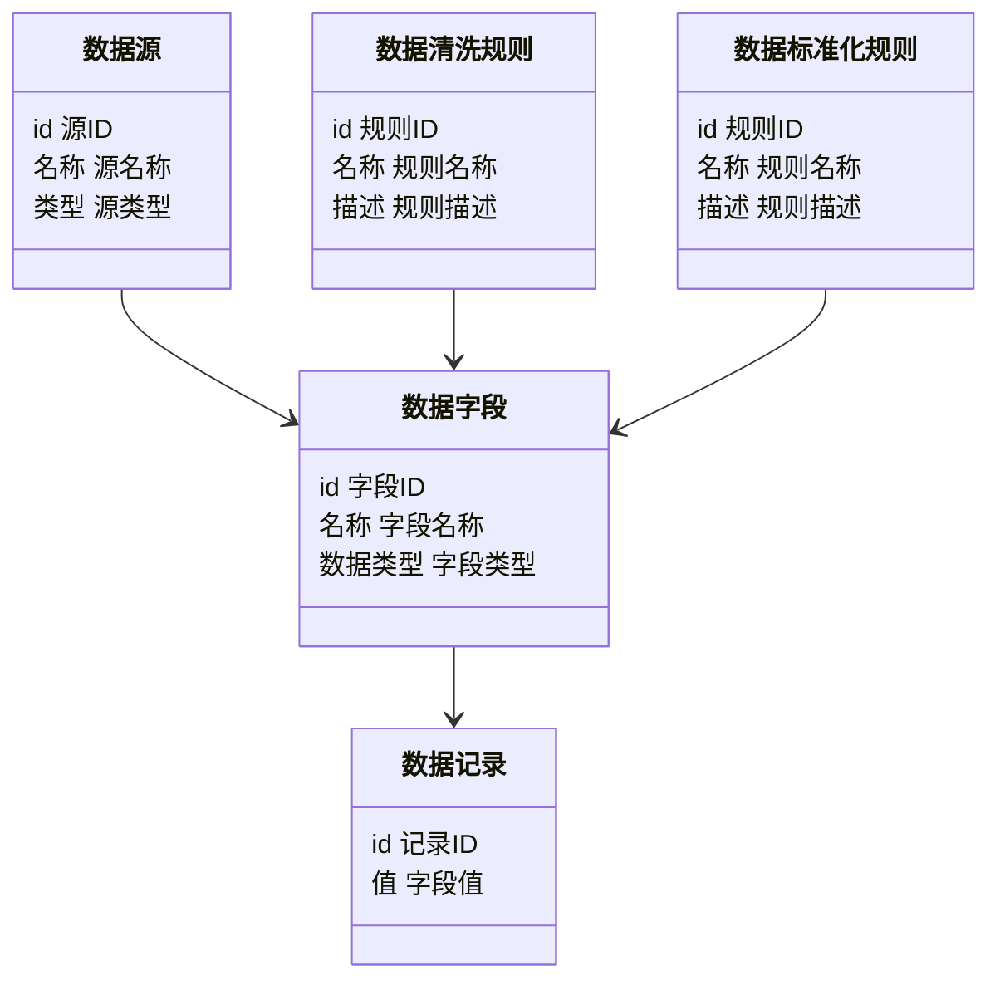
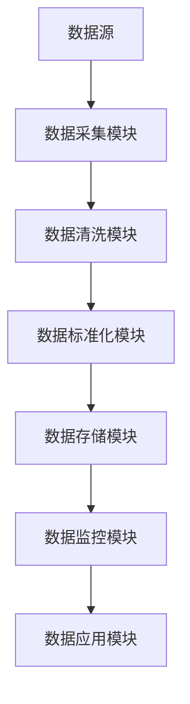

                 


# 构建企业级AI数据治理助手：确保数据质量与一致性

## 关键词：数据治理、数据质量、数据一致性、企业级AI、数据清洗、数据架构

## 摘要：  
在企业数字化转型的背景下，数据治理已成为确保企业高效运作和数据价值实现的关键。本文将从数据治理的背景与核心概念入手，深入探讨数据质量与一致性的实现方法，结合具体算法和系统架构，提供企业级AI数据治理助手的构建思路，帮助企业在复杂的数据环境中实现数据的高效管理和应用。

---

# 第一部分：数据治理背景与核心概念

## 第1章：数据治理背景介绍

### 1.1 数据治理的背景与问题背景  
随着企业数字化转型的推进，数据已成为企业核心资产。然而，数据孤岛、数据冗余、数据不一致等问题严重制约了数据价值的挖掘与利用。企业需要通过数据治理来确保数据的准确性和一致性，从而支持智能决策和业务创新。

#### 1.1.1 数据在企业中的重要性  
- 数据是企业决策的基础，直接影响业务效率和客户体验。  
- 数据驱动的洞察帮助企业优化流程、降低成本，并发现新的商业机会。  

#### 1.1.2 数据质量问题的现状  
- 数据来源多样，导致数据格式、语义不一致。  
- 数据清洗和转换过程复杂，容易引入错误。  
- 数据安全与隐私问题日益突出，数据泄露风险增加。  

#### 1.1.3 数据一致性的挑战  
- 不同部门或系统中同一数据的存储格式和含义可能不同。  
- 数据更新不及时或同步问题导致数据不一致。  
- 数据冗余和重复存储增加了数据管理的复杂性。  

### 1.2 数据治理问题描述  
数据治理的核心目标是解决数据孤岛、数据冗余、数据不一致等问题，确保数据的准确性和一致性。  

#### 1.2.1 数据孤岛问题  
- 数据分散在不同的系统中，缺乏统一的管理标准。  
- 数据孤岛导致信息无法有效共享，影响业务协同。  

#### 1.2.2 数据冗余与不一致问题  
- 数据重复存储，增加了存储成本和维护难度。  
- 数据不一致可能导致决策错误，影响业务质量。  

#### 1.2.3 数据安全与隐私问题  
- 数据泄露风险增加，可能导致企业损失和声誉损害。  
- 数据隐私保护法规日益严格，企业需要合规性更高的数据管理方案。  

### 1.3 数据治理的解决思路  
数据治理需要从数据标准化、数据清洗、数据质量管理等多个方面入手，构建统一的数据管理平台。  

#### 1.3.1 数据标准化策略  
- 建立统一的数据标准，规范数据的命名、格式和存储方式。  
- 制定数据分类和编码规则，确保数据的语义一致性。  

#### 1.3.2 数据清洗与转换方法  
- 使用数据清洗工具自动识别并修复数据中的错误和冗余。  
- 数据转换过程中确保数据格式和语义的一致性。  

#### 1.3.3 数据质量管理工具  
- 引入数据质量管理工具，监控数据质量和一致性。  
- 建立数据质量评估指标，定期评估数据健康状态。  

### 1.4 数据治理的边界与外延  
数据治理不仅关注数据本身，还涉及数据管理的组织架构和流程优化。  

#### 1.4.1 数据治理的范围界定  
- 数据治理的范围包括数据采集、存储、处理、分析和应用的全生命周期。  
- 数据治理不仅涉及技术层面，还包括组织架构、政策制定和人员管理。  

#### 1.4.2 数据治理与其他IT管理的关系  
- 数据治理与IT战略管理密切相关，是企业信息化建设的重要组成部分。  
- 数据治理需要与信息安全、风险管理等其他IT管理领域协同工作。  

#### 1.4.3 数据治理的未来发展趋势  
- 数据治理将更加注重数据的智能化管理和自动化处理。  
- 数据治理将与人工智能、大数据分析等技术深度融合，推动企业数据价值的释放。  

### 1.5 核心概念结构与组成  
数据治理的核心概念包括数据质量、数据一致性、数据安全等，这些概念相互关联，共同构成数据治理的完整体系。  

#### 1.5.1 数据治理的核心要素  
- 数据质量：确保数据的准确性、完整性和一致性。  
- 数据一致性：确保数据在不同系统和场景中的语义一致。  
- 数据安全：保护数据的机密性、完整性和可用性。  

#### 1.5.2 数据治理的流程模型  
数据治理的流程通常包括数据采集、数据清洗、数据标准化、数据存储、数据监控和数据应用等阶段。  

#### 1.5.3 数据治理的组织架构  
- 数据治理需要建立专门的组织架构，包括数据治理委员会、数据管理员等角色。  
- 数据治理团队需要与业务部门、IT部门紧密合作，确保数据治理目标的实现。  

---

## 第2章：数据治理核心概念与联系

### 2.1 数据治理的核心概念原理  
数据治理的核心概念包括数据质量、数据一致性和数据安全性，这些概念共同保障了数据的可用性和可靠性。  

#### 2.1.1 数据质量的定义与评估指标  
- 数据质量是指数据的准确性、完整性、一致性和及时性。  
- 数据质量评估指标包括完整性、一致性、准确性、唯一性和规范性。  

#### 2.1.2 数据一致性的实现机制  
- 数据一致性是指在不同系统或场景中，数据的语义和格式保持一致。  
- 数据一致性可以通过数据清洗、数据标准化和数据同步等技术实现。  

#### 2.1.3 数据安全的保障措施  
- 数据安全是指保护数据的机密性、完整性和可用性。  
- 数据安全可以通过数据加密、访问控制和数据备份等技术实现。  

### 2.2 核心概念属性特征对比表  
以下表格对比了数据质量、数据一致性和数据安全的核心属性特征：  

| 概念       | 属性特征                   |  
|------------|---------------------------|  
| 数据质量    | - 准确性：数据反映真实情况。  |  
|             | - 完整性：数据无缺失。      |  
|             | - 一致性：数据格式统一。    |  
| 数据一致性  | - 格式一致性：数据存储格式统一。 |  
|             | - 语义一致性：数据含义一致。 |  
|             | - 存储一致性：数据存储位置一致。 |  
| 数据安全    | - 机密性：数据仅限授权访问。 |  
|             | - 完整性：数据未被篡改。    |  
|             | - 可用性：数据可被合法访问。 |  

### 2.3 数据治理的ER实体关系图  
以下是数据治理中涉及的核心实体及其关系的ER图：  

```mermaid
er
    entity 数据源 {
        id 源ID
        名称 源名称
        类型 源类型
    }
    entity 数据字段 {
        id 字段ID
        名称 字段名称
        数据类型 字段类型
    }
    entity 数据记录 {
        id 记录ID
        值 字段值
    }
    entity 数据质量规则 {
        id 规则ID
        名称 规则名称
        描述 规则描述
    }
    entity 数据一致性约束 {
        id 约束ID
        名称 约束名称
        类型 约束类型
    }
    entity 数据安全策略 {
        id 策略ID
        名称 策略名称
        描述 策略描述
    }
    数据源 --> 数据字段: 拥有
    数据字段 --> 数据记录: 包含
    数据质量规则 --> 数据字段: 应用到
    数据一致性约束 --> 数据字段: 应用到
    数据安全策略 --> 数据字段: 应用到
```

---

## 第3章：数据治理算法原理

### 3.1 数据清洗算法原理  
数据清洗是数据治理中的重要环节，用于消除数据中的错误和冗余。  

#### 3.1.1 基于规则的清洗算法  
- 基于规则的清洗算法通过预定义的规则识别和修复数据中的错误。  
- 例如，可以通过正则表达式清洗电话号码格式，确保所有电话号码符合统一格式。  

#### 3.1.2 数据匹配与合并算法  
- 数据匹配算法用于识别重复或冗余的数据。  
- 数据合并算法将匹配的数据合并为一条记录，减少数据冗余。  

### 3.2 数据标准化算法  
数据标准化是确保数据格式和语义一致的关键步骤。  

#### 3.2.1 数据转换算法  
- 数据转换算法将数据从一种格式转换为另一种格式，例如日期格式统一。  
- 数据转换可以通过正则表达式、数据映射表等方式实现。  

#### 3.2.2 数据分类与编码算法  
- 数据分类算法将数据按类别划分，例如客户类型分类。  
- 数据编码算法将分类结果编码，例如将客户类型编码为1、2、3等。  

### 3.3 数据质量评估算法  
数据质量评估算法用于评估数据的质量，包括完整性、准确性、一致性等指标。  

#### 3.3.1 数据完整性检查算法  
- 数据完整性检查算法用于识别数据中的缺失值。  
- 例如，可以通过检查字段是否为空来评估数据完整性。  

#### 3.3.2 数据一致性检查算法  
- 数据一致性检查算法用于识别数据中的不一致值。  
- 例如，可以通过检查同一字段在不同记录中的值是否一致。  

### 3.4 数据安全保护算法  
数据安全保护算法用于保护数据的机密性、完整性和可用性。  

#### 3.4.1 数据加密算法  
- 数据加密算法将敏感数据加密存储，例如使用AES算法加密。  
- 数据加密可以防止数据在传输过程中被窃取。  

#### 3.4.2 数据访问控制算法  
- 数据访问控制算法基于角色权限控制数据访问。  
- 例如，使用RBAC（基于角色的访问控制）模型。  

---

## 第4章：数据治理系统架构与设计

### 4.1 系统功能设计  
数据治理系统需要实现数据采集、数据清洗、数据标准化、数据存储、数据监控和数据应用等功能。  

#### 4.1.1 数据采集模块  
- 数据采集模块负责从各种数据源中采集数据，例如数据库、文件、API接口等。  
- 数据采集过程中需要处理数据格式和编码问题。  

#### 4.1.2 数据清洗模块  
- 数据清洗模块负责识别并修复数据中的错误和冗余。  
- 数据清洗规则可以通过配置管理模块进行配置。  

#### 4.1.3 数据标准化模块  
- 数据标准化模块负责将数据转换为统一的格式和语义。  
- 数据标准化规则可以通过规则引擎进行配置。  

#### 4.1.4 数据存储模块  
- 数据存储模块负责将清洗和标准化后的数据存储到目标数据库中。  
- 数据存储可以采用关系型数据库或NoSQL数据库。  

#### 4.1.5 数据监控模块  
- 数据监控模块负责实时监控数据质量和一致性。  
- 数据监控可以通过设置阈值和触发警报来实现。  

#### 4.1.6 数据应用模块  
- 数据应用模块负责将数据应用于业务系统，例如数据分析、数据可视化等。  
- 数据应用可以通过API接口实现与业务系统的集成。  

### 4.2 系统架构设计  
数据治理系统需要采用分层架构，包括数据采集层、数据处理层、数据存储层、数据监控层和数据应用层。  

#### 4.2.1 领域模型类图  
以下是数据治理系统的核心领域模型类图：  



#### 4.2.2 系统架构图  
以下是数据治理系统的系统架构图：  



---

## 第5章：数据治理项目实战

### 5.1 项目背景与目标  
某企业希望通过数据治理实现数据的标准化和一致性，提升数据分析的准确性和效率。  

### 5.2 项目实施步骤  
1. 数据源调研与采集：识别数据源，采集数据并进行初步清洗。  
2. 数据清洗与标准化：根据清洗规则和标准化规则进行数据处理。  
3. 数据存储与监控：将处理后的数据存储到目标数据库，并设置数据监控指标。  
4. 数据应用与优化：将数据应用于业务系统，并根据反馈优化数据治理策略。  

### 5.3 核心代码实现  
以下是数据清洗和标准化的核心代码示例：  

```python
# 数据清洗示例
def clean_data(raw_data):
    cleaned_data = []
    for record in raw_data:
        cleaned_record = {}
        for key, value in record.items():
            # 清洗规则：去除空值
            if value is None:
                continue
            # 清洗规则：统一日期格式
            if key == 'date':
                cleaned_date = datetime.strptime(value, '%m/%d/%Y').strftime('%Y-%m-%d')
                cleaned_record[key] = cleaned_date
            else:
                cleaned_record[key] = value
        cleaned_data.append(cleaned_record)
    return cleaned_data

# 数据标准化示例
def standardize_data(cleaned_data):
    standardized_data = []
    for record in cleaned_data:
        standardized_record = {}
        for key, value in record.items():
            # 标准化规则：统一编码格式
            if key == 'code':
                standardized_code = value.upper().zfill(6)
                standardized_record[key] = standardized_code
            else:
                standardized_record[key] = value
        standardized_data.append(standardized_record)
    return standardized_data
```

---

## 第6章：数据治理最佳实践与小结

### 6.1 数据治理的关键点  
- 数据治理需要从数据全生命周期的角度进行管理。  
- 数据治理需要结合企业的实际情况制定灵活的策略。  
- 数据治理需要引入先进的技术工具和方法，例如人工智能和大数据分析。  

### 6.2 数据治理的注意事项  
- 数据治理需要与业务需求紧密结合，避免为治理而治理。  
- 数据治理需要建立完善的组织架构和人员团队。  
- 数据治理需要注重数据安全和隐私保护。  

### 6.3 数据治理的未来展望  
随着人工智能和大数据技术的快速发展，数据治理将更加智能化和自动化。未来，数据治理将与企业数字化转型更加紧密，为企业创造更大的价值。

---

# 作者：AI天才研究院/AI Genius Institute & 禅与计算机程序设计艺术 /Zen And The Art of Computer Programming

