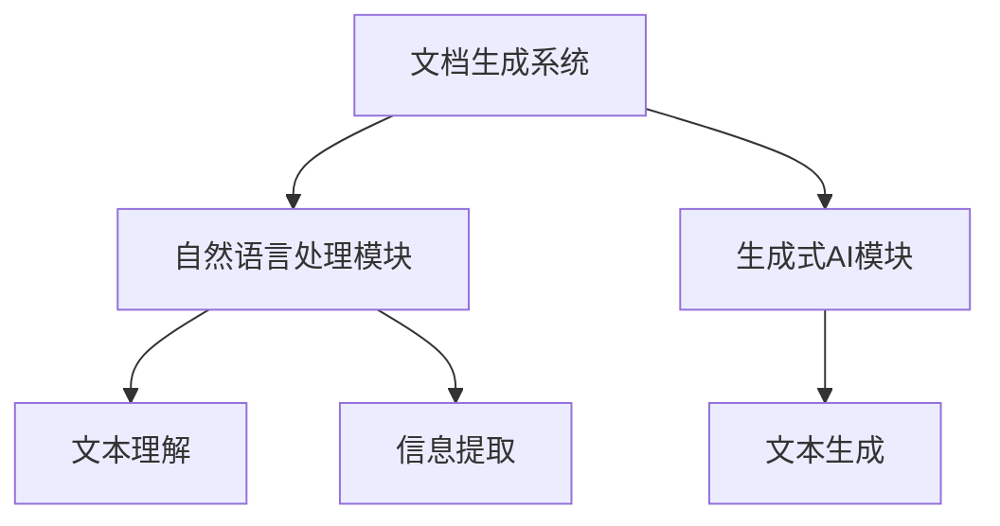
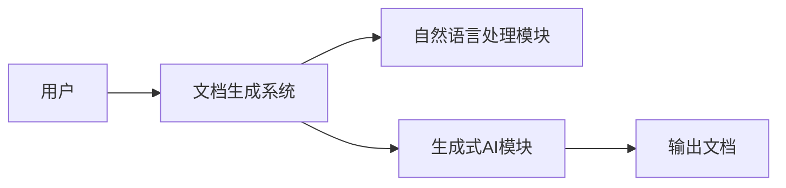

                 


# 构建企业级AI文档助手：自动化报告与提案生成

> 关键词：AI文档助手、自动化报告、生成式AI、自然语言处理、企业级系统

> 摘要：本文详细探讨了构建企业级AI文档助手的技术与方法，涵盖自然语言处理、生成式AI、算法原理、系统架构设计以及项目实战，旨在为企业提供高效的文档生成解决方案。

---

## 第一部分: 企业级AI文档助手的背景与价值

### 第1章: 问题背景与需求分析

#### 1.1 问题背景
企业文档生成面临效率低、成本高、标准化难的问题。传统方法依赖人工操作，难以满足大规模、多样化的文档需求。AI技术的引入为企业文档生成带来了新的可能性。

#### 1.2 问题描述
- **文档生成的复杂性**：文档类型多样，内容复杂，人工生成效率低。
- **标准化挑战**：企业文档需符合特定格式和内容规范，人工操作易出错。
- **提案生成效率**：企业提案通常需要快速响应，人工撰写耗时长。

#### 1.3 解决方案概述
企业级AI文档助手通过自动化技术，实现高效、准确的文档生成，降低企业成本，提高效率。

---

### 第2章: 企业级AI文档助手的核心概念

#### 2.1 自然语言处理技术
NLP技术是AI文档助手的基础，包括文本理解、信息提取等任务，帮助系统理解输入内容。

#### 2.2 生成式AI
基于生成模型，如GPT，生成符合要求的文本，是文档生成的核心技术。

#### 2.3 文档生成的流程与模式
- **基于模板的生成模式**：利用预定义模板生成标准化文档。
- **基于内容理解的生成模式**：根据输入内容自动生成个性化文档。

---

## 第二部分: 核心概念与联系

### 第3章: 核心概念与联系

#### 3.1 核心概念原理
- **NLP的数学模型**：如词嵌入、序列模型。
- **生成式AI的算法框架**：如Transformer架构。

#### 3.2 概念属性特征对比表
| 概念       | 属性       | 特征                                   |
|------------|------------|----------------------------------------|
| 自然语言处理 | 输入        | 文本或句子                             |
| 生成式AI   | 输出        | 新的文本或句子                         |

#### 3.3 实体关系图


---

## 第三部分: 算法原理讲解

### 第4章: 生成式AI的算法原理

#### 4.1 生成模型的工作流程


#### 4.2 模型数学公式
- **编码器-解码器结构**：
  $$ \text{编码器} = \text{Encoder}(x) $$
  $$ \text{解码器} = \text{Decoder}(y, \text{Encoder}(x)) $$

#### 4.3 生成过程示例
输入：公司季度报告
输出：生成的报告文本

---

## 第四部分: 系统分析与架构设计

### 第5章: 系统架构设计

#### 5.1 问题场景
企业需要一个支持多种文档类型的生成系统，满足不同部门的需求。

#### 5.2 系统架构


#### 5.3 功能模块设计
- **文本理解模块**：解析输入内容。
- **生成模块**：生成符合要求的文档。

---

## 第五部分: 项目实战

### 第6章: 项目实战

#### 6.1 环境安装
- Python 3.8+
- 安装依赖：TensorFlow、Keras、NLTK

#### 6.2 核心代码实现
```python
def generate_document(template, data):
    # 文本生成逻辑
    pass
```

#### 6.3 实际案例分析
案例：生成财务报告，输入数据后生成标准化报告。

---

## 第六部分: 最佳实践与小结

### 第7章: 最佳实践与小结

#### 7.1 小结
企业级AI文档助手通过NLP和生成式AI，实现高效文档生成，为企业带来显著效率提升。

#### 7.2 注意事项
- 数据安全：确保文档数据的安全性。
- 模型优化：持续优化生成模型，提高准确性。

#### 7.3 拓展阅读
推荐学习深度学习、自然语言处理等领域的知识。

---

## 作者信息

作者：AI天才研究院/AI Genius Institute & 禅与计算机程序设计艺术 /Zen And The Art of Computer Programming

