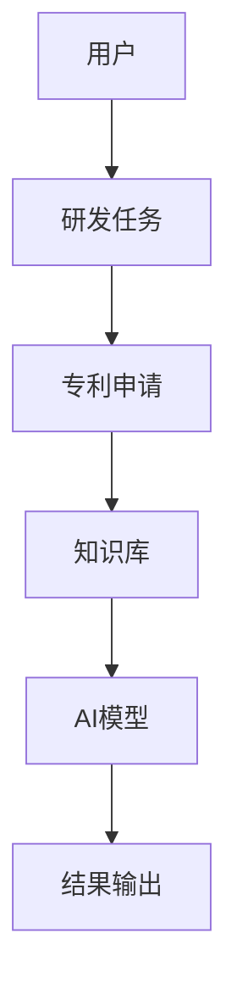
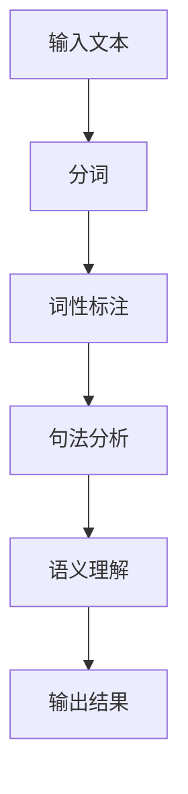
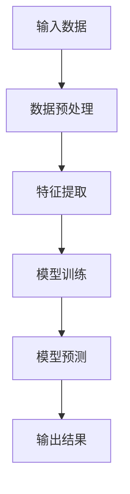
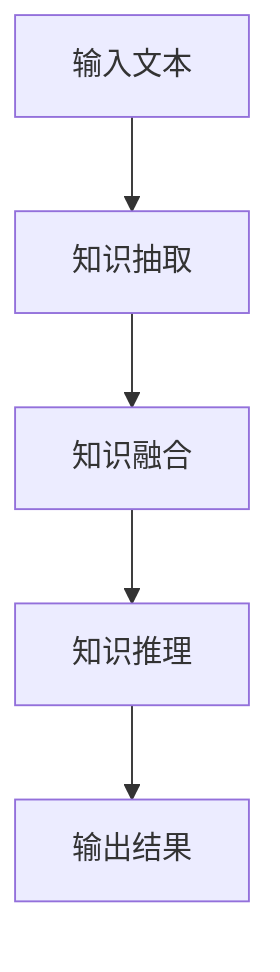
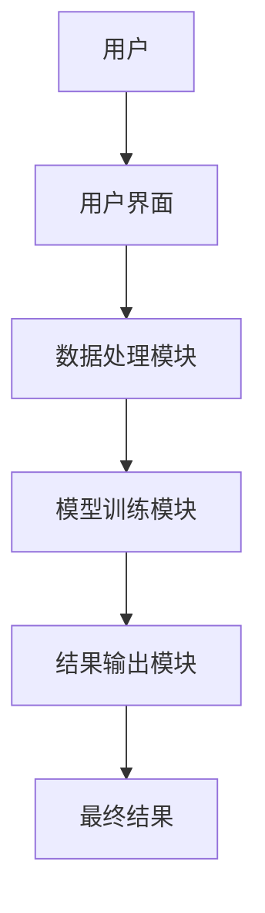
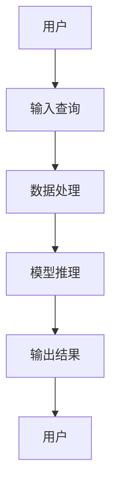

                 


# 构建企业级AI研发助手：加速创新与专利申请

> 关键词：企业级AI研发助手，自然语言处理，机器学习，专利申请，知识图谱，系统架构设计，创新加速

> 摘要：本文将详细探讨如何构建一个企业级的人工智能研发助手，以加速创新过程并提升专利申请的效率。文章将从背景与概念、核心技术、系统架构设计、项目实战、最佳实践与未来展望五个方面进行深入分析。通过自然语言处理、机器学习和知识图谱等技术的结合，为企业提供智能化的研发支持，从而在竞争激烈的市场中占据优势。

---

# 第一部分: 企业级AI研发助手的背景与概念

## 第1章: 企业级AI研发助手的定义与价值

### 1.1 什么是企业级AI研发助手
#### 1.1.1 企业级AI研发助手的定义
企业级AI研发助手是一种基于人工智能技术的智能化工具，旨在通过自动化和智能化的方式，辅助研发团队完成从创新想法到实际应用的整个流程。它结合了自然语言处理（NLP）、机器学习（ML）和知识图谱等技术，能够帮助研发人员快速获取信息、优化研发流程、提高创新效率。

#### 1.1.2 企业级AI研发助手的核心价值
1. **加速创新**：通过智能化的搜索和推荐，快速找到相关的技术资料和专利信息，缩短研发周期。
2. **提高效率**：自动化处理大量的数据和信息，减少人工重复劳动。
3. **优化决策**：基于数据和模型提供科学的决策支持，提高研发的成功率。

#### 1.1.3 企业级AI研发助手的边界与外延
企业级AI研发助手专注于研发过程中的辅助功能，其边界包括但不限于：
- 专利检索与分析
- 知识库构建与管理
- 技术趋势预测
- 研发流程优化

外延则涵盖了从基础研究到产品落地的全生命周期。

### 1.2 AI研发助手与传统研发工具的区别
#### 1.2.1 传统研发工具的特点
传统研发工具主要依赖人工操作，功能单一，例如：
- 专利检索工具（如专利数据库）
- 文献管理工具（如EndNote）

#### 1.2.2 AI研发助手的独特优势
AI研发助手通过智能化技术实现了以下优势：
- **智能推荐**：基于用户的输入，自动推荐相关技术资料和专利。
- **语义理解**：通过NLP技术，理解用户需求并提供精准的搜索结果。
- **知识关联**：构建知识图谱，发现潜在的技术关联和创新方向。

#### 1.2.3 两者的对比分析
| 特性 | 传统研发工具 | AI研发助手 |
|------|----------------|------------|
| 智能化程度 | 低 | 高 |
| 数据处理能力 | 单一 | 全面 |
| 用户体验 | 简单 | 个性化 |

---

## 第2章: 企业级AI研发助手的核心概念与联系

### 2.1 核心概念原理
#### 2.1.1 AI研发助手的核心原理
AI研发助手通过以下步骤实现其功能：
1. **数据采集**：从专利数据库、学术论文、技术报告等来源获取数据。
2. **数据预处理**：清洗、标注和结构化数据。
3. **模型训练**：基于机器学习算法，训练NLP模型。
4. **用户交互**：通过自然语言理解技术，与用户进行交互并提供结果。

#### 2.1.2 关键技术的实现机制
- **自然语言处理（NLP）**：用于理解和生成人类语言。
- **机器学习（ML）**：用于模式识别和预测。
- **知识图谱**：用于存储和关联知识。

#### 2.1.3 核心概念的数学模型
AI研发助手的核心模型包括：
- **词嵌入模型**：如Word2Vec，用于将词语转换为向量表示。
- **序列模型**：如LSTM，用于处理序列数据。

### 2.2 核心概念属性特征对比表
| 概念 | 特征 |
|------|------|
| 自然语言处理 | 语义理解、文本分类 |
| 机器学习 | 模型训练、预测 |
| 知识图谱 | 数据关联、知识推理 |

### 2.3 ER实体关系图


---

# 第二部分: 企业级AI研发助手的核心技术

## 第3章: 自然语言处理技术在AI研发助手中的应用

### 3.1 自然语言处理技术概述
#### 3.1.1 NLP的基本概念
自然语言处理（NLP）是人工智能的核心技术之一，旨在使计算机能够理解和生成人类语言。

#### 3.1.2 NLP的核心技术
- **分词**：将文本分割成词语。
- **词性标注**：识别词语的词性。
- **句法分析**：分析句子的语法结构。
- **语义理解**：理解文本的含义。

#### 3.1.3 NLP在AI研发中的作用
通过NLP技术，AI研发助手能够理解用户的查询意图，并提供相关的技术资料。

### 3.2 基于NLP的专利申请分析
#### 3.2.1 专利文本的预处理
- **分词**：将专利文本分割成词语。
- **词性标注**：标注词语的词性。
- **实体识别**：识别专利文本中的实体（如人名、机构名）。

#### 3.2.2 专利分类与检索
通过NLP技术，AI研发助手可以自动分类专利，并根据用户的需求进行检索。

#### 3.2.3 专利分析的可视化
将专利分析结果以图表形式展示，帮助用户快速理解技术趋势。

### 3.3 NLP算法实现
#### 3.3.1 算法流程图


#### 3.3.2 Python代码实现
```python
import nltk
text = "This is a test sentence."
tokens = nltk.word_tokenize(text)
print(tokens)
```

---

## 第4章: 机器学习在AI研发助手中的应用

### 4.1 机器学习技术概述
#### 4.1.1 机器学习的基本概念
机器学习（ML）是一种人工智能技术，通过数据训练模型，使其能够进行预测和分类。

#### 4.1.2 机器学习的核心技术
- **监督学习**：基于标注数据进行模型训练。
- **无监督学习**：基于无标注数据进行模型训练。
- **深度学习**：基于神经网络进行模型训练。

#### 4.1.3 机器学习在AI研发中的作用
通过机器学习技术，AI研发助手能够自动分类和推荐技术资料。

### 4.2 机器学习在专利申请中的应用
#### 4.2.1 专利分类与推荐
通过机器学习算法，对专利进行分类，并根据用户的兴趣推荐相关专利。

#### 4.2.2 专利质量评估
通过机器学习模型，评估专利的质量和创新性。

### 4.3 机器学习算法实现
#### 4.3.1 算法流程图


#### 4.3.2 Python代码实现
```python
from sklearn import tree
X = [[1, 1], [0, 0], [1, 0], [0, 1]]
y = [0, 0, 1, 1]
model = tree.DecisionTreeClassifier()
model.fit(X, y)
print(model.predict([[1, 0]]))
```

---

## 第5章: 知识图谱在AI研发助手中的应用

### 5.1 知识图谱技术概述
#### 5.1.1 知识图谱的基本概念
知识图谱是一种用于表示知识的数据结构，能够将实体和关系以图的形式表示。

#### 5.1.2 知识图谱的核心技术
- **知识抽取**：从文本中提取实体和关系。
- **知识融合**：将多个知识源中的知识进行融合。
- **知识推理**：基于知识图谱进行推理。

#### 5.1.3 知识图谱在AI研发中的作用
通过知识图谱，AI研发助手能够发现技术关联和潜在的创新方向。

### 5.2 知识图谱在专利分析中的应用
#### 5.2.1 专利关联分析
通过知识图谱，分析专利之间的关联性，发现技术趋势。

#### 5.2.2 专利网络分析
通过知识图谱，构建专利网络，分析专利的影响力。

### 5.3 知识图谱算法实现
#### 5.3.1 算法流程图


#### 5.3.2 Python代码实现
```python
from networkx import Graph
graph = Graph()
graph.add_nodes_from(["A", "B", "C"])
graph.add_edges_from([("A", "B"), ("B", "C")])
print(graph.nodes())
```

---

## 第6章: 系统架构设计

### 6.1 系统功能设计
- **用户界面**：提供用户交互界面，支持用户查询和操作。
- **数据处理模块**：负责数据的采集、预处理和存储。
- **模型训练模块**：负责机器学习模型的训练和优化。
- **结果输出模块**：输出最终的结果，包括文本、图表等。

### 6.2 系统架构图


### 6.3 系统接口设计
- **输入接口**：接收用户的查询请求。
- **输出接口**：输出查询结果。

### 6.4 系统交互流程图


---

## 第7章: 项目实战

### 7.1 环境安装
- **Python**：安装Python 3.8及以上版本。
- **库依赖**：安装必要的库，例如nltk、scikit-learn、networkx等。

### 7.2 核心代码实现
#### 7.2.1 数据预处理
```python
import nltk
text = "This is a test sentence."
tokens = nltk.word_tokenize(text)
print(tokens)
```

#### 7.2.2 机器学习模型训练
```python
from sklearn import tree
X = [[1, 1], [0, 0], [1, 0], [0, 1]]
y = [0, 0, 1, 1]
model = tree.DecisionTreeClassifier()
model.fit(X, y)
print(model.predict([[1, 0]]))
```

#### 7.2.3 知识图谱构建
```python
from networkx import Graph
graph = Graph()
graph.add_nodes_from(["A", "B", "C"])
graph.add_edges_from([("A", "B"), ("B", "C")])
print(graph.nodes())
```

### 7.3 案例分析
通过实际案例分析，展示AI研发助手在专利申请和创新中的应用。

### 7.4 项目小结
总结项目实现的关键点和注意事项。

---

## 第8章: 最佳实践与未来展望

### 8.1 最佳实践
- **数据质量**：确保数据的准确性和完整性。
- **模型优化**：不断优化机器学习模型，提高预测精度。
- **用户体验**：注重用户界面的设计，提升用户体验。

### 8.2 小结
总结本文的核心内容和主要观点。

### 8.3 注意事项
- **数据隐私**：注意数据的隐私保护。
- **模型泛化能力**：确保模型的泛化能力。

### 8.4 拓展阅读
推荐相关领域的书籍和论文，供读者进一步阅读。

---

# 作者

作者：AI天才研究院/AI Genius Institute & 禅与计算机程序设计艺术 /Zen And The Art of Computer Programming

---

**本文由AI天才研究院/AI Genius Institute倾心创作，转载请注明出处。**

