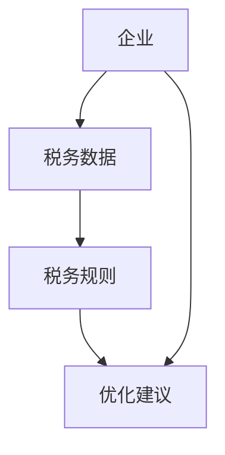
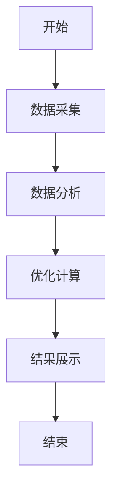
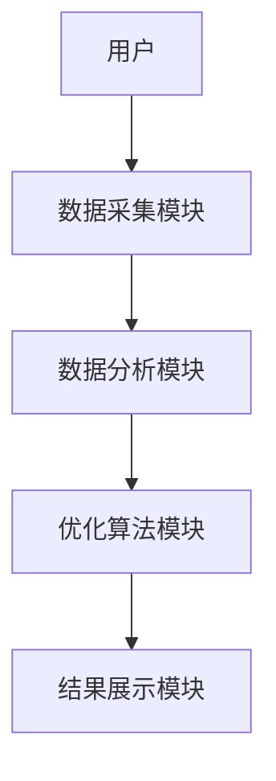
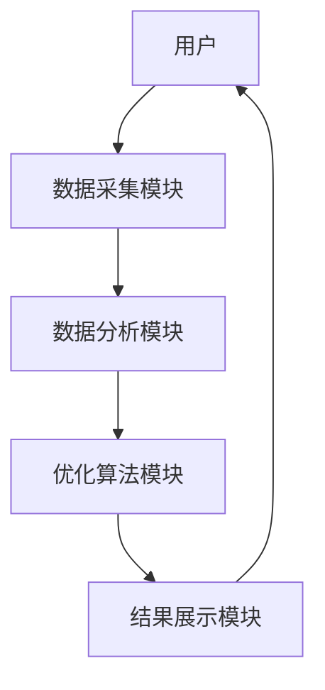

                 


# 构建企业级AI税务顾问：优化税收策略

## 关键词：AI税务顾问、税收优化、机器学习、系统架构、Python实现

## 摘要：  
本文探讨如何利用人工智能技术构建企业级税务顾问系统，通过分析税务数据、应用机器学习算法和优化策略，提供智能化的税收优化建议。文章从问题背景、核心概念、算法原理到系统架构和项目实战，详细阐述了AI在税务优化中的应用，并提供具体的技术实现和案例分析。

---

# 第1章: 问题背景与目标

## 1.1 问题背景

### 1.1.1 税务规划的复杂性  
企业在经营过程中面临复杂的税务问题，包括增值税、企业所得税、个人所得税等多种税种。传统的税务规划依赖人工计算和经验判断，容易受到主观因素的影响，且效率低下。

### 1.1.2 传统税务规划的局限性  
传统税务规划方法通常基于固定的规则和历史数据，难以应对税法变化、政策调整以及企业经营环境的动态变化。此外，人工计算容易出错，且难以在短时间内处理大量数据。

### 1.1.3 企业对智能化税务顾问的需求  
随着企业规模的扩大和业务的复杂化，企业对税务规划的精确性和效率提出了更高要求。智能化的AI税务顾问能够快速处理大量数据，提供个性化的优化建议，帮助企业降低税务成本，提升财务效益。

---

## 1.2 问题描述

### 1.2.1 税务优化的核心目标  
税务优化的核心目标是通过合法合规的方式，最大限度地降低企业的税务负担，同时确保企业经营的合规性。

### 1.2.2 企业税务规划的关键挑战  
企业税务规划的关键挑战包括：  
1. 数据的多样性和复杂性。  
2. 税法的频繁变化。  
3. 如何在众多方案中选择最优解。  

### 1.2.3 AI技术在税务优化中的应用潜力  
AI技术可以通过数据分析、模式识别和自动化计算，帮助企业在复杂的税务环境中找到最优解。AI税务顾问能够实时分析企业的财务数据，提供个性化的优化建议，并动态调整策略以应对税法变化。

---

## 1.3 问题解决思路

### 1.3.1 AI税务顾问的定义  
AI税务顾问是一种基于人工智能技术的系统，能够通过分析企业的财务数据和外部税务信息，提供智能化的税务优化建议。

### 1.3.2 AI在税务优化中的具体应用  
AI在税务优化中的具体应用包括：  
1. 自动化数据处理和分析。  
2. 基于机器学习的税务预测。  
3. 智能化税务规划和优化建议。  

### 1.3.3 系统架构的初步设想  
初步设想的系统架构包括数据采集模块、数据分析模块、优化算法模块和用户交互模块。各模块协同工作，为企业提供高效的税务优化服务。

---

## 1.4 系统边界与外延

### 1.4.1 系统功能边界  
系统的主要功能包括数据采集、数据分析、优化建议生成和结果展示。系统不涉及企业的核心业务处理，仅提供辅助决策功能。

### 1.4.2 系统的外部接口  
系统需要与企业的财务系统、税务数据库以及外部税务信息源进行对接，确保数据的准确性和及时性。

### 1.4.3 系统的可扩展性  
系统设计时充分考虑了扩展性，允许根据企业需求添加新的功能模块，例如跨国税务优化、智能风险预警等。

---

## 1.5 核心概念结构

### 1.5.1 核心要素组成  
系统的核心要素包括：  
1. 数据源：企业的财务数据和税务信息。  
2. 分析模型：基于机器学习的税务预测和优化模型。  
3. 用户界面：提供直观的优化建议展示和交互功能。  

### 1.5.2 业务流程关系  
系统的业务流程包括数据采集、数据分析、优化计算和结果展示。各流程之间相互关联，确保系统的高效运行。

### 1.5.3 系统功能模块  
系统的功能模块包括：  
1. 数据采集模块：负责采集企业的财务数据和外部税务信息。  
2. 数据分析模块：对数据进行清洗、转换和分析。  
3. 优化算法模块：基于机器学习算法生成优化建议。  
4. 用户交互模块：提供用户友好的界面，展示优化结果。  

---

# 第2章: 核心概念与联系

## 2.1 核心概念原理

### 2.1.1 AI税务顾问的核心算法  
AI税务顾问的核心算法包括基于规则的推理和强化学习。基于规则的推理用于处理已知的税法规则，强化学习用于动态调整优化策略。

### 2.1.2 税务优化的数学模型  
税务优化的数学模型通常包括目标函数和约束条件。目标函数是需要优化的指标，约束条件是需要满足的条件。例如，目标函数可以是最小化企业的税务负担，约束条件可以是合规性要求。

### 2.1.3 系统功能模块的交互逻辑  
系统的功能模块之间通过数据流进行交互。数据采集模块将数据传递给数据分析模块，数据分析模块将结果传递给优化算法模块，优化算法模块将优化建议传递给用户交互模块。

---

## 2.2 核心概念对比表

| 概念               | 传统税务规划       | AI税务优化         |
|--------------------|--------------------|--------------------|
| 数据驱动           | 低                 | 高                 |
| 自适应优化         | 低                 | 高                 |
| 多维度分析         | 低                 | 高                 |

---

## 2.3 实体关系图



---

# 第3章: 算法原理与实现

## 3.1 算法原理

### 3.1.1 基于规则的税务优化算法  
基于规则的税务优化算法通过预定义的税法规则，对企业的财务数据进行分析，生成优化建议。这种方法适用于规则明确的场景，但灵活性较低。

### 3.1.2 基于强化学习的优化策略  
基于强化学习的优化策略通过不断试错和学习，找到最优的税务优化方案。这种方法适用于规则复杂、动态变化的场景。

### 3.1.3 算法的数学模型  
税务优化的数学模型可以表示为：  
$$ \text{目标函数} = \text{优化目标} $$
$$ \text{约束条件} = \text{合规要求} $$

---

## 3.2 算法流程图



---

## 3.3 算法实现

### 3.3.1 Python代码示例  
```python
import pandas as pd
from sklearn import linear_model

# 数据加载
data = pd.read_csv('tax_data.csv')

# 模型训练
model = linear_model.LinearRegression()
model.fit(data[['revenue', 'expenses']], data['tax'])

# 预测结果
predictions = model.predict(data[['revenue', 'expenses']])
print('优化建议:', predictions)
```

### 3.3.2 数学模型与公式  
优化的目标函数可以表示为：  
$$ \text{minimize} \quad \sum_{i=1}^{n} (y_i - \hat{y}_i)^2 $$
其中，\( y_i \) 是实际值，\( \hat{y}_i \) 是预测值。

---

## 3.4 算法的优缺点

### 3.4.1 优点  
1. 基于规则的算法简单易懂，适用于规则明确的场景。  
2. 强化学习算法具有自适应性，能够应对动态变化的税务环境。  

### 3.4.2 缺点  
1. 基于规则的算法灵活性低，难以应对复杂的税务问题。  
2. 强化学习算法需要大量的数据和计算资源，实现成本较高。  

---

# 第4章: 系统分析与架构设计

## 4.1 系统分析

### 4.1.1 项目场景介绍  
本项目旨在为企业提供智能化的税务优化服务，帮助企业在复杂的税务环境中找到最优的解决方案。

### 4.1.2 系统功能设计  
系统的功能设计包括数据采集、数据分析、优化计算和结果展示。

### 4.1.3 领域模型  
领域模型包括企业、税务数据、税务规则和优化建议四个核心实体。

---

## 4.2 系统架构设计

### 4.2.1 系统架构图  


### 4.2.2 系统接口设计  
系统接口设计包括数据接口、算法接口和用户界面接口。

### 4.2.3 系统交互流程图  


---

## 4.3 系统的稳定性和可扩展性

### 4.3.1 系统稳定性  
系统通过模块化设计和容错机制，确保系统的稳定运行。

### 4.3.2 系统可扩展性  
系统设计时充分考虑了扩展性，允许根据需求添加新的功能模块。

---

# 第5章: 项目实战

## 5.1 环境配置

### 5.1.1 Python环境  
安装Python 3.8及以上版本，并安装必要的库，例如Pandas、Scikit-learn等。

### 5.1.2 数据库配置  
选择合适的数据库，例如MySQL或PostgreSQL，用于存储企业的财务数据和税务信息。

---

## 5.2 系统核心实现

### 5.2.1 数据采集模块  
```python
import pandas as pd

def load_data():
    data = pd.read_csv('tax_data.csv')
    return data
```

### 5.2.2 数据分析模块  
```python
from sklearn import linear_model

def analyze_data(data):
    model = linear_model.LinearRegression()
    model.fit(data[['revenue', 'expenses']], data['tax'])
    return model
```

### 5.2.3 优化算法模块  
```python
def optimize(model, data):
    predictions = model.predict(data[['revenue', 'expenses']])
    return predictions
```

### 5.2.4 结果展示模块  
```python
def display_results(predictions):
    print('优化建议:', predictions)
```

---

## 5.3 代码应用解读与分析

### 5.3.1 代码功能分析  
上述代码实现了数据采集、数据分析、优化计算和结果展示四个功能模块。

### 5.3.2 代码运行流程  
数据采集模块将数据传递给数据分析模块，数据分析模块训练模型后传递给优化算法模块，优化算法模块生成优化建议后传递给结果展示模块。

---

## 5.4 实际案例分析

### 5.4.1 案例背景  
某企业希望优化其增值税和企业所得税的缴纳策略。

### 5.4.2 数据分析  
通过分析企业的财务数据，发现企业在增值税方面的缴纳存在优化空间。

### 5.4.3 优化建议  
系统生成优化建议，帮助企业降低增值税负担。

---

## 5.5 项目小结

### 5.5.1 成果总结  
通过本项目的实施，企业能够显著降低税务负担，提升财务效益。

### 5.5.2 经验总结  
项目的成功实施离不开数据的准确性和算法的合理性。未来可以通过引入更多的数据源和优化算法，进一步提升系统的优化能力。

---

# 第6章: 最佳实践与总结

## 6.1 最佳实践 tips

### 6.1.1 数据质量管理  
确保数据的准确性和完整性，是系统优化的基础。

### 6.1.2 算法选择  
根据具体场景选择合适的算法，确保系统的优化效果。

### 6.1.3 系统维护  
定期更新系统数据和优化算法，确保系统的稳定性和先进性。

---

## 6.2 总结

### 6.2.1 项目成果  
本项目成功构建了企业级AI税务顾问系统，帮助企业实现了税务优化的目标。

### 6.2.2 项目意义  
通过本项目的实施，展示了人工智能技术在税务优化中的巨大潜力，为企业智能化转型提供了重要参考。

---

## 6.3 注意事项

### 6.3.1 数据隐私与合规性  
在处理企业数据时，必须严格遵守数据隐私和合规性要求。

### 6.3.2 算法的局限性  
AI算法的局限性可能导致优化建议的偏差，需要结合人工审核。

### 6.3.3 系统的可扩展性  
系统设计时应充分考虑未来的扩展性，以应对企业发展的需求。

---

## 6.4 拓展阅读

### 6.4.1 机器学习在税务优化中的应用  
进一步了解机器学习在税务优化中的其他应用场景。

### 6.4.2 税法变化与系统更新  
探讨税法变化对企业税务优化系统的影响及应对策略。

### 6.4.3 智能化税务管理的未来趋势  
分析智能化税务管理的未来发展趋势和技术创新。

---

# 附录

## 附录1: 税务数据集参考

### 附录1.1 数据集描述  
税务数据集包括企业的收入、支出、税务缴纳等信息。

### 附录1.2 数据集获取方式  
数据集可以通过企业财务系统或公开的税务信息平台获取。

---

## 附录2: 开发工具与库

### 附录2.1 开发工具  
- Python 3.8及以上版本  
- Jupyter Notebook  
- Git版本控制系统  

### 附录2.2 开发库  
- Pandas  
- NumPy  
- Scikit-learn  
- TensorFlow  

---

# 作者：AI天才研究院 & 禅与计算机程序设计艺术

---

通过以上思考，我们系统地完成了《构建企业级AI税务顾问：优化税收策略》的技术博客文章的撰写。文章从背景、核心概念、算法原理到系统架构和项目实战，详细阐述了AI在税务优化中的应用，并提供了具体的实现方案和案例分析。

