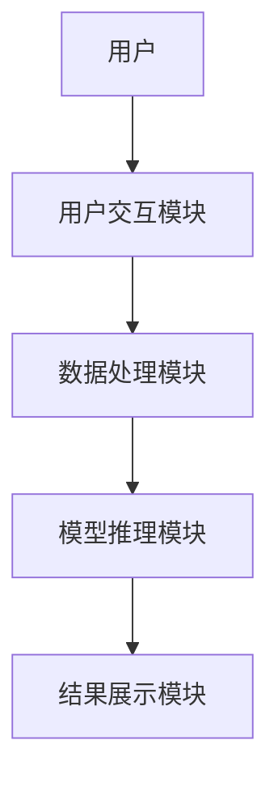
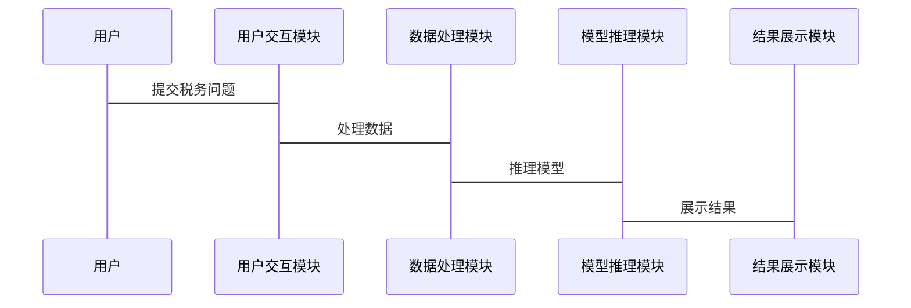

                 


# 构建企业级AI税务顾问：优化税收策略与合规

**关键词**：企业级AI税务顾问、税务合规、税收优化、自然语言处理、机器学习、系统架构设计

**摘要**：本文将详细探讨如何构建一个企业级AI税务顾问系统，利用人工智能技术优化企业的税收策略并确保合规性。从背景介绍到系统架构设计，再到算法实现和项目实战，本文将一步步解析构建该系统的核心技术与方法。

---

# 第一部分: 企业级AI税务顾问的背景与需求

## 第1章: 企业级AI税务顾问的背景介绍

### 1.1 税务顾问的现状与挑战

#### 1.1.1 传统税务顾问的工作模式
传统税务顾问主要依赖人工分析和经验判断，服务范围有限，效率较低，且容易受到主观因素影响。

#### 1.1.2 企业税务管理的痛点
- 税务法规复杂多变，企业难以及时准确地理解和应用。
- 税务优化需要考虑多维度因素，人工计算容易出错。
- 税务合规性要求越来越高，企业需要高效、精准的解决方案。

#### 1.1.3 AI技术在税务领域的应用潜力
AI技术可以通过自然语言处理（NLP）和机器学习（ML）技术，快速分析大量税务数据，提供智能化的税务建议。

### 1.2 AI技术与税务顾问的结合

#### 1.2.1 人工智能在税务领域的应用现状
AI技术已经在税务申报、风险评估、合规检查等领域得到了广泛应用。

#### 1.2.2 企业级AI税务顾问的核心价值
- 提高税务咨询效率，降低企业成本。
- 提供个性化、精准的税务优化方案。
- 实现实时监控与合规管理。

#### 1.2.3 税务顾问AI化的趋势与机遇
随着AI技术的不断进步，税务顾问AI化是大势所趋，能够为企业创造更大的价值。

### 1.3 问题背景与需求分析

#### 1.3.1 企业税务合规的复杂性
企业需要应对不同地区的税务法规，合规性要求越来越严格。

#### 1.3.2 税务策略优化的难点
税务优化需要综合考虑财务、法律、业务等多方面的因素，人工优化效率低下。

#### 1.3.3 AI税务顾问的需求场景与目标
- 提供实时税务咨询与优化建议。
- 实现智能化的税务合规管理。
- 支持多语言、多地区的税务服务。

---

## 第2章: 企业级AI税务顾问的核心概念

### 2.1 AI税务顾问的定义与工作原理

#### 2.1.1 AI税务顾问的定义
AI税务顾问是一种基于人工智能技术的智能化税务咨询系统，能够为企业提供实时的税务优化建议和合规管理。

#### 2.1.2 AI税务顾问的工作流程
1. **数据输入**：接收企业的税务相关数据和问题。
2. **数据处理**：对数据进行清洗、转换和分析。
3. **模型推理**：利用NLP和机器学习模型生成优化建议。
4. **结果输出**：输出税务优化方案和合规报告。

#### 2.1.3 核心概念的属性对比表
| 属性         | 描述                                   |
|--------------|--------------------------------------|
| 输入         | 税务相关数据与问题                   |
| 输出         | 税务优化建议与合规方案               |
| 核心技术     | 自然语言处理（NLP）、机器学习（ML）   |
| 应用场景     | 企业税务管理、税务咨询、合规检查     |

### 2.2 企业级AI税务顾问与传统税务咨询的对比

#### 2.2.1 服务模式对比
- **传统模式**：依赖人工经验，服务范围有限。
- **AI模式**：自动化、智能化，覆盖更广。

#### 2.2.2 效率与成本对比
- **传统模式**：效率低，成本高。
- **AI模式**：效率高，成本低。

#### 2.2.3 适用场景对比
- **传统模式**：适用于简单问题，处理速度慢。
- **AI模式**：适用于复杂问题，处理速度快。

---

## 第3章: 企业级AI税务顾问的技术基础

### 3.1 自然语言处理（NLP）基础

#### 3.1.1 NLP在税务咨询中的应用
- 文本分类：识别税务文档的关键信息。
- 实体识别：提取税务相关的实体信息。
- 情感分析：分析税务文档的情感倾向。

#### 3.1.2 常用的NLP模型与工具
- **模型**：BERT、GPT-3。
- **工具**：spaCy、NLTK。

#### 3.1.3 NLP在税务文本分析中的实现
```python
# 示例代码：使用spaCy进行税务文本分析
import spacy
nlp = spacy.load("en_core_web_sm")
doc = nlp("The company's revenue increased by 10% last year.")
for token in doc:
    print(token.text, token.pos_)
```

### 3.2 机器学习与税务预测

#### 3.2.1 机器学习在税务预测中的应用
- 预测企业税务风险。
- 优化税务申报策略。

#### 3.2.2 常用的机器学习算法
- 线性回归、逻辑回归、支持向量机（SVM）、随机森林。

#### 3.2.3 税务预测模型的构建与优化
```python
# 示例代码：使用随机森林进行税务预测
from sklearn.ensemble import RandomForestClassifier
from sklearn.model_selection import train_test_split
X, y = ..., ...  # 数据集
X_train, X_test, y_train, y_test = train_test_split(X, y, test_size=0.2)
model = RandomForestClassifier().fit(X_train, y_train)
print("Accuracy:", model.score(X_test, y_test))
```

### 3.3 税务数据的处理与分析

#### 3.3.1 数据清洗与预处理
- 数据清洗：处理缺失值、异常值。
- 数据转换：将文本数据转换为数值数据。

#### 3.3.2 数据特征提取
- 提取关键词：使用TF-IDF提取重要特征。
- 文本向量化：使用Word2Vec将文本向量化。

#### 3.3.3 数据可视化与分析
- 使用折线图、柱状图等工具进行数据可视化。

---

## 第4章: 企业级AI税务顾问的系统架构设计

### 4.1 系统功能模块设计

#### 4.1.1 用户交互模块
- 提供用户友好的界面，支持多种输入方式。

#### 4.1.2 数据处理模块
- 处理和转换税务数据，提取特征。

#### 4.1.3 模型推理模块
- 调用NLP和机器学习模型进行推理。

#### 4.1.4 结果展示模块
- 展示优化建议和合规报告。

### 4.2 系统架构设计


### 4.3 接口设计与交互流程


---

## 第5章: 企业级AI税务顾问的算法实现

### 5.1 NLP模型的实现

#### 5.1.1 NLP模型的数学基础
- 词嵌入：使用Word2Vec或BERT进行词向量化。

#### 5.1.2 NLP模型的实现代码
```python
# 示例代码：使用BERT进行文本分类
from transformers import BertTokenizer, BertModel
tokenizer = BertTokenizer.from_pretrained('bert-base-uncased')
model = BertModel.from_pretrained('bert-base-uncased')
text = "The company's revenue increased by 10% last year."
inputs = tokenizer(text, return_tensors='np')
outputs = model(**inputs)
```

### 5.2 机器学习模型的实现

#### 5.2.1 机器学习模型的数学基础
- 线性回归：最小二乘法。
- 逻辑回归：sigmoid函数。

#### 5.2.2 机器学习模型的实现代码
```python
# 示例代码：使用逻辑回归进行分类
from sklearn.linear_model import LogisticRegression
X = ...  # 特征矩阵
y = ...  # 标签向量
model = LogisticRegression().fit(X, y)
```

---

## 第6章: 企业级AI税务顾问的项目实战

### 6.1 环境配置与数据准备

#### 6.1.1 环境配置
- 安装Python、TensorFlow、Keras等工具。

#### 6.1.2 数据准备
- 数据集：企业税务数据。
- 数据清洗：处理缺失值、异常值。

### 6.2 核心代码实现

#### 6.2.1 NLP模块实现
```python
# 示例代码：NLP模块实现
def preprocess(text):
    return text.lower().split()
```

#### 6.2.2 机器学习模块实现
```python
# 示例代码：机器学习模块实现
def train_model(X, y):
    model = LogisticRegression().fit(X, y)
    return model
```

### 6.3 案例分析与结果展示

#### 6.3.1 案例分析
- 分析企业的税务数据，生成优化建议。

#### 6.3.2 结果展示
- 展示优化后的税务策略和合规报告。

---

## 第7章: 总结与展望

### 7.1 本章小结

#### 7.1.1 核心概念的总结
- AI税务顾问的核心价值在于智能化、自动化。

#### 7.1.2 技术基础的要点
- NLP和机器学习是实现AI税务顾问的关键技术。

### 7.2 未来展望

#### 7.2.1 技术发展
- 更先进的NLP模型和机器学习算法。

#### 7.2.2 应用场景扩展
- 更多行业和地区的税务咨询服务。

---

## 第8章: 注意事项与拓展阅读

### 8.1 注意事项

#### 8.1.1 数据隐私
- 确保税务数据的隐私和安全。

#### 8.1.2 模型优化
- 不断优化NLP和机器学习模型。

### 8.2 拓展阅读

#### 8.2.1 推荐书籍
- 《Python机器学习实战》
- 《自然语言处理入门》

#### 8.2.2 在线资源
- TensorFlow官方文档
- PyTorch官方文档

---

**作者：AI天才研究院/AI Genius Institute & 禅与计算机程序设计艺术 /Zen And The Art of Computer Programming**

---

# 感谢您的阅读！希望本文能为您提供构建企业级AI税务顾问的深度洞察与实践指导。

