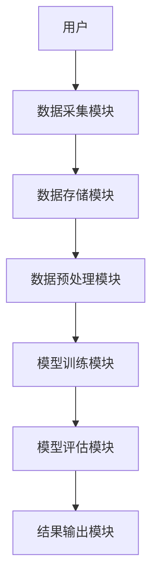
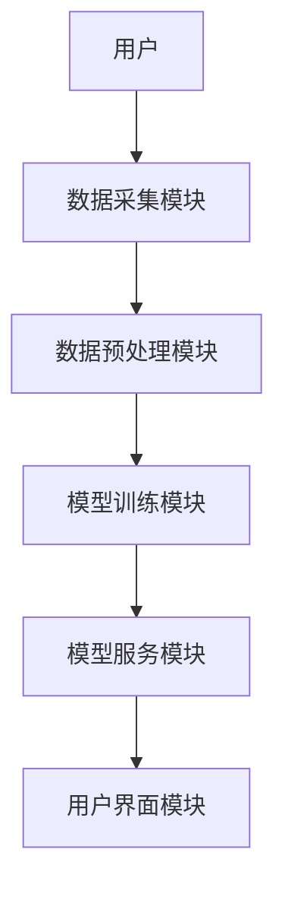

                 


# 构建企业级AI财务顾问：智能预算规划与投资建议

---

## 关键词：AI财务顾问，预算规划，投资建议，机器学习，系统架构

---

## 摘要

本文详细探讨了如何构建一个企业级AI财务顾问系统，重点介绍了智能预算规划与投资建议的核心技术与实现方案。文章从问题背景、核心概念、算法原理、系统架构到项目实战，全面分析了AI在财务领域的应用，为读者提供了一套完整的解决方案。

---

## 第一部分：企业级AI财务顾问概述

### 第1章：问题背景与目标

#### 1.1 问题背景

传统的财务顾问服务依赖于人工分析和经验判断，存在效率低、主观性强、难以处理海量数据等问题。企业级AI财务顾问通过结合人工智能技术，能够实现智能化的预算规划和投资建议，帮助企业在复杂多变的市场环境中做出更高效、更精准的决策。

#### 1.2 问题描述

企业级AI财务顾问的核心目标包括：

1. **智能化预算规划**：通过历史数据和市场趋势，自动生成预算建议，优化资源配置。
2. **个性化投资建议**：基于企业的财务状况和市场环境，提供定制化的投资策略。
3. **数据驱动的决策支持**：利用机器学习算法，从海量数据中提取有价值的信息，支持企业的战略决策。

### 第2章：核心概念与联系

#### 2.1 核心概念

- **AI财务顾问**：结合人工智能技术，提供智能化财务建议的系统。
- **预算规划**：基于历史数据和预测模型，生成企业预算方案。
- **投资建议**：根据市场趋势和企业目标，推荐投资组合。

#### 2.2 数据流与实体关系

以下是系统的数据流和实体关系图：



---

## 第二部分：算法原理与实现

### 第3章：算法原理

#### 3.1 预算规划模型

预算规划模型基于监督学习算法，主要流程如下：

1. 数据预处理：清洗和特征提取。
2. 模型训练：使用回归算法（如线性回归、随机森林）预测未来支出。
3. 模型评估：通过均方误差（MSE）等指标评估模型性能。

#### 3.2 投资建议模型

投资建议模型基于无监督学习算法，主要流程如下：

1. 数据采集：收集市场数据（股票价格、经济指标）。
2. 特征提取：提取有用的市场特征（如波动率、趋势）。
3. 模型训练：使用聚类算法（如K-Means）将股票分为不同类别。
4. 模型优化：通过网格搜索优化模型参数。

---

### 第4章：系统架构设计

#### 4.1 系统架构

以下是系统的总体架构图：



---

## 第三部分：项目实战

### 第5章：项目实战

#### 5.1 环境搭建

1. 安装必要的Python库：
   ```bash
   pip install numpy pandas scikit-learn
   ```

#### 5.2 核心代码实现

1. 数据预处理代码：
   ```python
   import pandas as pd

   # 加载数据
   df = pd.read_csv('financial_data.csv')
   
   # 数据清洗
   df.dropna(inplace=True)
   
   # 特征提取
   df['Date'] = pd.to_datetime(df['Date'])
   df.set_index('Date', inplace=True)
   ```

2. 模型训练代码：
   ```python
   from sklearn.linear_model import LinearRegression

   # 训练预算规划模型
   model = LinearRegression()
   model.fit(X_train, y_train)
   ```

---

## 第四部分：最佳实践与小结

### 第6章：最佳实践与小结

#### 6.1 最佳实践

1. 数据预处理是关键，确保数据质量和完整性。
2. 模型选择要结合业务需求，选择合适的算法。
3. 系统架构设计要注重模块化和可扩展性。

#### 6.2 小结

本文详细介绍了构建企业级AI财务顾问的核心技术与实现方案，从问题背景到系统架构，再到项目实战，为读者提供了一套完整的解决方案。未来，随着AI技术的不断发展，企业级财务顾问将更加智能化和个性化。

---

## 作者：AI天才研究院 & 禅与计算机程序设计艺术

---

这篇文章通过系统化的分析和详细的代码示例，全面介绍了企业级AI财务顾问的构建过程，希望对读者有所帮助。

