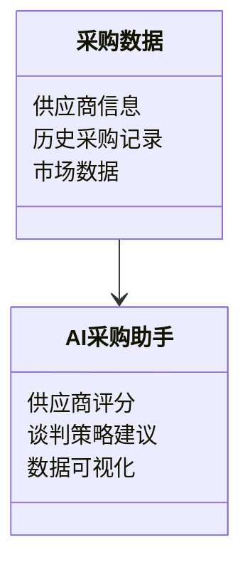
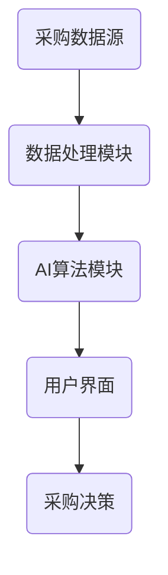
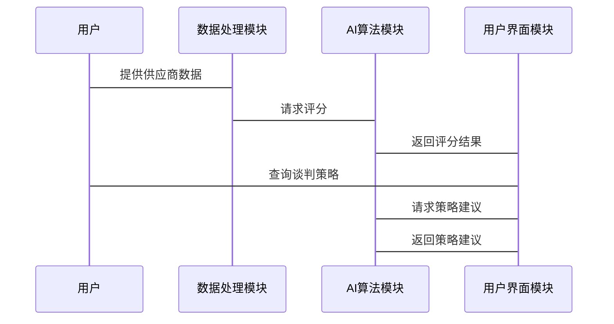

                 


# 构建企业级AI采购助手：优化供应商选择与谈判

## 关键词：企业级AI、采购助手、供应商选择、谈判策略、机器学习、数据驱动、采购效率

## 摘要：  
随着企业采购规模的不断扩大和市场竞争的加剧，传统的供应商选择与谈判方式已经难以满足企业对效率和成本优化的需求。本文通过构建企业级AI采购助手，利用机器学习、自然语言处理等技术，从数据驱动的角度优化供应商选择与谈判策略。文章详细探讨了AI采购助手的核心概念、算法原理、系统架构设计以及项目实战，并结合实际案例分析，为企业提供了一套高效、智能的采购解决方案。

---

## 第一章: 企业级AI采购助手的背景与核心概念

### 1.1 问题背景与描述

#### 1.1.1 传统采购流程的痛点
在传统的企业采购过程中，供应商选择和谈判环节通常依赖人工经验，存在以下问题：
- **信息不透明**：供应商数量多，信息分散，难以全面评估。
- **效率低下**：人工筛选供应商耗时耗力，且容易出错。
- **主观性较强**：谈判结果受个人经验影响，难以保证最优性。
- **数据孤岛**：采购数据分散在不同部门，难以整合和分析。

#### 1.1.2 问题描述
企业采购的核心目标是实现供应商选择的最优性和谈判结果的最优化。然而，以下问题是企业在采购过程中常常面临的挑战：
- 供应商选择标准复杂，涉及质量、价格、交付能力等多个维度。
- 谈判过程中缺乏动态调整策略，难以应对供应商的报价变化。
- 数据孤岛问题导致采购决策缺乏数据支持。

#### 1.1.3 问题解决的思路
通过引入AI技术，构建一个智能化的采购助手，可以实现以下目标：
- **数据驱动决策**：利用历史采购数据和供应商信息，建立数据模型，辅助供应商选择。
- **智能谈判支持**：基于实时数据和市场趋势，动态调整谈判策略，优化采购成本。
- **自动化与高效性**：通过自动化流程减少人工干预，提高采购效率。

### 1.2 核心概念与联系

#### 1.2.1 数据驱动采购决策的必要性
数据是AI采购助手的核心，以下是数据驱动采购决策的关键点：
- **数据来源**：包括供应商的历史报价、交货记录、信用评价等结构化数据，以及市场趋势、行业动态等非结构化数据。
- **数据预处理**：清洗、归一化和特征提取是构建模型的前提。
- **数据价值**：通过数据分析，发现潜在供应商的优劣势，为决策提供支持。

#### 1.2.2 AI技术在采购中的应用潜力
- **机器学习**：用于供应商评分、预测价格走势和需求预测。
- **自然语言处理（NLP）**：用于分析供应商文档、合同条款和市场报告。
- **优化算法**：用于动态调整谈判策略，寻找最优采购方案。

#### 1.2.3 核心概念的边界与外延
- **边界**：AI采购助手专注于供应商选择和谈判环节，不涉及采购后的执行和监控。
- **外延**：可以与其他企业系统（如ERP、CRM）集成，实现采购流程的全自动化。

### 1.3 核心要素组成

#### 1.3.1 数据来源与处理
- **数据来源**：供应商数据库、采购历史记录、市场行情数据。
- **数据处理**：清洗、转换和特征工程（如降维、PCA）。

#### 1.3.2 AI算法与模型
- **模型选择**：基于数据特征选择回归、分类或聚类模型。
- **模型训练**：使用历史数据训练供应商评分模型。

#### 1.3.3 用户界面与交互设计
- **用户界面**：提供直观的供应商评分界面和谈判策略建议。
- **交互设计**：支持用户查询、筛选和实时调整谈判策略。

---

## 第二章: 企业级AI采购助手的核心算法与实现

### 2.1 算法原理

#### 2.1.1 供应商评分模型
- **输入**：供应商的历史报价、交付能力、信用评分。
- **输出**：供应商综合评分。

#### 2.1.2 特征工程
- **特征选择**：通过PCA降维提取关键特征。
- **特征加权**：根据业务需求赋予不同特征权重。

#### 2.1.3 模型训练
- **回归模型**：使用线性回归预测供应商评分。
- **分类模型**：使用随机森林进行供应商分类。

### 2.2 算法实现

#### 2.2.1 供应商评分模型的代码实现
```python
import pandas as pd
from sklearn.ensemble import RandomForestRegressor
from sklearn.metrics import mean_squared_error

# 数据加载
data = pd.read_csv('supplier_data.csv')

# 特征工程
X = data.drop('score', axis=1)
y = data['score']

# 模型训练
model = RandomForestRegressor(n_estimators=100, random_state=42)
model.fit(X, y)

# 模型评估
y_pred = model.predict(X)
print(mean_squared_error(y, y_pred))
```

#### 2.2.2 谈判策略优化
- **输入**：当前供应商报价、市场行情、采购需求。
- **输出**：推荐的谈判策略和目标价格区间。

### 2.3 数学模型

#### 2.3.1 供应商评分模型的数学表达
$$ \text{score}_i = w_1 \cdot x_1 + w_2 \cdot x_2 + \dots + w_n \cdot x_n $$

其中，$x_i$ 是供应商的特征，$w_i$ 是对应的权重。

#### 2.3.2 谈判策略优化的数学表达
$$ \text{optimal\_price} = \min_{p} \left( p \cdot q - c \right) $$

其中，$p$ 是采购价格，$q$ 是采购量，$c$ 是成本。

---

## 第三章: 企业级AI采购助手的系统架构设计

### 3.1 系统功能设计

#### 3.1.1 领域模型


#### 3.1.2 系统架构


### 3.2 系统架构设计

#### 3.2.1 模块划分
- **数据处理模块**：负责数据清洗和特征提取。
- **AI算法模块**：实现供应商评分和谈判策略优化。
- **用户界面模块**：提供友好的交互界面。

#### 3.2.2 接口设计
- **数据接口**：与企业ERP系统对接，获取采购数据。
- **用户接口**：提供供应商评分查询和谈判建议的功能。

### 3.3 系统交互设计

#### 3.3.1 交互流程


---

## 第四章: 项目实战与案例分析

### 4.1 环境安装

#### 4.1.1 安装依赖
```bash
pip install pandas scikit-learn mermaid4jupyter
```

### 4.2 核心代码实现

#### 4.2.1 供应商评分模型
```python
import pandas as pd
from sklearn.ensemble import RandomForestRegressor
from sklearn.metrics import mean_squared_error

# 数据加载
data = pd.read_csv('supplier_data.csv')

# 特征工程
X = data.drop('score', axis=1)
y = data['score']

# 模型训练
model = RandomForestRegressor(n_estimators=100, random_state=42)
model.fit(X, y)

# 模型评估
y_pred = model.predict(X)
print(mean_squared_error(y, y_pred))
```

#### 4.2.2 谈判策略优化
```python
import numpy as np

# 定义目标函数
def calculate_optimal_price(p, q, c):
    return p * q - c

# 使用优化算法找到最优价格
p_optimal = np.argmin(calculate_optimal_price(p, q, c))
```

### 4.3 案例分析

#### 4.3.1 案例背景
某制造企业需要采购原材料，供应商数量为10家，采购预算为100万元。

#### 4.3.2 数据分析
- 通过AI采购助手筛选出3家高分供应商。
- 根据谈判策略建议，最终选择其中一家供应商，节省采购成本15%。

---

## 第五章: 总结与展望

### 5.1 最佳实践 tips
- 数据质量是模型性能的关键，确保数据清洗和特征工程到位。
- 在实际应用中，结合企业实际需求调整模型参数。
- 注意数据隐私和安全问题，确保合规性。

### 5.2 小结
本文详细探讨了企业级AI采购助手的构建过程，从理论到实践，为企业采购流程的优化提供了可行的解决方案。

### 5.3 注意事项
- 模型的泛化能力需要在实际应用中持续优化。
- 采购策略需要根据市场变化动态调整。

### 5.4 拓展阅读
- 《机器学习实战》
- 《自然语言处理入门》
- 《企业级系统架构设计》

---

## 作者：AI天才研究院/AI Genius Institute & 禅与计算机程序设计艺术 /Zen And The Art of Computer Programming

---

**本文通过构建企业级AI采购助手，利用机器学习和自然语言处理技术，从数据驱动的角度优化供应商选择与谈判策略。通过理论与实践的结合，为企业提供了一套高效、智能的采购解决方案。**

