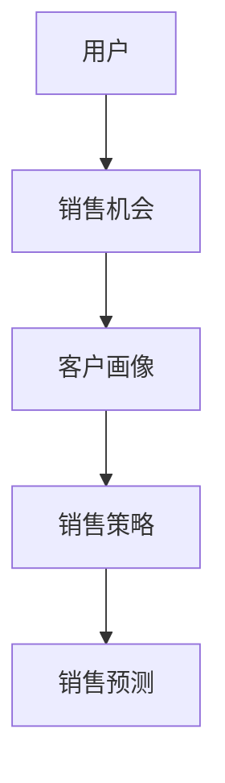
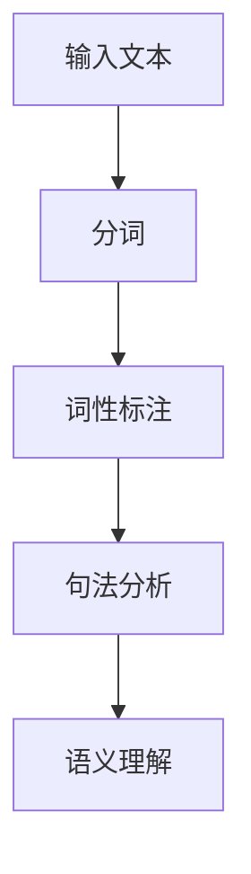
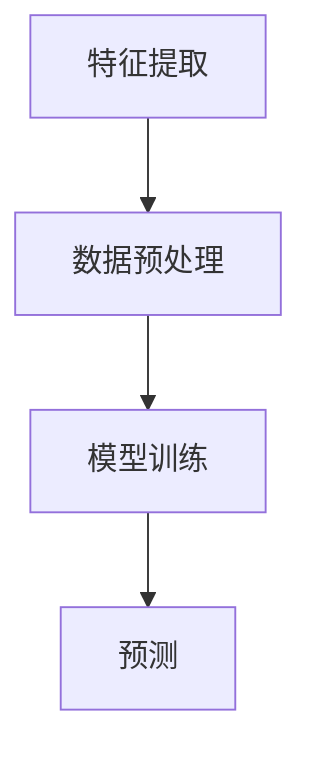
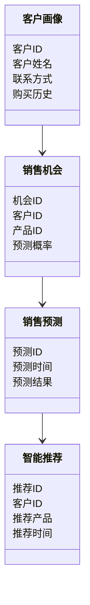
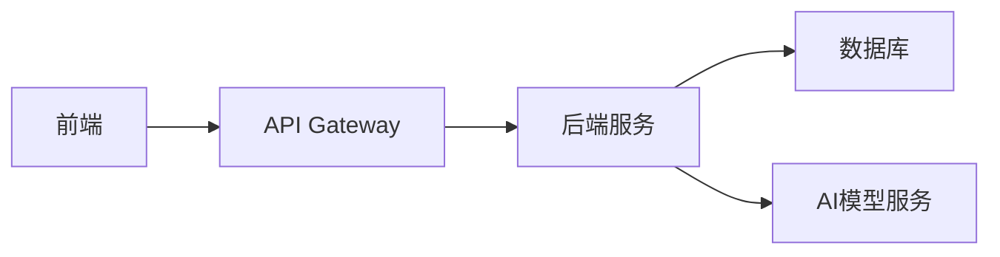
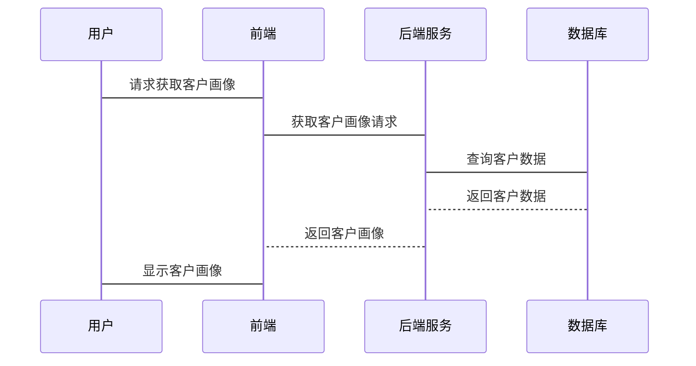

                 


# 构建企业级AI销售助手：提升转化率与客户满意度

> 关键词：企业级AI销售助手，销售转化率，客户满意度，AI技术，自然语言处理，机器学习，销售预测

> 摘要：本文将深入探讨如何利用AI技术构建企业级销售助手，通过自然语言处理、机器学习和情感分析等技术手段，解决传统销售工具的局限性，提升销售转化率和客户满意度。文章将从背景分析、核心概念、算法原理、系统架构、项目实战等多个维度展开，全面解析企业级AI销售助手的构建过程。

---

## 第一部分：企业级AI销售助手的背景与核心概念

### 第1章：企业级AI销售助手的背景与问题背景

#### 1.1 问题背景

##### 1.1.1 当前企业销售面临的挑战
- **销售效率低下**：传统销售流程依赖人工操作，信息处理效率低，导致销售周期延长。
- **客户需求多样化**：客户期望个性化服务，但传统销售工具难以满足。
- **数据孤岛问题**：企业内部数据分散，难以形成统一的客户画像和销售策略。

##### 1.1.2 传统销售工具的局限性
- **功能单一**：传统CRM系统功能有限，难以实现智能化分析。
- **缺乏预测能力**：无法通过历史数据预测销售趋势和客户行为。
- **客户体验差**：难以提供实时、个性化的客户互动。

##### 1.1.3 AI技术在销售领域的应用潜力
- **智能化推荐**：通过AI分析客户行为，提供个性化的产品推荐。
- **精准预测**：利用机器学习算法预测销售机会和客户流失风险。
- **实时互动**：通过NLP技术实现智能对话，提升客户满意度。

#### 1.2 问题描述

##### 1.2.1 销售转化率低的原因分析
- **客户需求未匹配**：销售人员无法准确理解客户需求，推荐的产品不符合客户期望。
- **销售流程不优化**：缺乏对销售流程的实时监控和调整，导致潜在客户流失。
- **客户信任不足**：传统销售模式难以建立客户的信任感。

##### 1.2.2 客户满意度低的常见问题
- **服务响应慢**：客户提出问题后，无法及时得到反馈。
- **服务不个性化**：缺乏对客户个性化需求的关注。
- **信息不透明**：客户对销售过程和产品信息缺乏透明度。

##### 1.2.3 企业销售流程中的效率瓶颈
- **信息重复录入**：销售人员需要在多个系统中重复录入数据，效率低下。
- **决策缺乏数据支持**：销售决策依赖经验而非数据驱动。
- **团队协作不足**：销售团队之间缺乏有效的信息共享和协作。

#### 1.3 问题解决

##### 1.3.1 AI销售助手的核心目标
- 提高销售转化率：通过智能推荐和预测，帮助销售人员抓住潜在机会。
- 提升客户满意度：通过个性化服务和实时互动，增强客户信任感。
- 优化销售流程：通过数据驱动的决策，提升销售效率。

##### 1.3.2 AI技术如何提升销售效率
- **自动化数据处理**：AI可以自动整理和分析销售数据，减少人工操作。
- **智能推荐**：通过分析客户行为和偏好，推荐最适合的产品或服务。
- **实时反馈**：AI可以实时监控销售过程，提供及时反馈和调整建议。

##### 1.3.3 提升客户满意度的AI解决方案
- **智能对话系统**：通过NLP技术实现自然语言交互，提供个性化的客户支持。
- **情感分析**：分析客户反馈，识别潜在不满情绪，及时采取措施。
- **个性化推荐**：根据客户偏好推荐产品，增强客户购买体验。

#### 1.4 边界与外延

##### 1.4.1 AI销售助手的功能边界
- **核心功能**：销售机会预测、客户画像、销售推荐。
- **非核心功能**：数据录入、基础报表生成。

##### 1.4.2 与CRM系统的区别与联系
- **区别**：AI销售助手通过AI技术提供智能化的销售支持，而传统CRM系统主要依赖人工操作。
- **联系**：AI销售助手可以与CRM系统无缝对接，提供数据支持和智能分析。

##### 1.4.3 与其他销售工具的对比分析
- **对比维度**：功能、性能、用户体验。
- **结论**：AI销售助手在智能化和数据分析能力上具有显著优势。

#### 1.5 概念结构与核心要素

##### 1.5.1 AI销售助手的核心要素分析
- **客户画像**：通过收集和分析客户数据，形成客户画像。
- **销售预测**：基于历史数据和机器学习模型，预测销售机会。
- **智能推荐**：根据客户画像和销售预测结果，推荐最适合的产品或服务。

##### 1.5.2 核心要素之间的关系
- **客户画像**与**销售预测**：客户画像是销售预测的基础，销售预测基于客户画像和历史数据。
- **销售预测**与**智能推荐**：销售预测结果为智能推荐提供数据支持。

##### 1.5.3 概念结构图


#### 1.6 本章小结
本章通过分析企业级AI销售助手的背景和问题背景，明确了AI销售助手的核心目标和功能边界。接下来将深入探讨AI销售助手的核心概念与联系。

---

### 第2章：AI销售助手的核心概念与联系

#### 2.1 核心概念原理

##### 2.1.1 自然语言处理（NLP）原理
- **分词**：将文本分割成词语或短语。
- **词性标注**：识别每个词语的词性（名词、动词等）。
- **句法分析**：分析句子的语法结构。
- **语义理解**：理解文本的含义和意图。

##### 2.1.2 机器学习在销售预测中的应用
- **特征提取**：从数据中提取有用的特征，如客户年龄、购买历史等。
- **数据预处理**：清洗数据，处理缺失值和异常值。
- **模型训练**：使用训练数据训练机器学习模型。
- **预测与评估**：利用训练好的模型进行预测，并评估模型性能。

##### 2.1.3 情感分析在客户满意度中的作用
- **情感分类**：将客户反馈分为正面、负面或中性。
- **情感强度分析**：量化客户情感的强弱程度。
- **情感趋势分析**：分析客户情感随时间的变化趋势。

#### 2.2 核心概念属性特征对比表格

| 概念       | 特征1：准确性 | 特征2：实时性 | 特征3：可解释性 |
|------------|--------------|--------------|----------------|
| NLP         | 高            | 中            | 低              |
| 机器学习     | 中            | 高            | 低              |
| 情感分析     | 中            | 高            | 高              |

#### 2.3 ER实体关系图



#### 2.4 本章小结
本章通过分析AI销售助手的核心概念与联系，明确了NLP、机器学习和情感分析在销售中的作用。接下来将深入探讨AI销售助手的算法原理与数学模型。

---

### 第3章：AI销售助手的算法原理与数学模型

#### 3.1 算法原理

##### 3.1.1 自然语言处理流程



##### 3.1.2 机器学习分类算法



#### 3.2 数学模型与公式

##### 3.2.1 情感分析模型

$$ P(\text{正面}|x) = \frac{\exp(w \cdot x)}{1 + \exp(w \cdot x)} $$

##### 3.2.2 销售预测模型

$$ \hat{y} = \beta_0 + \beta_1x_1 + \beta_2x_2 + \ldots + \beta_nx_n $$

#### 3.3 本章小结
本章通过详细讲解AI销售助手的算法原理与数学模型，明确了NLP、机器学习和情感分析的核心作用。接下来将深入探讨系统分析与架构设计方案。

---

## 第二部分：系统分析与架构设计方案

### 第4章：系统分析与架构设计

#### 4.1 问题场景介绍
- **目标**：构建一个基于AI的销售助手，提升销售转化率和客户满意度。
- **场景**：销售人员通过AI销售助手获取客户画像、销售预测和智能推荐。

#### 4.2 项目介绍
- **项目目标**：构建企业级AI销售助手，提供智能化的销售支持。
- **项目范围**：涵盖客户画像、销售预测、智能推荐等功能。

#### 4.3 系统功能设计

##### 4.3.1 领域模型



#### 4.4 系统架构设计

##### 4.4.1 系统架构图



##### 4.4.2 系统接口设计
- **接口1**：获取客户画像。
- **接口2**：预测销售机会。
- **接口3**：智能推荐产品。

#### 4.5 系统交互设计

##### 4.5.1 序列图



#### 4.6 本章小结
本章通过系统分析与架构设计，明确了AI销售助手的整体架构和功能模块。接下来将深入探讨项目实战，包括环境安装、核心代码实现、案例分析等内容。

---

## 第三部分：项目实战

### 第5章：项目实战

#### 5.1 环境安装
- **Python版本**：3.8及以上
- **依赖库**：numpy、pandas、scikit-learn、spacy、flair

#### 5.2 核心代码实现

##### 5.2.1 客户画像构建

```python
import pandas as pd
from flair.data import Corpus, Sentence
from flair.trainers import Trainer
from flair.models import SequenceTagger

# 加载数据
data = pd.read_csv('customer_data.csv')

# 数据预处理
sentences = [Sentence(text) for text in data['description']]

# 创建语料库
corpus = Corpus(sentences)

# 定义模型
tagger = SequenceTagger(tag_type='ner', tag_dictionary=corpus.tag_dictionary)

# 训练模型
trainer = Trainer(tagger, corpus)
trainer.train('ner_model', epochs=10)
```

##### 5.2.2 销售预测模型

```python
from sklearn.model

