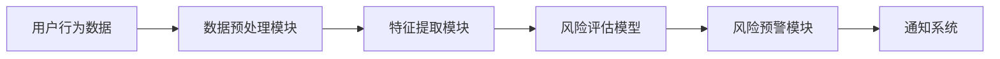
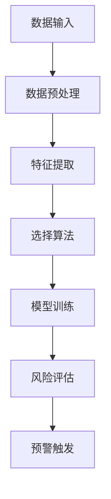
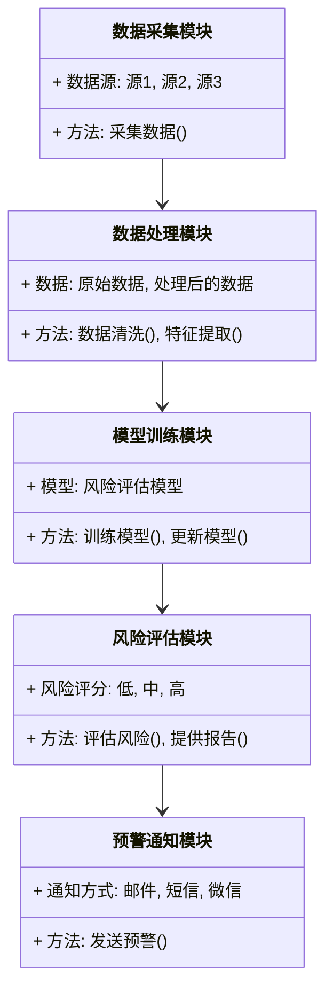
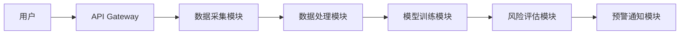

                 


```markdown
# 构建企业级AI风控助手：实时监控与风险预警

> 关键词：实时监控、风险预警、AI风控助手、企业级系统、异常检测、时间序列分析、风险评估

> 摘要：本文详细探讨了如何利用人工智能技术构建企业级AI风控助手，实现实时监控与风险预警。文章从背景介绍、核心概念、算法原理、系统架构、项目实战、最佳实践等多方面展开，结合实际案例分析，为读者提供了全面的技术指导。

---

# 第一部分：企业级AI风控助手的背景与概念

## 第1章：企业级AI风控助手概述

### 1.1 问题背景
#### 1.1.1 企业风控的传统挑战
传统的风控系统依赖人工监控和静态规则，存在响应速度慢、覆盖范围有限、误报率高等问题。随着企业业务的复杂化和数据的爆炸式增长，传统方法难以满足实时性和精准性的要求。

#### 1.1.2 AI技术在风控中的应用潜力
人工智能技术，尤其是机器学习和深度学习，能够从海量数据中提取特征，发现潜在风险，并实时做出预警。AI技术的应用可以显著提高风控系统的效率和准确性。

#### 1.1.3 企业级AI风控助手的目标与意义
企业级AI风控助手的目标是通过实时数据分析和智能模型，快速识别潜在风险，提供精准的预警信息，帮助企业在风险发生前采取措施，降低损失。

### 1.2 问题描述
#### 1.2.1 风险监控的核心问题
- 如何实时捕捉异常行为和模式？
- 如何快速响应潜在风险？
- 如何确保系统的高可用性和稳定性？

#### 1.2.2 实时监控的难点与痛点
- 数据量大，实时处理能力要求高
- 异常模式多样，传统规则难以覆盖
- 系统需要高容错性和可扩展性

#### 1.2.3 风险预警的业务需求
- 提供实时的预警信息
- 支持多维度的数据分析和可视化
- 提供可定制的预警规则

### 1.3 解决方案概述
#### 1.3.1 AI技术如何解决传统风控问题
- 利用机器学习算法自动识别异常模式
- 通过深度学习技术分析非结构化数据
- 基于实时数据分析实现快速响应

#### 1.3.2 企业级AI风控助手的核心功能
- 实时数据采集与处理
- 异常检测与风险评估
- 风险预警与通知
- 可视化分析与报告生成

#### 1.3.3 系统架构与技术选型
- 分层架构设计
- 高可用性和可扩展性的技术选型
- 数据存储与处理的技术方案

### 1.4 系统边界与外延
#### 1.4.1 系统功能边界
- �界定了系统的功能范围，明确与其他系统的接口
- 确定了数据来源和处理范围
- 定义了预警通知的范围和方式

#### 1.4.2 与现有系统的集成
- 如何与企业现有的IT系统集成
- 数据接口的设计与实现
- 系统之间的数据流和交互流程

#### 1.4.3 系统的可扩展性与灵活性
- 模块化设计便于功能扩展
- 支持多种数据源和多种预警方式
- 灵活的配置管理

### 1.5 核心概念结构
#### 1.5.1 系统组成模块
- 数据采集模块
- 数据处理模块
- 模型训练模块
- 风险评估模块
- 预警通知模块

#### 1.5.2 模块之间的关系
- 数据采集模块向数据处理模块提供原始数据
- 数据处理模块为模型训练模块提供特征数据
- 模型训练模块输出风险评估结果给风险评估模块
- 风险评估模块触发预警通知模块

#### 1.5.3 核心要素的定义与属性
- 数据采集：来源、格式、频率
- 数据处理：清洗、转换、特征提取
- 模型训练：算法选择、参数设置、评估指标
- 风险评估：评分机制、阈值设置、预警级别
- 预警通知：通知方式、接收人、触发条件

---

## 第2章：核心概念与系统架构

### 2.1 核心概念原理
#### 2.1.1 数据流与处理流程
- 数据采集：实时采集企业业务数据
- 数据预处理：清洗、转换、标准化
- 特征提取：从数据中提取有效特征
- 模型训练：基于特征训练风险评估模型
- 风险评估：利用模型对实时数据进行评估
- 预警通知：根据评估结果触发预警

#### 2.1.2 AI算法在风控中的应用
- 时间序列分析：用于检测数据中的趋势和周期性
- 异常检测：识别数据中的异常点
- 风险评分：基于多种特征计算风险评分
- 机器学习模型：如随机森林、XGBoost等

#### 2.1.3 风险预警机制的设计
- 预警级别：根据风险评分划分预警级别
- 预警策略：定制化的预警规则
- 预警触发：当风险评分超过阈值时触发预警
- 预警通知：通过多种方式通知相关人员

### 2.2 核心概念属性对比
#### 2.2.1 不同风险指标的对比分析
- 比较不同风险指标的计算方法、适用场景和优缺点
- 例如，比较孤立森林和K近邻算法在异常检测中的表现

#### 2.2.2 数据源的特征对比
- 数据的实时性、准确性、完整性对比
- 数据格式、数据量、数据更新频率对比

#### 2.2.3 算法模型的优劣势对比
- 时间序列分析：优点是适合时序数据，缺点是需要足够的历史数据
- 异常检测：优点是能够发现未知异常模式，缺点是需要大量数据训练

### 2.3 系统实体关系图


### 2.4 系统架构设计
#### 2.4.1 分层架构设计
- 数据采集层：负责实时数据采集
- 数据处理层：负责数据预处理和特征提取
- 模型训练层：负责训练和更新风险评估模型
- 应用层：负责风险评估和预警通知

#### 2.4.2 模块化设计原则
- 每个模块独立开发和测试
- 模块之间通过接口通信
- 模块化设计便于功能扩展和维护

#### 2.4.3 可扩展性设计
- 支持多种数据源的接入
- 支持多种算法模型的集成
- 支持多种预警方式的通知

---

## 第3章：算法原理与数学模型

### 3.1 算法概述
#### 3.1.1 时间序列分析
- 时间序列分析的基本概念
- 常用的时间序列模型：ARIMA、LSTM
- 时间序列分析在风控中的应用

#### 3.1.2 异常检测算法
- 异常检测的基本概念
- 常用的异常检测算法：孤立森林、K近邻、基于聚类的异常检测
- 异常检测在风控中的应用

#### 3.1.3 风险评分模型
- 风险评分的基本概念
- 常用的风险评分模型：分数概率模型、评分卡
- 风险评分在风控中的应用

### 3.2 算法流程图


### 3.3 算法实现细节
#### 3.3.1 时间序列分析
- 使用LSTM进行时间序列预测的代码示例
- LSTM模型的结构和训练过程
- 时间序列预测的评估指标

#### 3.3.2 异常检测
- 使用孤立森林算法进行异常检测的代码示例
- 异常检测算法的训练过程
- 异常检测的评估指标

#### 3.3.3 风险评分模型
- 使用XGBoost进行风险评分的代码示例
- 风险评分模型的训练过程
- 风险评分的评估指标

### 3.4 数学公式
#### 3.4.1 时间序列分析
- ARIMA模型的公式
- LSTM的结构公式

#### 3.4.2 异常检测
- Isolation Forest算法的公式

#### 3.4.3 风险评分
- 评分卡的公式

### 3.5 算法优劣势分析
- 时间序列分析的优劣势
- 异常检测的优劣势
- 风险评分模型的优劣势

---

## 第4章：系统分析与架构设计方案

### 4.1 问题场景介绍
- 系统需要实现实时监控和风险预警
- 系统需要支持多种数据源和多种预警方式
- 系统需要具备高可用性和可扩展性

### 4.2 项目介绍
- 项目目标：构建企业级AI风控助手
- 项目范围：涵盖数据采集、处理、模型训练、风险评估和预警通知
- 项目约束：实时性要求高、数据量大、系统需要高可用性

### 4.3 系统功能设计
#### 4.3.1 领域模型


#### 4.3.2 系统架构设计


#### 4.3.3 系统接口设计
- API接口的设计：RESTful API
- 接口的输入和输出：JSON格式
- 接口的安全性：API Key认证

#### 4.3.4 系统交互流程
- 用户发起请求，经过API Gateway到数据采集模块
- 数据采集模块采集数据并传递给数据处理模块
- 数据处理模块处理数据并传递给模型训练模块
- 模型训练模块训练模型并传递给风险评估模块
- 风险评估模块评估风险并触发预警通知模块

---

## 第5章：项目实战

### 5.1 环境安装
- 安装Python、Jupyter Notebook、TensorFlow、Scikit-learn、Flask
- 安装数据库和消息队列：MySQL、RabbitMQ

### 5.2 核心代码实现
#### 5.2.1 数据采集模块
```python
import requests

def fetch_data(api_url):
    response = requests.get(api_url)
    return response.json()
```

#### 5.2.2 数据处理模块
```python
import pandas as pd

def preprocess_data(data):
    df = pd.DataFrame(data)
    df.dropna(inplace=True)
    return df
```

#### 5.2.3 模型训练模块
```python
from sklearn.ensemble import IsolationForest

def train_model(X):
    model = IsolationForest(random_state=42)
    model.fit(X)
    return model
```

#### 5.2.4 风险评估模块
```python
def assess_risk(model, X):
    risk_scores = model.predict(X)
    return risk_scores
```

#### 5.2.5 预警通知模块
```python
import smtplib

def send_email.notification(to_email, subject, body):
    server = smtplib.SMTP('smtp.example.com', 587)
    server.starttls()
    server.login('your_email', 'your_password')
    message = f"Subject: {subject}\n\n{body}"
    server.sendmail('your_email', to_email, message)
    server.quit()
```

### 5.3 案例分析与详细讲解
- 案例背景：某企业的在线交易系统
- 数据来源：交易记录、用户行为日志
- 数据处理：清洗、转换、特征提取
- 模型训练：使用孤立森林算法进行异常检测
- 风险评估：评估交易风险并触发预警
- 预警通知：通过邮件通知风控团队

### 5.4 项目小结
- 项目实现的关键点
- 项目实现的难点与解决方法
- 项目的未来改进方向

---

## 第6章：最佳实践与小结

### 6.1 最佳实践
#### 6.1.1 数据质量管理
- 数据清洗、数据验证、数据增强

#### 6.1.2 模型优化
- 参数调优、模型集成、模型解释性

#### 6.1.3 系统优化
- 系统性能优化、系统安全性提升、系统可扩展性设计

### 6.2 小结
- 企业级AI风控助手的核心功能
- 项目实现的关键步骤
- 项目成功实施的关键因素

### 6.3 注意事项
- 数据隐私和安全问题
- 模型的可解释性问题
- 系统的实时性和稳定性问题

### 6.4 拓展阅读
- 推荐的相关书籍和论文
- 推荐的相关技术博客和在线资源

---

## 第7章：案例分析与详细讲解

### 7.1 案例背景
- 某银行的信用卡 fraud detection 系统
- 数据来源：信用卡交易记录、用户行为日志、设备信息
- 业务需求：实时检测信用卡欺诈交易

### 7.2 数据处理
- 数据清洗：处理缺失值、重复值、异常值
- 数据转换：特征提取、标准化、归一化
- 数据增强：增加时间戳、用户行为特征

### 7.3 模型训练
- 使用时间序列分析模型（LSTM）进行异常检测
- 使用评分卡模型进行风险评分

### 7.4 系统实现
- 实时数据采集：通过API接口获取实时交易数据
- 数据处理：使用Flask框架构建API
- 模型训练：使用Keras训练LSTM模型
- 风险评估：根据模型输出的风险评分触发预警
- 预警通知：通过邮件和短信通知风控团队

### 7.5 详细讲解
- 数据流的详细流程
- 模型训练的详细步骤
- 系统实现的详细代码

---

## 第8章：系统优化与未来展望

### 8.1 系统优化
#### 8.1.1 性能优化
- 使用分布式计算加速数据处理
- 使用缓存技术优化数据访问

#### 8.1.2 系统安全性优化
- 数据加密存储和传输
- 权限控制和访问控制

#### 8.1.3 系统可扩展性优化
- 使用微服务架构设计
- 使用容器化技术部署

### 8.2 未来展望
- AI技术在风控中的进一步应用
- 新兴技术（如区块链、边缘计算）在风控中的应用
- 风险评估模型的进一步优化

---

## 第9章：总结与展望

### 9.1 总结
- 企业级AI风控助手的核心功能和实现步骤
- 项目实施的关键点和难点
- 项目成功实施的效益

### 9.2 未来展望
- AI技术在风控中的应用前景
- 新技术对风控系统的影响
- 风险评估模型的未来发展方向

---

## 第10章：参考文献与致谢

### 10.1 参考文献
- 列出参考的书籍、论文、技术博客等

### 10.2 致谢
- 感谢参与项目开发的团队成员
- 感谢提供数据和资源的机构

---

## 作者：AI天才研究院/AI Genius Institute & 禅与计算机程序设计艺术 /Zen And The Art of Computer Programming
```

