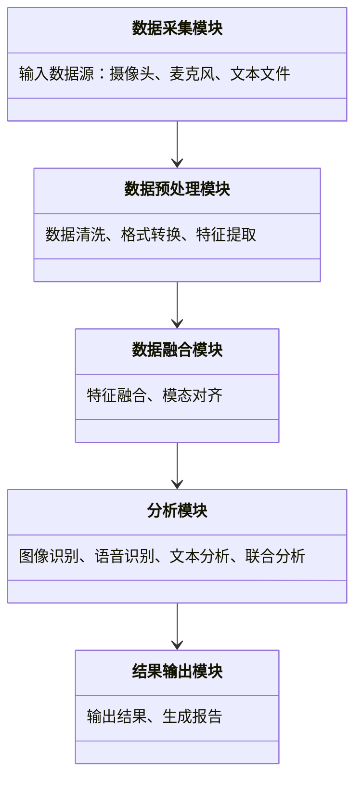
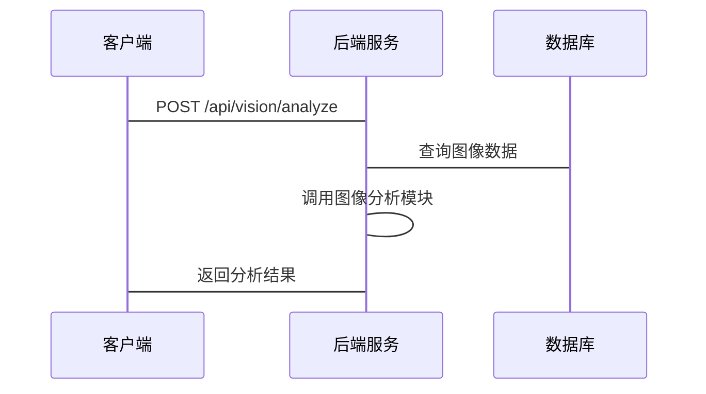

                 


# 构建企业级多模态AI平台：整合视觉、语音与文本的综合分析系统

> 关键词：多模态AI、机器学习、深度学习、NLP、语音识别、图像处理

> 摘要：本文详细探讨了构建企业级多模态AI平台的过程，整合视觉、语音与文本数据，实现综合分析系统的解决方案。通过分析问题背景、核心概念、算法原理、系统架构、项目实战及最佳实践，为读者提供全面的技术指导。

---

## 第一部分: 背景介绍

## 第1章: 多模态AI平台的背景与挑战

### 1.1 问题背景

#### 1.1.1 当前企业信息化的发展现状
企业信息化已进入深度发展阶段，数据来源多样化，包括文本、图像、语音等多模态数据。传统单模态系统难以满足复杂场景的需求，限制了企业的智能化升级。

#### 1.1.2 多模态数据处理的必要性
现代企业需要处理和分析多种数据类型，单一模态分析无法覆盖所有需求，多模态数据处理成为必然趋势。

#### 1.1.3 传统单模态系统的局限性
传统系统无法有效整合多种数据源，导致信息孤岛和分析不全面，影响决策的准确性和效率。

### 1.2 问题描述

#### 1.2.1 多模态数据整合的难点
多模态数据格式多样，采集、存储和处理复杂，需要统一的数据管理策略。

#### 1.2.2 多模态分析的需求
企业需要跨模态的数据分析能力，以提供更全面的洞察和决策支持。

#### 1.2.3 系统集成与扩展性问题
多模态平台需要良好的扩展性，以适应不同业务场景和数据规模的变化。

### 1.3 问题解决

#### 1.3.1 多模态AI平台的设计目标
构建一个能够整合视觉、语音和文本数据，提供综合分析能力的平台，支持企业智能化应用。

#### 1.3.2 关键技术的选择与实现
选择先进的AI技术，如深度学习、NLP和计算机视觉，实现多模态数据的融合和分析。

#### 1.3.3 平台架构的设计原则
采用分层架构，确保系统的模块化、可扩展性和可维护性。

### 1.4 边界与外延

#### 1.4.1 系统边界定义
平台仅处理视觉、语音和文本数据，不涉及其他类型数据的处理。

#### 1.4.2 功能的外延与扩展
平台可扩展至其他模态数据，支持更多应用场景，如视频分析和多语言处理。

#### 1.4.3 与其他系统的接口定义
定义统一的API接口，确保与其他系统如CRM和ERP的集成。

### 1.5 概念结构与核心要素

#### 1.5.1 多模态数据流的处理流程
数据采集、预处理、融合、分析、结果输出。

#### 1.5.2 平台功能模块的划分
数据采集模块、预处理模块、融合模块、分析模块和结果输出模块。

#### 1.5.3 核心要素的关联关系
数据流贯穿各模块，各模块通过接口协作完成任务。

---

## 第2章: 多模态AI平台的核心概念

### 2.1 多模态AI的定义与特点

#### 2.1.1 多模态数据的定义
多模态数据指多种类型的数据，如图像、语音、文本，用于提供更全面的信息。

#### 2.1.2 多模态AI的核心特点
跨模态分析、数据融合、模块化设计、可扩展性。

### 2.2 多模态数据的整合与分析

#### 2.2.1 数据预处理的关键步骤
标准化、格式转换、去噪、特征提取。

#### 2.2.2 多模态数据融合的方法
基于特征的融合、基于决策的融合、基于模型的融合。

#### 2.2.3 综合分析的实现方式
联合训练、多任务学习、注意力机制。

### 2.3 多模态AI平台的系统架构

#### 2.3.1 分层架构的设计理念
数据层、服务层、应用层，确保模块化和可扩展性。

#### 2.3.2 功能模块划分
数据采集、预处理、融合、分析、结果输出。

#### 2.3.3 架构的可扩展性分析
模块化设计，支持新增模态和功能扩展。

---

## 第3章: 多模态AI平台的算法原理

### 3.1 多模态数据融合算法

#### 3.1.1 多模态数据融合的数学模型
$$ y = f(x_1, x_2, ..., x_n) $$

#### 3.1.2 模型的训练与优化
采用深度学习模型，如Transformer，进行端到端训练。

#### 3.1.3 算法的实现步骤
数据预处理、特征提取、融合、模型训练、结果输出。

### 3.2 多模态分析算法

#### 3.2.1 各模态数据的独立分析
图像识别、语音识别、文本分析。

#### 3.2.2 跨模态关联分析的实现
跨模态注意力机制，关联不同数据源的信息。

#### 3.2.3 综合分析的结果输出
生成联合概率、置信度评分，提供综合决策支持。

### 3.3 算法的实现与优化

#### 3.3.1 算法实现的关键代码
```python
def multi_modal_analysis(x_vision, x_audio, x_text):
    # 融合特征
    fused_features = fusion_layer(x_vision, x_audio, x_text)
    # 联合预测
    output = model(fused_features)
    return output
```

#### 3.3.2 优化策略
模型压缩、并行计算、分布式训练，提升处理效率和准确性。

---

## 第4章: 系统分析与架构设计方案

### 4.1 问题场景介绍

#### 4.1.1 问题场景描述
企业需要整合视觉、语音和文本数据，进行综合分析，支持智能决策。

#### 4.1.2 项目介绍
构建一个多模态AI平台，整合多种数据源，提供分析服务。

### 4.2 系统功能设计

#### 4.2.1 领域模型


### 4.3 系统架构设计

#### 4.3.1 系统架构图


### 4.4 系统接口设计

#### 4.4.1 接口设计
定义RESTful API，如：
- POST /api/vision/analyze
- POST /api/audio/recognize
- POST /api/text/analyze

#### 4.4.2 交互设计


---

## 第5章: 项目实战

### 5.1 环境安装

#### 5.1.1 系统环境
- Python 3.8+
- TensorFlow 2.5+
- PyTorch 1.9+
- OpenCV 4.5+
- Flask 2.0+

#### 5.1.2 安装依赖
```bash
pip install numpy
pip install tensorflow
pip install pytorch
pip install opencv-python
pip install flask
```

### 5.2 系统核心实现源代码

#### 5.2.1 数据预处理模块
```python
import numpy as np

def preprocess_image(image):
    # 标准化处理
    image = image / 255.0
    return image

def preprocess_audio(audio):
    # 降噪处理
    audio = audio.filter()
    return audio
```

#### 5.2.2 数据融合模块
```python
import torch

class MultiModalFuser(torch.nn.Module):
    def __init__(self, vision_dim, audio_dim, text_dim):
        super().__init__()
        self.vision_layer = torch.nn.Linear(vision_dim, 128)
        self.audio_layer = torch.nn.Linear(audio_dim, 128)
        self.text_layer = torch.nn.Linear(text_dim, 128)
        self.final_layer = torch.nn.Linear(384, 1)

    def forward(self, vision_features, audio_features, text_features):
        v = self.vision_layer(vision_features)
        a = self.audio_layer(audio_features)
        t = self.text_layer(text_features)
        combined = torch.cat([v, a, t], dim=1)
        output = self.final_layer(combined)
        return output
```

### 5.3 案例分析与详细解读

#### 5.3.1 案例分析
在企业客服场景中，整合客户的面部表情、语音语调和文本信息，分析客户情绪，提供个性化服务。

#### 5.3.2 代码应用解读
通过代码实现图像识别、语音识别和文本分析，展示多模态数据的融合和分析过程。

### 5.4 项目小结

#### 5.4.1 项目实现的关键点
- 数据预处理：标准化、降噪
- 数据融合：特征对齐、模态融合
- 分析模块：联合训练、注意力机制
- 系统架构：模块化设计、API接口

---

## 第6章: 最佳实践、小结、注意事项与拓展阅读

### 6.1 最佳实践 tips

#### 6.1.1 数据质量管理
确保数据的准确性和完整性，避免噪声干扰。

#### 6.1.2 模型优化
采用轻量化模型，平衡准确性和计算效率。

#### 6.1.3 系统安全性
确保数据隐私和系统安全，遵循相关法律法规。

### 6.2 小结

构建企业级多模态AI平台是一项复杂的系统工程，需要整合多种技术，实现数据的高效处理和综合分析。通过模块化设计和先进算法，平台能够为企业提供强大的决策支持。

### 6.3 注意事项

- 数据隐私和安全问题需高度重视。
- 系统设计需考虑可扩展性和可维护性。
- 模型训练需选择合适的硬件资源，确保训练效率。

### 6.4 拓展阅读

推荐书籍和论文，深入学习多模态AI技术和系统设计。

---

## 作者信息

作者：AI天才研究院/AI Genius Institute & 禅与计算机程序设计艺术 /Zen And The Art of Computer Programming

---

感谢您的耐心阅读，希望本文能为您提供有价值的技术指导，助您成功构建企业级多模态AI平台。

