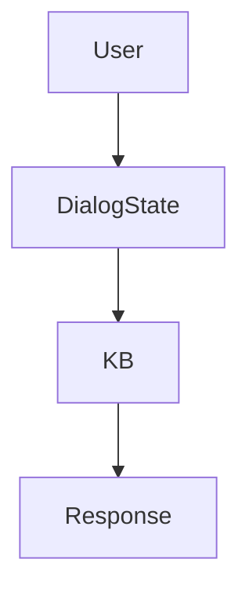
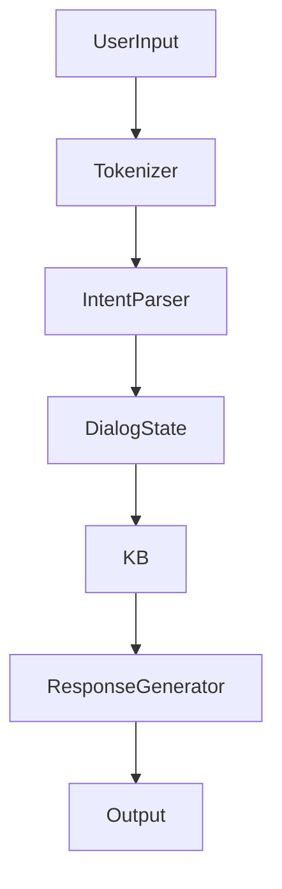
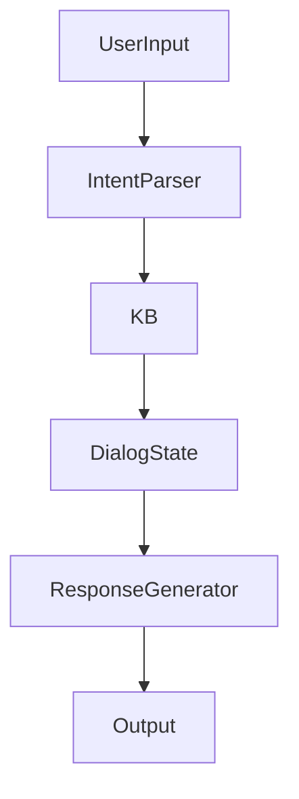
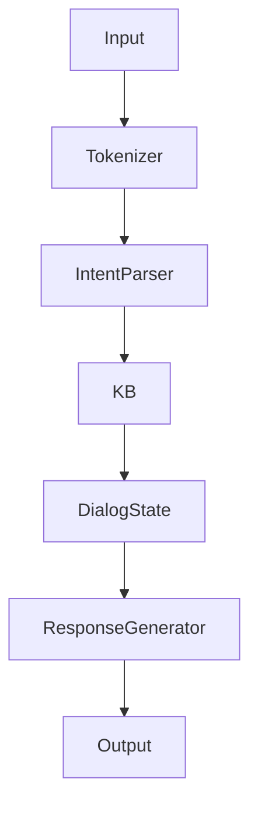
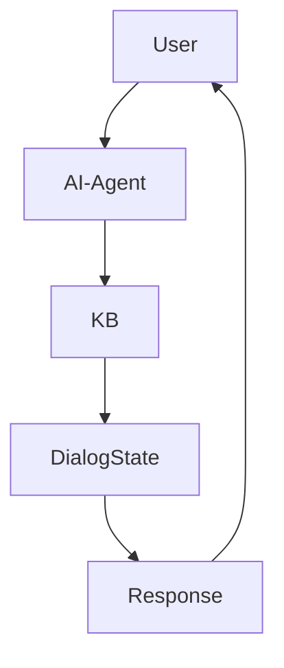

                 


# 《构建企业级对话式AI Agent：提升内部沟通效率》

---

## 关键词：
- 企业级对话式AI Agent
- 内部沟通效率
- 自然语言处理（NLP）
- 对话状态表示
- 意图识别
- 系统架构设计

---

## 摘要：
本篇文章详细探讨了构建企业级对话式AI Agent的理论基础、核心算法、系统架构及实战项目。文章从企业内部沟通效率的痛点出发，分析了对话式AI在企业场景中的应用价值，介绍了NLP和深度学习技术在对话式AI中的应用，详细讲解了对话状态表示和意图识别的算法原理，并通过系统架构设计和项目实战，展示了如何构建一个高效的企业级对话式AI Agent。本文旨在为企业技术团队提供从理论到实践的全面指导，帮助他们提升内部沟通效率。

---

# 第1章：引言

## 1.1 问题背景

### 1.1.1 企业内部沟通效率的现状与挑战
企业内部沟通效率低下是一个长期存在的痛点。传统的企业沟通工具（如邮件、即时通讯工具）存在以下问题：
- **信息传递延迟**：邮件沟通通常需要多轮回复，耗时较长。
- **信息碎片化**：不同部门之间的信息传递容易出现碎片化，难以形成有效的知识共享。
- **缺乏智能化支持**：传统工具无法理解上下文，难以提供主动的沟通支持。

### 1.1.2 对话式AI在企业沟通中的潜力
对话式AI（如聊天机器人）可以通过自然语言处理技术，实现智能化的沟通支持，解决传统工具的痛点：
- **实时响应**：对话式AI可以快速理解和回应用户的需求，提升沟通效率。
- **上下文理解**：通过自然语言处理技术，AI能够理解对话的上下文，提供更精准的回复。
- **知识共享**：AI可以整合企业知识库，帮助员工快速获取所需信息，减少信息孤岛。

### 1.1.3 本研究的目标与意义
本研究的目标是设计和实现一个企业级对话式AI Agent，通过智能化的对话处理，提升企业内部沟通效率。其意义在于：
- **提高沟通效率**：通过智能化的对话处理，减少沟通中的时间浪费。
- **降低沟通成本**：通过自动化处理常见问题，减少人工干预。
- **推动企业数字化转型**：通过智能化的沟通工具，推动企业向数字化、智能化方向发展。

---

# 第2章：对话式AI基础

## 2.1 对话式AI的基本概念

### 2.1.1 对话式AI的定义与特点
对话式AI是指能够通过自然语言与用户进行交互的智能系统。其特点包括：
- **自然语言理解**：能够理解用户的输入，包括意图和情感。
- **上下文记忆**：能够记住对话的上下文，保持对话的连贯性。
- **自适应学习**：能够根据对话历史和用户反馈，优化自身的回复策略。

### 2.1.2 对话式AI的核心技术与实现原理
对话式AI的核心技术包括：
- **自然语言处理（NLP）**：用于理解和生成自然语言文本。
- **对话管理**：用于管理对话的流程和状态。
- **知识库**：用于存储和检索与对话相关的信息。

### 2.1.3 对话式AI的应用场景与优势
对话式AI在企业中的应用场景包括：
- **内部员工助手**：帮助员工快速获取内部信息、协调任务。
- **客户支持**：通过智能客服系统，为客户提供24/7的支持。
- **信息汇总与分析**：通过对话式AI汇总和分析大量信息，生成报告。

其优势在于：
- **高效性**：能够快速响应用户需求。
- **准确性**：通过自然语言处理技术，提高信息传递的准确性。
- **可扩展性**：能够同时处理大量对话请求。

---

## 2.2 自然语言处理（NLP）基础

### 2.2.1 NLP的基本概念与技术栈
NLP是对话式AI的核心技术之一。其基本概念包括：
- **文本预处理**：包括分词、词干提取、去除停用词等。
- **特征提取**：通过词袋模型、TF-IDF等方法提取文本特征。
- **模型训练**：使用机器学习或深度学习模型对文本进行分类、聚类等任务。

### 2.2.2 常见的NLP任务与模型
常见的NLP任务包括：
- **文本分类**：将文本分为不同的类别（如情感分析）。
- **命名实体识别**：识别文本中的实体（如人名、地名）。
- **句法分析**：分析句子的语法结构。

常用的NLP模型包括：
- **Word2Vec**：用于词向量的训练。
- **GloVe**：用于全局向量的词嵌入。
- **BERT**：基于变换器的模型，广泛应用于文本理解和生成任务。

### 2.2.3 对话式AI中NLP的关键作用
在对话式AI中，NLP主要用于以下方面：
- **意图识别**：识别用户的意图（如查询信息、解决问题）。
- **对话理解**：理解对话的上下文，生成合适的回复。
- **实体识别**：提取对话中的关键实体（如人名、日期）。

---

## 2.3 主流对话式AI模型简介

### 2.3.1 GPT系列模型在对话式AI中的应用
GPT系列模型（如GPT-2、GPT-3）是目前最流行的对话式AI模型之一。它们通过大规模的预训练，能够生成连贯且自然的对话内容。

### 2.3.2 BERT及其变体在对话式AI中的应用
BERT（Bidirectional Encoder Representations from Transformers）是一种基于变换器的模型，广泛应用于对话式AI中的语义理解任务。

### 2.3.3 其他对話式AI模型
- **Transformer**：用于对话式AI中的编码和解码任务。
- **Seq2Seq**：用于对话生成任务。
- **DST（Dialogue State Tracking）**：用于对话状态的跟踪与管理。

---

# 第3章：对话式AI Agent的核心概念与联系

## 3.1 对话式AI Agent的设计原则

### 3.1.1 对话式AI Agent的定义与功能
对话式AI Agent是一个能够与用户进行自然语言对话的智能系统，其功能包括：
- **意图识别**：识别用户的意图。
- **对话管理**：管理对话的流程。
- **知识检索**：从知识库中检索相关信息。

### 3.1.2 对话式AI Agent的核心要素
对话式AI Agent的核心要素包括：
- **知识库**：存储与对话相关的信息。
- **对话策略**：定义对话的流程和规则。
- **执行引擎**：根据对话策略执行相应的操作。

---

## 3.2 对话式AI Agent的任务分解

### 3.2.1 对话式AI Agent的任务类型
对话式AI Agent的任务类型包括：
- **信息查询**：帮助用户查询信息。
- **任务执行**：根据用户的指令执行任务。
- **情感支持**：提供情感支持和安慰。

### 3.2.2 对话式AI Agent的任务分解方法
对话式AI Agent的任务分解方法包括：
- **基于规则的任务分解**：根据预定义的规则分解任务。
- **基于学习的任务分解**：通过机器学习模型自动分解任务。

---

## 3.3 对話式AI Agent的上下文管理

### 3.3.1 上下文管理的重要性
上下文管理是对话式AI Agent的重要组成部分。它能够帮助AI Agent理解对话的上下文，保持对话的连贯性。

### 3.3.2 上下文管理的实现方法
上下文管理的实现方法包括：
- **基于历史记录的上下文管理**：通过记录对话历史来管理上下文。
- **基于知识图谱的上下文管理**：通过知识图谱来管理上下文。

---

## 3.4 对話式AI Agent的对话策略

### 3.4.1 对話策略的定义与分类
对话策略的定义是对话式AI Agent在对话过程中所采用的策略。其分类包括：
- **规则驱动的对话策略**：基于预定义的规则进行对话。
- **模型驱动的对话策略**：基于机器学习模型进行对话。

### 3.4.2 对話策略的实现方法
对话策略的实现方法包括：
- **基于决策树的对话策略**：通过决策树来实现对话策略。
- **基于规则的对话策略**：通过预定义的规则来实现对话策略。

---

## 3.5 对話式AI Agent的多轮对话处理

### 3.5.1 多轮对话的基本概念
多轮对话是指用户与AI Agent之间进行多轮交互的过程。其基本概念包括：
- **对话状态**：对话的当前状态。
- **对话历史**：对话的完整历史记录。

### 3.5.2 多轮对话的挑战
多轮对话的挑战包括：
- **上下文理解**：如何理解对话的上下文。
- **对话记忆**：如何记忆对话的历史记录。
- **对话连贯性**：如何保持对话的连贯性。

---

## 3.6 对話式AI Agent的实体关系与流程图

### 3.6.1 实体关系图
以下是一个简单的实体关系图（ER图）：



### 3.6.2 流程图
以下是一个对话式AI Agent的流程图：



---

# 第4章：对话式AI Agent的算法原理

## 4.1 对話式AI Agent的对话状态表示

### 4.1.1 对話状态表示的定义
对话状态表示是指对对话过程中所涉及的状态进行建模。其定义包括：
- **对话历史**：对话的完整历史记录。
- **当前意图**：用户当前的意图。
- **实体信息**：对话中涉及的实体信息。

### 4.1.2 对話状态表示的实现方法
对话状态表示的实现方法包括：
- **基于序列的对话状态表示**：通过序列模型（如LSTM）对对话历史进行编码。
- **基于变换器的对话状态表示**：通过变换器模型（如BERT）对对话历史进行编码。

---

## 4.2 对話式AI Agent的意图识别

### 4.2.1 意图识别的定义与分类
意图识别是指通过自然语言处理技术，识别用户的意图。其分类包括：
- **基于规则的意图识别**：通过预定义的规则进行意图识别。
- **基于模型的意图识别**：通过机器学习模型进行意图识别。

### 4.2.2 意图识别的算法原理
意图识别的算法原理包括：
- **文本分类**：将文本分为不同的类别（如意图类别）。
- **序列标注**：对文本中的每个位置进行标注（如意图标注）。

---

## 4.3 对話式AI Agent的数学模型与公式

### 4.3.1 对話式AI Agent的数学模型
以下是一个简单的对话式AI Agent的数学模型：

$$
P(y|x) = \frac{P(x|y)P(y)}{P(x)}
$$

其中：
- $P(y|x)$ 是条件概率，表示在输入$x$的情况下，输出$y$的概率。
- $P(x|y)$ 是条件概率，表示在输出$y$的情况下，输入$x$的概率。
- $P(y)$ 是先验概率，表示输出$y$的概率。
- $P(x)$ 是边缘概率，表示输入$x$的概率。

### 4.3.2 对話式AI Agent的数学公式
以下是一个对话式AI Agent的数学公式：

$$
\text{Output} = f(\text{Input})
$$

其中：
- $f$ 是对话式AI Agent的模型函数。
- $\text{Input}$ 是输入的文本。
- $\text{Output}$ 是模型的输出。

---

# 第5章：对话式AI Agent的系统分析与架构设计

## 5.1 对話式AI Agent的系统功能设计

### 5.1.1 系统功能概述
对话式AI Agent的系统功能包括：
- **输入处理**：接收用户的输入。
- **意图识别**：识别用户的意图。
- **知识检索**：从知识库中检索相关信息。
- **对话生成**：根据对话历史和知识库生成回复。

### 5.1.2 对話式AI Agent的系统功能流程图
以下是一个对话式AI Agent的系统功能流程图：



---

## 5.2 对話式AI Agent的领域模型设计

### 5.2.1 领域模型的定义
领域模型是指对话式AI Agent所涉及的领域知识模型。其定义包括：
- **实体**：对话中涉及的实体（如人名、地名）。
- **关系**：实体之间的关系（如“是”、“属于”）。
- **属性**：实体的属性（如“年龄”、“性别”）。

### 5.2.2 领域模型的实现方法
领域模型的实现方法包括：
- **基于知识图谱的领域模型**：通过知识图谱建模领域知识。
- **基于本体论的领域模型**：通过本体论建模领域知识。

---

## 5.3 对話式AI Agent的系统架构设计

### 5.3.1 系统架构概述
对话式AI Agent的系统架构包括：
- **输入模块**：接收用户的输入。
- **处理模块**：对输入进行处理（如分词、意图识别）。
- **知识库**：存储与对话相关的信息。
- **输出模块**：生成并输出回复。

### 5.3.2 对話式AI Agent的系统架构图
以下是一个对话式AI Agent的系统架构图：



---

## 5.4 对話式AI Agent的接口设计

### 5.4.1 接口设计的定义
接口设计是指对话式AI Agent与其他系统之间的接口设计。其定义包括：
- **输入接口**：接收用户的输入。
- **输出接口**：输出AI Agent的回复。

### 5.4.2 对話式AI Agent的接口设计
对话式AI Agent的接口设计包括：
- **HTTP接口**：通过HTTP协议接收用户的输入并返回回复。
- **WebSocket接口**：通过WebSocket协议实现实时对话。

---

## 5.5 对話式AI Agent的系统交互流程图

### 5.5.1 系统交互流程图
以下是一个对话式AI Agent的系统交互流程图：



---

# 第6章：对话式AI Agent的项目实战

## 6.1 项目实战环境安装

### 6.1.1 环境要求
项目实战的环境要求包括：
- **操作系统**：Windows、Linux、MacOS。
- **Python版本**：Python 3.6及以上。
- **依赖库**：numpy、pandas、tensorflow、transformers。

### 6.1.2 安装步骤
安装步骤包括：
1. 安装Python。
2. 安装依赖库。
3. 下载对话式AI Agent的源代码。

---

## 6.2 对話式AI Agent的核心实现

### 6.2.1 对話式AI Agent的代码实现
以下是一个简单的对话式AI Agent的代码实现：

```python
import transformers
from transformers import pipeline

# 加载预训练模型
model = pipeline("text-generation", model="gpt2")

# 定义对话式AI Agent的类
class DialogAgent:
    def __init__(self):
        self.model = model
        self.dialog_history = []

    def process_input(self, input_text):
        # 处理输入
        self.dialog_history.append(input_text)
        # 生成回复
        response = self.model(input_text)[0]['generated_text']
        self.dialog_history.append(response)
        return response

    def get_dialog_history(self):
        # 获取对话历史
        return self.dialog_history

# 创建对话式AI Agent实例
agent = DialogAgent()

# 测试对话
print(agent.process_input("你好"))
print(agent.process_input("你叫什么名字"))
```

### 6.2.2 对話式AI Agent的代码解读
对话式AI Agent的代码解读如下：
- **模型加载**：使用transformers库加载预训练的GPT-2模型。
- **对话式AI Agent类**：定义了一个对话式AI Agent类，包含处理输入和获取对话历史的方法。
- **输入处理**：将用户的输入添加到对话历史中，并生成回复。
- **回复生成**：使用预训练模型生成回复。

---

## 6.3 对話式AI Agent的测试与优化

### 6.3.1 测试步骤
测试步骤包括：
1. 初始化对话式AI Agent。
2. 输入测试问题。
3. 检查回复是否符合预期。

### 6.3.2 对話式AI Agent的优化
对话式AI Agent的优化包括：
- **模型优化**：优化预训练模型以提高生成质量。
- **对话历史管理**：优化对话历史的管理以提高对话连贯性。

---

## 6.4 对話式AI Agent的项目小结

### 6.4.1 项目总结
对话式AI Agent的项目总结如下：
- **实现功能**：实现了基本的对话式AI Agent功能，包括输入处理、意图识别、知识检索和对话生成。
- **系统性能**：对话式AI Agent能够快速响应用户输入，并生成连贯的回复。
- **系统优势**：通过预训练模型和自然语言处理技术，提升了对话的准确性和连贯性。

---

# 第7章：对话式AI Agent的最佳实践与未来展望

## 7.1 对話式AI Agent的最佳实践

### 7.1.1 设计原则
对话式AI Agent的设计原则包括：
- **简洁性**：设计简洁的功能流程。
- **可扩展性**：设计可扩展的系统架构。
- **易用性**：设计用户友好的交互界面。

### 7.1.2 技术选型
对话式AI Agent的技术选型包括：
- **模型选择**：选择适合任务的预训练模型（如GPT-2、BERT）。
- **工具选择**：选择适合任务的NLP工具（如transformers库）。

---

## 7.2 对話式AI Agent的部署与维护

### 7.2.1 部署策略
对话式AI Agent的部署策略包括：
- **本地部署**：在本地服务器上部署对话式AI Agent。
- **云部署**：在云平台上部署对话式AI Agent。

### 7.2.2 维护策略
对话式AI Agent的维护策略包括：
- **模型更新**：定期更新预训练模型以保持生成质量。
- **数据维护**：定期更新知识库以保持信息的准确性。

---

## 7.3 对話式AI Agent的未来展望

### 7.3.1 对話式AI Agent的发展趋势
对话式AI Agent的发展趋势包括：
- **多模态对话式AI Agent**：结合视觉、听觉等多种模态的对话式AI Agent。
- **自适应对话式AI Agent**：能够自适应用户需求的对话式AI Agent。
- **强化学习对话式AI Agent**：通过强化学习优化对话策略。

### 7.3.2 对話式AI Agent的技术挑战
对话式AI Agent的技术挑战包括：
- **对话上下文的理解**：如何更准确地理解对话的上下文。
- **对话连贯性的保持**：如何保持对话的连贯性。
- **对话生成的可控性**：如何控制对话生成的内容。

---

## 7.4 对話式AI Agent的注意事项

### 7.4.1 对話式AI Agent的使用注意事项
对话式AI Agent的使用注意事项包括：
- **数据隐私**：注意保护用户的隐私数据。
- **系统稳定性**：确保系统的稳定性和可靠性。
- **用户体验**：关注用户体验，不断优化交互界面。

### 7.4.2 对話式AI Agent的未来发展方向
对话式AI Agent的未来发展方向包括：
- **智能化提升**：进一步提升对话式AI Agent的智能化水平。
- **多语言支持**：支持多种语言的对话。
- **跨平台应用**：在不同平台上实现对话式AI Agent的应用。

---

## 7.5 对話式AI Agent的拓展阅读

### 7.5.1 推荐书籍
以下是一些推荐的书籍：
- 《Deep Learning》
- 《Natural Language Processing with PyTorch》
- 《Transformer-Based NLP》

### 7.5.2 推荐论文
以下是一些推荐的论文：
- "Attention Is All You Need"
- "BERT: Pre-training of Deep Bidirectional Transformers for NLP"
- "GPT: Generating Pretrained Transfor

