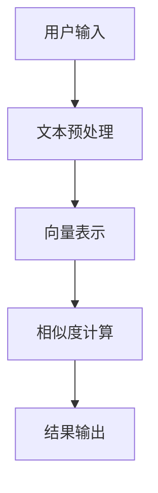
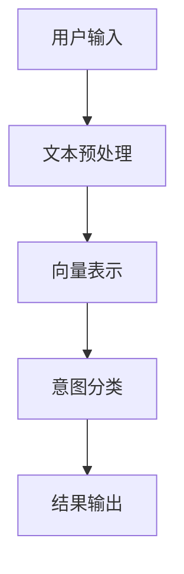
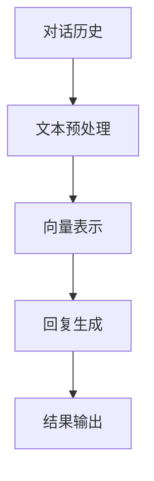
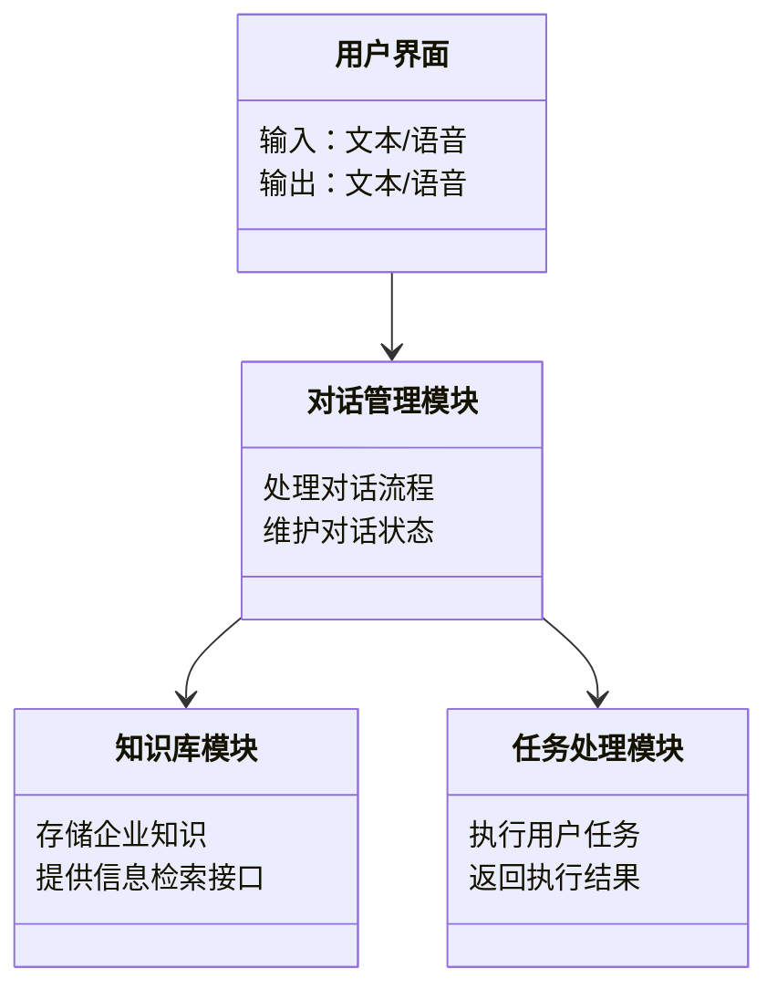
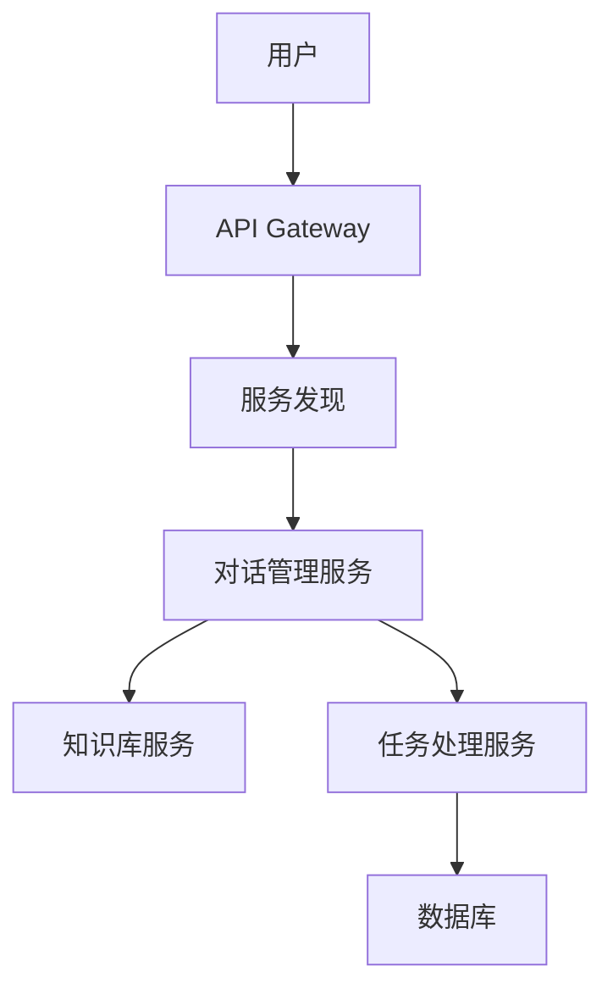

                 


# 构建企业级对话式AI助手：提升员工生产力

## 关键词
- 企业级对话式AI助手
- 自然语言处理
- 对话管理
- 知识库
- 机器学习
- 系统架构
- 项目实战

## 摘要
本文将深入探讨如何构建企业级对话式AI助手，以提升员工生产力。从背景介绍到核心概念，再到算法原理、系统架构、项目实战和最佳实践，全面解析构建这一系统的各个方面。文章详细讨论了自然语言处理、对话管理、知识库等核心技术，并通过实际案例展示了如何设计和实现一个高效的对话式AI系统。

---

## 第1章：对话式AI助手的背景与意义

### 1.1 对话式AI助手的定义与概念
对话式AI助手是一种能够通过自然语言与用户交互的智能系统，旨在为企业员工提供高效的支持，帮助他们完成各种任务，从而提升生产力。这种系统通常集成多种AI技术，如自然语言处理（NLP）、机器学习和知识库管理。

#### 1.1.1 对话式AI助手的基本概念
对话式AI助手通过理解和生成自然语言，与用户进行实时交互。它能够处理多种任务，如信息查询、任务分配、状态跟踪等。例如，员工可以通过与AI助手对话来获取项目进度、查找资料或安排会议。

#### 1.1.2 对话式AI助手的核心功能
- **信息检索**：快速查找企业内部或外部的信息，如公司政策、客户资料等。
- **任务处理**：自动化执行任务，如安排会议、发送邮件等。
- **知识库管理**：维护和更新企业知识库，确保信息的准确性和及时性。
- **多轮对话**：支持复杂对话，理解上下文，保持对话连贯性。

#### 1.1.3 对话式AI助手在企业中的应用价值
- **提升效率**：通过自动化处理任务，减少员工手动操作的时间。
- **增强协作**：促进团队内部的信息共享和协作，提高工作效率。
- **24/7支持**：提供全天候的员工支持，解决突发问题。

### 1.2 对话式AI助手的背景与现状
随着AI技术的快速发展，对话式AI助手在企业中的应用越来越广泛。企业希望通过这一技术提升员工的生产力，同时优化资源分配。

#### 1.2.1 人工智能技术的发展背景
人工智能技术的进步，特别是自然语言处理和深度学习的发展，为对话式AI助手的实现提供了坚实的技术基础。近年来，预训练模型（如BERT、GPT）的出现，极大地提升了对话系统的理解和生成能力。

#### 1.2.2 对话式AI助手的市场现状
目前，市场上已经涌现出许多对话式AI助手产品，但大多数专注于个人用户的需求。企业级对话式AI助手则需要满足特定的业务需求，具有更强的定制化能力和安全性。

#### 1.2.3 企业级对话式AI助手的独特优势
企业级AI助手通常集成企业的知识库和业务流程，能够更准确地理解和处理员工的需求。此外，它还可以与企业现有的系统（如CRM、ERP）无缝集成，提供更全面的支持。

### 1.3 对话式AI助手的目标与挑战
对话式AI助手的目标是通过智能化的方式，提升员工的工作效率和满意度。然而，实现这一目标需要克服诸多挑战。

#### 1.3.1 提升员工生产力的目标
- **自动化任务处理**：减少员工的重复性劳动，使其专注于更具创造性的任务。
- **快速信息检索**：帮助员工快速找到所需信息，缩短决策时间。
- **高效协作**：促进团队内部的高效协作，提高整体工作效率。

#### 1.3.2 对话式AI助手面临的挑战
- **数据隐私与安全**：企业数据的敏感性要求AI系统具备高安全性和合规性。
- **复杂对话管理**：处理多轮对话中的上下文理解和任务跟踪。
- **知识库维护**：需要持续更新和维护知识库，确保信息的准确性。

#### 1.3.3 企业级应用中的特殊需求
- **定制化功能**：根据企业的具体需求，开发特定的对话流程和功能。
- **多语言支持**：支持多种语言，满足国际化企业的需求。
- **高可用性**：确保系统在高负载下的稳定运行。

---

## 第2章：对话式AI助手的核心技术

### 2.1 自然语言处理（NLP）
自然语言处理是对话式AI助手的核心技术之一，负责理解和生成自然语言。

#### 2.1.1 NLP的基本概念
自然语言处理是指让计算机理解和生成人类语言的技术。它涵盖了多个子领域，如词法分析、句法分析、语义理解等。

#### 2.1.2 常见的NLP技术与工具
- **词嵌入**：如Word2Vec、GloVe，用于将词语表示为向量。
- **序列模型**：如RNN、LSTM，用于处理序列数据。
- **预训练模型**：如BERT、GPT，用于生成和理解上下文。

#### 2.1.3 NLP在对话式AI中的应用
- **意图识别**：识别用户的意图，如“查询订单状态”。
- **实体识别**：提取对话中的实体信息，如订单号、客户姓名。
- **文本生成**：生成自然语言回复，如“您的订单已处理完成”。

#### 2.1.4 NLP的关键挑战
- **语义理解**：准确理解用户的真实意图。
- **上下文处理**：处理多轮对话中的上下文信息。
- **语言多样性**：支持多种语言和方言。

#### 2.1.5 NLP在对话式AI中的具体实现
- 使用预训练模型进行意图识别和实体提取。
- 基于上下文的生成模型，如对话式GPT。

### 2.2 对话管理与流程控制
对话管理是对话式AI助手的另一个核心部分，负责协调对话的流程。

#### 2.2.1 对话管理的基本原理
对话管理负责跟踪对话的状态，根据当前对话内容生成适当的回复。它通常包括以下几个步骤：
1. 理解用户输入。
2. 确定对话的当前状态。
3. 生成回复并发送给用户。

#### 2.2.2 基于规则的对话管理
基于规则的对话管理通过预定义的规则来处理对话。例如，当用户提到“订单查询”时，系统会触发订单查询的流程。

- **规则定义**：定义对话中的各种情况和对应的处理逻辑。
- **规则执行**：根据用户输入匹配相应的规则，执行相应的操作。

#### 2.2.3 基于机器学习的对话管理
基于机器学习的对话管理通过训练模型来自动处理对话。这种方法通常需要大量的对话数据进行训练。

- **模型训练**：使用深度学习模型（如RNN、LSTM）进行训练。
- **对话生成**：模型根据当前对话状态生成回复。

#### 2.2.4 对话管理的关键挑战
- **规则复杂性**：随着对话场景的增加，规则变得复杂难维护。
- **模型泛化能力**：模型需要具备良好的泛化能力，以应对各种未知的对话情况。
- **对话上下文**：需要准确跟踪对话的上下文，确保回复的连贯性。

#### 2.2.5 对话管理的具体实现
- 使用预训练模型进行对话生成。
- 结合规则和机器学习模型，实现混合式的对话管理。

### 2.3 知识库与信息检索
知识库是对话式AI助手的重要组成部分，用于存储和检索信息。

#### 2.3.1 知识库的构建与管理
知识库的构建需要经过数据收集、清洗、存储等步骤。常见的知识库形式包括结构化数据库、文本库等。

- **数据收集**：从企业内部系统中收集相关信息。
- **数据清洗**：去除冗余和不相关的信息。
- **数据存储**：将数据存储在数据库中，如MySQL、MongoDB等。

#### 2.3.2 信息检索的基本原理
信息检索是指从知识库中快速找到与用户需求相关的信息。常见的信息检索方法包括基于关键词的检索、基于语义的检索等。

- **关键词检索**：通过匹配关键词进行信息检索。
- **语义检索**：通过理解用户意图进行信息检索。

#### 2.3.3 知识库在对话式AI中的应用
- **快速响应**：当用户提出问题时，系统能够快速从知识库中找到答案。
- **动态更新**：根据企业信息的变化，动态更新知识库内容。
- **多语言支持**：支持多种语言的信息检索。

#### 2.3.4 知识库的关键挑战
- **数据质量**：确保知识库中的数据准确、完整。
- **检索效率**：在高并发情况下，保证信息检索的效率。
- **动态更新**：及时更新知识库内容，确保信息的准确性。

#### 2.3.5 知识库的具体实现
- 使用数据库进行结构化数据存储。
- 采用搜索引擎（如Elasticsearch）进行高效的全文检索。

---

## 第3章：对话式AI的关键算法

### 3.1 文本匹配与相似度计算
文本匹配是对话式AI中的关键技术，用于衡量两个文本之间的相似性。

#### 3.1.1 文本匹配的定义与应用
文本匹配用于判断两个文本是否相似或相关。在对话式AI中，文本匹配通常用于意图识别和内容推荐。

#### 3.1.2 基于向量的相似度计算
文本匹配的一种常用方法是将文本表示为向量，然后计算向量之间的相似度。

- **向量表示**：使用词嵌入（如Word2Vec）将文本转换为向量。
- **相似度计算**：使用余弦相似度或欧氏距离等方法计算向量之间的相似度。

#### 3.1.3 常见的文本相似度算法
- **余弦相似度**：衡量两个向量在方向上的相似程度。
- **杰卡德相似度**：基于集合的相似度计算方法。
- **BM25**：用于信息检索中的相似度计算。

#### 3.1.4 文本匹配的具体实现
- 使用预训练的词嵌入模型（如BERT）进行文本表示。
- 通过计算向量相似度进行文本匹配。

#### 3.1.5 文本匹配的mermaid流程图


### 3.2 意图识别与分类
意图识别是对话式AI中的另一个关键任务，用于确定用户的需求。

#### 3.2.1 意图识别的基本原理
意图识别通过分析用户输入的文本，确定用户的意图。常见的意图包括“查询订单”、“预约会议”等。

#### 3.2.2 基于机器学习的意图分类
意图分类通常使用监督学习方法，如支持向量机（SVM）、随机森林（Random Forest）和深度学习模型（如CNN、RNN）。

- **数据标注**：将对话数据标注为不同的意图类别。
- **模型训练**：使用训练数据训练意图分类模型。
- **模型预测**：根据用户输入，预测其意图。

#### 3.2.3 常见的意图识别算法
- **SVM**：适用于小规模数据的意图分类。
- **随机森林**：适用于中等规模数据的意图分类。
- **LSTM**：适用于处理长序列数据的意图分类。

#### 3.2.4 意图识别的具体实现
- 使用预训练的词嵌入模型进行文本表示。
- 通过深度学习模型（如LSTM）进行意图分类。

#### 3.2.5 意图识别的mermaid流程图


### 3.3 对话生成与回复优化
对话生成是对话式AI的核心任务之一，用于生成自然流畅的回复。

#### 3.3.1 对话生成的定义与方法
对话生成的目标是根据对话历史生成合适的回复。常用的方法包括基于规则的生成和基于模型的生成。

- **基于规则的生成**：通过预定义的规则生成回复。
- **基于模型的生成**：使用深度学习模型（如GPT）生成回复。

#### 3.3.2 基于预训练模型的对话生成
预训练模型（如GPT）通过大量的对话数据训练，能够生成自然流畅的回复。

- **模型微调**：在特定领域数据上对预训练模型进行微调。
- **生成策略**：根据对话上下文选择合适的回复。

#### 3.3.3 对话生成的关键挑战
- **回复的相关性**：生成的回复需要与对话上下文相关。
- **回复的多样性**：生成多种可能的回复，供用户选择。
- **回复的可解释性**：生成的回复需要具有可解释性。

#### 3.3.4 对话生成的具体实现
- 使用预训练的对话模型（如GPT）进行回复生成。
- 通过强化学习对生成模型进行优化。

#### 3.3.5 对话生成的mermaid流程图


---

## 第4章：企业级对话式AI助手的系统架构

### 4.1 系统功能设计
企业级对话式AI助手需要具备强大的功能，以满足企业的多样化需求。

#### 4.1.1 用户交互界面设计
用户交互界面是用户与AI助手的桥梁，设计良好的界面能够提升用户体验。

- **多渠道支持**：支持多种交互方式，如语音、文本、图形界面。
- **个性化设置**：允许用户根据需求自定义界面。

#### 4.1.2 后端逻辑处理模块
后端逻辑处理模块负责处理用户请求，协调各个功能模块的工作。

- **对话管理**：负责对话的流程控制。
- **知识库查询**：负责从知识库中检索相关信息。
- **任务处理**：负责执行用户请求的任务。

#### 4.1.3 知识库与数据存储
知识库是系统的核心部分，存储了大量企业相关信息。

- **知识库构建**：通过数据抽取、清洗、存储等步骤构建知识库。
- **知识库更新**：根据企业信息的变化，动态更新知识库内容。

#### 4.1.4 系统功能设计的mermaid类图


### 4.2 系统架构设计
系统架构设计决定了系统的性能和扩展性。

#### 4.2.1 分层架构设计
分层架构将系统划分为多个层次，每一层负责不同的功能。

- **表现层**：负责用户与系统的交互。
- **业务逻辑层**：负责处理业务逻辑。
- **数据访问层**：负责与数据存储的交互。

#### 4.2.2 微服务架构设计
微服务架构将系统划分为多个独立的服务，每个服务负责不同的功能。

- **服务发现**：通过服务发现机制找到需要调用的服务。
- **服务调用**：通过API调用不同的服务。
- **服务监控**：监控服务的运行状态，确保系统的高可用性。

#### 4.2.3 可扩展性与高可用性设计
为了确保系统的可扩展性和高可用性，可以采用以下措施：

- **负载均衡**：通过负载均衡分配请求，确保系统的高可用性。
- **容错设计**：设计容错机制，确保单点故障不会导致系统崩溃。
- **水平扩展**：通过增加服务器数量来扩展系统的容量。

#### 4.2.4 系统架构设计的mermaid架构图


### 4.3 系统接口与交互流程
系统接口是系统与其他系统或服务之间的交互界面。

#### 4.3.1 系统内部接口设计
系统内部接口用于不同模块之间的通信。

- **API接口**：定义模块之间的接口规范。
- **消息队列**：通过消息队列实现模块之间的异步通信。

#### 4.3.2 系统与第三方服务的集成
企业级对话式AI助手通常需要与第三方服务（如CRM、ERP）集成。

- **API调用**：通过API调用第三方服务。
- **数据同步**：确保系统与第三方服务的数据同步。

#### 4.3.3 系统交互的mermaid序列图
```mermaid
sequenceDiagram
    用户 ->> 对话管理模块：发送请求
    对话管理模块 ->> 知识库模块：查询知识库
    知识库模块 --> 对话管理模块：返回结果
    对话管理模块 ->> 任务处理模块：执行任务
    任务处理模块 --> 对话管理模块：返回结果
    对话管理模块 ->> 用户：返回回复
```

---

## 第5章：构建企业级对话式AI助手

### 5.1 环境搭建与工具安装
构建企业级对话式AI助手需要搭建合适的开发环境。

#### 5.1.1 开发环境的选择与搭建
- **操作系统**：建议使用Linux或macOS，因为它们对开发环境的支持更好。
- **开发工具**：推荐使用IntelliJ IDEA或PyCharm进行开发。
- **虚拟环境**：使用virtualenv或conda管理Python环境。

#### 5.1.2 必要工具的安装与配置
- **Python**：安装Python 3.8或更高版本。
- **pip**：安装pip工具。
- **预训练模型**：安装如BERT、GPT等预训练模型的库，如transformers。

#### 5.1.3 项目初始化
创建一个新的Python项目，并初始化虚拟环境。

```bash
mkdir dialog_system
cd dialog_system
python -m venv venv
source venv/bin/activate  # 激活虚拟环境
pip install transformers  # 安装transformers库
```

### 5.2 核心功能实现
企业级对话式AI助手的核心功能包括对话管理、知识库查询和任务处理。

#### 5.2.1 对话管理模块的实现
对话管理模块负责处理对话的流程。

- **文本预处理**：对用户输入进行清洗和格式化。
- **意图识别**：使用预训练模型识别用户的意图。
- **对话状态管理**：维护对话的状态，如当前轮数、上下文等。

#### 5.2.2 知识库构建与信息检索
知识库构建需要从企业系统中提取数据，并存储在数据库中。

- **数据抽取**：从CRM、ERP等系统中抽取数据。
- **数据清洗**：去除冗余和不相关的信息。
- **数据存储**：将数据存储在数据库中，如MySQL、MongoDB等。

#### 5.2.3 任务处理模块的实现
任务处理模块负责执行用户的任务请求。

- **任务队列**：使用队列系统（如Celery）处理任务。
- **任务执行**：根据任务类型调用相应的处理函数。
- **任务反馈**：将任务执行结果反馈给用户。

#### 5.2.4 系统集成与测试
系统集成与测试是确保系统稳定运行的重要步骤。

- **单元测试**：对各个模块进行单元测试，确保功能正常。
- **集成测试**：对整个系统进行集成测试，确保模块之间的协作顺畅。
- **压力测试**：在高并发情况下测试系统的性能，确保系统的稳定性。

### 5.3 项目实战：构建企业级对话式AI助手

#### 5.3.1 项目介绍
本项目旨在构建一个企业级对话式AI助手，能够处理员工的日常任务请求，如查询订单、安排会议等。

#### 5.3.2 核心代码实现
以下是对话管理模块的核心代码示例：

```python
from transformers importpipeline

class DialogManager:
    def __init__(self):
        self.nlp = pipeline("question-answering")

    def process_input(self, user_input):
        # 进行意图识别
        response = self.nlp(user_input)
        return response
```

#### 5.3.3 代码应用解读与分析
对话管理模块通过预训练的模型进行意图识别，根据识别到的意图调用相应的功能模块。

#### 5.3.4 实际案例分析
假设用户输入“查询订单状态”，系统将触发订单查询功能，从知识库中检索订单信息，并将结果反馈给用户。

#### 5.3.5 项目小结
通过本项目，我们成功构建了一个企业级对话式AI助手，能够处理多种任务请求，显著提升了员工的生产力。

---

## 第6章：最佳实践与注意事项

### 6.1 最佳实践
在构建企业级对话式AI助手时，需要注意以下几点：

- **数据隐私与安全**：确保系统的数据安全，防止数据泄露。
- **系统可扩展性**：设计灵活的架构，方便后续的功能扩展。
- **用户体验优化**：不断优化用户体验，提升用户满意度。

### 6.2 小结
本文详细介绍了构建企业级对话式AI助手的各个方面，从核心概念到系统架构，再到项目实战，为读者提供了全面的指导。

### 6.3 注意事项
- **数据质量管理**：确保知识库中的数据准确、完整。
- **系统监控与维护**：定期监控系统运行状态，及时处理异常情况。
- **用户反馈收集**：收集用户的反馈，不断优化系统功能。

### 6.4 拓展阅读
- **深度学习与自然语言处理**：进一步学习深度学习在自然语言处理中的应用。
- **对话式AI的前沿技术**：了解对话式AI领域的最新研究成果。

---

## 结语

企业级对话式AI助手是提升员工生产力的重要工具。通过本文的介绍，读者可以全面了解构建这一系统的核心技术与实现方法。未来，随着AI技术的不断发展，对话式AI助手将在企业中发挥越来越重要的作用。

---

## 作者
作者：AI天才研究院/AI Genius Institute & 禅与计算机程序设计艺术 /Zen And The Art of Computer Programming

