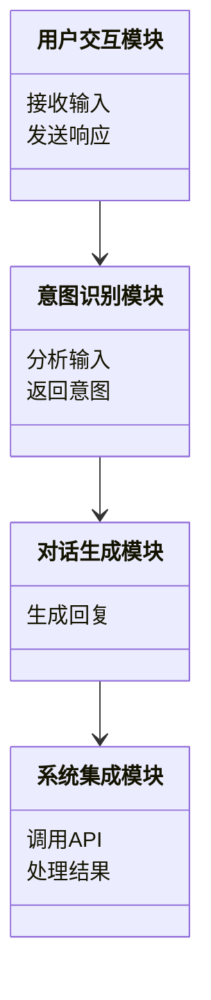
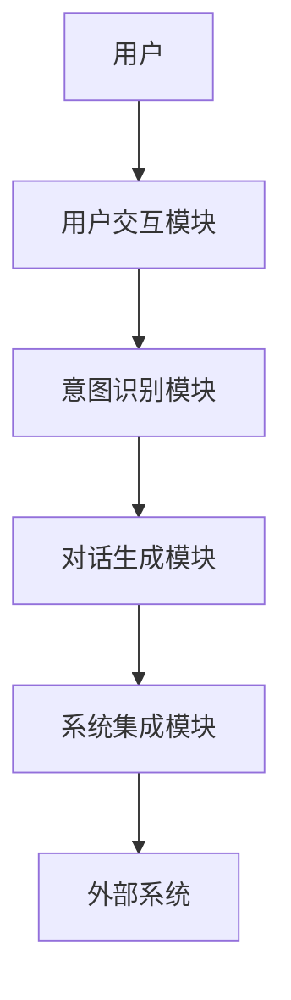

                 


# 构建企业级对话式AI助手：跨系统业务流程自动化与协调

> 关键词：企业级AI助手、对话系统、跨系统集成、业务流程自动化、NLP、深度学习

> 摘要：本文系统地探讨了构建企业级对话式AI助手的技术与实践，涵盖从技术基础到系统架构设计的全过程，结合实际案例，深入分析了对话式AI助手在企业中的应用价值及实现方法。

---

# 第1章: 对话式AI助手的背景与意义

## 1.1 问题背景与挑战

### 1.1.1 传统人机交互的局限性
传统的基于菜单的人机交互方式存在用户操作复杂、效率低下等问题。用户需要通过多级菜单选择操作，尤其是在处理复杂业务流程时，用户容易迷失在选项中，降低了用户体验。

### 1.1.2 企业业务流程自动化的痛点
企业内部业务流程通常涉及多个系统和部门，流程复杂且割裂。手动操作不仅效率低下，还容易出错，且难以快速响应用户需求。如何实现跨系统的无缝协作成为企业数字化转型的关键挑战。

### 1.1.3 对话式AI助手的出现与价值
对话式AI助手通过自然语言处理技术，将复杂的业务流程简化为自然的对话交互，极大地提升了用户体验和业务效率。它能够实时协调多个系统，自动完成业务流程，是企业数字化转型的重要工具。

## 1.2 对话式AI助手的核心概念

### 1.2.1 对话式AI助手的定义
对话式AI助手是一种基于NLP技术的智能系统，能够通过自然语言与用户进行交互，理解用户意图并执行相应的操作。

### 1.2.2 核心功能与应用场景
- **核心功能**：意图识别、多轮对话、任务执行、知识库查询。
- **应用场景**：客服支持、内部员工助手、客户咨询、业务流程自动化等。

### 1.2.3 与传统聊天机器人的区别
| 特性 | 对话式AI助手 | 传统聊天机器人 |
|------|--------------|----------------|
| 智能性 | 高，支持任务执行和系统集成 | 低，主要提供信息查询 |
| 可扩展性 | 高，支持复杂业务流程 | 低，功能相对单一 |
| 应用场景 | 企业级应用为主 | 通用客服或咨询 |

## 1.3 企业级对话式AI助手的特点

### 1.3.1 高可用性与稳定性
企业级系统需要7×24小时的高可用性，确保在高负载和故障情况下仍能正常运行。

### 1.3.2 多系统集成能力
能够与企业现有的ERP、CRM等系统无缝集成，调用API完成业务操作。

### 1.3.3 业务流程智能化
通过对话式交互，简化复杂的业务流程，实现自动化操作，提升业务效率。

## 1.4 本章小结

---

# 第2章: 自然语言处理与对话系统

## 2.1 自然语言处理（NLP）基础

### 2.1.1 NLP的核心任务与技术
- **文本处理**：分词、句法分析、实体识别。
- **语义理解**：情感分析、意图识别、文本摘要。
- **技术支撑**：词向量（如Word2Vec）、预训练语言模型（如BERT）。

### 2.1.2 语言模型的发展历程
- **规则驱动**：基于关键词匹配，简单且不灵活。
- **统计驱动**：基于机器学习，能够处理大量数据。
- **深度学习驱动**：基于神经网络，模型性能显著提升。

### 2.1.3 预训练语言模型的应用
预训练语言模型（如GPT、BERT）通过大量数据的预训练，能够直接应用于下游任务，显著提升了对话系统的生成能力。

## 2.2 对话系统的实现原理

### 2.2.1 基于规则的对话系统
通过预定义的规则和关键词匹配来实现对话交互，适用于简单场景。

### 2.2.2 基于统计的对话系统
通过训练数据生成概率模型，预测用户的下一步操作。

### 2.2.3 基于深度学习的对话系统
利用神经网络模型（如Transformer）进行对话生成，能够处理复杂场景。

## 2.3 当前主流对话模型

### 2.3.1 GPT系列模型
GPT模型通过自回归的方式生成对话，具有上下文理解和生成能力。

### 2.3.2 DialoGPT的对话优化
DialoGPT在GPT的基础上，针对对话任务进行了优化，支持多轮对话。

### 2.3.3 其他对话模型对比
| 模型 | GPT | DialoGPT | Llama |
|------|------|----------|-------|
| 性能 | 高 | 较高 | 中等 |
| 适用场景 | 单轮对话 | 多轮对话 | 通用 |

## 2.4 本章小结

---

# 第3章: 对话式AI助手的核心技术原理

## 3.1 对话式AI助手的输入处理

### 3.1.1 用户意图识别
通过NLP技术分析用户的输入，识别其意图和需求。

### 3.1.2 语义解析
将用户的自然语言转换为系统能够理解的结构化请求。

### 3.1.3 对话上下文管理
记录对话历史，保持上下文的一致性。

## 3.2 对话生成与响应优化

### 3.2.1 基于生成式模型的对话生成
利用生成式模型（如GPT）生成多样化的回复。

### 3.2.2 响应的多样性与准确性
通过策略优化算法，平衡生成回复的多样性和准确性。

### 3.2.3 对话策略优化
通过强化学习（如REINFORCE算法）优化对话策略。

## 3.3 多轮对话管理

### 3.3.1 对话状态跟踪
记录对话的当前状态，确保每次回复都基于最新的对话历史。

### 3.3.2 对话历史记录
维护完整的对话历史，以便后续的上下文理解。

### 3.3.3 对话终止条件
设定对话的结束条件，确保对话流程的完整性和有效性。

## 3.4 本章小结

---

# 第4章: 对话式AI助手的系统架构与实现

## 4.1 系统功能模块划分

### 4.1.1 用户交互模块
负责接收用户的输入并返回系统的响应。

### 4.1.2 意图识别模块
通过NLP技术分析用户的意图。

### 4.1.3 对话生成模块
基于意图生成合适的回复。

### 4.1.4 系统集成模块
与企业现有系统进行集成，调用API完成业务操作。

## 4.2 系统架构设计

### 4.2.1 领域模型设计
使用类图描述系统的主要模块及其关系。



### 4.2.2 系统架构设计


## 4.3 本章小结

---

# 第5章: 项目实战——构建企业级对话式AI助手

## 5.1 环境安装与配置

### 5.1.1 安装Python
```bash
python --version
pip install --upgrade pip
```

### 5.1.2 安装必要的库
```bash
pip install transformers torch
```

## 5.2 核心代码实现

### 5.2.1 对话生成模块实现
```python
from transformers import AutoTokenizer, AutoModelForCausalLM

model_name = "microsoft/DialoGPT-medium"
tokenizer = AutoTokenizer.from_pretrained(model_name)
model = AutoModelForCausalLM.from_pretrained(model_name)

def generate_response(input_text):
    inputs = tokenizer(input_text, return_tensors="np")
    outputs = model.generate(inputs.input_ids, max_length=100)
    response = tokenizer.decode(outputs[0].tolist()[0])
    return response
```

### 5.2.2 系统集成模块实现
```python
import requests

def call_api(service, params):
    url = f"http://localhost:8080/api/{service}"
    response = requests.post(url, json=params)
    return response.json()
```

## 5.3 测试与优化

### 5.3.1 测试对话生成
```python
input_text = "帮我安排一个会议，明天下午2点，参加人有小王和小李。"
response = generate_response(input_text)
print(response)
```

### 5.3.2 系统集成测试
```python
params = {"time": "14:00", "participants": ["小王", "小李"]}
result = call_api("book_meeting", params)
print(result)
```

## 5.4 本章小结

---

# 第6章: 扩展与优化

## 6.1 跨系统集成与协调

### 6.1.1 跨系统集成的挑战
- 系统异构性
- 数据安全
- API兼容性

### 6.1.2 安全性与可靠性
- 数据加密
- 容错设计
- 定期备份

## 6.2 对话式AI助手的优化方向

### 6.2.1 算法优化
- 更先进的对话模型
- 更高效的推理算法

### 6.2.2 系统优化
- 高可用性设计
- 可扩展性设计

## 6.3 本章小结

---

# 第7章: 结论与展望

## 7.1 总结
对话式AI助手通过自然语言处理技术和深度学习算法，实现了跨系统的业务流程自动化，为企业提供了高效、智能的交互方式。

## 7.2 展望
随着AI技术的不断发展，对话式AI助手将在企业中发挥越来越重要的作用，未来的优化方向包括更智能的对话生成、更高效的系统集成和更强大的安全性保障。

## 7.3 最佳实践Tips
- 确保系统的高可用性和安全性
- 定期优化对话模型和系统架构
- 建立完善的监控和反馈机制

---

作者：AI天才研究院 & 禅与计算机程序设计艺术

