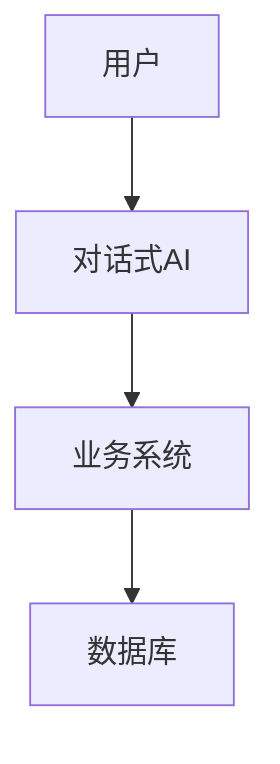
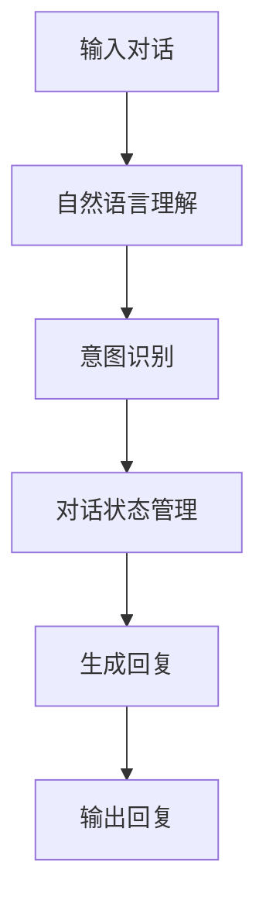
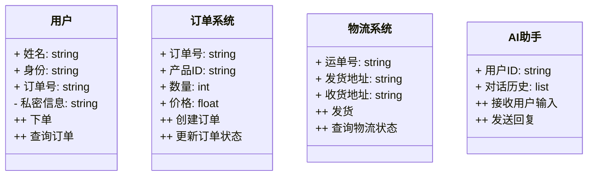
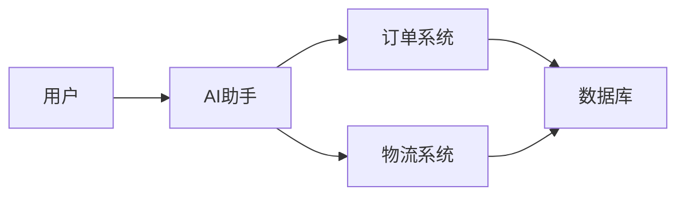
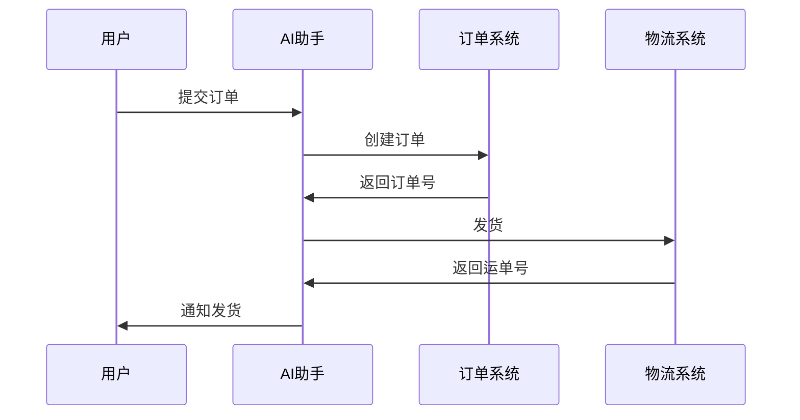

                 


# 构建企业级对话式AI助手：跨部门业务流程自动化

## 关键词：企业级对话式AI助手，跨部门业务流程，自动化，自然语言处理，对话管理，业务流程自动化

## 摘要：本文将详细探讨如何构建一个企业级的对话式AI助手，重点分析其在跨部门业务流程自动化中的应用。从核心概念、算法原理到系统架构设计，再到项目实战，我们将一步步拆解构建这样一个系统的全过程，揭示其背后的逻辑与技术实现。

---

# 第一部分: 背景与核心概念

## 第1章: 对话式AI助手的背景与现状

### 1.1 问题背景

#### 1.1.1 企业级业务流程的痛点
企业在日常运营中，常常面临复杂的跨部门协作问题。例如，一个订单从接单到交付，可能需要经过销售、物流、财务等多个部门的协同处理。传统的人工处理方式效率低下，容易出错，且难以快速响应客户需求。

#### 1.1.2 对话式AI的出现与价值
随着自然语言处理（NLP）和机器学习技术的快速发展，对话式AI助手应运而生。它能够通过自然语言理解（NLU）和对话管理技术，帮助企业实现跨部门业务流程的自动化，提高效率，降低成本。

#### 1.1.3 跨部门协作的挑战
跨部门协作的复杂性主要体现在信息传递不畅、责任边界模糊以及协作效率低下等方面。对话式AI助手可以通过统一的交互界面，将各个部门的需求整合到一个流程中，实现无缝协作。

### 1.2 问题描述

#### 1.2.1 传统业务流程的效率瓶颈
传统业务流程依赖人工操作，容易受到人为因素的影响，且难以快速响应变化。例如，客户在下单后，可能需要等待数天才能完成审批和交付。

#### 1.2.2 人工干预的局限性
人工干预不仅效率低下，还容易出现错误。例如，订单信息填写错误可能导致整个流程中断，需要重新处理。

#### 1.2.3 对话式AI在业务流程中的应用场景
对话式AI助手可以在多种场景中应用，例如客户咨询、订单处理、问题反馈等。它能够通过自然语言理解客户意图，并自动触发相应的业务流程。

### 1.3 问题解决

#### 1.3.1 对话式AI的核心能力
对话式AI助手的核心能力包括自然语言理解、对话管理、意图识别等。这些能力使其能够理解和处理用户的请求，并将其转化为具体的业务操作。

#### 1.3.2 跨部门协作的自动化实现
通过对话式AI助手，企业可以实现跨部门协作的自动化。例如，当客户提出一个订单请求时，AI助手可以自动将请求分发给销售、物流和财务部门，完成订单处理。

#### 1.3.3 业务流程优化的具体路径
业务流程优化的具体路径包括流程梳理、自动化设计、系统集成等。通过对话式AI助手，企业可以实现业务流程的端到端自动化，提升效率。

### 1.4 边界与外延

#### 1.4.1 对话式AI的适用范围
对话式AI适用于需要自然语言交互的场景，例如客户服务、内部协作等。但它并不适合所有类型的任务，例如需要复杂决策的任务可能仍需要人工干预。

#### 1.4.2 与其他技术的协同关系
对话式AI需要与NLP、机器学习、知识图谱等技术协同工作，才能实现复杂的功能。例如，结合知识图谱可以提高对话的准确性。

#### 1.4.3 业务流程自动化的边界条件
业务流程自动化的边界条件包括流程的复杂性、系统的稳定性、数据的安全性等。在设计自动化流程时，需要充分考虑这些因素，以确保系统的可靠性和安全性。

### 1.5 核心要素与概念结构

#### 1.5.1 对话式AI的关键组成部分
对话式AI的关键组成部分包括自然语言理解（NLU）、对话管理（DM）、知识库、业务系统接口等。

#### 1.5.2 业务流程自动化的核心要素
业务流程自动化的核心要素包括流程建模、自动化触发、状态管理、结果反馈等。

#### 1.5.3 概念结构图


### 1.6 本章小结

---

## 第2章: 对话式AI助手的核心概念与联系

### 2.1 核心概念原理

#### 2.1.1 自然语言处理（NLP）
自然语言处理（NLP）是对话式AI的核心技术之一。它包括文本分词、实体识别、情感分析等功能，能够帮助AI理解用户的意图。

#### 2.1.2 对话管理（Dialog Management）
对话管理负责维护对话的状态，根据用户的输入生成适当的回复，并引导对话走向预期的方向。

#### 2.1.3 业务流程自动化（BPA）
业务流程自动化（BPA）通过对业务流程的建模和优化，实现流程的自动化执行，减少人工干预。

### 2.2 核心概念属性对比

#### 2.2.1 对比表格：NLP vs 对话管理 vs BPA

| 技术 | 目标 | 输入 | 输出 |
|------|------|------|------|
| NLP | 理解文本 | 文本 | 意图、实体 |
| 对话管理 | 维护对话状态 | 用户输入、对话历史 | 回复、下一步操作 |
| BPA | 自动化业务流程 | 业务请求 | 流程执行结果 |

#### 2.2.2 对比分析：概念间的异同点
NLP和对话管理是对话式AI的两大核心，NLP负责理解用户意图，对话管理负责维护对话流程。而BPA则是在业务层面实现自动化，三者相辅相成。

### 2.3 ER实体关系图


### 2.4 本章小结

---

## 第3章: 对话式AI助手的算法原理

### 3.1 算法原理概述

#### 3.1.1 自然语言处理（NLP）算法
自然语言处理算法包括分词、实体识别、情感分析等。例如，使用词袋模型（Bag of Words）进行文本分类。

#### 3.1.2 对话管理算法
对话管理算法包括基于规则的对话管理和基于机器学习的对话管理。例如，使用马尔可夫链（Markov Chain）进行状态转移。

#### 3.1.3 业务流程自动化算法
业务流程自动化算法包括流程建模、自动化触发等。例如，使用工作流引擎（Workflow Engine）实现流程自动化。

### 3.2 算法流程图



### 3.3 核心算法实现

#### 3.3.1 源代码实现

```python
def intent_classifier(text):
    # 示例代码：简单的意图分类器
    if "订单" in text:
        return "订单处理"
    elif "物流" in text:
        return "物流查询"
    else:
        return "其他"
```

### 3.4 数学模型与公式

#### 3.4.1 概率论在NLP中的应用
$$ P(\text{文本属于类别} C) = \frac{\text{类别} C \text{的文本数}}{\text{总文本数}} $$

#### 3.4.2 机器学习中的损失函数
$$ \text{损失} = \sum_{i=1}^{n} (y_i - \hat{y_i})^2 $$

### 3.5 本章小结

---

# 第四部分: 系统分析与架构设计

## 第4章: 系统分析与架构设计方案

### 4.1 问题场景介绍
我们以一个典型的订单处理场景为例，设计一个对话式AI助手来实现订单从下单到交付的全流程自动化。

### 4.2 项目介绍
该项目旨在构建一个企业级对话式AI助手，支持跨部门协作，实现订单处理、物流跟踪、客户咨询等业务流程的自动化。

### 4.3 系统功能设计

#### 4.3.1 领域模型（Mermaid类图）


### 4.4 系统架构设计

#### 4.4.1 系统架构图（Mermaid架构图）


### 4.5 系统接口设计

#### 4.5.1 接口列表
| 接口名称 | 输入 | 输出 |
|----------|------|------|
| createOrder | 用户信息 | 订单号 |
| updateOrderStatus | 订单号 | 状态更新 |
| queryLogistics | 运单号 | 物流状态 |

### 4.6 系统交互流程（Mermaid序列图）



### 4.7 本章小结

---

## 第5章: 项目实战

### 5.1 环境安装
安装必要的依赖：
```bash
pip install numpy
pip install scikit-learn
pip install transformers
```

### 5.2 核心代码实现

#### 5.2.1 对话管理实现
```python
from transformers import pipeline

nlp = pipeline("text-classification", model="bert-base-cased")
```

#### 5.2.2 自然语言理解实现
```python
def process_input(text):
    return nlp(text)
```

#### 5.2.3 业务流程自动化实现
```python
def create_order(user_info):
    # 示例代码：创建订单
    return "Order Created"
```

### 5.3 案例分析与详细讲解

#### 5.3.1 订单处理流程
用户提交订单 -> AI助手解析请求 -> 触发订单系统 -> 返回订单号 -> 通知用户。

#### 5.3.2 物流跟踪流程
用户查询物流 -> AI助手触发物流系统 -> 返回物流状态 -> 通知用户。

### 5.4 项目小结

---

## 第6章: 最佳实践、小结与注意事项

### 6.1 最佳实践
- **模块化设计**：将系统拆分为独立的模块，便于维护和扩展。
- **日志记录**：记录每个操作的日志，便于调试和优化。
- **安全性**：确保数据的安全性，避免敏感信息泄露。

### 6.2 小结
通过本文的详细讲解，我们了解了构建企业级对话式AI助手的全过程，包括背景分析、核心概念、算法实现、系统架构设计以及项目实战。

### 6.3 注意事项
- **数据隐私**：在设计系统时，必须考虑数据隐私问题，确保符合相关法律法规。
- **用户体验**：对话式AI助手的设计必须以用户体验为核心，确保交互的自然流畅。
- **持续优化**：对话式AI是一个不断优化的过程，需要持续收集用户反馈，改进系统。

### 6.4 拓展阅读
推荐阅读《自然语言处理实战》和《机器学习实战》，深入了解相关技术。

---

# 作者：AI天才研究院/AI Genius Institute & 禅与计算机程序设计艺术 /Zen And The Art of Computer Programming

