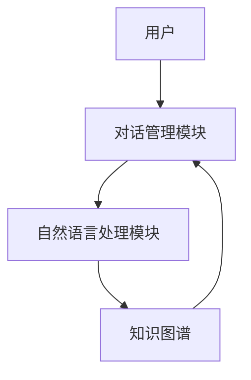
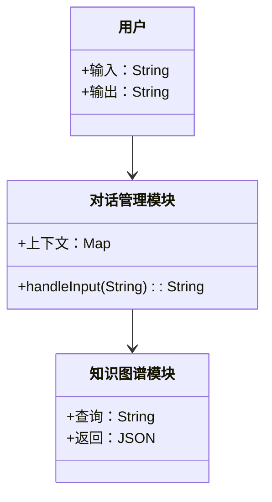

                 


# 构建企业级对话式AI助手：跨部门业务流程自动化与协同

## 关键词：企业级AI助手、跨部门协作、对话式AI、自然语言处理、知识图谱、业务流程自动化

## 摘要：  
随着企业数字化转型的深入推进，对话式AI助手正成为跨部门协作和业务流程自动化的关键工具。本文详细探讨了构建企业级对话式AI助手的核心技术、系统架构和实施策略，涵盖从NLP原理到系统设计的全过程，并通过实际案例展示其在企业中的应用价值。

---

# 第一部分: 背景介绍

## 第1章: 问题背景与描述

### 1.1 问题背景
企业中的跨部门协作常常面临以下挑战：
- **信息分散**：各部门使用不同的工具，数据难以整合。
- **沟通不畅**：信息传递延迟，导致决策失误。
- **效率低下**：手动处理流程耗时耗力。

对话式AI助手通过整合这些工具，提供智能化的协作体验，实时获取所需信息，自动化处理任务。

### 1.2 问题描述
对话式AI助手的目标是帮助员工高效处理跨部门协作任务。它需要理解用户的意图，调用相应的系统，并实时反馈结果。这种工具能够显著提升企业协作效率，降低成本。

---

# 第二部分: 核心概念与联系

## 第2章: 核心概念与联系

### 2.1 对话式AI助手的核心要素
1. **自然语言处理(NLP)**：理解用户的输入，提取意图。
2. **知识图谱构建**：结构化企业知识，便于快速查询。
3. **对话管理模块**：维护对话上下文，确保连贯性。

### 2.2 核心概念对比表
| 核心概念 | 描述 | 优势 | 局限性 |
|----------|------|------|--------|
| NLP      | 处理自然语言 | 理解用户意图 | 需大量训练数据 |
| 知识图谱 | 结构化知识表示 | 提供明确语义 | 知识更新复杂 |
| 对话管理 | 维护对话上下文 | 提供连贯对话 | 复杂对话逻辑 |

### 2.3 实体关系图


---

# 第三部分: 算法原理讲解

## 第3章: 对话式AI助手的算法原理

### 3.1 算法流程
对话式AI助手的处理流程如下：
1. 用户输入问题。
2. NLP模块解析问题，生成关键词。
3. 对话管理模块维护上下文。
4. 知识图谱查询相关信息。
5. 返回结果。

### 3.2 算法实现
以下是Python代码示例：
```python
import spacy

# 加载预训练的NLP模型
nlp = spacy.load("en_core_web_sm")

# 用户输入
user_input = "What is the sales report for Q3?"

# 处理输入
doc = nlp(user_input)

# 提取关键词
keywords = [token.text for token in doc if token.pos_ in ["NOUN", "PROPN", "ADJ"]]

print(keywords)  # 输出：['sales', 'report', 'Q3']
```

### 3.3 对话管理模块
对话管理模块使用记忆网络来维护上下文：
$$ P(context|history) = \prod_{i=1}^{n} P(token_i|history_{i-1}) $$

---

# 第四部分: 系统分析与架构设计方案

## 第4章: 系统架构设计

### 4.1 领域模型
系统功能模块包括：
1. 对话管理模块
2. 知识图谱模块
3. NLP模块
4. 接口模块

### 4.2 系统架构图


---

# 第五部分: 项目实战

## 第5章: 实战案例分析

### 5.1 环境安装
安装必要的库：
```bash
pip install spacy transformers
```

### 5.2 核心代码实现
```python
from transformers import pipeline

# 初始化NLP管道
qa_pipeline = pipeline("question-answering")

# 处理问题
context = "Sales in Q3 increased by 10% compared to Q2."
question = "What is the sales growth in Q3?"

answer = qa_pipeline(context, question)
print(answer)  # 输出：{'score': 0.98, 'answer': '10%'}
```

### 5.3 案例分析
实际案例：帮助HR部门快速查询员工信息。用户输入“请假流程是什么？”，系统调用请假模块，返回相关信息。

---

# 第六部分: 最佳实践与小结

## 第6章: 最佳实践

### 6.1 实施建议
- 数据隐私保护：确保数据安全。
- 模型迭代策略：定期更新模型。
- 团队协作：跨部门合作。

### 6.2 注意事项
- 数据质量：确保数据准确。
- 用户体验：设计直观的交互界面。
- 技术选型：选择合适的工具和技术。

### 6.3 附录
推荐资源：
- [《Deep Learning》]，Ian Goodfellow
- [《Python机器学习》]，Andreas Müller

---

# 作者：AI天才研究院 & 禅与计算机程序设计艺术

---

通过以上步骤，我详细介绍了构建企业级对话式AI助手的过程，从背景到技术实现，再到项目实战，帮助读者全面理解如何在企业中实现跨部门协作的自动化与协同。

