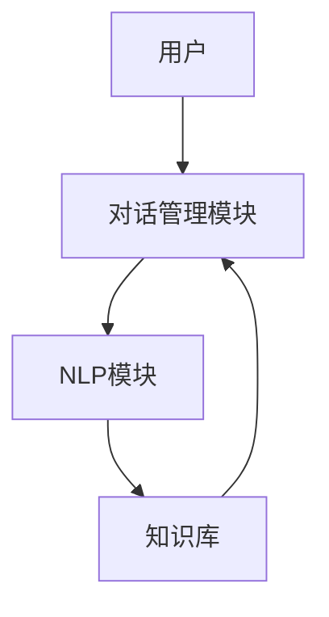

                 


# 构建企业级对话式AI平台：提升内外部沟通效率

---

## 关键词：
企业级对话式AI平台、自然语言处理（NLP）、对话管理、系统架构设计、内部沟通效率、外部客户体验

---

## 摘要：
本文将详细探讨如何构建一个高效的企业级对话式AI平台，以提升企业内部和外部的沟通效率。通过结合自然语言处理（NLP）和对话管理技术，我们能够设计出一个智能化的对话系统，帮助企业在复杂的沟通场景中实现高效、精准的交互。本文将从问题背景、核心概念、算法原理、系统架构设计到项目实战，全面解析企业级对话式AI平台的构建过程，并提供实际案例和最佳实践，帮助读者更好地理解和应用这一技术。

---

## 第一部分：企业级对话式AI平台的背景与核心概念

### 第1章：问题背景与描述

#### 1.1 问题背景
随着企业规模的不断扩大，内部和外部的沟通需求日益复杂。传统的人工沟通方式效率低下，难以满足现代企业的高效需求。例如：
- **内部沟通**：跨部门协作时，信息传递不畅，容易出现信息孤岛。
- **外部沟通**：客户咨询、技术支持等场景中，人工响应速度慢，难以覆盖大量客户需求。

对话式AI的出现，为解决这些问题提供了新的可能性。通过智能化的对话系统，企业可以实现自动化、个性化的沟通，从而显著提升沟通效率。

#### 1.2 问题描述
对话式AI的目标是通过自然语言处理和对话管理技术，构建一个能够理解和生成自然语言的系统，实现与用户的智能交互。具体需求包括：
- 支持多轮对话，保持上下文的理解和记忆。
- 提供个性化的回复，根据用户需求和历史记录优化回答。
- 支持多种交互渠道，如文本、语音、视频等。

#### 1.3 解决方案
企业级对话式AI平台的核心在于整合NLP和对话管理技术，构建一个智能化的对话系统。该系统能够：
- 自动解析用户的意图，生成准确的回复。
- 管理对话上下文，确保多轮对话的连贯性。
- 集成企业知识库，提供基于知识的智能回答。

#### 1.4 概念结构与核心要素
- **核心概念**：对话式AI、自然语言处理、对话管理。
- **核心要素**：
  - 语义理解：通过NLP技术解析用户意图。
  - 对话上下文：记录对话历史，确保连贯性。
  - 知识库：存储企业相关知识，支持智能回答。
  - 推理能力：基于知识和上下文生成合理的回复。

---

### 第2章：对话式AI的核心概念与架构

#### 2.1 对话式AI的定义与特点
对话式AI是一种基于自然语言处理技术的智能对话系统，能够通过文本或语音与用户进行交互。其特点包括：
- **智能化**：通过NLP技术实现语义理解。
- **个性化**：根据用户需求生成个性化回复。
- **连贯性**：支持多轮对话，保持上下文记忆。
- **可扩展性**：支持多种交互渠道和应用场景。

#### 2.2 对话式AI的架构分析
对话式AI的架构通常包括以下几个核心模块：
- **NLP模块**：负责语义理解、意图识别和实体提取。
- **对话管理模块**：负责对话上下文的管理、对话流控制和回复生成。
- **知识库**：存储企业相关知识，支持智能回答。

#### 2.3 对话式AI的核心要素
- **语义理解**：通过NLP技术解析用户意图。
- **对话上下文**：记录对话历史，确保连贯性。
- **知识库与推理能力**：基于知识库生成合理的回复。

---

## 第二部分：对话式AI的算法原理与实现

### 第3章：对话式AI的算法原理

#### 3.1 自然语言处理（NLP）算法
NLP是对话式AI的核心技术之一，主要包括以下步骤：
1. **分词**：将输入文本分割成词语或短语。
2. **词性标注**：为每个词语标注其词性（如名词、动词、形容词等）。
3. **句法分析**：分析句子的语法结构，确定句子成分之间的关系。

#### 3.2 对话管理算法
对话管理是对话式AI的另一个核心技术，主要包括以下步骤：
1. **意图识别**：通过NLP技术识别用户的意图。
2. **对话上下文管理**：记录对话历史，保持上下文理解。
3. **回复生成**：根据用户意图和上下文生成回复。

#### 3.3 对话式AI的训练与推理
- **模型训练**：使用大量的对话数据训练NLP和对话管理模型。
- **模型推理**：基于训练好的模型，生成实时对话的回复。

---

## 第三部分：企业级对话式AI平台的系统架构设计

### 第4章：系统架构设计

#### 4.1 系统功能设计
- **用户界面**：支持文本和语音输入，提供友好的用户界面。
- **对话管理**：实现多轮对话的上下文管理和对话流控制。
- **知识库集成**：整合企业知识库，支持智能回答。

#### 4.2 系统架构图


#### 4.3 系统接口设计
- **输入接口**：接收用户的输入文本或语音。
- **输出接口**：返回系统的回复文本或语音。
- **内部接口**：NLP模块与对话管理模块之间的交互接口。

---

## 第四部分：项目实战与案例分析

### 第5章：项目实战

#### 5.1 环境搭建与配置
- **开发环境**：建议使用Python和深度学习框架（如TensorFlow、PyTorch）。
- **依赖库安装**：安装NLP相关库（如spaCy、jieba）和对话管理库（如Rasa、.dialogflow）。

#### 5.2 核心代码实现
```python
# 示例代码：简单的意图识别
import spacy

nlp = spacy.load("en_core_web_sm")

text = "I want to book a flight to New York."
doc = nlp(text)

# 提取意图
intent = "booking_flight"

# 提取实体
entities = [(ent.text, ent.label_) for ent in doc.ents]
print(entities)
```

#### 5.3 案例分析
以客服咨询场景为例，对话式AI可以自动解析客户的问题，快速生成回复，显著提升客户满意度和处理效率。

---

## 第五部分：最佳实践与小结

### 第6章：最佳实践

#### 6.1 小结
- 对话式AI的核心在于NLP和对话管理技术的结合。
- 系统架构设计需要考虑可扩展性和灵活性。
- 项目实战中，环境搭建和代码实现是关键步骤。

#### 6.2 注意事项
- 数据质量对模型性能影响重大，需确保数据的多样性和准确性。
- 对话管理模块的设计需要考虑系统的可解释性和可维护性。
- 保护用户隐私和数据安全是系统设计中的重要环节。

#### 6.3 拓展阅读
- 推荐阅读《自然语言处理实战：基于深度学习》和《对话式AI的原理与应用》。

---

## 作者信息：
作者：AI天才研究院 & 禅与计算机程序设计艺术

