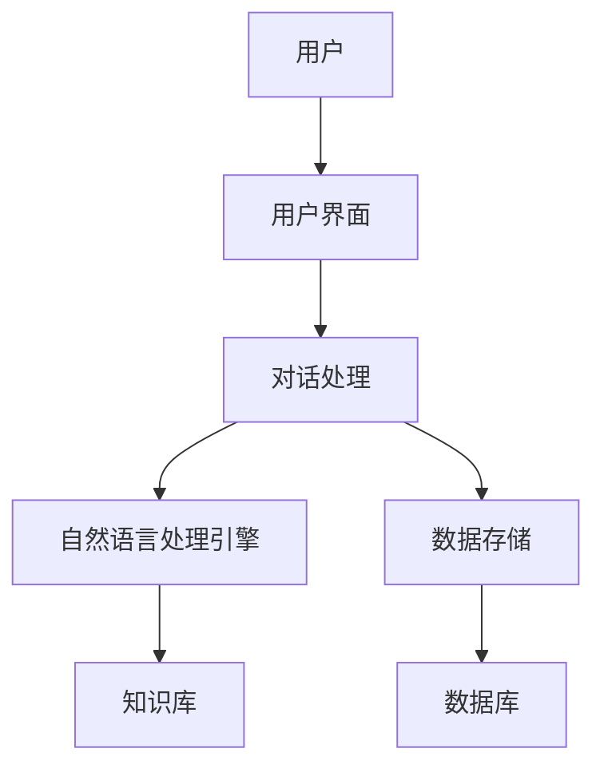
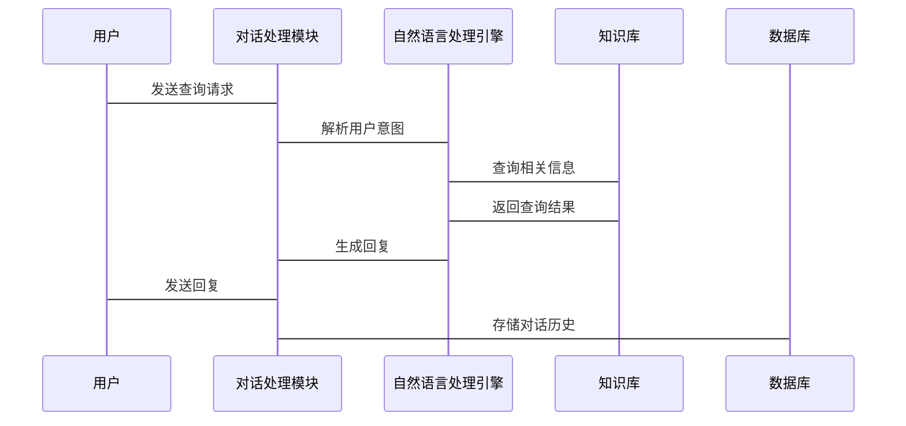

                 


# 构建企业级对话式AI：提升内部沟通效率

> 关键词：企业级对话式AI，内部沟通效率，自然语言处理，系统架构，项目实战

> 摘要：本文详细探讨了构建企业级对话式AI系统的各个方面，从问题背景到系统架构，再到实际项目实现，深入分析了对话式AI在提升企业内部沟通效率中的重要作用。文章通过清晰的逻辑和详细的分析，帮助读者理解如何设计和实现一个高效、安全、稳定的对话式AI系统。

---

# 第一部分: 企业级对话式AI的背景与核心概念

## 第1章: 问题背景与目标

### 1.1 问题背景

#### 1.1.1 企业内部沟通效率的痛点
现代企业中，内部沟通效率低下已成为一个普遍问题。传统的邮件、即时通讯工具和会议等方式，往往导致信息传递延迟、信息孤岛和资源浪费。据统计，员工在寻找信息和协调工作上的时间浪费约占企业总时间的40%。

#### 1.1.2 对话式AI的潜力与价值
对话式AI（Conversational AI）通过自然语言处理技术，能够以更高效、更自然的方式实现人与系统之间的交互。它不仅可以快速响应用户需求，还能通过上下文理解提供精准的信息支持，从而显著提升内部沟通效率。

#### 1.1.3 传统沟通工具的局限性
传统的沟通工具如邮件、即时通讯等，虽然在一定程度上提高了沟通效率，但仍然存在以下问题：
- 信息分散，难以快速查找和整理。
- 无法智能化地理解和响应用户需求。
- 缺乏上下文记忆，导致重复沟通和信息丢失。

### 1.2 问题描述

#### 1.2.1 企业内部沟通的低效现状
企业在日常运营中，员工需要频繁协调资源、查询信息和解决问题。由于信息分散和沟通工具的局限性，这些问题往往耗时耗力，影响工作效率。

#### 1.2.2 对话式AI的应用场景
对话式AI可以在企业内部广泛应用，例如：
- 员工帮助与支持：快速解答员工问题，如IT支持、政策咨询等。
- 信息查询：快速检索企业知识库中的信息，如公司制度、项目资料等。
- 会议协调：自动安排会议、分配任务和跟踪进度。

#### 1.2.3 企业级AI的挑战与目标
企业级AI需要满足高可用性、数据安全和与现有系统集成等要求。其目标是通过智能化的对话系统，显著提升企业内部沟通效率，减少人工干预，降低运营成本。

---

## 第2章: 对话式AI的核心概念与原理

### 2.1 对话式AI的定义与特点

#### 2.1.1 对话式AI的定义
对话式AI是一种基于自然语言处理技术的智能系统，能够通过文本或语音与用户进行自然的对话交互，理解用户需求并提供相应的反馈或服务。

#### 2.1.2 对话式AI的核心特点
- **上下文理解**：能够记忆对话历史，理解用户的上下文需求。
- **多轮对话**：支持连续的多轮交互，提供更自然的用户体验。
- **智能学习**：通过机器学习技术不断优化对话策略和回答质量。

#### 2.1.3 对话式AI与传统聊天机器人的区别
| 特性                | 对话式AI                          | 传统聊天机器人                  |
|---------------------|-----------------------------------|---------------------------------|
| 上下文理解          | 支持                              | 仅支持单轮对话                  |
| 智能学习            | 支持                              | 不支持                          |
| 企业级功能          | 支持复杂业务逻辑                  | 仅限于简单的问答或任务          |

### 2.2 自然语言处理（NLP）基础

#### 2.2.1 NLP的定义与作用
自然语言处理（NLP）是研究如何让计算机理解和生成人类语言的学科。在对话式AI中，NLP主要用于文本的解析、理解、生成和对话管理。

#### 2.2.2 常见的NLP技术与模型
- **文本分词**：将文本分割成词语或短语，例如中文分词。
- **实体识别**：识别文本中的命名实体，如人名、地名、组织名等。
- **情感分析**：分析文本的情感倾向，如正面、负面或中性。
- **意图识别**：识别用户的意图，如“查询订单状态”或“预约会议室”。

#### 2.2.3 对话式AI中的NLP应用
在对话式AI中，NLP主要用于以下方面：
- **用户意图识别**：通过解析用户的输入，确定用户的需求。
- **对话上下文管理**：记忆对话历史，理解当前对话的上下文。
- **文本生成**：根据上下文生成自然的回复。

### 2.3 企业级AI的特殊要求

#### 2.3.1 高可用性与稳定性
企业级AI系统需要7×24小时稳定运行，支持高并发用户请求，确保系统的可用性和稳定性。

#### 2.3.2 数据安全与隐私保护
企业级AI系统需要处理大量敏感数据，必须严格遵守数据安全和隐私保护的相关法律法规，确保数据的机密性和完整性。

#### 2.3.3 与企业现有系统的集成
企业级AI系统需要与企业的现有系统（如ERP、CRM等）无缝集成，确保数据的互通和业务流程的连贯性。

---

## 第3章: 对话式AI的核心技术与算法

### 3.1 对话式AI的算法原理

#### 3.1.1 基于规则的对话系统
基于规则的对话系统通过预定义的规则和关键词匹配来生成回复。这种方式简单易实现，但灵活性和扩展性较差。

#### 3.1.2 基于统计模型的对话系统
基于统计模型的对话系统通过统计学习方法，从大量对话数据中学习对话模式，生成回复。这种方法能够处理复杂的对话场景，但需要大量的训练数据。

#### 3.1.3 基于深度学习的对话系统
基于深度学习的对话系统利用神经网络模型（如RNN、Transformer）学习对话数据，生成更自然的回复。这种方法能够处理复杂的上下文和意图，但需要大量的计算资源。

### 3.2 常见的对话模型

#### 3.2.1 基于RNN的对话模型
RNN（循环神经网络）通过处理序列数据，能够捕捉对话的时序关系，适用于生成连续的对话回复。

#### 3.2.2 基于Transformer的对话模型
Transformer模型通过自注意力机制，能够更好地捕捉对话的全局信息，生成更准确的回复。

#### 3.2.3 深度上下文理解模型
深度上下文理解模型（如BERT）通过预训练技术，能够理解对话的上下文信息，生成更自然的回复。

### 3.3 对话生成与优化

#### 3.3.1 对话生成的挑战
对话生成的挑战包括：
- **上下文理解**：准确理解用户的意图和上下文。
- **生成多样性**：生成多种可能的回复，避免重复。
- **语境适应**：根据对话场景调整回复语气和内容。

#### 3.3.2 基于强化学习的对话优化
通过强化学习（Reinforcement Learning）技术，对话系统可以在与用户的交互中不断优化回复策略，提高对话质量。

#### 3.3.3 对话质量的评估指标
常用的对话质量评估指标包括：
- **BLEU**：基于_bleu_分数评估生成回复的准确性和流畅性。
- **ROUGE**：基于rouge分数评估生成回复的相关性和信息量。
- **人类评价**：通过人工评估生成回复的自然性和有用性。

---

# 第二部分: 对话式AI的系统架构与实现

## 第4章: 系统架构设计

### 4.1 系统功能模块划分

#### 4.1.1 用户界面模块
用户界面模块负责与用户交互，接收用户的输入并显示系统的回复。通常包括文本输入框、显示区域和操作按钮。

#### 4.1.2 对话处理模块
对话处理模块负责解析用户的输入，生成回复并返回给用户。包括意图识别、上下文管理和回复生成等功能。

#### 4.1.3 数据存储与管理模块
数据存储与管理模块负责存储对话历史、用户信息和知识库数据。支持高效的查询和更新操作。

#### 4.1.4 系统管理与监控模块
系统管理与监控模块负责系统的配置管理、日志记录和性能监控。确保系统的稳定运行和高效管理。

### 4.2 系统架构图


### 4.3 系统接口设计

#### 4.3.1 用户与系统的交互接口
- **输入接口**：文本输入框或语音输入。
- **输出接口**：文本显示区域或语音播放器。

#### 4.3.2 系统与知识库的交互接口
- **查询接口**：通过API调用知识库，获取相关信息。
- **更新接口**：将对话历史和新知识添加到知识库中。

#### 4.3.3 系统与外部系统的交互接口
- **API接口**：与企业现有系统（如ERP、CRM）进行数据交互。
- **消息队列**：通过消息队列实现异步通信。

### 4.4 系统交互流程



---

## 第5章: 项目实战与优化

### 5.1 环境安装与配置

#### 5.1.1 安装Python与相关库
```bash
pip install python==3.8
pip install numpy
pip install tensorflow
pip install transformers
```

#### 5.1.2 安装对话式AI框架
```bash
pip install dialogflow
pip install rasa
pip install fastapi
```

### 5.2 核心代码实现

#### 5.2.1 对话处理模块实现
```python
from transformers import AutoTokenizer, AutoModelForCausalLM
import torch

class DialogSystem:
    def __init__(self, model_name):
        self.tokenizer = AutoTokenizer.from_pretrained(model_name)
        self.model = AutoModelForCausalLM.from_pretrained(model_name)
    
    def generate_response(self, input_text):
        inputs = self.tokenizer.encode(input_text, return_tensors="pt")
        outputs = self.model.generate(inputs, max_length=50, num_beams=5)
        response = self.tokenizer.decode(outputs[0], skip_special_tokens=True)
        return response
```

#### 5.2.2 知识库查询模块实现
```python
class KnowledgeBase:
    def __init__(self, db_path):
        self.db = sqlite3.connect(db_path)
    
    def query(self, intent):
        cursor = self.db.cursor()
        cursor.execute("SELECT response FROM knowledge WHERE intent=?", (intent,))
        result = cursor.fetchone()
        return result[0] if result else None
```

### 5.3 优化与调优

#### 5.3.1 对话模型的优化
通过调整模型超参数（如学习率、批次大小等）和优化算法（如Adam优化器），可以提高对话模型的生成质量和训练效率。

#### 5.3.2 系统性能的优化
通过缓存机制、负载均衡和分布式部署，可以提高系统的响应速度和处理能力。

#### 5.3.3 数据增强与训练
通过数据增强技术（如同义词替换、句式变换）和多任务学习，可以提高模型的泛化能力和对话质量。

---

## 第6章: 最佳实践与小结

### 6.1 最佳实践

#### 6.1.1 系统设计的注意事项
- **模块化设计**：确保系统模块化，便于维护和扩展。
- **安全性设计**：严格遵守数据安全和隐私保护的相关规定。
- **可扩展性设计**：预留接口和模块，方便后续功能扩展。

#### 6.1.2 项目实施的注意事项
- **数据质量**：确保训练数据的多样性和代表性。
- **模型选择**：根据实际需求选择合适的对话模型和算法。
- **系统集成**：确保系统与现有企业的无缝集成。

### 6.2 小结

构建企业级对话式AI系统是一项复杂而艰巨的任务，需要综合考虑技术、数据和系统架构等多个方面。通过合理的设计和优化，对话式AI可以显著提升企业内部的沟通效率，为企业带来可观的经济效益。

---

作者：AI天才研究院/AI Genius Institute & 禅与计算机程序设计艺术/Zen And The Art of Computer Programming

