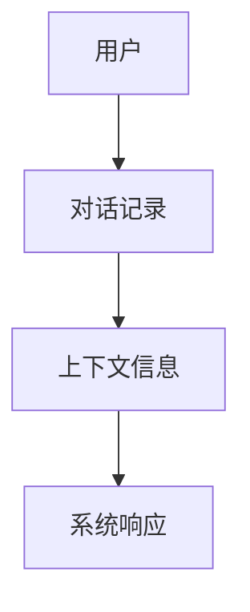
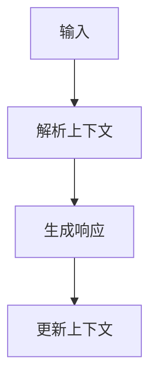
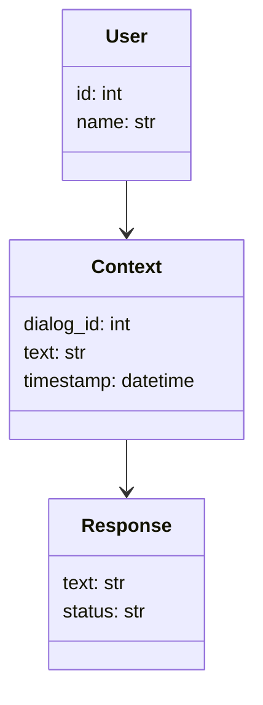
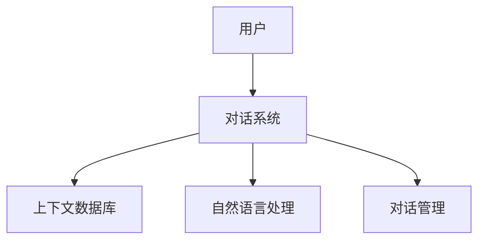
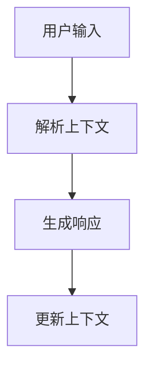

                 


---

# 构建企业级对话系统：上下文感知与多轮交互管理

> 关键词：企业级对话系统，上下文感知，多轮交互，对话系统架构，对话管理，自然语言处理，人工智能

> 摘要：  
本文将详细介绍如何构建一个企业级对话系统，重点探讨上下文感知和多轮交互管理的核心技术。通过分析对话系统的背景、核心概念、算法原理、系统架构和项目实战，本文将为读者提供从理论到实践的全面指导。从问题背景到解决方案，从核心概念到算法实现，从系统设计到项目落地，本文将一步步带领读者深入了解企业级对话系统的构建过程。

---

## 第1章: 背景介绍

### 1.1 问题背景
在现代企业中，对话系统已成为与用户交互的重要工具。然而，传统的对话系统往往缺乏上下文感知能力，导致用户体验差、交互效率低。例如，当用户在多轮对话中提到多个相关问题时，系统无法有效结合上下文信息进行准确的响应。

#### 1.1.1 对话系统的发展历程
对话系统经历了从规则驱动到机器学习驱动的转变。早期的系统依赖预定义的规则，难以应对复杂场景。随着自然语言处理（NLP）技术的发展，基于深度学习的模型逐渐成为主流。

#### 1.1.2 企业级对话系统的定义
企业级对话系统是一种能够理解用户意图、管理多轮交互并提供个性化服务的智能系统，广泛应用于客服、销售、技术支持等领域。

#### 1.1.3 上下文感知与多轮交互的重要性
上下文感知使系统能够理解对话的历史信息，而多轮交互管理则确保了对话的连贯性和效率。

### 1.2 问题描述
#### 1.2.1 当前对话系统的主要挑战
- **上下文丢失**：系统无法有效存储和利用对话历史信息。
- **状态管理复杂**：多轮交互中的状态难以统一管理。
- **用户体验差**：用户常常需要重复说明问题，导致不满。

#### 1.2.2 上下文感知的核心问题
- 如何有效存储和更新上下文信息？
- 如何关联对话中的上下文信息？

#### 1.2.3 多轮交互的管理难点
- 如何设计高效的交互流程？
- 如何管理复杂的对话状态？

### 1.3 问题解决
#### 1.3.1 上下文感知的解决方案
引入上下文表示模型，通过自然语言处理技术提取对话中的关键信息，并存储在上下文数据库中。

#### 1.3.2 多轮交互的管理策略
设计状态机模型，根据对话历史动态调整系统行为。

#### 1.3.3 企业级对话系统的构建方法
采用模块化设计，结合自然语言处理和对话管理技术，构建高效的对话系统。

### 1.4 边界与外延
#### 1.4.1 对话系统的边界
- 输入：用户输入的文本或语音。
- 输出：系统的响应文本或动作。
- 上下文：对话历史信息。

#### 1.4.2 上下文感知的范围
- 包括对话历史、用户意图、实体信息等。
- 不包括外部系统状态和实时数据。

#### 1.4.3 多轮交互的限制条件
- 对话长度有限。
- 系统对上下文信息的处理能力有限。

### 1.5 概念结构与核心要素
#### 1.5.1 对话系统的组成要素
- 用户输入。
- 系统输出。
- 上下文信息。

#### 1.5.2 上下文感知的核心要素
- 上下文表示。
- 上下文更新。
- 上下文关联。

#### 1.5.3 多轮交互的流程结构
- 初始化交互。
- 中间轮次处理。
- 结束条件。

### 1.6 本章小结
本章介绍了企业级对话系统的背景、核心概念和构建方法，为后续内容奠定了基础。

---

## 第2章: 核心概念与联系

### 2.1 对话系统的组成要素
#### 2.1.1 用户输入
用户输入是对话的起点，可以是文本或语音。

#### 2.1.2 系统输出
系统输出是对话的响应，通常为文本或动作。

#### 2.1.3 上下文信息
上下文信息是对话历史的记录，包括用户意图、实体信息等。

### 2.2 上下文感知的机制
#### 2.2.1 上下文信息的存储
使用数据库或缓存存储上下文信息。

#### 2.2.2 上下文信息的更新
根据最新输入更新上下文信息。

#### 2.2.3 上下文信息的关联
通过上下文表示模型关联对话中的信息。

### 2.3 多轮交互的流程
#### 2.3.1 初始化交互
用户发起对话，系统解析意图。

#### 2.3.2 中间轮次的处理
系统根据上下文信息生成响应。

#### 2.3.3 结束条件
当用户确认或系统完成任务时结束对话。

### 2.4 核心概念属性特征对比
| 对话系统属性 | 上下文感知属性 | 多轮交互属性 |
|--------------|----------------|--------------|
| 输入类型     | 上下文类型     | 交互轮次数    |
| 输出类型     | 上下文存储     | 交互状态     |
| 状态管理方式 | 上下文更新     | 交互流程     |

### 2.5 ER实体关系图


### 2.6 本章小结
本章详细讲解了对话系统的组成要素和上下文感知的机制，通过对比表和ER图帮助读者理解核心概念。

---

## 第3章: 算法原理

### 3.1 对话系统的算法框架
#### 3.1.1 序列模型
使用循环神经网络（RNN）处理对话序列。

#### 3.1.2 注意力机制
通过注意力机制捕捉对话中的关键信息。

#### 3.1.3 状态管理算法
设计状态机模型管理对话状态。

### 3.2 上下文感知的算法实现
#### 3.2.1 上下文表示方法
使用词嵌入（如Word2Vec）表示上下文信息。

#### 3.2.2 上下文更新策略
基于最新输入更新上下文表示。

#### 3.2.3 上下文关联算法
通过相似度计算关联上下文信息。

### 3.3 多轮交互的算法优化
#### 3.3.1 基于记忆的多轮对话
引入记忆网络（Memory Network）处理多轮对话。

#### 3.3.2 基于强化学习的对话策略
使用强化学习优化对话策略。

#### 3.3.3 对话历史的压缩算法
通过聚类算法压缩对话历史。

### 3.4 算法流程图


### 3.5 算法实现代码
```python
import numpy as np

class ContextManager:
    def __init__(self):
        self.context = {}
    
    def update_context(self, new_context):
        self.context.update(new_context)
    
    def get_context(self, key):
        return self.context.get(key, None)
```

### 3.6 本章小结
本章详细讲解了对话系统的算法框架和上下文感知的实现方法，通过代码示例和流程图帮助读者理解技术细节。

---

## 第4章: 系统分析与架构设计

### 4.1 问题场景介绍
企业级对话系统需要处理复杂场景，如多轮对话、上下文感知等。

### 4.2 项目介绍
#### 4.2.1 项目目标
构建一个支持上下文感知和多轮交互的企业级对话系统。

#### 4.2.2 项目范围
覆盖客服、销售和技术支持领域。

### 4.3 系统功能设计
#### 4.3.1 领域模型


#### 4.3.2 系统架构图


#### 4.3.3 接口设计
- 输入接口：用户输入。
- 输出接口：系统响应。
- 上下文接口：上下文数据库。

#### 4.3.4 交互流程图


### 4.4 本章小结
本章通过系统分析和架构设计，展示了如何构建一个高效的企业级对话系统。

---

## 第5章: 项目实战

### 5.1 环境安装
安装必要的Python库，如TensorFlow、Keras、NLTK等。

### 5.2 核心代码实现
#### 5.2.1 上下文管理模块
```python
class ContextManager:
    def __init__(self):
        self.context = {}
    
    def update_context(self, new_context):
        self.context.update(new_context)
    
    def get_context(self, key):
        return self.context.get(key, None)
```

#### 5.2.2 对话管理模块
```python
class DialogManager:
    def __init__(self):
        self.context_manager = ContextManager()
    
    def process_input(self, input_text):
        context = self.context_manager.get_context()
        response = self.generate_response(context, input_text)
        self.context_manager.update_context(response)
        return response
```

### 5.3 代码解读与分析
详细解读上下文管理和对话管理模块的代码，分析其实现原理。

### 5.4 实际案例分析
通过具体案例展示系统的实际应用，分析其优缺点。

### 5.5 本章小结
本章通过项目实战，帮助读者理解如何将理论应用于实际开发中。

---

## 第6章: 最佳实践与小结

### 6.1 最佳实践 tips
- 定期更新上下文信息。
- 设计高效的对话流程。
- 优化自然语言处理模型。

### 6.2 小结
本文详细介绍了企业级对话系统的构建过程，从背景到实现，为读者提供了全面的指导。

### 6.3 注意事项
- 确保上下文信息的安全性。
- 定期优化对话算法。
- 提供良好的用户体验。

### 6.4 拓展阅读
推荐相关领域的书籍和论文，供读者深入学习。

---

## 附录

### 附录A: 工具安装指南
详细说明如何安装和配置开发环境。

### 附录B: 术语表
解释文章中涉及的关键术语。

### 附录C: 参考文献
列出文章中引用的文献和资料。

---

## 作者：AI天才研究院 & 禅与计算机程序设计艺术

---

希望这篇文章能满足您的需求！如果需要进一步调整或补充，请随时告知。

