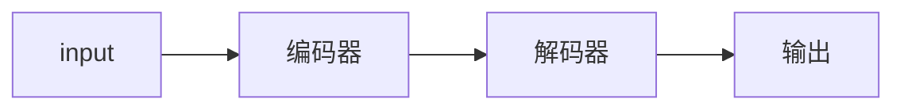
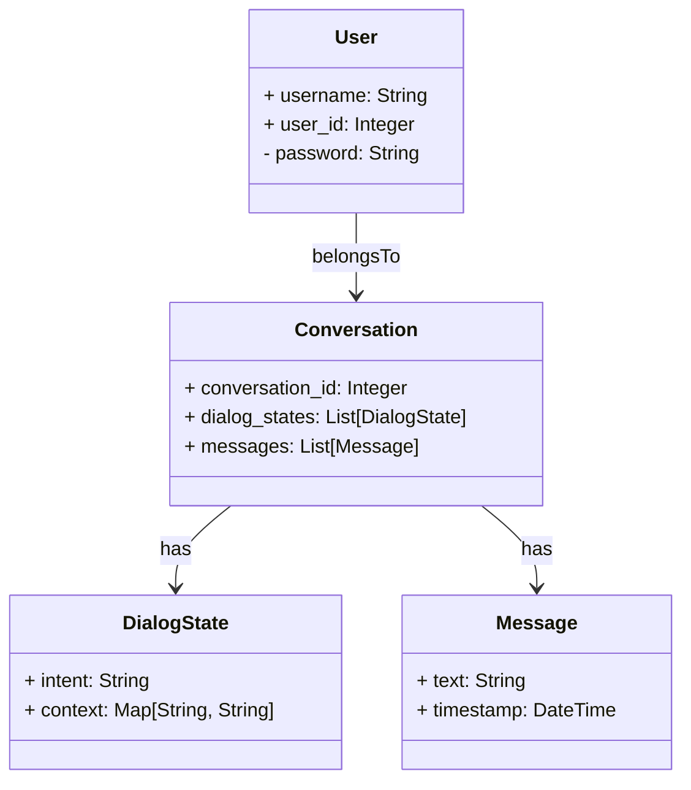

                 


# 构建企业级对话系统：多轮对话管理与意图理解的深度整合

> 关键词：企业级对话系统、多轮对话管理、意图理解、深度学习、自然语言处理、对话系统架构

> 摘要：本文系统性地探讨了构建企业级对话系统的关键挑战，重点分析了多轮对话管理与意图理解的深度整合方法。通过详细的技术分析与案例实战，展示了如何通过先进的算法与架构设计，实现高效、智能的企业级对话系统。

---

## 第一部分: 背景介绍与核心概念

### 第1章: 对话系统概述

#### 1.1 对话系统的定义与分类

**1.1.1 对话系统的定义**  
对话系统是一种通过自然语言处理技术，模拟人类对话的计算机系统。它能够理解用户输入的文本或语音，生成符合上下文的回复，实现人与计算机之间的交互。

**1.1.2 对话系统的分类**  
对话系统可以分为以下几类：  
- **基于规则的对话系统**：通过预定义的规则和关键词匹配来生成回复，适用于简单的对话场景。  
- **基于统计的对话系统**：利用概率模型（如马尔可夫链）分析对话历史，生成回复。  
- **基于深度学习的对话系统**：采用神经网络模型（如序列到序列模型）进行对话生成，能够处理复杂的上下文关系。  

**1.1.3 企业级对话系统的特征**  
企业级对话系统具有以下特征：  
- 高可用性：能够处理大规模用户请求，保证系统的稳定运行。  
- 高准确性：在复杂场景下，能够准确理解用户意图并生成合理的回复。  
- 可扩展性：支持多种对话场景和业务需求的快速扩展。  

---

#### 1.2 多轮对话管理的背景与挑战

**1.2.1 多轮对话的基本概念**  
多轮对话是指用户与系统之间进行的多次交互，系统需要根据对话历史理解当前用户的意图，保持对话的连贯性。  

**1.2.2 企业级对话系统的复杂性**  
企业级对话系统通常需要处理复杂的业务逻辑，例如订单查询、客户服务等，这要求系统具备强大的对话管理和意图理解能力。  

**1.2.3 多轮对话管理的挑战**  
- 对话历史的存储与管理：如何高效地记录和检索对话历史，以支持后续的对话生成。  
- 对话状态的动态更新：如何根据用户的输入实时更新对话状态，确保系统能够准确理解用户意图。  
- 对话策略的制定：如何根据对话历史和当前意图制定合理的回复策略。  

---

#### 1.3 意图理解的核心作用

**1.3.1 意图理解的定义**  
意图理解是指通过分析用户输入的文本或语音，确定用户在当前对话中的主要目标或需求。  

**1.3.2 意图理解的关键技术**  
- **关键词匹配**：基于预定义的关键词库，匹配用户输入中的关键词，判断意图。  
- **模式匹配**：通过预定义的对话模板，匹配用户输入的模式，判断意图。  
- **机器学习模型**：利用分类模型（如支持向量机、随机森林、神经网络等）对用户输入进行分类，判断意图。  

**1.3.3 意图理解在对话系统中的应用**  
意图理解是对话系统的核心模块，广泛应用于以下场景：  
- 电子商务：订单查询、商品推荐等。  
- 客户服务：问题解答、投诉处理等。  
- 语音助手：信息查询、日程管理等。  

---

### 第2章: 企业级对话系统的背景与需求

#### 2.1 企业级对话系统的定义  
企业级对话系统是指在企业环境中部署的对话系统，能够支持企业内部或外部用户进行复杂的对话交互。  

#### 2.2 企业级对话系统的应用场景  
- **客户服务**：通过对话系统为用户提供在线咨询、问题解答等服务。  
- **内部协作**：支持员工之间的信息交流与任务协作。  
- **业务自动化**：通过对话系统自动化处理订单、预约等业务流程。  

#### 2.3 企业级对话系统的建设目标  
- 提供高效、智能的对话交互体验。  
- 支持多轮对话，确保对话的连贯性与准确性。  
- 集成企业核心业务系统，实现业务流程的自动化。  

---

#### 2.4 问题背景与挑战

**2.4.1 当前对话系统的局限性**  
- **意图理解不准确**：部分对话系统在复杂场景下，意图理解的准确率较低。  
- **对话管理能力不足**：部分系统无法有效处理多轮对话，导致对话流程混乱。  
- **缺乏业务深度**：部分系统仅能处理简单的对话场景，无法支持复杂的业务需求。  

**2.4.2 企业级对话系统的复杂性**  
企业级对话系统需要集成多个业务系统，处理复杂的业务逻辑，这增加了系统的复杂性和维护成本。  

**2.4.3 多轮对话管理与意图理解的整合需求**  
为了提升企业级对话系统的性能，需要将多轮对话管理与意图理解深度整合，确保系统能够高效、准确地处理复杂对话场景。  

---

### 第3章: 多轮对话管理与意图理解的整合

#### 3.1 多轮对话管理的核心概念

**3.1.1 对话状态表示**  
对话状态表示是多轮对话管理的核心，通常包括以下内容：  
- **当前意图**：用户在当前对话中的主要目标。  
- **对话历史**：用户之前输入的文本或语音。  
- **上下文信息**：与当前对话相关的背景信息。  

**3.1.2 对话上下文的理解**  
对话上下文是指对话过程中积累的信息，包括用户输入、系统回复等。理解对话上下文是实现多轮对话管理的关键。  

**3.1.3 对话策略的制定**  
对话策略是指系统在对话过程中采取的行动规则，例如根据当前意图选择合适的回复模板。  

---

#### 3.2 意图理解的关键技术

**3.2.1 意图分类的基本原理**  
意图分类是通过机器学习模型对用户输入进行分类，确定其意图。常用的模型包括：  
- **支持向量机（SVM）**：适用于小规模数据集。  
- **随机森林**：适用于特征较多的场景。  
- **卷积神经网络（CNN）**：适用于文本数据，能够捕捉局部特征。  

**3.2.2 意图理解的模型选择**  
在选择意图理解模型时，需要考虑以下因素：  
- 数据规模：大规模数据推荐使用深度学习模型，小规模数据可以使用传统机器学习模型。  
- 数据特征：文本数据推荐使用CNN或Transformer模型，结构化数据推荐使用SVM或决策树模型。  

**3.2.3 意图理解的优化方法**  
- **数据增强**：通过生成同义词、同义句等方法，增加训练数据的多样性。  
- **模型调优**：通过交叉验证、网格搜索等方法，优化模型参数。  
- **特征工程**：提取有用的特征，例如词袋模型、TF-IDF特征等。  

---

#### 3.3 多轮对话与意图理解的整合策略

**3.3.1 对话历史与意图关联**  
通过分析对话历史，确定用户意图的变化趋势，例如用户从“查询订单”到“取消订单”的意图转变。  

**3.3.2 意图驱动的对话管理**  
根据当前意图，动态调整对话流程，例如在用户意图明确时直接执行相关操作。  

**3.3.3 对话流程的优化**  
通过优化对话流程，减少不必要的对话步骤，提升用户体验。  

---

## 第二部分: 核心概念与联系

### 第4章: 多轮对话管理与意图理解的核心原理

#### 4.1 多轮对话管理的原理

**4.1.1 对话状态表示**  
对话状态表示通常采用向量形式，例如使用词嵌入（Word Embedding）表示对话历史和当前意图。  

**4.1.2 对话历史记录**  
对话历史记录是多轮对话管理的重要组成部分，通常采用数据库或缓存技术进行存储和检索。  

**4.1.3 对话策略执行**  
对话策略执行是指根据当前对话状态，选择合适的回复模板或调用相关业务系统。  

---

#### 4.2 意图理解的原理

**4.2.1 意图分类模型**  
意图分类模型通常包括输入层、隐藏层和输出层，通过反向传播算法进行训练。  

**4.2.2 意图识别算法**  
意图识别算法包括基于规则的算法和基于模型的算法，其中基于模型的算法（如深度学习模型）表现更优。  

**4.2.3 意图理解的上下文关联**  
意图理解需要考虑对话上下文，例如通过注意力机制（Attention）捕捉对话历史中的重要信息。  

---

#### 4.3 多轮对话与意图理解的整合原理

**4.3.1 对话上下文与意图的关系**  
对话上下文是意图理解的重要依据，通过分析对话历史，可以更准确地判断用户意图。  

**4.3.2 意图驱动的对话流程**  
根据意图，动态调整对话流程，例如在用户意图明确时直接执行相关操作。  

**4.3.3 对话策略的动态调整**  
根据意图的变化，动态调整对话策略，例如从信息查询切换到问题解答。  

---

### 第5章: 核心概念对比与ER实体关系图

#### 5.1 多轮对话管理与意图理解的核心概念对比

| 概念 | 多轮对话管理 | 意图理解 |
|------|--------------|----------|
| 核心目标 | 管理对话流程 | 理解用户意图 |
| 主要技术 | 对话状态表示、对话策略 | 机器学习模型、特征工程 |
| 应用场景 | 电子商务、客户服务 | 语音助手、对话系统 |

---

#### 5.2 ER实体关系图

```mermaid
er
  actor
  role
  conversation
  intent
  dialog_state
  dialog_action
  message
  actor --> conversation: starts
  conversation --> dialog_state: has
  dialog_state --> intent: detects
  conversation --> message: contains
  message --> dialog_action: triggers
  dialog_action --> intent: determines
```

---

## 第三部分: 算法原理

### 第6章: 序列到序列模型的算法原理

#### 6.1 模型结构



#### 6.2 模型实现

```python
import tensorflow as tf
from tensorflow.keras.layers import LSTM, Dense, Input
from tensorflow.keras.models import Model

# 定义编码器
encoder_input = Input(shape=(None, input_dim))
encoder_lstm = LSTM(units=hidden_size)(encoder_input)
encoder_output = encoder_lstm

# 定义解码器
decoder_input = Input(shape=(None, output_dim))
decoder_lstm = LSTM(units=hidden_size, return_sequences=True)(decoder_input, initial_state=[encoder_output])
decoder_output = Dense(output_dim, activation='softmax')(decoder_lstm)

# 定义模型
model = Model(inputs=[encoder_input, decoder_input], outputs=decoder_output)
model.compile(optimizer='adam', loss='categorical_crossentropy')
```

#### 6.3 数学模型

序列到序列模型的损失函数可以表示为：

$$ \mathcal{L} = -\sum_{t=1}^{T} \log p(y_t|x_{1:T}) $$

其中，$x_{1:T}$ 表示输入序列，$y_t$ 表示第 $t$ 个输出。

---

## 第四部分: 系统分析与架构设计

### 第7章: 系统架构设计

#### 7.1 问题场景介绍

系统需要支持用户与客服之间的多轮对话，实现订单查询、问题解答等功能。  

#### 7.2 系统功能设计



#### 7.3 系统架构设计


---

## 第五部分: 项目实战

### 第8章: 客服对话系统的实战

#### 8.1 环境安装

```bash
pip install tensorflow==2.0.0
pip install numpy==1.19.2
pip install scikit-learn==0.24.1
```

#### 8.2 核心实现

```python
def process_dialogue(dialogue_history, intent_classifier):
    # 分析对话历史
    dialog_state = analyze_dialogue(dialogue_history)
    # 判断意图
    intent = intent_classifier.predict(dialog_state)
    return intent

def analyze_dialogue(dialogue_history):
    # 具体实现略
    pass
```

#### 8.3 案例分析

**案例背景**：用户询问订单状态，系统需要根据对话历史判断用户意图。  

**代码实现**：  
```python
dialogue_history = ["我有一个订单需要查询", "请告诉我订单号"]
intent = process_dialogue(dialogue_history, intent_classifier)
print(f"识别的意图：{intent}")
```

---

## 第六部分: 总结与展望

### 第9章: 总结与展望

#### 9.1 总结

本文系统性地探讨了构建企业级对话系统的关键技术，重点分析了多轮对话管理与意图理解的深度整合方法。通过理论分析与实战案例，展示了如何通过先进的算法与架构设计，实现高效、智能的企业级对话系统。

#### 9.2 展望

未来，随着自然语言处理技术的不断发展，企业级对话系统将更加智能化、个性化。建议进一步研究以下方向：  
- 更高效的对话状态表示方法。  
- 更准确的意图理解模型。  
- 更灵活的对话流程管理策略。  

---

**作者：AI天才研究院/AI Genius Institute & 禅与计算机程序设计艺术 /Zen And The Art of Computer Programming**

