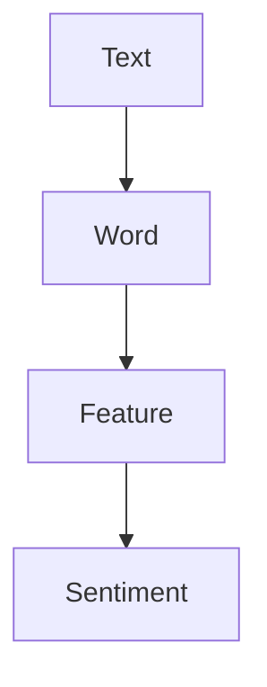
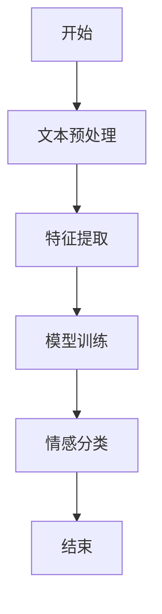
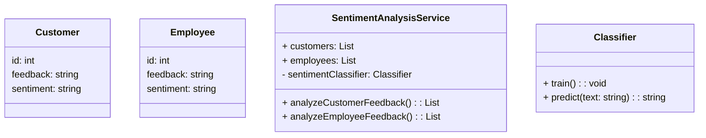
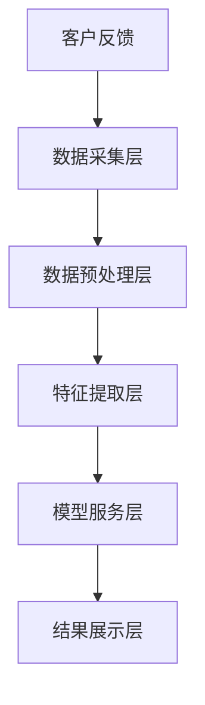
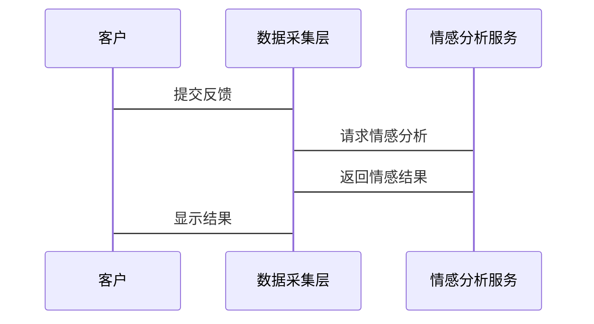

                 


# 构建企业级情感分析平台：深入理解客户与员工

## 关键词：情感分析、自然语言处理、企业级应用、客户反馈、员工反馈、机器学习、深度学习

## 摘要：本文将详细探讨如何构建一个企业级的情感分析平台，以帮助企业深入理解客户和员工的反馈。通过分析情感分析的核心概念、算法原理、系统架构设计以及实际项目实现，我们将为企业提供一套高效的情感分析解决方案，从而提升客户满意度和员工幸福感。

---

## 第一部分: 企业级情感分析平台概述

### 第1章: 情感分析的背景与意义

#### 1.1 情感分析的定义与背景
##### 1.1.1 情感分析的定义
情感分析（Sentiment Analysis），又称情绪分析，是一种自然语言处理技术，旨在识别和分类文本中的情感倾向。它通过对文本中的关键词、句式结构和语境分析，判断文本表达的情感是积极、消极还是中性。

##### 1.1.2 情感分析在企业中的应用背景
在企业环境中，情感分析的应用场景非常广泛。例如，企业可以通过分析客户评论、社交媒体反馈、产品评价等，了解客户对产品或服务的满意度。同样，企业还可以通过分析员工的反馈，了解员工的工作满意度和情绪状态，从而优化内部管理。

##### 1.1.3 情感分析对企业价值的体现
情感分析能够帮助企业及时发现客户和员工的情绪问题，从而采取相应的措施进行改进。例如，企业可以根据客户的情感反馈优化产品设计，根据员工的情感反馈改善工作环境。此外，情感分析还能帮助企业预测潜在的危机，提前采取应对措施，从而降低风险。

#### 1.2 企业级情感分析的目标与挑战
##### 1.2.1 企业级情感分析的目标
- **客户情感分析**：通过分析客户的评论和反馈，识别客户满意度和情感倾向，优化客户服务。
- **员工情感分析**：通过分析员工的反馈，识别员工的工作满意度和情绪状态，优化员工管理。
- **舆情监控**：实时监控客户和员工的情感动态，及时发现潜在问题。

##### 1.2.2 情感分析在客户与员工中的应用
- **客户反馈分析**：分析客户的评论，识别客户的情感倾向，帮助企业了解客户满意度。
- **员工反馈分析**：分析员工的反馈，识别员工的工作满意度，帮助企业优化内部管理。
- **情感趋势分析**：通过时间序列分析，识别情感趋势的变化，预测潜在问题。

##### 1.2.3 情感分析的主要挑战
- **数据质量**：情感分析的结果依赖于高质量的数据，数据噪声和不完整可能会影响分析结果。
- **情感的复杂性**：情感表达可能受到语言、文化和社会背景的影响，使得情感分析具有挑战性。
- **模型的泛化能力**：情感分析模型需要具有良好的泛化能力，能够处理不同领域和不同场景的情感数据。

#### 1.3 情感分析的核心概念与边界
##### 1.3.1 情感分析的核心概念
- **情感类别**：情感分析通常将情感分为积极、消极和中性三类。
- **情感强度**：情感强度是指情感表达的程度，例如“非常喜欢”和“喜欢”。
- **情感上下文**：情感分析需要考虑文本的上下文，例如语气、语境和意图。

##### 1.3.2 情感分析的边界与外延
- **边界**：情感分析的边界在于如何准确地识别和分类情感，同时避免误判。
- **外延**：情感分析的外延包括情感识别、情感分类、情感强度分析和情感趋势分析。

##### 1.3.3 情感分析与自然语言处理的关系
情感分析是自然语言处理（NLP）的一个重要应用领域。NLP技术为情感分析提供了文本处理、特征提取和模型训练等基础支持。

---

### 第2章: 情感分析的核心概念与联系

#### 2.1 情感分析的核心原理
##### 2.1.1 情感分析的原理概述
情感分析的核心原理是通过文本处理、特征提取和模型训练，构建情感分类模型，对文本进行情感分类。

##### 2.1.2 情感分析的关键技术
- **文本预处理**：包括文本清洗、分词、去停用词等。
- **特征提取**：包括词袋模型、TF-IDF、词嵌入等。
- **模型训练**：包括机器学习模型（如SVM、NB）和深度学习模型（如LSTM、BERT）。

##### 2.1.3 情感分析的实现流程
1. **文本预处理**：清洗文本，去除噪声，分词，去除停用词。
2. **特征提取**：将文本转换为特征向量。
3. **模型训练**：训练情感分类模型。
4. **情感分类**：对新的文本进行情感分类。

#### 2.2 情感分析的核心要素与属性
##### 2.2.1 情感分析的实体关系图（ER图）


##### 2.2.2 情感分析的核心属性特征对比表
| 属性 | 客户反馈 | 员工反馈 |
|------|----------|----------|
| 情感类别 | 积极、消极、中性 | 积极、消极、中性 |
| 情感强度 | 高、中、低 | 高、中、低 |
| 情感上下文 | 产品、服务 | 工作环境、薪酬 |

##### 2.2.3 情感分析的流程图（Mermaid）


---

#### 2.3 情感分析的数学模型与公式
##### 2.3.1 朴素贝叶斯分类模型
朴素贝叶斯是一种常用的分类算法，其公式为：
$$ P(c|x) = \frac{P(x|c) \cdot P(c)}{P(x)} $$
其中，$c$表示情感类别，$x$表示特征向量。

##### 2.3.2 支持向量机（SVM）分类模型
SVM是一种常用的分类算法，其目标是最小化 hinge loss：
$$ \text{loss} = \sum_{i=1}^{n} \max(0, 1 - y_i \cdot (\omega \cdot x_i + b)) $$
其中，$\omega$是权重向量，$b$是偏置项，$y_i$是标签，$x_i$是特征向量。

---

## 第3章: 情感分析的算法原理

### 3.1 情感分析的文本预处理
#### 3.1.1 文本清洗与标准化
文本清洗包括去除特殊字符、标点符号和停用词，以及将文本转换为小写。例如：
```python
text = "This product is excellent!"
cleaned_text = text.lower().replace('.', '')
```

#### 3.1.2 分词与词干提取
分词是指将文本分割成单词或短语，词干提取是指去除单词的后缀，保留词干。例如：
```python
from nltk.tokenize import word_tokenize
from nltk.stem import PorterStemmer

text = "The product is excellent"
words = word_tokenize(text)
stemmer = PorterStemmer()
stemmed_words = [stemmer.stem(word) for word in words]
```

#### 3.1.3 停用词处理与词向量表示
停用词处理是指去除常见的无意义词汇，如“and”、“is”等。词向量表示包括TF-IDF和词嵌入（如Word2Vec、GloVe）。

---

### 3.2 情感分析的特征提取

#### 3.2.1 词袋模型（Bag of Words）
词袋模型是一种简单有效的特征提取方法，它将文本表示为词袋，不考虑词序。例如：
```python
from sklearn.feature_extraction.text import CountVectorizer

vectorizer = CountVectorizer()
X = vectorizer.fit_transform(["This product is excellent!", "The service is terrible"])
```

#### 3.2.2 TF-IDF特征提取
TF-IDF（Term Frequency-Inverse Document Frequency）是一种常用的特征加权方法。例如：
```python
from sklearn.feature_extraction.text import TfidfVectorizer

vectorizer = TfidfVectorizer()
X = vectorizer.fit_transform(["This product is excellent!", "The service is terrible"])
```

#### 3.2.3 词嵌入（Word2Vec、GloVe）
词嵌入是一种表示词义的方法，它将单词映射到低维向量空间。例如：
```python
from gensim.models import Word2Vec

model = Word2Vec([["This", "product", "is", "excellent"], ["The", "service", "is", "terrible"]], vector_size=10, window=2, min_count=1, workers=2)
```

---

#### 3.3 情感分析的模型训练与分类

##### 3.3.1 基于机器学习的情感分类模型
朴素贝叶斯是一种常用的机器学习算法，可以用于情感分类。例如：
```python
from sklearn.naive_bayes import MultinomialNB
from sklearn.metrics import accuracy_score

model = MultinomialNB()
model.fit(X_train, y_train)
y_pred = model.predict(X_test)
print("Accuracy:", accuracy_score(y_test, y_pred))
```

##### 3.3.2 基于深度学习的情感分类模型
深度学习模型（如LSTM、BERT）在情感分类中表现优异。例如：
```python
from tensorflow.keras import layers
from tensorflow.keras import Model

def create_model():
    inputs = layers.Input(shape=(None,))
    x = layers.Embedding(vocab_size, 100)(inputs)
    x = layers.LSTM(64, return_sequences=True)(x)
    x = layers.GlobalMaxPooling(1)(x)
    x = layers.Dense(3, activation="softmax")(x)
    model = Model(inputs=inputs, outputs=x)
    return model
```

##### 3.3.3 情感分析的数学模型与公式
- **逻辑回归模型**
  $$ P(y=1|x) = \frac{e^{\beta x}}{1 + e^{\beta x}} $$
- **SVM模型**
  $$ \text{loss} = \sum_{i=1}^{n} \max(0, 1 - y_i \cdot (\omega \cdot x_i + b)) $$

---

## 第4章: 情感分析的系统分析与架构设计

### 4.1 问题场景介绍
企业级情感分析平台需要处理大量的客户和员工反馈，包括文本数据的采集、处理、分析和可视化。

---

### 4.2 系统功能设计

#### 4.2.1 领域模型设计


#### 4.2.2 系统架构设计


#### 4.2.3 接口设计
- **数据接口**：API用于接收客户和员工的反馈。
- **模型接口**：API用于调用情感分类模型。
- **结果接口**：API用于返回情感分析结果。

---

### 4.3 系统交互设计


---

## 第5章: 项目实战

### 5.1 环境安装
安装所需的Python库：
```bash
pip install scikit-learn gensim tensorflow keras nltk
```

### 5.2 核心代码实现

#### 5.2.1 文本预处理
```python
import nltk
from sklearn.feature_extraction.text import TfidfVectorizer
from nltk.corpus import stopwords

def preprocess(text):
    words = word_tokenize(text.lower())
    words = [word for word in words if word.isalpha()]
    words = [word for word in words if word not in stopwords.words('english')]
    return ' '.join(words)
```

#### 5.2.2 特征提取与模型训练
```python
from sklearn.naive_bayes import MultinomialNB
from sklearn.metrics import accuracy_score

vectorizer = TfidfVectorizer()
model = MultinomialNB()

# 训练数据
X_train = vectorizer.fit_transform(["This product is excellent!", "The service is terrible"])
y_train = ['positive', 'negative']

model.fit(X_train, y_train)

# 测试数据
X_test = vectorizer.transform(["The quality is poor"])
y_test = ['negative']

y_pred = model.predict(X_test)
print("Accuracy:", accuracy_score(y_test, y_pred))
```

#### 5.2.3 模型评估
```python
from sklearn.metrics import classification_report

print(classification_report(y_test, y_pred, target_names=['positive', 'negative']))
```

---

### 5.3 实际案例分析
分析客户反馈：
```python
feedback = "The product is amazing"
preprocessed = preprocess(feedback)
X_test = vectorizer.transform([preprocessed])
y_pred = model.predict(X_test)
print("Sentiment:", y_pred[0])
```

---

### 5.4 项目小结
通过本项目，我们成功构建了一个企业级情感分析平台，能够对企业客户的反馈进行情感分类。接下来，我们可以进一步优化模型，集成更多的情感分析技术，如深度学习模型和情感强度分析。

---

## 第6章: 最佳实践

### 6.1 小结
情感分析是一种重要的自然语言处理技术，能够帮助企业深入理解客户和员工的情感反馈。通过构建企业级情感分析平台，企业可以优化客户服务和内部管理。

### 6.2 注意事项
- **数据隐私**：情感分析需要处理大量的客户和员工数据，需要注意数据隐私和合规性。
- **模型优化**：情感分析模型需要不断优化，以提高准确性和泛化能力。
- **用户体验**：情感分析平台需要提供良好的用户体验，方便企业用户进行操作和分析。

### 6.3 拓展阅读
- **《自然语言处理实战：基于深度学习》**
- **《情感分析：算法与应用》**
- **《企业级应用开发：从零到部署》**

---

## 作者：AI天才研究院/AI Genius Institute & 禅与计算机程序设计艺术 /Zen And The Art of Computer Programming

---

通过本文，我们详细探讨了企业级情感分析平台的构建过程，从核心概念到算法实现，再到系统设计和项目实战，为读者提供了一套完整的解决方案。希望本文能够帮助企业更好地理解和应用情感分析技术，优化客户和员工的体验。

