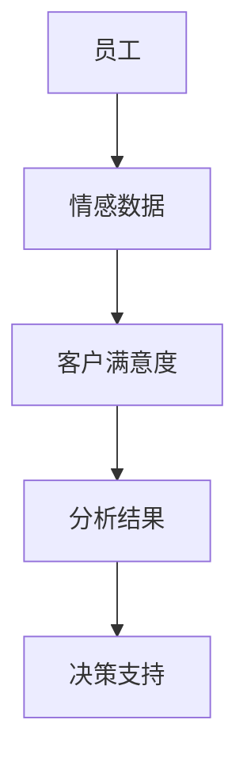
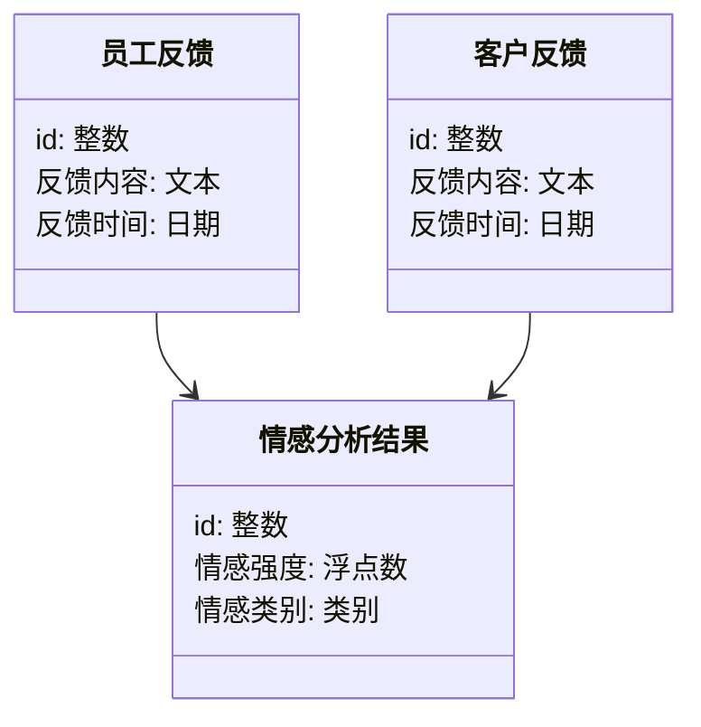
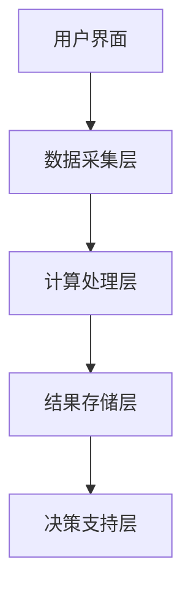
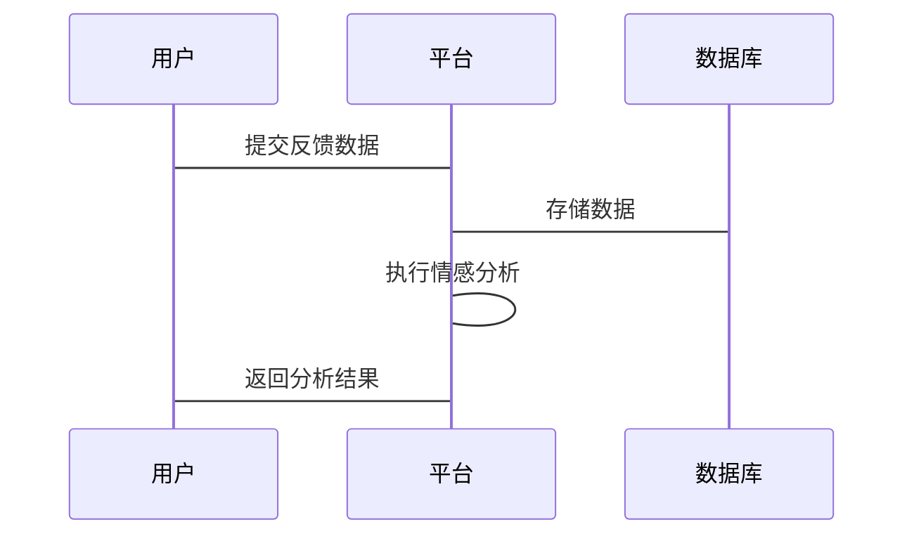

                 


# 构建企业级情感计算平台：员工幸福感与客户满意度分析

**关键词：** 情感计算、员工幸福感、客户满意度、机器学习、深度学习、系统架构

**摘要：** 本文旨在探讨如何构建一个企业级情感计算平台，以分析员工幸福感和客户满意度。文章从背景介绍、核心概念、算法原理、系统架构设计、项目实战等方面进行详细阐述。通过结合理论与实际案例，分析情感计算在企业管理中的应用价值，并提出构建平台的关键步骤和注意事项。文章最后总结了最佳实践和未来研究方向。

---

## 第1章：企业级情感计算平台的背景与概述

### 1.1 情感计算的核心概念

#### 1.1.1 情感计算的定义与特点
- **定义：** 情感计算是指通过分析人类语言、行为和数据，理解和计算情感状态的科学。
- **特点：** 数据驱动、实时性、跨领域应用、可扩展性。

#### 1.1.2 情感计算在企业管理中的应用
- **员工幸福感：** 通过分析员工反馈，识别情绪波动，优化工作环境。
- **客户满意度：** 利用客户反馈数据，提升服务质量，增强客户忠诚度。

#### 1.1.3 员工幸福感与客户满意度的关联性
- **内部管理：** 员工满意度直接影响企业绩效。
- **外部服务：** 客户满意度是企业市场竞争力的重要指标。

### 1.2 企业级情感计算平台的背景与意义

#### 1.2.1 平台背景
- **技术发展：** 大数据和人工智能技术的进步推动了情感计算的发展。
- **市场需求：** 企业对员工管理和客户服务质量的提升需求日益增长。

#### 1.2.2 平台意义
- **提升管理效率：** 通过自动化分析，节省时间和资源。
- **数据驱动决策：** 基于情感数据的洞察，优化企业战略。

### 1.3 情感计算的核心要素与边界

#### 1.3.1 核心要素分析
- **数据来源：** 文本、语音、面部表情。
- **分析方法：** 统计学习、机器学习、深度学习。
- **输出结果：** 情感强度、情感类别、情感趋势。

#### 1.3.2 平台边界与外延
- **边界：** 专注于情感数据的收集、分析和反馈。
- **外延：** 可与企业其他系统（如CRM）集成，提供综合解决方案。

#### 1.3.3 系统架构与组成
- **数据采集层：** 收集员工和客户反馈。
- **计算处理层：** 进行情感分析和特征提取。
- **应用层：** 提供可视化和决策支持。

---

## 第2章：情感计算的核心原理

### 2.1 情感计算的原理与方法

#### 2.1.1 情感计算的基本原理
- **数据预处理：** 清洗、分词、去停用词。
- **特征提取：** 识别关键情感词汇和语义特征。
- **分类与预测：** 基于机器学习模型进行情感分类。

#### 2.1.2 情感计算的主要方法
- **规则驱动：** 基于预定义规则进行情感分析。
- **统计学习：** 使用朴素贝叶斯、SVM等方法。
- **深度学习：** 利用神经网络（如LSTM、BERT）进行情感分析。

### 2.2 情感计算的关键概念与属性

#### 2.2.1 情感数据的特征与属性
- **情感强度：** 衡量情感的强烈程度。
- **情感类别：** 分为正面、负面、中性。
- **情感语境：** 考虑上下文对情感的影响。

#### 2.2.2 情感分析的维度与层次
- **微观层面：** 个体情感分析。
- **宏观层面：** 集体情感趋势分析。

#### 2.2.3 情感计算的评价指标
- **准确率：** 分类的正确性。
- **召回率：** 真实情感被正确识别的比例。
- **F1分数：** 综合准确率和召回率的指标。

### 2.3 情感计算的ER实体关系图



---

## 第3章：情感计算的算法原理与数学模型

### 3.1 情感分析的算法原理

#### 3.1.1 基于规则的情感分析
- **规则设定：** 预定义情感关键词。
- **示例：** 通过检测“满意”、“高兴”等关键词进行情感分类。

#### 3.1.2 统计学习方法
- **朴素贝叶斯模型：** 基于概率论进行分类。
- **支持向量机（SVM）：** 用于高维特征空间中的分类。

#### 3.1.3 深度学习模型
- **循环神经网络（RNN）：** 处理序列数据。
- ** Transformer模型：** 用于更复杂的语义分析。

### 3.2 情感计算的特征提取

#### 3.2.1 文本特征提取方法
- **词袋模型：** 基于词频（TF）和逆文档频率（TF-IDF）。
- **词嵌入：** 使用Word2Vec、GloVe进行词向量表示。

#### 3.2.2 非文本特征提取
- **语音特征：** 声调、语速分析。
- **面部表情：** 通过图像识别提取情绪特征。

#### 3.2.3 特征选择与降维
- **主成分分析（PCA）：** 降低特征维度。
- **Lasso回归：** 用于特征选择。

### 3.3 情感分类的机器学习算法

#### 3.3.1 支持向量机（SVM）模型
- **原理：** 在高维空间中找到最优分隔线。
- **代码示例：**
  ```python
  from sklearn import svm
  model = svm.SVC(kernel='linear')
  model.fit(X_train, y_train)
  ```

#### 3.3.2 随机森林（Random Forest）模型
- **原理：** 基于决策树的集成学习方法。
- **代码示例：**
  ```python
  from sklearn.ensemble import RandomForestClassifier
  model = RandomForestClassifier(n_estimators=100)
  model.fit(X_train, y_train)
  ```

#### 3.3.3 神经网络模型
- **原理：** 使用深度神经网络进行端到端学习。
- **代码示例：**
  ```python
  import tensorflow as tf
  model = tf.keras.Sequential([
      tf.keras.layers.Dense(64, activation='relu'),
      tf.keras.layers.Dense(1, activation='sigmoid')
  ])
  model.compile(optimizer='adam', loss='binary_crossentropy')
  model.fit(X_train, y_train, epochs=10)
  ```

### 3.4 情感计算的数学模型

#### 3.4.1 情感计算的数学表达式
$$ P(y|x) = \frac{P(x|y)P(y)}{P(x)} $$

#### 3.4.2 情感分类的损失函数
$$ L = -\sum_{i=1}^{n} y_i \log P(y_i|x_i) + (1-y_i)\log (1-P(y_i|x_i)) $$

#### 3.4.3 示例分析
假设输入文本为“我非常满意这个产品”，模型输出概率为0.9，表示正面情感的概率为90%。

---

## 第4章：企业级情感计算平台的系统架构设计

### 4.1 问题场景介绍

#### 4.1.1 员工幸福感分析
- **问题描述：** 通过分析员工反馈数据，识别情绪波动，优化工作环境。
- **场景示例：** 员工满意度调查、离职面谈记录分析。

#### 4.1.2 客户满意度分析
- **问题描述：** 基于客户反馈数据，评估服务质量，提升客户体验。
- **场景示例：** 客户评价、投诉记录分析。

### 4.2 系统功能设计

#### 4.2.1 领域模型设计


#### 4.2.2 系统架构设计


#### 4.2.3 系统接口设计
- **API接口：** 提供RESTful API，支持数据上传和结果查询。
- **交互流程：** 用户提交数据，系统返回分析结果。

### 4.3 系统交互设计

#### 4.3.1 序列图展示


---

## 第5章：项目实战与案例分析

### 5.1 环境安装与配置

#### 5.1.1 Python环境安装
- **工具：** 安装Python 3.x，安装Jupyter Notebook。
- **依赖管理：** 使用pip安装必要的库，如scikit-learn、TensorFlow、Numpy。

#### 5.1.2 数据集准备
- **员工反馈数据：** CSV格式，包含id、反馈内容、反馈时间。
- **客户反馈数据：** 类似结构。

### 5.2 系统核心实现

#### 5.2.1 数据预处理代码
```python
import pandas as pd
from sklearn.feature_extraction.text import TfidfVectorizer

# 加载数据
df = pd.read_csv('feedback.csv')

# 分词与向量化
vectorizer = TfidfVectorizer(max_features=1000)
X = vectorizer.fit_transform(df['反馈内容'])
```

#### 5.2.2 情感分类代码
```python
from sklearn.model_selection import train_test_split
from sklearn.svm import SVC

# 划分训练集与测试集
X_train, X_test, y_train, y_test = train_test_split(X, df['情感标签'], test_size=0.2)

# 训练模型
model = SVC()
model.fit(X_train, y_train)

# 预测与评估
accuracy = model.score(X_test, y_test)
print(f"准确率：{accuracy}")
```

#### 5.2.3 结果可视化代码
```python
import matplotlib.pyplot as plt

# 可视化情感强度分布
plt.hist(df['情感强度'], bins=10, alpha=0.7)
plt.xlabel('情感强度')
plt.ylabel('频数')
plt.title('情感强度分布')
plt.show()
```

### 5.3 案例分析与解读

#### 5.3.1 案例1：员工幸福感分析
- **背景：** 某公司员工满意度调查数据。
- **分析：** 识别出部分部门员工满意度较低，原因可能与工作压力和薪酬相关。
- **建议：** 针对问题部门提供心理辅导和薪酬调整。

#### 5.3.2 案例2：客户满意度分析
- **背景：** 某电商平台客户评价数据。
- **分析：** 产品质量和物流速度是客户不满的主要原因。
- **建议：** 提升产品品质和优化物流服务。

### 5.4 项目小结

#### 5.4.1 核心实现总结
- **数据预处理：** 文本清洗、分词、向量化。
- **模型训练：** 使用SVM、随机森林等算法进行情感分类。
- **结果可视化：** 通过图表展示情感强度和分布。

#### 5.4.2 注意事项
- **数据质量：** 确保数据准确性和完整性。
- **模型调优：** 通过网格搜索优化模型参数。
- **结果解读：** 需结合业务背景分析情感计算结果。

---

## 第6章：最佳实践与未来展望

### 6.1 小结

#### 6.1.1 核心要点回顾
- 情感计算的核心原理与算法。
- 企业级平台的系统架构与实现。
- 项目实战中的关键步骤与注意事项。

#### 6.1.2 总结
企业级情感计算平台能够有效提升员工幸福感和客户满意度，是未来企业管理的重要工具。

### 6.2 注意事项与建议

#### 6.2.1 项目实施注意事项
- 数据隐私保护：确保数据安全和合规性。
- 模型可解释性：避免“黑箱”模型，提供清晰的分析结果。
- 系统可扩展性：支持未来的数据量增长和技术升级。

#### 6.2.2 拓展阅读建议
- **推荐阅读书籍：** 《情感计算：理论与应用》。
- **参考论文：** 关于深度学习在情感分析中的应用。

### 6.3 未来展望

#### 6.3.1 技术发展趋势
- **多模态情感计算：** 结合文本、语音、图像等多种数据源进行情感分析。
- **实时分析：** 提升计算效率，支持实时情感监测。

#### 6.3.2 应用场景扩展
- **智能客服：** 利用情感计算优化客户交互体验。
- **心理健康管理：** 基于情感数据提供个性化心理辅导。

---

## 作者：AI天才研究院/AI Genius Institute & 禅与计算机程序设计艺术 /Zen And The Art of Computer Programming

---

**全文总结：** 本文系统地介绍了企业级情感计算平台的构建过程，从理论到实践，详细阐述了情感计算的核心原理、算法实现和系统架构设计。通过实际案例分析，展示了平台在提升员工幸福感和客户满意度中的重要作用。未来，随着技术的发展，情感计算将在企业管理中发挥更大的价值，为企业创造更多的竞争优势。

