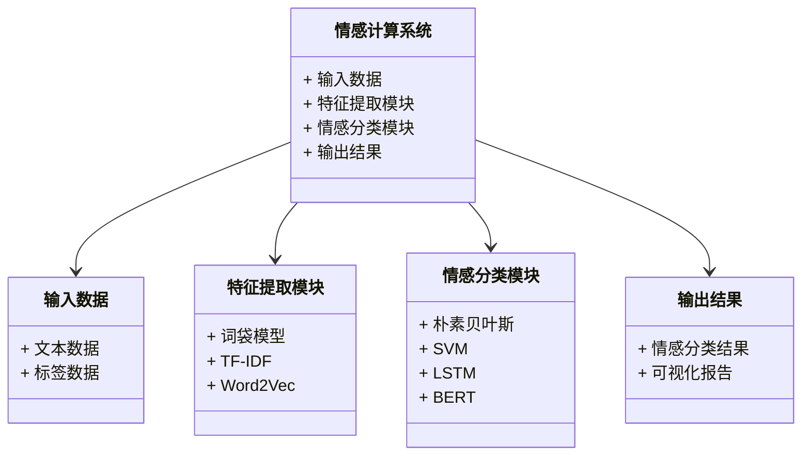
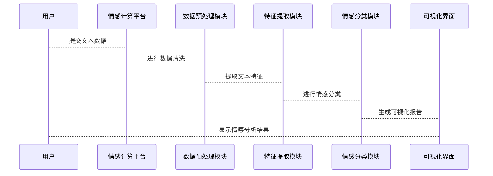

                 


# 构建企业级情感计算平台：员工满意度与客户情绪分析

## 关键词：情感计算、员工满意度、客户情绪分析、自然语言处理、机器学习、深度学习

## 摘要：企业级情感计算平台是利用自然语言处理和机器学习技术，对企业内部员工满意度和外部客户情绪进行分析和预测的系统。本文从背景、核心概念、算法原理、系统架构到项目实战，详细阐述了情感计算平台的构建过程，为企业提供高效、智能的管理工具。

---

# 第1章 情感计算平台概述

## 1.1 情感计算的定义与背景

### 1.1.1 情感计算的定义

情感计算（Affective Computing）是人工智能领域的一个重要分支，旨在通过计算机系统理解和计算人类的情感。它不仅仅是对情感的识别，还包括情感的分析、理解和应用。情感计算的核心目标是让计算机能够像人类一样具备情感认知能力。

### 1.1.2 情感计算的应用背景

在企业管理中，员工满意度和客户情绪分析是两个关键指标。员工满意度高可以提升工作效率和企业凝聚力，而客户情绪分析可以帮助企业及时了解客户反馈，优化产品和服务质量。然而，传统的满意度调查和客户反馈分析方式效率低下，且难以实时获取和处理大量非结构化数据。情感计算技术的引入，为企业提供了更高效、更精准的解决方案。

### 1.1.3 情感计算的核心目标

情感计算的核心目标是通过自然语言处理、机器学习等技术，从文本数据中提取情感信息，进而实现对员工满意度和客户情绪的自动化分析和预测。这不仅可以帮助企业及时发现问题，还能提供数据支持的决策依据。

## 1.2 员工满意度与客户情绪分析的重要性

### 1.2.1 员工满意度对企业的影响

员工满意度直接影响企业的生产力和员工留存率。通过情感计算平台，企业可以实时了解员工的工作状态和情绪变化，及时采取措施改善工作环境，提升员工满意度，从而提高整体工作效率和企业竞争力。

### 1.2.2 客户情绪分析的商业价值

客户情绪分析可以帮助企业了解客户对产品或服务的满意度，及时发现客户投诉和不满，从而优化产品设计和服务流程。此外，客户情绪分析还可以用于市场调研、品牌管理等方面，为企业提供全面的客户洞察。

### 1.2.3 情感计算在企业管理中的作用

情感计算在企业管理中的作用主要体现在以下几个方面：

1. **实时监测**：通过实时分析员工和客户的文本数据，帮助企业快速发现问题。
2. **数据驱动决策**：利用情感数据支持企业决策，优化管理策略。
3. **提升效率**：自动化的情感分析可以显著提高数据处理效率，减少人工成本。

## 1.3 情感计算平台的技术基础

### 1.3.1 自然语言处理技术

自然语言处理（NLP）是情感计算的核心技术之一。通过分词、句法分析、情感抽取等步骤，NLP技术可以帮助系统理解文本内容并提取情感信息。

### 1.3.2 机器学习与深度学习

机器学习和深度学习技术是情感计算的另一大核心。通过训练分类模型，系统可以对文本进行情感分类，准确识别积极、消极或中性情感。

### 1.3.3 数据挖掘与分析

数据挖掘技术可以帮助系统从海量数据中提取有用的信息，发现潜在的模式和趋势，为情感分析提供支持。

## 1.4 情感计算的挑战与解决方案

### 1.4.1 数据质量与多样性问题

情感计算的准确性高度依赖数据质量。如何处理噪声数据、不完整数据以及多样化的数据类型是情感计算面临的挑战。

### 1.4.2 情感分析的复杂性

情感分析不仅仅是对情感的分类，还需要考虑语境、语气、情感强度等多种因素。复杂的情感表达方式使得情感计算更加困难。

### 1.4.3 情感计算平台的优化方向

针对上述挑战，可以通过以下方式优化情感计算平台：

1. **数据预处理**：建立数据清洗和标准化流程，提高数据质量。
2. **模型优化**：引入更先进的深度学习模型（如BERT、LSTM）提高情感分类的准确性。
3. **多模态数据融合**：结合文本、语音、图像等多种数据源，提升情感分析的全面性。

## 1.5 本章小结

本章介绍了情感计算的定义、背景及其在企业管理中的应用。通过分析员工满意度和客户情绪分析的重要性，阐述了情感计算平台的核心目标和技术基础。同时，也探讨了情感计算面临的挑战和优化方向。

---

# 第2章 情感计算的核心概念

## 2.1 情感计算的基本原理

### 2.1.1 情感计算的输入与输出

情感计算的输入通常是文本数据，如员工的反馈、客户的评论等。输出则是对这些文本的情感分析结果，如满意度评分、情感分类标签等。

### 2.1.2 情感计算的特征提取

特征提取是情感计算的关键步骤。常用的特征包括词袋模型（Bag of Words）、TF-IDF（词频-逆文档频率）、Word2Vec词向量等。

### 2.1.3 情感计算的分类与预测

情感计算的核心任务是对情感进行分类和预测。常用的分类算法包括朴素贝叶斯、支持向量机（SVM）、随机森林、深度学习模型（如LSTM、BERT）等。

## 2.2 情感计算的核心要素

### 2.2.1 文本数据的预处理

文本预处理是情感计算的第一步，包括分词、去除停用词、去除标点符号等步骤。预处理的目的是提高文本的可处理性和模型的准确性。

### 2.2.2 情感特征的提取方法

特征提取是情感计算的关键步骤。以下是几种常用的特征提取方法：

1. **词袋模型（Bag of Words）**：将文本转换为词袋表示，忽略词语顺序，只考虑词语的出现频率。
2. **TF-IDF（Term Frequency-Inverse Document Frequency）**：计算每个词语在文档中的重要性，常用作文本相似度计算。
3. **Word2Vec**：通过神经网络模型将词语映射为低维向量，捕捉词语的语义信息。

### 2.2.3 情感分类模型的选择

情感分类模型的选择取决于数据规模、分类任务的复杂性和计算资源。以下是几种常用的情感分类模型：

1. **朴素贝叶斯（Naive Bayes）**：基于概率论的简单分类器，适用于文本分类任务。
2. **支持向量机（SVM）**：适用于小规模数据的高维分类任务，可以处理线性不可分的问题。
3. **深度学习模型（如LSTM、BERT）**：适用于大规模数据和复杂的情感分析任务，可以捕捉长距离依赖关系和上下文信息。

## 2.3 情感计算的实体关系分析

### 2.3.1 数据源与目标的关系

数据源是情感计算的基础，包括员工反馈、客户评论等文本数据。目标是对这些数据进行情感分析，输出情感分类结果。

### 2.3.2 情感特征与分类结果的关系

情感特征是情感分类的关键，特征的选择和提取直接影响分类的准确率。分类结果是对情感特征的综合判断，反映了文本的情感倾向。

### 2.3.3 情感计算系统的组件关系

情感计算系统通常包括数据预处理、特征提取、模型训练和预测四个主要组件。各组件之间相互依赖，共同完成情感分析任务。

## 2.4 情感计算的核心算法

### 2.4.1 朴素贝叶斯分类器

朴素贝叶斯分类器是一种基于概率论的简单分类器。其核心思想是通过计算每个类别的条件概率，选择概率最大的类别作为预测结果。

### 2.4.2 支持向量机（SVM）

SVM是一种监督学习算法，适用于小规模数据的分类任务。其核心思想是通过找到一个超平面，将数据分成不同的类别。

### 2.4.3 深度学习模型（如LSTM、BERT）

深度学习模型在情感分析任务中表现出色，尤其是处理复杂的情感表达和长文本数据。LSTM（长短期记忆网络）和BERT（双向变压器）是常用的深度学习模型。

## 2.5 本章小结

本章详细阐述了情感计算的核心概念，包括情感计算的基本原理、核心要素和核心算法。通过对比不同特征提取方法和分类模型，帮助读者理解情感计算的技术细节。

---

# 第3章 情感计算算法的数学模型

## 3.1 朴素贝叶斯分类器的原理

### 3.1.1 朴素贝叶斯的条件概率公式

朴素贝叶斯分类器基于贝叶斯定理，计算每个类别的条件概率。其核心公式如下：

$$ P(y|x) = \frac{P(x|y)P(y)}{P(x)} $$

其中，\( y \) 表示类别，\( x \) 表示特征向量。

### 3.1.2 朴素贝叶斯的分类流程

1. **计算先验概率**：计算每个类别的先验概率 \( P(y) \)。
2. **计算条件概率**：计算每个特征在每个类别下的条件概率 \( P(x|y) \)。
3. **计算后验概率**：根据贝叶斯公式，计算每个类别的后验概率 \( P(y|x) \)。
4. **选择最大概率类别**：选择后验概率最大的类别作为预测结果。

## 3.2 支持向量机（SVM）的原理

### 3.2.1 SVM的几何解释

SVM的核心思想是找到一个超平面，将数据分成不同的类别。对于线性可分的数据，SVM通过最大化几何间隔来选择最优超平面。

### 3.2.2 SVM的优化目标

SVM的优化目标是最小化以下目标函数：

$$ \min_{w, b, \xi} \frac{1}{2}||w||^2 + C \sum_{i=1}^n \xi_i $$

其中，\( C \) 是惩罚参数，\( \xi_i \) 是松弛变量，用于处理不可分数据的情况。

## 3.3 深度学习模型（如LSTM、BERT）的原理

### 3.3.1 LSTM（长短期记忆网络）

LSTM是一种特殊的RNN（循环神经网络），通过引入记忆单元和遗忘门，可以有效捕捉长距离依赖关系。

### 3.3.2 BERT（双向变压器）

BERT是一种基于变压器的深度学习模型，通过预训练和微调的方式，可以处理多种自然语言处理任务。

## 3.4 本章小结

本章通过数学公式和模型结构，详细阐述了朴素贝叶斯、SVM和深度学习模型（如LSTM、BERT）的原理和优势。这些模型在情感计算任务中各有特点，适用于不同规模和复杂度的数据分析任务。

---

# 第4章 情感计算系统的架构设计

## 4.1 系统功能设计

### 4.1.1 领域模型（Mermaid 类图）

以下是情感计算系统的领域模型类图：



### 4.1.2 系统架构设计（Mermaid 架构图）

以下是情感计算系统的架构图：

```mermaid
docker
    services {
        情感计算平台
        components {
            数据预处理模块
            特征提取模块
            情感分类模块
            可视化界面
        }
        database
        API 接口
    }
```

## 4.2 系统接口设计

### 4.2.1 输入接口

系统提供以下输入接口：

1. **文本数据接口**：接收员工和客户的文本数据。
2. **数据预处理接口**：对输入数据进行清洗和标准化处理。
3. **特征提取接口**：提取文本特征，生成特征向量。

### 4.2.2 输出接口

系统提供以下输出接口：

1. **情感分类结果接口**：返回情感分类结果。
2. **可视化报告接口**：生成情感分析的可视化报告。
3. **API 接口**：提供 RESTful API 供其他系统调用。

## 4.3 系统交互流程（Mermaid 序列图）

以下是情感计算系统的交互流程图：



## 4.4 本章小结

本章详细描述了情感计算系统的功能设计、架构设计和交互流程。通过Mermaid图表，展示了系统的各个组件及其交互关系，为后续的系统实现提供了清晰的指导。

---

# 第5章 情感计算平台的项目实战

## 5.1 环境安装与配置

### 5.1.1 安装 Python 和相关库

安装 Python 和以下常用库：

- `numpy`
- `pandas`
- `scikit-learn`
- `tensorflow`
- `transformers`

安装命令：

```bash
pip install numpy pandas scikit-learn tensorflow transformers
```

### 5.1.2 安装文本预处理工具

安装 `jieba` 分词工具：

```bash
pip install jieba
```

## 5.2 情感计算系统的核心实现

### 5.2.1 数据预处理模块

以下是数据预处理模块的实现代码：

```python
import jieba

def preprocess(text):
    # 分词
    words = jieba.lcut(text)
    # 去除停用词
    stopwords = set(["的", "了", "是", "在", "我", "你"])
    filtered_words = [word for word in words if word not in stopwords]
    return " ".join(filtered_words)
```

### 5.2.2 特征提取模块

以下是特征提取模块的实现代码：

```python
from sklearn.feature_extraction.text import TfidfVectorizer

vectorizer = TfidfVectorizer()
```

### 5.2.3 情感分类模块

以下是情感分类模块的实现代码：

```python
from sklearn.naive_bayes import MultinomialNB

model = MultinomialNB()
model.fit(X_train, y_train)
```

## 5.3 项目实战：员工满意度分析

### 5.3.1 数据采集与处理

假设我们有以下员工反馈数据：

```python
feedbacks = [
    "我对公司的发展前景非常满意。",
    "工作压力太大了，建议改善工作环境。",
    "薪酬福利有待提高。",
    "公司培训资源丰富，感谢公司支持。",
    "工作氛围很好，同事都很友好。"
]
```

预处理并提取特征：

```python
processed_texts = [preprocess(text) for text in feedbacks]
```

### 5.3.2 模型训练与预测

训练朴素贝叶斯模型：

```python
from sklearn.model_selection import train_test_split

X = vectorizer.fit_transform(processed_texts)
X_train, X_test, y_train, y_test = train_test_split(X, [1, 0, 0, 1, 1], test_size=0.2)

model.fit(X_train, y_train)
```

预测结果：

```python
print(model.predict(X_test))
```

## 5.4 项目实战：客户情绪分析

### 5.4.1 数据采集与处理

假设我们有以下客户评论数据：

```python
comments = [
    "产品功能强大，非常喜欢。",
    "客服服务态度差，需要改进。",
    "价格偏高，考虑更换其他品牌。",
    "产品质量不错，性价比高。",
    "物流速度慢，影响客户体验。"
]
```

预处理并提取特征：

```python
processed_comments = [preprocess(comment) for comment in comments]
```

### 5.4.2 模型训练与预测

训练SVM模型：

```python
from sklearn.svm import SVC

model_svm = SVC()
model_svm.fit(X_train, y_train)
```

预测结果：

```python
print(model_svm.predict(X_test))
```

## 5.5 项目小结

通过本章的项目实战，我们详细介绍了情感计算系统的实现过程，包括数据预处理、特征提取和模型训练。通过具体案例，展示了如何利用Python和机器学习库构建情感计算平台，为实际应用提供了参考。

---

# 第6章 情感计算平台的最佳实践

## 6.1 小结

情感计算平台的核心是通过自然语言处理和机器学习技术，对企业内部员工满意度和外部客户情绪进行分析和预测。本文详细阐述了情感计算平台的构建过程，包括背景、核心概念、算法原理、系统架构和项目实战。

## 6.2 注意事项

在实际应用中，需要注意以下几点：

1. **数据隐私**：确保数据的隐私性和安全性，遵守相关法律法规。
2. **模型优化**：根据实际需求，不断优化模型性能，提高分类准确率。
3. **系统维护**：定期更新模型和数据，保持系统的稳定性和可用性。

## 6.3 拓展阅读

以下是一些推荐阅读的资料：

1. **《自然语言处理入门》**：深入理解自然语言处理技术。
2. **《机器学习实战》**：掌握机器学习算法的实现和应用。
3. **《深度学习》**：学习深度学习的基本原理和前沿技术。

---

# 作者：AI天才研究院/AI Genius Institute & 禅与计算机程序设计艺术 /Zen And The Art of Computer Programming

---

本文通过详细阐述情感计算平台的构建过程，为企业的员工满意度和客户情绪分析提供了理论和实践指导。希望本文能为相关领域的技术专家和企业提供有价值的参考和启发。

